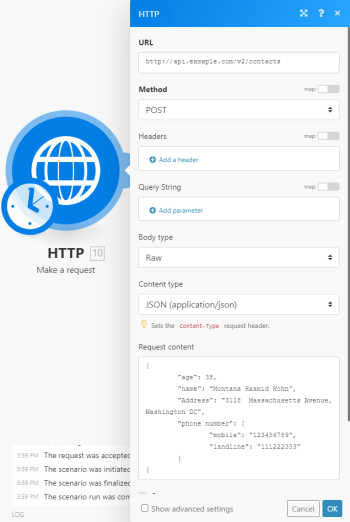

# [!UICONTROL HTTP] >[!UICONTROL 요청 수행] 모듈

>[!NOTE]
>
>Adobe Workfront Fusion에는 [!DNL Adobe Workfront Fusion] 라이센스 [!DNL Adobe Workfront] 라이센스.

다음 [!DNL Adobe Workfront Fusion] [!UICONTROL HTTP] > [!UICONTROL 요청 모듈 만들기] 는 HTTP 요청을 구성하고 서버에 제출할 수 있는 범용 모듈입니다. 수신된 HTTP 응답이 출력 번들에 포함됩니다.

## 액세스 요구 사항

이 문서의 기능을 사용하려면 다음 액세스 권한이 있어야 합니다.

<table style="table-layout:auto"> 
 <col> 
 <col> 
 <tbody> 
  <tr> 
    <td role="rowheader">[!DNL Adobe Workfront] 플랜*</td> 
   <td> 
[!UICONTROL Pro] 이상
 </td>
  </tr> 
  <tr data-mc-conditions=""> 
   <td role="rowheader">[!DNL Adobe Workfront] 라이센스*</td> 
   <td> 
[!UICONTROL Plan], [!UICONTROL Work]
 </td> 
  </tr> 
  <tr> 
   <td role="rowheader">[!DNL Adobe Workfront Fusion] license**</td> 
   <td> 
[!UICONTROL [!DNL Workfront Fusion] 작업 자동화 및 통합을 위한] 
  </td> 
  </tr> 
  <tr> 
   <td role="rowheader">제품</td> 
   <td>조직이 구매해야 합니다 [!DNL Adobe Workfront Fusion] 뿐만 아니라 [!DNL Adobe Workfront] 을 참조하십시오.</td> 
  </tr> 
 </tbody> 
</table>

어떤 계획, 라이센스 유형 또는 액세스 권한을 보유하고 있는지 확인하려면 [!DNL Workfront] 관리자

에 대한 자세한 정보 [!DNL Adobe Workfront Fusion] 라이센스 [Adobe Workfront Fusion 라이센스](../../../workfront-fusion/get-started/license-automation-vs-integration.md)

## [!UICONTROL HTTP] >[!UICONTROL 요청 수행] 모듈 구성

를 구성할 때 [!UICONTROL HTTP] >[!UICONTROL 요청 수행] 모듈, [!DNL Adobe Workfront Fusion] 아래 나열된 필드를 표시합니다. 모듈에서 굵게 표시된 제목은 필수 필드를 나타냅니다.

필드 또는 함수 위에 맵 단추가 표시되면 이 단추를 사용하여 해당 필드에 대한 변수와 함수를 설정할 수 있습니다. 자세한 내용은 [의 한 모듈에서 다른 모듈로 정보 매핑 [!DNL Adobe Workfront Fusion]](../../../workfront-fusion/mapping/map-information-between-modules.md).

<table style="table-layout:auto"> 
 <col> 
 <col> 
 <tbody> 
  <tr> 
   <td role="rowheader">[!UICONTROL 모든 상태를 오류로 평가(2xx 및 3xx 제외)] </td> 
   <td> 
이 옵션을 사용하여 오류 처리를 설정합니다.
 
자세한 내용은 <a href="../../../workfront-fusion/errors/error-handling.md" class="MCXref xref">에서 오류 처리 중 [!DNL Adobe Workfront Fusion]</a>.
 </td> 
  </tr> 
  <tr> 
   <td role="rowheader">[!UICONTROL URL] </td> 
   <td> 
API 엔드포인트, 웹 사이트 등과 같이 요청을 전송할 URL을 입력합니다.
 </td> 
  </tr> 
  <tr> 
   <td role="rowheader"> 
[!UICONTROL 메서드]
 </td> 
   <td> 
API 호출을 구성하는 데 필요한 HTTP 요청 메서드를 선택합니다. 자세한 내용은 <a href="../../../workfront-fusion/modules/http-request-methods.md" class="MCXref xref">의 HTTP 요청 메서드 [!DNL Adobe Workfront Fusion]</a>.
 </td> 
  </tr> 
  <tr> 
   <td role="rowheader">[!UICONTROL Headers] </td> 
   <td> 
요청의 헤더를 표준 JSON 개체 형태로 추가합니다. 예: <code>{"Content-type":"application/json"}</code>
 </td> 
  </tr> 
  <tr> 
   <td role="rowheader">[!UICONTROL 쿼리 문자열]</td> 
   <td> 
 원하는 쿼리 키-값 쌍을 입력합니다.
 </td> 
  </tr> 
  <tr> 
   <td role="rowheader"> 
[!UICONTROL Body type]
 </td> 
   <td> 
HTTP Body는 사용할 데이터 바이트가 있는 경우 헤더 바로 뒤에 HTTP 트랜잭션 메시지로 전송되는 데이터 바이트입니다.
 
    <ul> 
     <li> 
<strong>[!UICONTROL Raw]</strong> 
 
원시 본문 유형은 일반적으로 개발자 설명서에서 전송할 데이터를 지정하지 않는 경우에도 대부분의 HTTP 본문 요청에 적합합니다.
 
[!UICONTROL 콘텐츠 유형] 필드에서 데이터를 구문 분석하는 형식을 지정합니다.
 
컨텐츠 유형을 선택했지만, 데이터는 개발자 설명서에서 규정하거나 필요로 하는 형식으로 입력됩니다.
 </li> 
     <li> 
<strong>[!UICONTROL Application/x-www-form-urlencoded]</strong> 
 
이 본문 유형은 다음을 사용하여 [!UICONTROL POST] 데이터를 가져옵니다 <code>[!UICONTROL application/x-www-form-urlencoded]</code>.
 
대상 <code>application/x-www-form-urlencoded</code>를 지정하는 경우, 서버로 전송되는 HTTP 메시지의 본문은 기본적으로 하나의 쿼리 문자열입니다. 키 및 값은 키-값 쌍으로 구분되어 인코딩됩니다 <code>&amp;</code> 그리고 <code>=</code> 키와 값 사이에 있을 수 있습니다. 
 
이진 데이터의 경우 <code>[!UICONTROL multipart/form-data]</code> 을 가리키도록 업데이트하는 것이 좋습니다.
 
      
Example: </b>">
       <b>예: </b> 
       
결과 HTTP 요청 형식의 예:
 
       
<code>field1=value1&amp;field2=value2</code> 
 
      
 </li> 
     <li> 
<strong>[!UICONTROL Multipart/form-data]</strong> 
 
[!UICONTROL Multipart/form-data]는 파일과 데이터를 보내는 데 사용되는 HTTP 다중 부분 요청입니다. 일반적으로 서버에 파일을 업로드하는 데 사용됩니다.
 
요청에서 전송할 필드를 추가합니다. 각 필드에는 키-값 쌍이 포함되어야 합니다.
 
      <ul> 
       <li> 
<strong>[!UICONTROL Text]</strong> 
 
요청 본문 내에 전송할 키와 값을 입력합니다.
 </li> 
       <li> 
<strong>[!UICONTROL File]</strong> 
 
키를 입력하고 요청 본문에 전송할 소스 파일을 지정합니다.
 
이전 모듈에서 업로드할 파일(예: [!UICONTROL HTTP] &gt;[!UICONTROL 파일 가져오기] 또는 [!UICONTROL Google Drive] &gt;[!UICONTROL 파일 다운로드)]을 매핑하거나 파일 이름과 파일 데이터를 수동으로 입력합니다.
 </li> 
      </ul> </li> 
    </ul> </td> 
  </tr> 
  <tr> 
   <td role="rowheader"> 
[!UICONTROL 구문 분석 응답]
 </td> 
   <td> 
[!UICONTROL JSON] &gt; [!UICONTROL Parse JSON] 또는 [!UICONTROL XML] &gt; [!UICONTROL Parse XML] 모듈을 사용할 필요가 없도록 응답을 자동으로 구문 분석하고 JSON 및 XML 응답을 변환하려면 이 옵션을 활성화합니다.
 
구문 분석된 JSON 또는 XML 컨텐츠를 사용하기 전에 모듈이 응답 컨텐츠를 인식하고 후속 모듈에 매핑할 수 있도록 모듈을 한 번 수동으로 실행하십시오.
 </td> 
  </tr> 
  <tr> 
   <td role="rowheader"> 
[!UICONTROL User name]
 </td> 
   <td> 
 기본 인증을 사용하여 요청을 보내려면 사용자 이름을 입력합니다.
 </td> 
  </tr> 
  <tr> 
   <td role="rowheader">[!UICONTROL Password] </td> 
   <td> 
기본 인증을 사용하여 요청을 보내려면 암호를 입력합니다.
 </td> 
  </tr> 
  <tr> 
   <td role="rowheader">[!UICONTROL Timeout] </td> 
   <td> 
요청 시간 제한(초-1-300)을 지정합니다. 기본값은 40초입니다.
 </td> 
  </tr> 
  <tr> 
   <td role="rowheader">[!UICONTROL 다른 HTTP 모듈과 쿠키 공유]</td> 
   <td> 
 시나리오의 모든 HTTP 모듈과 서버에서 쿠키를 공유하려면 이 옵션을 활성화합니다.
 </td> 
  </tr> 
  <tr> 
   <td role="rowheader">[!UICONTROL 자체 서명 인증서]</td> 
   <td> 
 자체 서명된 인증서를 사용하여 TLS를 사용하려면 인증서를 업로드합니다.
 </td> 
  </tr> 
  <tr> 
   <td role="rowheader">[!UICONTROL 확인되지 않은(자체 서명) 인증서를 사용하는 연결 거부] </td> 
   <td> 
확인되지 않은 TLS 인증서를 사용하는 연결을 거부하려면 이 옵션을 활성화합니다.
 </td> 
  </tr> 
  <tr> 
   <td role="rowheader">[!UICONTROL 리디렉션 후]</td> 
   <td> 
 3xx 응답이 있는 URL 리디렉션을 따르려면 이 옵션을 활성화합니다.
 </td> 
  </tr> 
  <tr> 
   <td role="rowheader">[!UICONTROL 모든 리디렉션 따르기] </td> 
   <td> 
모든 응답 코드가 있는 URL 리디렉션을 따르려면 이 옵션을 활성화합니다.
 </td> 
  </tr> 
  <tr> 
   <td role="rowheader"> 
[!UICONTROL 배열과 동일한 여러 쿼리 문자열 키의 직렬화를 사용하지 않도록 설정]
 </td> 
   <td> 
기본적으로 [!DNL Workfront Fusion] 배열과 동일한 URL 쿼리 문자열 매개 변수 키의 여러 값을 처리합니다. 예, <code>www.test.com?foo=bar&amp;foo=baz</code> 은(는) <code>www.test.com?foo[0]=bar&amp;foo[1]=baz</code>. 이 기능을 비활성화하려면 이 옵션을 활성화합니다. 
 </td> 
  </tr> 
  <tr> 
   <td role="rowheader">[!UICONTROL 압축된 콘텐츠 요청]</td> 
   <td> 
 웹 사이트의 압축 버전을 요청하려면 이 옵션을 활성화합니다.
 
추가 <code>[!UICONTROL Accept-Encoding]</code> 헤더를 사용하여 압축된 콘텐츠를 요청합니다.
 </td> 
  </tr> 
  <tr> 
   <td role="rowheader">[!UICONTROL Use Mutual TLS]</td> 
   <td> 
HTTP 요청에서 상호 TLS를 사용하려면 이 옵션을 활성화하십시오.
 
상호 TLS에 대한 자세한 내용은 다음을 참조하십시오 <a href="../../../workfront-fusion/apps-and-their-modules/http-modules/use-mtls-in-http-modules.md" class="MCXref xref">의 HTTP 모듈에서 상호 TLS 사용 [!DNL Adobe Workfront Fusion]</a>.
 </td> 
  </tr> 
 </tbody> 
</table>

>[!INFO]
>
>**예:** 이 예에서는 모듈을 설정하여 [!UICONTROL POST] JSON 페이로드를 사용하여 요청:
>
>

>[!NOTE]
>
>다음을 확인합니다. [!UICONTROL JSON] 이(가) 유효합니다. 다음과 같이 사용 가능한 온라인 서비스 중 하나를 사용할 수 있습니다. [https://jsonlint.com/](https://jsonlint.com/). 를 사용할 수도 있습니다 [!UICONTROL JSON] >[!UICONTROL JSON 모듈 만들기] JSON을 동적으로 만들고 필요한 모든 이스케이프를 처리하려면 다음을 수행합니다.
>
>JSON 조각과 에서 직접 표현식 및 항목 혼합 [!UICONTROL 콘텐츠 요청] 잘못된 JSON을 초래할 수 있으므로 필드를 권장하지 않습니다.
