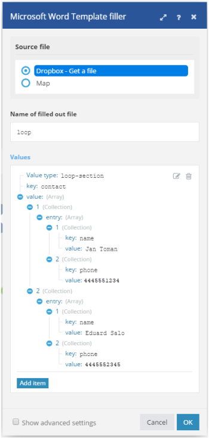

# [!DNL Microsoft Word Template] 모듈

에서 [!DNL Adobe Workfront Fusion] 시나리오, [!DNL Microsoft Word Templates]여러 타사 애플리케이션 및 서비스에 연결할 수 있습니다.

시나리오 만들기에 대한 지침이 필요한 경우 [에서 시나리오 만들기 [!DNL Adobe Workfront Fusion]](../../workfront-fusion/scenarios/create-a-scenario.md).

모듈에 대한 자세한 내용은 [의 모듈 [!DNL Adobe Workfront Fusion]](../../workfront-fusion/modules/modules.md).

## 액세스 요구 사항

이 문서의 기능을 사용하려면 다음 액세스 권한이 있어야 합니다.

<table style="table-layout:auto"> 
 <col> 
 <col> 
 <tbody> 
  <tr> 
   <td role="rowheader">[!DNL Adobe Workfront] 플랜*</td>
  <td> <p>[!UICONTROL Pro] 이상</p> </td>
  </tr> 
  <tr data-mc-conditions=""> 
   <td role="rowheader">[!DNL Adobe Workfront] 라이센스*</td>
   <td> <p>[!UICONTROL Plan], [!UICONTROL Work]</p> </td> 
  </tr> 
  <tr> 
   <td role="rowheader">[!DNL Adobe Workfront Fusion] license**</td> 
   <td> <p>[!UICONTROL [!DNL Workfront Fusion] 작업 자동화 및 통합을 위한] </p> </td> 
  </tr> 
  <tr> 
   <td role="rowheader">제품</td> 
   <td>조직이 구매해야 합니다 [!DNL Adobe Workfront Fusion] 뿐만 아니라 [!DNL Adobe Workfront] 을 참조하십시오.</td> 
  </tr> <!--
   <tr data-mc-conditions="QuicksilverOrClassic.Draft mode"> 
    <td role="rowheader">Access level configurations*</td> 
    <td> 
      <p data-mc-conditions="QuicksilverOrClassic.Draft mode">You must be a Workfront Fusion administrator for your organization.</p>
     --> <!--
      <p data-mc-conditions="QuicksilverOrClassic.Draft mode">You must be a Workfront Fusion administrator for your team.</p>
     --> </td> 
   </tr>
 </tbody> 
</table>

어떤 계획, 라이센스 유형 또는 액세스 권한을 보유하고 있는지 확인하려면 [!DNL Workfront] 관리자

에 대한 자세한 정보 [!DNL Adobe Workfront Fusion] 라이센스 [[!DNL Adobe Workfront Fusion] 라이선스](../../workfront-fusion/get-started/license-automation-vs-integration.md).

## 전제 조건

를 사용하려면 [!DNL Miscrosoft Word Templates] with [!DNL Adobe Workfront Fusion]를 채울 때는 [!DNL Office 365] 계정이 필요합니다. www.office.com에서 만들 수 있습니다.

## 사용 [!DNL Microsoft Word Templates] 모듈

을(를) 사용할 수 있습니다 [!DNL Microsoft Word Template] 여러 웹 서비스의 데이터를 [!DNL Microsoft Word] 문서.

예를 들어 다음 스크립트를 사용할 수 있습니다 [!DNL Microsoft Word] 템플릿:


이 문서를 만들려면 다음을 수행하십시오.


## 값 태그 기본 정보

A [!DNL Microsoft Word] 템플릿은 일반입니다 [!DNL Microsoft Word] 데이터의 병합 위치 및 방법을 결정하는 텍스트에 특수 태그가 있는 문서(.docx 파일)가 있습니다. 태그에는 다음 세 가지 유형이 있습니다.

* [단순 값 태그](#simple-value-tag)
* [조건 태그](#condition-tag)
* [루프 태그](#loop-tag)

### 단순 값 태그 {#simple-value-tag}

단순 값 태그는 해당 값으로 대체됩니다. 태그의 이름은 [!UICONTROL 키] 이중 중괄호 안에 배치되는 필드 값. 예


<pre>{{이름}}</pre>


.

**예:** &quot;Hi, Petr!&quot;라는 문서를 만들려면 [!DNL Microsoft Word Template] 다음 템플릿을 만드는 모듈입니다.

<pre>&gt; {{name}} 님 안녕하세요!</pre>

이렇게 하려면 다음과 같이 모듈을 설정합니다.


### 조건 태그 {#condition-tag}

조건 태그를 사용하여 특정 조건이 충족되는 경우에만 렌더링해야 하는 텍스트를 래핑할 수 있습니다. 텍스트를 줄바꿈하려면 조건에 전화 번호가 포함되어 있는지 여부를 나타내는 경우 &quot;hasPhone&quot;과 같이 열기 및 닫기 조건 태그 사이에 배치합니다. 여는 태그의 이름 앞에 해시 기호 #이 붙고, 닫는 태그의 이름 앞에는 아래 예와 같이 슬래시 / 가 붙습니다.

**예:** 입력 데이터에 전화 번호가 있지만 전자 메일 주소가 없는 경우 고객의 전화 번호가 포함된 문서를 생성하려면 [!DNL Microsoft Word Template] 모듈 및 다음 템플릿을 만듭니다.
<pre>&gt; {{#hasPhone}}전화: {{phone}} {{/hasPhone}}</pre><pre>&gt; {{#hasEmail}}전자 메일: {{email}} {{/hasEmail}}</pre>이렇게 하려면 다음과 같이 모듈을 설정합니다.


문서에서 전화 번호는 다음과 같이 나타납니다.
<pre>&gt; 전화: 4445551234</pre>

### 루프 태그 {#loop-tag}

섹션 태그라고도 하는 루프 태그를 사용하여 텍스트 섹션을 반복할 수 있습니다. 텍스트를 열고 닫는 루프 태그 사이에 배치하여 래핑합니다. 열기 태그의 이름 앞에 해시 기호 #; 닫는 태그의 이름 앞에는 슬래시 / 가 붙습니다.

* [문서 모듈 채우기를 사용하여 태그 루프](#loop-tag-with-fill-out-a-document-module)

<!-- [Loop tag with Fill a document with a batch of data module](#loop-tag-with-fill-a-document-with-a-batch-of-data-module)-->

#### 문서 모듈 채우기를 사용하여 태그 루프 {#loop-tag-with-fill-out-a-document-module}

**예:** 고객 목록에 있는 각 연락처의 이름과 전화 번호를 나열하는 문서를 생성하려면 [!DNL Microsoft Word Template] 모듈 및 다음 템플릿을 만듭니다.

<pre>&gt; {{#contact}}</pre><pre>&gt; {{name}}, {{phone}}</pre><pre>&gt; {{/contact}}</pre>

이렇게 하려면 다음과 같이 모듈을 설정합니다.




이 모듈은 다음 문서를 만듭니다.

```
> Jan Toman, 4445551234
> Eduard Salo, 4445552345
```

<!--

#### Loop tag with Fill a document with a batch of data module {#loop-tag-with-fill-a-document-with-a-batch-of-data-module}

**Example:** You can export Google contacts into a table that you create using loop tags.

The first module loads the template. The next module retrieves all contacts from the group you specify in [!DNL Google Contacts]. The aggregator module aggregates all values retrieved from Google Contacts and merges them into the template. And the last module saves the filled template to the desired location.


You could use this scenario with the following template:


To do this, you would set up the module as follows:


The module would create the following document:


-->

## [!DNL Microsoft Word Template] 모듈

이러한 모듈에는 연결이 필요하지 않습니다.

* [문서 작성](#fill-out-a-document)
* [문서 데이터 묶음으로 채우기](#fill-a-document-with-a-batch-of-data)

### [!UICONTROL 문서 작성] {#fill-out-a-document}

이 변압기 모듈을 사용하면 지정된 데이터로 문서를 채울 수 있습니다. 단순 값 태그, 조건부 태그 또는 루프 태그와 함께 사용할 수 있습니다.

<table style="table-layout:auto"> 
 <col> 
 <col> 
 <tbody> 
  <tr> 
   <td role="rowheader">[!UICONTROL 바꿀 텍스트의 시작 구분 기호]</td> 
   <td> <p>바꿀 텍스트의 시작 부분을 표시할 문자를 입력합니다. </p> <p class="example" data-mc-autonum="<b>Example: </b>"><span class="autonumber"><span><b>예: </b></span></span>Enter 키 <code>[[</code> 다음과 유사한 텍스트를 바꾸려면 다음을 수행하십시오. <code>[[replace_me]]</code></p> </td> 
  </tr> 
  <tr> 
   <td role="rowheader"> <p>[!UICONTROL 바꿀 텍스트의 끝 구분 기호]</p> </td> 
   <td> <p>바꿀 텍스트의 끝을 표시할 문자를 입력합니다. </p> <p class="example" data-mc-autonum="<b>Example: </b>"><span class="autonumber"><span><b>예: </b></span></span>Enter 키 <code>]]</code> 다음과 유사한 텍스트를 바꾸려면 다음을 수행하십시오. <code>[[replace_me]]</code></p> </td> 
  </tr> 
  <tr> 
   <td role="rowheader">[!UICONTROL 소스 파일]</td> 
   <td> <p> 이전 모듈에서 업로드할 파일을 매핑합니다(예: HTTP &gt; 파일 가져오기 또는 Dropbox &gt; 파일 모듈 가져오기). 또는 데이터 파일을 수동으로 입력합니다.</p> </td> 
  </tr> 
  <tr> 
   <td role="rowheader">[!UICONTROL 채워진 파일의 이름]</td> 
   <td>대상 출력 파일의 파일 이름(확장명 포함)을 입력합니다.</td> 
  </tr> 
  <tr> 
   <td role="rowheader">[!UICONTROL 데이터 소스]</td> 
   <td> <p>사용 중인 데이터가 양식 또는 원시 데이터 수집(처리되지 않은 컴퓨터 데이터)에서 사용되는지 여부를 나타내는 옵션을 선택합니다.</p> </td> 
  </tr> 
  <tr> 
   <td role="rowheader">[!UICONTROL Values]</td> 
   <td> <p>컬렉션 배열이어야 합니다. 여기서</p> 
    <ul> 
     <li>각 컬렉션은 하나의 데이터 항목에 해당하며 하나의 항목을 포함합니다 <code>entry</code></li> 
     <li>항목 <code>entry </code>의 컬렉션을 포함합니다 <code>key </code>및 <code>value</code></li> 
     <li>항목 <code>key </code>태그 이름을 포함합니다.</li> 
     <li>항목 <code>value </code>태그의 값을 포함합니다.</li> 
    </ul> 
    <p>항목을 추가하려면</p>
    <ol> 
     <li> 클릭 <b>[!UICONTROL 항목 추가]</b>. </li> 
     <li>항목의 값 유형을 선택합니다.</li> 
     <li>이름과 값을 추가합니다. 자세한 내용은 이 문서에서 선택한 값 유형에 대한 예를 참조하십시오. 
      <ul> 
       <li><a href="#simple-value-tag" class="MCXref xref">단순 값 태그</a></li> 
       <li><a href="#condition-tag" class="MCXref xref">조건 태그</a></li> 
       <li><a href="#loop-tag" class="MCXref xref">루프 태그</a></li> 
      </ul></li> 
    </ol> </td> 
  </tr> 
 </tbody> 
</table>

### [!UICONTROL 문서 데이터 묶음으로 채우기] {#fill-a-document-with-a-batch-of-data}

이 누적 모듈은 데이터 항목이 별도의 번들로 제공되는 경우 유용합니다. 이 모듈을 사용하면 값 필드에 필요한 구조를 쉽게 설정하고 항목을 각 값 항목에 매핑할 수 있습니다. 문서 모듈 작성과 달리 문서 데이터 모듈 일괄 채우기의 값 필드에서 변수를 포함하는 단일 항목만 허용됩니다.

데이터 항목이 배열로 제공되는 경우에도 *반복기* 모듈의 내용을 일련의 번들로 변환하는 모듈입니다.

각 들어오는 번들에 대해 실제 값이 생성되고 채워집니다. 템플릿은 모든 입력 번들이 처리된 후에 생성됩니다.

이 누적 모듈은 목록 또는 보고서를 만드는 데 특히 유용합니다.

<table style="table-layout:auto"> 
 <col> 
 <col> 
 <tbody> 
  <tr> 
   <td role="rowheader">[!UICONTROL 소스 모듈]</td> 
   <td>텍스트 소스인 모듈을 선택합니다.</td> 
  </tr> 
  <tr> 
   <td role="rowheader">[!UICONTROL 바꿀 텍스트의 시작 구분 기호]</td> 
   <td> <p>바꿀 텍스트의 시작 부분을 표시할 문자를 입력합니다. </p> <p class="example" data-mc-autonum="<b>Example: </b>"><span class="autonumber"><span><b>예: </b></span></span>Enter 키 <code>[[</code> 다음과 유사한 텍스트를 바꾸려면 다음을 수행하십시오. <code>[[replace_me]]</code></p> </td> 
  </tr> 
  <tr> 
   <td role="rowheader"> <p>[!UICONTROL 바꿀 텍스트의 끝 구분 기호]</p> </td> 
   <td> <p>바꿀 텍스트의 끝을 표시할 문자를 입력합니다. </p> <p class="example" data-mc-autonum="<b>Example: </b>"><span class="autonumber"><span><b>예: </b></span></span>Enter 키 <code>]]</code> 다음과 유사한 텍스트를 바꾸려면 다음을 수행하십시오. <code>[[replace_me]]</code></p> </td> 
  </tr> 
  <tr> 
   <td role="rowheader">[!UICONTROL Group by]</td> 
   <td> 하나 이상의 매핑된 항목이 포함된 표현식을 정의합니다. 집계된 데이터는 같은 표현식의 값이 있는 그룹에서 분리됩니다. 각 그룹은 평가된 표현식과 집계된 텍스트가 있는 키가 포함된 별도의 번들로 출력됩니다. 이렇게 하면 키를 후속 모듈에서 필터로 사용할 수 있습니다.</td> 
  </tr> 
  <tr> 
   <td role="rowheader">[!UICONTROL 빈 집계 후 처리 중지]</td> 
   <td>집계에 번들이 포함되어 있지 않은 경우 이 옵션을 활성화하여 처리를 중지합니다.</td> 
  </tr> 
  <tr> 
   <td role="rowheader">[!UICONTROL 소스 파일]</td> 
   <td> <p> 이전 모듈에서 업로드할 파일을 매핑합니다(예: HTTP &gt; 파일 가져오기 또는 Dropbox &gt; 파일 모듈 가져오기). 또는 데이터 파일을 수동으로 입력합니다.</p> </td> 
  </tr> 
  <tr> 
   <td role="rowheader">[!UICONTROL 채워진 파일의 이름]</td> 
   <td>대상 출력 파일의 파일 이름(확장명 포함)을 입력합니다.</td> 
  </tr> 
  <tr> 
   <td role="rowheader">[!UICONTROL 데이터 소스]</td> 
   <td> <p>사용 중인 데이터가 양식 또는 원시 데이터 수집(처리되지 않은 컴퓨터 데이터)에서 사용되는지 여부를 나타내는 옵션을 선택합니다.</p> </td> 
  </tr> 
  <tr> 
   <td role="rowheader">[!UICONTROL Values]</td> 
   <td> <p>컬렉션 배열이어야 합니다. 여기서</p> 
    <ul> 
     <li>각 컬렉션은 하나의 데이터 항목에 해당하며 하나의 항목을 포함합니다 <code>entry</code></li> 
     <li>항목 <code>entry </code>의 컬렉션을 포함합니다 <code>key </code>및 <code>value</code></li> 
     <li>항목 <code>key </code>태그 이름을 포함합니다.</li> 
     <li>항목 <code>value </code>태그의 값을 포함합니다.</li> 
    </ul> 
    <p>항목을 추가하려면</p>
    <ol> 
     <li> 클릭 <b>[!UICONTROL 항목 추가]</b>. </li> 
     <li>항목의 값 유형을 선택합니다.</li> 
     <li>이름과 값을 추가합니다. 자세한 내용은 이 문서에서 선택한 값 유형에 대한 예를 참조하십시오. 
      <ul> 
       <li><a href="#simple-value-tag" class="MCXref xref">단순 값 태그</a></li> 
       <li><a href="#condition-tag" class="MCXref xref">조건 태그</a></li> 
       <li><a href="#loop-tag" class="MCXref xref">루프 태그</a></li> 
      </ul></li> 
    </ol> </td> 
  </tr> 
 </tbody> 
</table>

