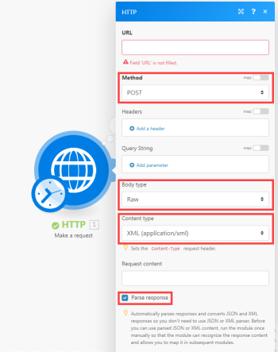

# [!UICONTROL SOAP] 모듈

다음을 사용할 수 있습니다. [!UICONTROL SOAP] 연결할 모듈 [!UICONTROL SOAP] 의 API [!UICONTROL Adobe Workfront Fusion].

## 액세스 요구 사항

이 문서의 기능을 사용하려면 다음 액세스 권한이 있어야 합니다.

<table style="table-layout:auto"> 
 <col> 
 <col> 
 <tbody> 
  <tr> 
   <td role="rowheader">[!DNL Adobe Workfront] 플랜*</td>
  <td> <p>[!UICONTROL Pro] 이상</p> </td>
  </tr> 
  <tr data-mc-conditions=""> 
   <td role="rowheader">[!DNL Adobe Workfront] 라이센스*</td>
   <td> <p>[!UICONTROL Plan], [!UICONTROL Work]</p> </td> 
  </tr> 
  <tr> 
   <td role="rowheader">[!DNL Adobe Workfront Fusion] 라이센스**</td> 
   <td>
   <p>현재 라이선스 요구 사항: 아니요 [!DNL Workfront Fusion] 라이센스 요구 사항.</p>
   <p>또는</p>
   <p>기존 라이선스 요구 사항: [!UICONTROL [!DNL Workfront Fusion] for Work Automation and Integration] </p>
   </td> 
  </tr> 
  <tr> 
   <td role="rowheader">제품</td> 
   <td>
   <p>현재 제품 요구 사항: [!UICONTROL Select] 또는 [!UICONTROL Prime]이 있는 경우 [!DNL Adobe Workfront] 플랜, 조직은 다음을 구매해야 합니다. [!DNL Adobe Workfront Fusion] 뿐만 아니라 [!DNL Adobe Workfront] 이 문서에 설명된 기능을 사용하십시오. [!DNL Workfront Fusion] [!UICONTROL Ultimate]에 포함되어 있습니다. [!DNL Workfront] 계획.</p>
   <p>또는</p>
   <p>레거시 제품 요구 사항: 조직에서 구매해야 함 [!DNL Adobe Workfront Fusion] 뿐만 아니라 [!DNL Adobe Workfront] 이 문서에 설명된 기능을 사용하십시오.</p>
   </td> 
  </tr> 
 </tbody> 
</table>

보유 중인 플랜, 라이선스 유형 또는 액세스 권한을 알아보려면 [!DNL Workfront] 관리자.

다음에 대한 정보: [!DNL Adobe Workfront Fusion] 라이센스, 참조 [[!DNL Adobe Workfront Fusion] 라이선스](../../workfront-fusion/get-started/license-automation-vs-integration.md).

## 의 제한 사항 [!UICONTROL SOAP] 모듈

>[!NOTE]
>
>WDSL을 로드하는 동안 리디렉션이 비활성화됩니다. 이는 보안 기능이지만 모듈을 실행할 때 확인되지 않은 리디렉션이 차단됨을 의미할 수 있습니다.

다음 [!UICONTROL SOAP] 모듈은 현재 beta 상태이며 다음을 지원하지 않습니다.

* 요소 재정의
* 소수 자릿수 제한
* 총 자릿수 제한
* 공백 제한
* 입력 및 출력 메시지의 여러 부분. 단일 부분 메시지만 지원됩니다.
* 다음을 통해 정의된 사용자 지정 XML 스키마 요소 [[!UICONTROL SOAP] 인코딩](https://schemas.xmlsoap.org) 스키마 및 요소입니다.

>[!INFO]
>
>**예:**
>  
>다음은에서 올바르게 인식되지 않습니다. [!UICONTROL Workfront Fusion]:
>
>```
><complexType name="ArrayOfFloat">
>     <complexContent>
>           <restriction base="soapenc:Array">
>                 <attribute ref="soapenc:arrayType"
>                       wsdl:arrayType="xsd:integer[]"/>
>           </restriction>
>     </complexContent>
></complexType>
>```
>
>이 예에는 다음이 포함됩니다. `soapenc:Array`, `soapenc:arrayType` 및 `wsdl:arrayType` 에서 아직 지원되지 않는 참조 [!UICONTROL Workfront Fusion].

## 해결 방법

다음과 같은 경우 [!UICONTROL SOAP] 모듈이 WSDL 파일 처리를 거부하거나 모듈 구성에 여러 오류가 발생합니다. 유니버설 사용을 시도할 수 있습니다. **[!UICONTROL HTTP] > [!UICONTROL 요청]** 모듈:

1. 위치 [!DNL Workfront Fusion], 새 시나리오를 만듭니다.
1. 삽입 **[!UICONTROL HTTP] > [!UICONTROL 요청]** 를 입력합니다.
1. 모듈의 구성을 열고 다음 필드를 채웁니다.

   <table style="table-layout:auto"> 
    <col> 
    <col> 
    <tbody> 
     <tr> 
      <td role="rowheader">[!UICONTROL 메서드]</td> 
      <td> <p>[!UICONTROL POST]</p> </td> 
     </tr> 
     <tr data-mc-conditions=""> 
      <td role="rowheader">[!UICONTROL Body type]</td> 
      <td> <p>[!UICONTROL Raw]</p> </td> [!UICONTROL ]
     </tr> 
     <tr> 
      <td role="rowheader">[!UICONTROL 컨텐츠 유형]</td> 
      <td> <p>[!UICONTROL XML (application/xml)]</p> </td> 
     </tr> 
     <tr> 
      <td role="rowheader">[!UICONTROL 구문 분석 응답]</td> 
      <td>[!UICONTROL 활성화됨]</td> 
     </tr> 
    </tbody> 
   </table>

   

1. 새 웹 브라우저 창 또는 탭을 엽니다.
1. 웹 브라우저의 주소 표시줄에 WSDL URL을 붙여 넣고 XML 파일을 가져옵니다.

   WSDL URL은 일반적으로 로 끝납니다. `?wsdl`, 그러나 반드시 그런 것은 아닙니다. 예 `http://voip.ms/api/v1/server.wsdl`.

1. WSDL 파일이 웹 브라우저에 직접 표시되지 않으면 다운로드한 파일을 텍스트 편집기에서 엽니다.
1. 검색 `<service>` 또는 `<wsdl:service>` 태그:

   

1. 찾으면 다음에서 URL을 복사합니다. `location` 특성.
1. 위치 [!DNL Workfront Fusion]를 클릭하고 URL을 HTTP 모듈의 URL 필드에 붙여넣습니다.
1. 를 엽니다. [온라인 [!UICONTROL SOAP] 클라이언트](https://wsdlbrowser.com/) 새 웹 브라우저 창/탭에서.
1. WSDL URL을 WSDL URL 필드에 붙여넣습니다.
1. 클릭 **[!UICONTROL 찾아보기]**.
1. 예를 들어 왼쪽에 있는 함수 목록에서 선택합니다. `getLanguages`.
1. 의 콘텐츠 복사 [!UICONTROL 요청 XML] 텍스트 영역입니다.
1. 위치 [!UICONTROL Workfront Fusion]를 클릭하고 복사한 컨텐츠를 모듈의 URL 필드에 붙여넣습니다.
1. 물음표를 실제 값으로 대체하여 선택한 매개 변수의 값을 제공합니다.

   

1. 을 클릭하여 모듈의 구성을 닫습니다. **[!UICONTROL 확인]**.
1. 시나리오 또는 모듈을 실행합니다.
