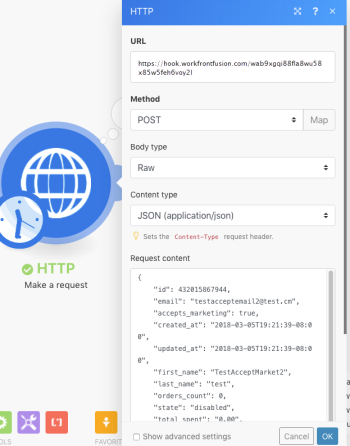

# 웹후크

웹후크는 이벤트에 의해 트리거되는 HTTP 호출입니다. 웹후크를 사용하여 즉시 트리거 모듈을 활성화할 수 있습니다. 인터넷에 연결되어 있고 HTTP 요청을 허용하는 모든 애플리케이션은 웹 후크를 Adobe Workfront Fusion으로 보낼 수 있습니다.

## 액세스 요구 사항

이 문서의 기능을 사용하려면 다음 액세스 권한이 있어야 합니다.

<table style="table-layout:auto"> 
 <col> 
 <col> 
 <tbody> 
  <tr> 
   <td role="rowheader">[!DNL Adobe Workfront] 플랜*</td> 
   <td> <p>[!UICONTROL Pro] 이상</p> </td> 
  </tr> 
  <tr data-mc-conditions=""> 
   <td role="rowheader">[!DNL Adobe Workfront] 라이센스*</td> 
   <td> <p>[!UICONTROL Plan], [!UICONTROL Work]</p> </td> 
  </tr> 
  <tr> 
   <td role="rowheader">[!DNL Adobe Workfront Fusion] 라이센스**</td> 
   <td>
   <p>현재 라이선스 요구 사항: [!DNL Workfront Fusion] 라이선스 요구 사항이 없습니다.</p>
   <p>또는</p>
   <p>레거시 라이선스 요구 사항: 작업 자동화 및 통합을 위한 [!UICONTROL [!DNL Workfront Fusion]] </p>
   </td> 
  </tr> 
  <tr> 
   <td role="rowheader">제품</td> 
   <td>
   <p>현재 제품 요구 사항: [!UICONTROL Select] 또는 [!UICONTROL Prime] [!DNL Adobe Workfront] 플랜이 있는 경우 조직에서 이 문서에 설명된 기능을 사용하려면 [!DNL Adobe Workfront Fusion]과(와) [!DNL Adobe Workfront]을(를) 구매해야 합니다. [!DNL Workfront Fusion]이(가) [!UICONTROL Ultimate] [!DNL Workfront] 계획에 포함되어 있습니다.</p>
   <p>또는</p>
   <p>레거시 제품 요구 사항: 이 문서에 설명된 기능을 사용하려면 조직에서 [!DNL Adobe Workfront Fusion]과(와) [!DNL Adobe Workfront]을(를) 구매해야 합니다.</p>
   </td> 
  </tr>
 </tbody> 
</table>

&#42;보유 중인 플랜, 라이선스 유형 또는 액세스 권한을 확인하려면 Workfront 관리자에게 문의하십시오.

&#42;&#42;라이선스 [!DNL Adobe Workfront Fusion]에 대한 자세한 내용은 [[!DNL Adobe Workfront Fusion] 라이선스](../../workfront-fusion/get-started/license-automation-vs-integration.md)를 참조하세요.

## [!DNL Workfront Fusion]에서 웹후크 사용

>[!NOTE]
>
>서드파티 웹후크(발신 웹후크)를 호출하려면 HTTP 모듈 중 하나를 사용합니다. 자세한 내용은 [HTTP 모듈](../../workfront-fusion/apps-and-their-modules/http-modules/http-modules-1.md)을 참조하세요.

웹후크를 사용하여 앱을 [!DNL Workfront Fusion]에 연결하려면:

1. **[!UICONTROL Webhooks]** >**[!UICONTROL 사용자 지정 Webhook]** 인스턴트 트리거 모듈을 시나리오에 추가합니다.

1. Webhook 필드 옆에 있는 **[!UICONTROL 추가]**&#x200B;를 클릭하고 새 Webhook의 이름을 입력합니다.
1. (선택 사항) **[!UICONTROL 고급 설정]**&#x200B;을 클릭합니다.
1. **[!UICONTROL IP 제한]** 필드에 모듈에서 데이터를 허용할 수 있는 IP 주소의 쉼표로 구분된 목록을 입력하십시오.
1. **[!UICONTROL 저장]** 클릭

웹후크를 생성하면 고유한 URL이 표시됩니다. Webhook에서 데이터를 보내는 주소입니다. Workfront Fusion은 이 주소로 전송된 데이터의 유효성을 검사한 다음 시나리오에서 처리하기 위해 데이터를 전달합니다.

>[!NOTE]
>
>웹후크를 만든 후에는 한 번에 두 개 이상의 시나리오에서 사용할 수 있습니다.

### 웹후크의 데이터 구조 구성 {#configure-the-webhook-s-data-structure}

들어오는 페이로드의 데이터 구조를 인식하기 위해 [!DNL Workfront Fusion]은(는) 표시된 주소로 보내는 샘플 데이터를 구문 분석합니다. 해당 서비스 또는 앱이 Webhook을 호출하도록 하는 서비스 또는 앱을 변경하여 샘플 데이터를 제공할 수 있습니다. 예를 들어 파일을 제거할 수 있습니다.

또는 아래 단계에 따라 [!UICONTROL HTTP] > [!UICONTROL 요청] 모듈을 통해 샘플 데이터를 보낼 수 있습니다.

1. **[!UICONTROL HTTP]** > **[!UICONTROL 요청]** 모듈로 새 시나리오를 만듭니다.

1. 다음 값으로 모듈을 구성합니다.

   <table style="table-layout:auto"> 
    <col> 
    <col> 
    <tbody> 
     <tr> 
      <td role="rowheader"><p>[!UICONTROL URL] </p></td> 
      <td>Webhook의 URL을 입력합니다. 이 URL은 웹후크를 설정하는 데 사용한 [!UICONTROL Webhooks] 모듈에서 찾을 수 있습니다.</td> 
     </tr> 
     <tr> 
      <td role="rowheader">[!UICONTROL 메서드] </td> 
      <td><p>[!UICONTROL POST]</p></td> 
     </tr> 
     <tr> 
      <td role="rowheader">[!UICONTROL Body type]</td> 
      <td><p> [!UICONTROL Raw]</p></td> 
     </tr> 
     <tr> 
      <td role="rowheader">[!UICONTROL 컨텐츠 유형]</td> 
      <td><p> JSON(application/json)</p></td> 
     </tr> 
     <tr> 
      <td role="rowheader">[!UICONTROL 요청 컨텐츠]</td> 
      <td><p>Webhook에 필요한 원시 JSON</p></td> 
     </tr> 
    </tbody> 
   </table>

   

1. 별도의 브라우저 탭 또는 창에서 [!UICONTROL Webhooks] 모듈로 시나리오를 엽니다.
1. Webhooks 모듈에서 **[!UICONTROL 데이터 구조 다시 결정]**&#x200B;을 클릭합니다.

   Webhooks 모듈에서 다른 모듈의 연결을 해제할 필요가 없습니다.

1. [!UICONTROL HTTP] 모듈이 있는 시나리오로 전환한 다음 실행하십시오.
1. Webhooks 모듈을 사용하여 시나리오로 다시 전환합니다.

   &quot;[!UICONTROL 확인되었습니다]&quot; 메시지는 모듈이 데이터 구조를 확인했음을 의미합니다.

   

1. 데이터 구조를 저장하려면 **[!UICONTROL 확인]**&#x200B;을 클릭하세요.

   이제 웹후크의 항목을 매핑 패널에서 시나리오의 후속 모듈과 함께 사용할 수 있습니다.

## Webhook 큐

웹후크가 데이터를 받고 해당 데이터를 예상하는 활성 시나리오가 없는 경우 데이터가 큐에 저장됩니다. 시나리오를 활성화하면 큐에서 대기 중인 모든 번들을 순차적으로 처리합니다.

>[!IMPORTANT]
>
>웹후크 대기열은 동일한 웹후크를 사용하는 시나리오 간에 공유됩니다. 시나리오 중 하나가 비활성화된 경우 들어오는 모든 데이터가 큐에 보관됩니다.

## 지원되는 수신 데이터 형식

[!DNL Workfront Fusion]은(는) 들어오는 데이터 형식 [!UICONTROL 쿼리 문자열], [!UICONTROL 양식 데이터] 및 [!UICONTROL JSON]의 3가지 형식을 지원합니다.

[!DNL Workfront Fusion]이(가) 선택한 데이터 구조에 대해 들어오는 모든 데이터의 유효성을 검사합니다. 그런 다음 시나리오의 설정에 따라 데이터가 처리를 위해 큐에 저장되거나 즉시 처리됩니다.

데이터의 일부가 유효성 검사를 통과하지 못하면 [!DNL Workfront Fusion]은(는) 400 HTTP 상태 코드를 반환하고 HTTP 응답 본문에 들어오는 데이터가 유효성 검사에 실패한 이유를 지정합니다. 들어오는 데이터의 유효성 검사가 성공하면 Workfront Fusion은 &quot;[!UICONTROL 200 수락됨]&quot; 상태를 반환합니다.

* [[!UICONTROL 쿼리 문자열]](#query-string)
* [[!UICONTROL 양식 데이터]](#form-data)
* [[!UICONTROL JSON]](#json)

### [!UICONTROL 쿼리 문자열]

```
GET https://app.workfrontfusion.com/wh/<yourunique32characterslongstring>?name=<yourname>&job=automate
```

### [!UICONTROL 양식 데이터]

```
POST https://app.workfrontfusion.com/wh/<yourunique32characterslongstring>

Content-Type: application/x-www-form-urlencoded

name=<yourname>&job=automate
```

#### 다중 파트 양식 데이터

```
POST https://app.workfrontfusion.com/wh/<yourunique32characterslongstring>


Content-Type: multipart/form-data; boundary=---generatedboundary

---generatedboundary

Content-Disposition: form-data; name="file"; filename="file.txt"


Content-Type: text/plain


Content of file.txt


---generatedboundary

Content-Disposition: form-data; name="name"

Workfront Fusion

---generatedboundary
```

`multipart/form-data`(으)로 인코딩된 파일을 받으려면 중첩 필드 `name`, `mime` 및 `data`이(가) 포함된 `collection` 형식 필드로 데이터 구조를 구성해야 합니다. 필드 `name`은(는) `text` 형식이며 업로드된 파일의 이름을 포함합니다. `mime`은(는) `text` 형식이며 MIME 형식의 파일을 포함합니다. 필드 `data`은(는) `buffer` 형식이며 전송 중인 파일에 대한 이진 데이터를 포함합니다.

MIME 형식에 대한 자세한 내용은 [MIME 모듈](../../workfront-fusion/apps-and-their-modules/mime.md)을 참조하세요.

### [!UICONTROL JSON]

```
POST https://app.workfrontfusion.com/wh/<yourunique32characterslongstring>

Content-Type: application/json

{"name": "Workfront Fusion", "job": "automate"}
```

>[!TIP]
>
>원래 JSON에 액세스하려는 경우 웹후크를 설정할 때 JSON 패스스루를 활성화합니다.
>
>1. 새 웹후크를 추가하려면 **[!UICONTROL 추가]**&#x200B;를 클릭하십시오.
>1. **[!UICONTROL 고급 설정 표시]**&#x200B;를 클릭합니다.
>1. **[!UICONTROL JSON 통과]**&#x200B;를 클릭합니다.
>

## Webhook 헤더

Webhook의 헤더에 액세스하려면 Webhook을 설정할 때 요청 헤더 가져오기 를 활성화합니다.

1. 새 웹후크를 추가하려면 **[!UICONTROL 추가]**&#x200B;를 클릭하십시오.
1. **[!UICONTROL 고급 설정 표시]**&#x200B;를 클릭합니다.
1. **[!UICONTROL 요청 헤더 가져오기]**&#x200B;를 클릭합니다.

`map()` 및 `get()` 함수의 조합으로 특정 헤더 값을 추출할 수 있습니다.

>[!INFO]
>
>**예:**
>
>아래 예제는 `Headers[]` 배열에서 `authorization` 헤더의 값을 추출하는 수식을 보여 줍니다. 공식은 추출된 값과 지정된 텍스트를 비교하여 일치하는 항목이 있는 경우 웹후크만 전달하는 필터에 사용됩니다.
>
>
>
>지정된 키로 배열의 요소를 가져오는 방법에 대한 자세한 내용은 문서 [Adobe Workfront Fusion의 한 모듈에서 다른 모듈로 정보 매핑](../../workfront-fusion/mapping/map-information-between-modules.md)에서 [지정된 키로 배열의 요소 매핑](../../workfront-fusion/mapping/map-information-between-modules.md#mapping)을 참조하십시오.

## 웹후크에 응답

Webhook 호출에 대한 기본 응답은 &quot;Accepted&quot;입니다. 사용자 지정 Webhook 모듈을 실행하는 동안 Webhook를 호출한 앱에 응답이 반환됩니다.

* [Webhook에 대한 응답을 테스트합니다](#test-the-response-to-a-webhook)
* [HTML 응답 예](#html-response-example)
* [리디렉션 예](#redirect-example)

### Webhook에 대한 응답 테스트

1. 시나리오에 **[!UICONTROL 사용자 지정 Webhook]** 모듈을 포함하십시오.
1. 새 웹후크를 모듈에 추가합니다.
1. 웹후크 URL을 클립보드에 복사합니다.
1. 시나리오를 실행합니다.

   [!UICONTROL 사용자 지정 Webhook] 모듈의 번개 아이콘이 회전하는 점으로 변경됩니다. 이는 모듈이 이제 Webhook 호출을 기다리고 있음을 보여줍니다.

1. 새 브라우저 창을 열고 복사한 URL을 주소 표시줄에 붙여 넣은 다음 **[!UICONTROL Enter]**&#x200B;를 누릅니다.

   [!UICONTROL 사용자 지정 Webhook] 모듈이 트리거되고 브라우저에 새 페이지가 표시됩니다.

Webhook 응답을 사용자 정의하려면 Webhook 응답 모듈을 사용합니다.

모듈 구성에 두 개의 필드가 있습니다. [!UICONTROL 상태] 및 [!UICONTROL 본문].

* [!UICONTROL Status] 필드에는 성공(예: `200`)에 대한 2xx, 리디렉션에 대한 3xx(예: 임시 리디렉션에 대한 `307`), 클라이언트 오류에 대한 4xx(예: 잘못된 요청에 대한 `400`) 등의 HTTP 응답 상태 코드가 포함되어 있습니다.

* [!UICONTROL Body] 필드에 Webhook의 호출에서 수락되는 모든 항목이 포함되어 있습니다. 간단한 텍스트, HTML, XML, JSON 등이 될 수 있습니다.

  >[!TIP]
  >
  >`Content-Type` 헤더를 해당하는 MIME 형식으로 설정하는 것이 좋습니다. 일반 텍스트의 경우 `text/plain`, HTML의 경우 `text/html`, JSON의 경우 `application/json`, XML의 경우 `application/xml` 등입니다. MIME 유형에 대한 자세한 내용은 [MIME 모듈](../../workfront-fusion/apps-and-their-modules/mime.md)을 참조하세요.

응답 전송 시간 제한은 40초입니다. 이 기간 내에 응답을 사용할 수 없는 경우 Workfront Fusion은 &#39;200 수락됨&#39; 상태를 반환합니다.

### HTML 응답 예

>[!INFO]
>
>**예:**
>
>다음과 같이 [!UICONTROL Webhook 응답] 모듈을 구성합니다.
>
><table style="table-layout:auto"> 
&gt; <col> 
&gt; <col> 
&gt; <tbody> 
&gt;  <tr> 
&gt;   <td role="rowheader">[!UICONTROL 상태] </td> 
&gt;   <td> <p>2xx 성공 HTTP 상태 코드(예: 200)</p> </td> 
&gt;  </tr> 
&gt;  <tr> 
&gt;   <td role="rowheader">[!UICONTROL Body] </td> 
&gt;   <td> <p>HTML 코드</p> </td> 
&gt;  </tr> 
&gt;  <tr> 
&gt;   <td role="rowheader"> <p>[!UICONTROL 사용자 지정 헤더]</p> </td> 
&gt;   <td> 
&gt;    <ul> 
&gt;     <li><strong>키</strong>: Content-type</li> 
&gt;     <li><strong>값</strong>: text/html</li> 
&gt;    </ul> </td> 
&gt;  </tr> 
&gt; </tbody> 
&gt;</table>
>
>
>
>이렇게 하면 웹 브라우저에 표시되는 HTML 응답이 생성됩니다.
>
>

### 리디렉션 예

>[!INFO]
>
>**예:** [!UICONTROL Webhook 응답] 모듈을 다음과 같이 구성합니다.
>
><table style="table-layout:auto"> 
&gt; <col> 
&gt; <col> 
&gt; <tbody> 
&gt;  <tr> 
&gt;   <td role="rowheader">[!UICONTROL 상태] </td> 
&gt;   <td> <p>3xx 리디렉션 HTTP 상태 코드(예: 303)</p> </td> 
&gt;  </tr> 
&gt;  <tr> 
&gt;   <td role="rowheader"> <p>[!UICONTROL 사용자 지정 헤더]</p> </td> 
&gt;   <td> 
&gt;    <ul> 
&gt;     <li><strong>[!UICONTROL 키]</strong>: 위치</li> 
&gt;     <li><strong>[!UICONTROL Value]</strong>: 리디렉션할 URL입니다.</li> 
&gt;    </ul> </td> 
&gt;  </tr> 
&gt; </tbody> 
&gt;</table>
>
>

## Webhook 비활성화

다음 중 하나가 적용되는 경우 웹후크는 자동으로 비활성화됩니다.

* 웹후크가 5일 이상 어떤 시나리오에도 연결되지 않았습니다.
* 웹후크는 30일 이상 비활성 상태인 비활성 시나리오에서만 사용됩니다.

비활성화된 웹후크는 시나리오에 연결되어 있지 않고 30일 이상 비활성화된 상태인 경우 자동으로 삭제 및 등록 취소됩니다.


## 문제 해결

### 매핑 패널에 누락된 항목

[!UICONTROL Webhooks] > [!UICONTROL 사용자 지정 Webhook] 모듈 다음에 있는 모듈 설정의 매핑 패널에서 일부 항목이 누락된 경우 **[!UICONTROL Webhooks] > [!UICONTROL 사용자 지정 Webhook]** 모듈을 클릭하여 설정을 열고 **[!UICONTROL 데이터 구조 다시 확인]**&#x200B;을 클릭합니다.


그런 다음 이 문서의 [웹후크의 데이터 구조 구성](#configure-the-webhook-s-data-structure) 섹션에 설명된 단계를 수행합니다.
