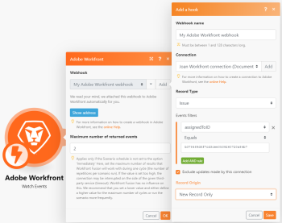

# [!DNL Adobe Workfront] 모듈

를 사용할 수 있습니다 [!DNL Adobe Workfront Fusion] [!DNL Adobe Workfront] 커넥터 를 사용하여 내부 프로세스를 자동화합니다. [!DNL Workfront]. 만약 [!UICONTROL [!DNL Workfront Fusion] 작업 자동화 및 통합을 위한] 라이센스를 취득하면 이를 사용하여 타사 앱 및 서비스에 연결할 수도 있습니다.

다음 [!DNL Workfront] 커넥터는 조직에서 사용할 수 있는 활성 앱 수에 대해서는 계산되지 않습니다. 모든 시나리오는 [!DNL Workfront] 앱으로, 조직의 총 시나리오 수에 대해 카운트합니다.

조직의 사용 가능한 앱 및 시나리오에 대한 자세한 내용은 [조직](../../workfront-fusion/organizations/organizations-and-teams.md#organiza2) in [[!DNL Adobe Workfront Fusion] 조직 및 팀](../../workfront-fusion/organizations/organizations-and-teams.md).

시나리오 만들기에 대한 지침이 필요한 경우 [에서 시나리오 만들기 [!DNL Adobe Workfront Fusion]](../../workfront-fusion/scenarios/create-a-scenario.md). 모듈에 대한 자세한 내용은 [의 모듈 [!DNL Adobe Workfront Fusion]](../../workfront-fusion/modules/modules.md).

## 액세스 요구 사항

이 문서의 기능을 사용하려면 다음 액세스 권한이 있어야 합니다.

<table style="table-layout:auto">
 <col> 
 <col> 
 <tbody> 
  <tr> 
   <td role="rowheader">[!DNL Adobe Workfront] 플랜*</td>
  <td> 
[!UICONTROL Pro] 이상
 </td>
  </tr> 
  <tr data-mc-conditions=""> 
   <td role="rowheader">[!DNL Adobe Workfront] 라이센스*</td>
   <td> 
[!UICONTROL Plan], [!UICONTROL Work]
 </td> 
  </tr> 
  <tr> 
   <td role="rowheader">[!DNL Adobe Workfront Fusion] license**</td> 
   <td> 
[!UICONTROL [!DNL Workfront Fusion] 작업 자동화 및 통합을 위한] 
  
[!UICONTROL [!DNL Workfront Fusion] 작업 자동화를 위한]
</td> 
  </tr> 
  <tr> 
   <td role="rowheader">제품</td> 
   <td>조직이 구매해야 합니다 [!DNL Adobe Workfront Fusion] 뿐만 아니라 [!DNL Adobe Workfront] 을 참조하십시오.</td> 
  </tr> 
 </tbody> 
</table>

어떤 계획, 라이센스 유형 또는 액세스 권한을 보유하고 있는지 확인하려면 [!DNL Workfront] 관리자

에 대한 자세한 정보 [!DNL Adobe Workfront Fusion] 라이센스 [[!DNL Adobe Workfront Fusion] 라이선스](../../workfront-fusion/get-started/license-automation-vs-integration.md).

## Connect [!DNL Workfront] to [!DNL Workfront Fusion]

다음 [!DNL Workfront] 커넥터는 OAuth 2.0을 사용하여 연결합니다 [!DNL Workfront].

에 대한 연결을 만들 수 있습니다 [!DNL Workfront] 내에서 직접 계정 [!DNL Workfront Fusion] 모듈.

1. 어떤 경우에서도 [!DNL Workfront] 앱 모듈, 클릭 **[!UICONTROL 추가]** 다음 [!UICONTROL 연결] 상자.
1. URL에 인스턴스 이름을 입력합니다. 예: `https://<your instance>.my.workfront.com`.
1. 클릭 **[!UICONTROL 다음]**.
1. 클릭 **[!UICONTROL SAML 로그인]** 연결을 만들고 모듈로 돌아갑니다.

   또는

   사용자 이름과 암호를 입력한 다음 **[!UICONTROL 로그인]** 연결을 만들고 모듈로 돌아갑니다.

   >[!NOTE]
   >
   >* SAML 로그인 단추가 보이지 않는 경우 조직에서 SSO(Single Sign-On)를 활성화하지 않았습니다. 사용자 이름과 암호로 로그인할 수 있습니다.
      >   
      >   SSO에 대한 자세한 내용은 [단일 사인온 개요 [!DNL Adobe Workfront]](../../administration-and-setup/add-users/single-sign-on/sso-in-workfront.md)
   >   
   >* OAuth 2.0 연결 [!DNL Workfront] API는 더 이상 API 키를 사용하지 않습니다.

## [!DNL Workfront] 모듈 및 해당 필드

구성 시 [!DNL Workfront] 모듈, [!DNL Workfront Fusion] 아래 나열된 필드를 표시합니다. 이와 함께 추가 [!DNL Workfront] 앱이나 서비스에서 액세스 수준과 같은 요소에 따라 필드가 표시될 수 있습니다. 모듈에서 굵게 표시된 제목은 필수 필드를 나타냅니다.

필드 또는 함수 위에 맵 단추가 표시되면 이 단추를 사용하여 해당 필드에 대한 변수와 함수를 설정할 수 있습니다. 자세한 내용은 [의 한 모듈에서 다른 모듈로 정보 매핑 [!DNL Adobe Workfront Fusion]](../../workfront-fusion/mapping/map-information-between-modules.md).

* [Triggers](#triggers)
* [액션](#actions)
* [검색 결과](#searches)

### Triggers

<!--
* [Watch Events](#watch-events) 
* [Watch Record](#watch-record) 
* [Watch Field](#watch-field)
-->

+++ **[!UICONTROL 이벤트 보기]**

이 트리거 모듈은 특정 유형의 개체가 Workfront에서 추가, 업데이트 또는 삭제될 때 시나리오를 실시간으로 실행합니다

이 모듈은 연결에 액세스하는 사용자 지정 필드 및 값과 함께 레코드와 연결된 표준 필드를 반환합니다. 이 정보는 시나리오의 후속 모듈에 매핑할 수 있습니다.

1. 클릭 **[!UICONTROL 추가]** 오른쪽 **Webhook** 상자.

1. 에서 웹 후크를 구성합니다. **[!UICONTROL 후크 추가]** 표시되는 상자.

   이 모듈을 구성할 때 다음 필드가 표시됩니다.

   <table style="table-layout:auto"> 
    <col> 
    <col> 
    <tbody> 
     <tr> 
      <td>[!UICONTROL Webhook name]</td> 
      <td>(선택 사항) 웹 후크의 새 이름을 입력합니다</td> 
     </tr> 
     <tr> 
      <td>[!UICONTROL Connection]</td> 
      <td> 
연결 방법에 대한 지침은 [!DNL Workfront] 앱 대상 [!DNL Workfront Fusion]를 참조하십시오. <a href="#connect-workfront-to-workfront-fusion" class="MCXref xref">Connect [!DNL Workfront] to [!DNL Workfront Fusion]</a> 참조하십시오.
 </td> 
     </tr> 
     <tr> 
      <td>[!UICONTROL 레코드 유형]</td> 
      <td>유형 선택 [!DNL Workfront] 모듈이 볼 수 있도록 기록합니다.</td> 
     </tr> 
     <tr> 
      <td>[!UICONTROL State]</td> 
      <td>이전 상태 또는 새 상태를 보는지 여부를 선택합니다.<ul><li>
<b>[!UICONTROL 새 상태]</b>

레코드가 변경될 때 시나리오 트리거 <b>to</b> 지정된 값입니다.

예를 들어, 상태가 [!UICONTROL 새 상태]로 설정되어 있고 필터가 [!UICONTROL 상태] [!UICONTROL Equals] [!UICONTROL In Progress]로 설정된 경우, 웹 후크는 이전의 상태에 관계없이 [!UICONTROL Status]가 [!UICONTROL In Progress]로 변경되면 시나리오를 트리거합니다. 
</li><li>
<b>[!UICONTROL 이전 상태]</b>

레코드가 변경될 때 시나리오 트리거 <b>변환 전:</b> 지정된 값입니다.

예를 들어 상태가 [!UICONTROL 이전 상태]로 설정되어 있고 필터가 [!UICONTROL 상태] [!UICONTROL Equals] [!UICONTROL In Progress]로 설정되어 있으면 웹 후크는 현재 [!UICONTROL In Progress]인 [!UICONTROL Status]가 다른 상태로 변경되면 시나리오를 트리거합니다. 
</li></ul></td> 
     </tr> 
     <tr data-mc-conditions=""> 
      <td> 
[!UICONTROL 이벤트 필터]
 </td> 
      <td> 
선택한 기준에 맞는 레코드만 표시하도록 필터를 설정할 수 있습니다.
 
각 필터에 대해 필터를 평가할 필드, 연산자 및 필터를 허용할 값을 입력합니다. AND 규칙을 추가하여 두 개 이상의 필터를 사용할 수 있습니다.
 
참고: 기존 필터에서는 편집할 수 없습니다 [!DNL Workfront] 웹 후크. 에 대해 다른 필터를 설정하려면 다음을 수행하십시오 [!DNL Workfront] 이벤트 구독, 현재 웹 후크를 제거하고 새 웹 후크를 만듭니다.
 
이벤트 필터에 대한 자세한 내용은 <a href="#event-subscription-filters-in-the-workfront-watch-events-modules" class="MCXref xref">의 이벤트 구독 필터 [!DNL Workfront] &gt; [!UICONTROL Watch Events] 모듈</a> 참조하십시오.
 </td> 
     </tr> 
     <tr data-mc-conditions=""> 
      <td>이 연결에서 수행한 이벤트 제외</td> 
      <td>이 트리거 모듈에서 사용하는 것과 동일한 커넥터를 사용하여 만들거나 업데이트하는 이벤트를 제외하려면 이 옵션을 활성화합니다. 이렇게 하면 시나리오가 자체적으로 트리거되어 무한 루프에서 반복되는 상황을 방지할 수 있습니다.</td> 
     </tr> 
     <tr> 
      <td>[!UICONTROL Record Origin]</td> 
      <td> 
시나리오를 감시할지 여부를 선택합니다 <strong>[!UICONTROL 새 레코드만]</strong>, <strong>[!UICONTROL 업데이트된 레코드만]</strong>, <strong>[!UICONTROL 새 레코드 및 업데이트된 레코드]</strong>, 또는 <strong>[!DNL Deleted Records Only]</strong>.
 
참고: 만약 <strong>[!UICONTROL 새 레코드 및 업데이트된 레코드]</strong>로 설정되면 웹 후크 만들기에서 두 개의 이벤트 구독(동일한 웹 후크 주소에 대해)을 만듭니다.
 </td> 
     </tr> 
    </tbody> 
   </table>

웹 후크가 만들어지면 이벤트가 전송되는 종단점의 주소를 볼 수 있습니다.

자세한 내용은 섹션을 참조하십시오 [이벤트 페이로드의 예](../../wf-api/general/event-subs-api.md#examples-of-event-payloads) 에서 [!DNL Workfront] 도움말 문서 [이벤트 구독 API](../../wf-api/general/event-subs-api.md).

목록 보기 [!DNL Workfront] 에서 이 모듈을 사용할 수 있는 개체 유형 [[!DNL Workfront] object types available for each [!DNL Workfront] 모듈](#workfront-object-types-available-for-each-workfront-module).

+++

+++ **[!UICONTROL 감시 필드]**

이 트리거 모듈은 지정한 필드가 업데이트되면 시나리오를 실행합니다. 이 모듈은 지정한 필드의 이전 값과 새 값을 모두 반환합니다. 이 정보는 시나리오의 후속 모듈에 매핑할 수 있습니다.

이 모듈을 구성할 때 다음 필드가 표시됩니다.

<table style="table-layout:auto">
 <col> 
 <col> 
 <tbody> 
  <tr> 
   <td>[!UICONTROL Connection]</td> 
   <td> 
연결 방법에 대한 지침은 [!DNL Workfront] 앱 대상 [!DNL Workfront Fusion]를 참조하십시오. <a href="#connect-workfront-to-workfront-fusion" class="MCXref xref">Connect [!DNL Workfront] to [!DNL Workfront Fusion]</a> 참조하십시오.
 </td> 
  </tr> 
  <tr> 
   <td>[!UICONTROL 레코드 유형]</td> 
   <td> 
유형 선택 [!DNL Workfront] 모듈이 볼 수 있도록 기록합니다.
 
예를 들어 작업에서 레코드 필드가 업데이트될 때마다 시나리오 실행을 시작하려면 [!UICONTROL 작업]을 선택합니다.
 </td> 
  </tr> 
  <tr> 
   <td>[!UICONTROL Field]</td> 
   <td>모듈에서 업데이트를 확인할 필드를 선택합니다. 이러한 필드는 [!DNL Workfront] 관리자가 추적을 사용하도록 설정되었습니다.</td> 
  </tr> 
  <tr> 
   <td>[!UICONTROL 출력]</td> 
   <td>이 모듈의 출력 번들에 포함할 정보를 선택합니다.</td> 
  </tr> 
  <tr> 
   <td>[!UICONTROL 제한]</td> 
   <td> 
각 시나리오 실행 주기 동안 모듈이 반환할 최대 레코드 수를 입력하거나 매핑합니다.
 </td> 
  </tr> 
 </tbody> 
</table>

목록 보기 [!DNL Workfront] 에서 이 모듈을 사용할 수 있는 개체 유형 [[!DNL Workfront] object types available for each [!DNL Workfront] 모듈](#workfront-object-types-available-for-each-workfront-module).

+++

+++ **[!UICONTROL 감시 레코드]**

이 트리거 모듈은 특정 유형의 개체가 추가, 업데이트 또는 둘 다 될 때 시나리오를 실행합니다. 이 모듈은 연결에서 액세스하는 사용자 지정 필드 및 값과 함께 레코드 또는 레코드와 연관된 모든 표준 필드를 반환합니다. 이 정보는 시나리오의 후속 모듈에 매핑할 수 있습니다. 출력에서 모듈은 각 레코드가 새 레코드인지 아니면 업데이트되었는지를 나타냅니다.

지정된 기간에 추가되고 업데이트된 레코드는 새 레코드로 반환됩니다.

이 모듈을 구성할 때 다음 필드가 표시됩니다.

<table style="table-layout:auto"> 
 <col> 
 <col> 
 <tbody> 
  <tr> 
   <td role="rowheader">[!UICONTROL Connection]</td> 
   <td> 
연결 방법에 대한 지침은 [!DNL Workfront] 앱 대상 [!DNL Workfront Fusion]를 참조하십시오. <a href="#connect-workfront-to-workfront-fusion" class="MCXref xref">Connect [!DNL Workfront] to [!DNL Workfront Fusion]</a> 참조하십시오.
 </td> 
  </tr> 
  <tr> 
   <td role="rowheader">[!UICONTROL Filter]</td> 
   <td> 
시나리오를 감시할지 여부를 선택합니다 <strong>[!UICONTROL 새 레코드만]</strong>, <strong>[!UICONTROL 업데이트된 레코드만]</strong>, 또는 <strong>[!UICONTROL 새 레코드 및 업데이트된 레코드]</strong>.
 </td> 
  </tr> 
  <tr> 
   <td role="rowheader">[!UICONTROL 레코드 유형]</td> 
   <td> 
(을(를) 선택하면 표시됩니다. <strong>필터</strong>) 유형 선택 [!DNL Workfront] 모듈이 볼 수 있도록 기록합니다.
 
예를 들어 새 프로젝트를 만들 때마다 시나리오를 시작하려면 [!UICONTROL 프로젝트]를 선택합니다
 </td> 
  </tr> 
  <tr> 
   <td role="rowheader">[!UICONTROL 출력]</td> 
   <td> 
이 모듈의 출력 번들에 포함할 정보를 선택합니다.
 </td> 
  </tr> 
  <tr> 
   <td role="rowheader">[!UICONTROL 옵션 필터]</td> 
   <td> 
(고급) API 코드 문자열을 입력하여 기준을 구체화할 추가 매개 변수 또는 코드를 정의합니다. 
 </td> 
  </tr> 
  <tr> 
   <td role="rowheader">[!UICONTROL 제한]</td> 
   <td> 
각 시나리오 실행 주기 동안 모듈이 반환할 최대 레코드 수를 입력하거나 매핑합니다.
 </td> 
  </tr> 
 </tbody> 
</table>

목록 보기 [!DNL Workfront] 에서 이 모듈을 사용할 수 있는 개체 유형 [[!DNL Workfront] object types available for each [!DNL Workfront] 모듈](#workfront-object-types-available-for-each-workfront-module).

+++

### 액션

<!--
* [Convert object](#convert-object) 
* [Create a record (attaching custom forms)](#create-a-record-attaching-custom-forms) 
* [Create a record](#create-a-record) 
* [Custom API Call](#custom-api-call) 
* [Delete Record](#delete-record) 
* [Download Document](#download-document) 
* [Misc Action](#misc-action) 
* [Read a Record](#read-a-record) 
* [Update Record](#update-record) 
* [Upload Document](#upload-document)
-->

+++ **[!UICONTROL 개체 변환]**

이 작업 모듈은 다음 전환 중 하나를 수행합니다.

* 문제를 프로젝트로 변환
* 문제를 작업으로 변환
* 작업을 프로젝트로 변환

<table style="table-layout:auto"> 
 <col> 
 <col> 
 <tbody> 
  <tr> 
   <td>[!UICONTROL Connection]</td> 
   <td> 
연결 방법에 대한 지침은 [!DNL Workfront] 앱 대상 [!DNL Workfront Fusion]를 참조하십시오. <a href="#connect-workfront-to-workfront-fusion" class="MCXref xref">Connect [!DNL Workfront] to [!DNL Workfront Fusion]</a> 참조하십시오.
 </td> 
  </tr> 
  <tr data-mc-conditions=""> 
   <td>[!UICONTROL 개체 유형]</td> 
   <td> 
변환할 개체 유형을 선택합니다. 변환 전에 개체의 형식입니다.
 </td> 
  </tr> 
  <tr data-mc-conditions=""> 
   <td>[!UICONTROL 변환 대상]</td> 
   <td>변환할 개체를 선택합니다. 변환 후 개체의 형식입니다.</td> 
  </tr> 
  <tr> 
   <td>[!UICONTROL &lt;object&gt; ID]</td> 
   <td> 
개체의 ID를 입력합니다. 
 
참고: 개체의 ID를 입력할 때 개체의 이름을 입력한 다음 목록에서 선택할 수 있습니다. 그런 다음 모듈이 필드에 적절한 ID를 입력합니다.
 </td> 
  </tr> 
  <tr data-mc-conditions=""> 
   <td>[!UICONTROL 템플릿 ID]</td> 
   <td> 
프로젝트로 변환하는 경우, 프로젝트에 사용할 템플릿 ID를 선택합니다.
 
참고: 개체의 ID를 입력할 때 개체의 이름을 입력한 다음 목록에서 선택할 수 있습니다. 그런 다음 모듈이 필드에 적절한 ID를 입력합니다.
 </td> 
  </tr> 
  <tr data-mc-conditions=""> 
   <td>[!UICONTROL 사용자 지정 양식]</td> 
   <td>새로 변환된 개체에 추가할 사용자 정의 양식을 선택한 다음 사용자 정의 양식 필드에 값을 입력합니다.</td> 
  </tr> 
  <tr data-mc-conditions=""> 
   <td>[!UICONTROL Options]</td> 
   <td> 
개체를 변환할 때 원하는 옵션을 활성화합니다. 변환하거나 변환한 객체에 따라 옵션을 사용할 수 있습니다.
 </td> 
  </tr> 
 </tbody> 
</table>

+++

+++ **[!UICONTROL 레코드 만들기(사용자 지정 양식 첨부)]**

이 작업 모듈은 프로젝트, 작업 또는 문제와 같은 개체를 만듭니다 [!DNL Workfront]및 을 사용하면 새 개체에 사용자 지정 양식을 추가할 수 있습니다. 모듈에서 사용할 수 있는 객체 필드를 선택할 수 있습니다.

레코드의 ID를 지정합니다.

이 모듈은 연결이 액세스하는 사용자 지정 필드 및 값과 함께 레코드 및 관련 필드의 ID를 반환합니다. 이 정보는 시나리오의 후속 모듈에 매핑할 수 있습니다.

예를 들어 이 모듈을 사용하여 작업을 만들 수 있습니다 [!DNL Workfront] 클라이언트가 [!DNL Google Sheets] 수행해야 하는 작업 목록입니다.

이 모듈을 구성할 때 다음 필드가 표시됩니다.

최소 입력 필드 수를 입력해야 합니다. 예를 들어, 문제를 만들려면 프로젝트 ID 필드에 유효한 상위 프로젝트 ID를 제공하여 Workfront에서 문제가 발생하는 위치를 표시해야 합니다. 매핑 패널을 사용하여 시나리오의 다른 모듈에서 이 정보를 매핑하거나, 이름을 입력한 다음 목록에서 선택하여 수동으로 입력할 수 있습니다.

<table style="table-layout:auto">
 <col> 
 </col> 
 <col> 
 </col> 
 <tbody> 
  <tr> 
   <td>[!UICONTROL Connection]</td> 
   <td> 
연결 방법에 대한 지침은 [!DNL Workfront] 앱 대상 [!DNL Workfront Fusion]를 참조하십시오. <a href="#connect-workfront-to-workfront-fusion" class="MCXref xref">Connect [!DNL Workfront] to [!DNL Workfront Fusion]</a> 참조하십시오.
 </td> 
  </tr> 
  <tr> 
   <td>[!UICONTROL 레코드 유형]</td> 
   <td> 
유형 선택 [!DNL Workfront] 모듈이 만들 레코드를 기록합니다.
 
예를 들어, 프로젝트를 만들려면 드롭다운 목록에서 [!UICONTROL 프로젝트] 를 선택한 다음, 프로젝트를 채울 데이터(시나리오의 이전 모듈에서)에 액세스할 수 있는지 확인합니다.
 </td> 
  </tr> 
  <tr data-mc-conditions=""> 
   <td>[!UICONTROL 매핑할 필드 선택]</td> 
   <td> 
데이터 입력에 사용할 필드를 선택합니다. 이렇게 하면 필요하지 않은 필드를 스크롤하지 않고도 이러한 필드를 사용할 수 있습니다.
 
사용자 지정 양식의 필드의 경우 <b>[!UICONTROL 사용자 지정 양식 첨부]</b> 필드.
 </td> 
  </tr> 
  <tr data-mc-conditions=""> 
   <td>[!UICONTROL 사용자 지정 양식 첨부]</td> 
   <td>새 객체에 추가할 사용자 정의 양식을 선택한 다음 해당 필드의 값을 입력합니다.</td> 
  </tr> 
 </tbody> 
</table>

목록 보기 [!DNL Workfront] 에서 이 모듈을 사용할 수 있는 개체 유형 [[!DNL Workfront] object types available for each [!DNL Workfront] 모듈](#workfront-object-types-available-for-each-workfront-module).

>[!NOTE]
>
>* 개체의 ID를 입력할 때 개체의 이름을 입력한 다음 목록에서 선택할 수 있습니다. 그런 다음 모듈이 필드에 적절한 ID를 입력합니다.
>* 사용자 지정 필드 또는 [!UICONTROL 참고] 개체(주석 또는 회신)에서는 [!UICONTROL 참고 텍스트] 굵게 또는 기울임체 텍스트와 같이 리치 텍스트를 만드는 필드입니다.
>
>  업데이트의 리치 텍스트에 대한 자세한 내용은 [작업 항목에 업데이트 추가](../../workfront-basics/updating-work-items-and-viewing-updates/update-work.md#add) in [작업 업데이트](../../workfront-basics/updating-work-items-and-viewing-updates/update-work.md).

+++

+++ **[!UICONTROL 레코드 만들기]**

이 작업 모듈은 프로젝트, 작업 또는 Workfront 문제와 같은 개체를 만듭니다. 모듈에서 사용할 수 있는 객체 필드를 선택할 수 있습니다.

레코드의 ID를 지정합니다.

이 모듈은 연결이 액세스하는 사용자 지정 필드 및 값과 함께 레코드 및 관련 필드의 ID를 반환합니다. 이 정보는 시나리오의 후속 모듈에 매핑할 수 있습니다.

예를 들어 이 모듈을 사용하여 작업을 만들 수 있습니다 [!DNL Workfront] 클라이언트가 Google 시트 목록에 수행해야 하는 작업의 새 행을 추가하면 됩니다.

이 모듈을 구성할 때 다음 필드가 표시됩니다.

최소 입력 필드 수를 입력해야 합니다. 예를 들어, 문제를 만들려면 프로젝트 ID 필드에 유효한 상위 프로젝트 ID를 제공하여 Workfront에서 문제가 발생하는 위치를 표시해야 합니다. 매핑 패널을 사용하여 시나리오의 다른 모듈에서 이 정보를 매핑하거나, 이름을 입력한 다음 목록에서 선택하여 수동으로 입력할 수 있습니다.

<table style="table-layout:auto">
 <col> 
 </col> 
 <col> 
 </col> 
 <tbody> 
  <tr> 
   <td>[!UICONTROL Connection]</td> 
   <td> 
연결 방법에 대한 지침은 [!DNL Workfront] 앱 대상 [!DNL Workfront Fusion]를 참조하십시오. <a href="#connect-workfront-to-workfront-fusion" class="MCXref xref">Connect [!DNL Workfront] to [!DNL Workfront Fusion]</a> 참조하십시오.
 </td> 
  </tr> 
  <tr> 
   <td>[!UICONTROL 레코드 유형]</td> 
   <td> 
유형 선택 [!DNL Workfront] 모듈이 만들 레코드를 기록합니다.
 
예를 들어, 프로젝트를 만들려면 드롭다운 목록에서 [!UICONTROL 프로젝트] 를 선택한 다음, 프로젝트를 채울 데이터(시나리오의 이전 모듈에서)에 액세스할 수 있는지 확인합니다.
 </td> 
  </tr> 
  <tr data-mc-conditions=""> 
   <td>[!UICONTROL 매핑할 필드 선택]</td> 
   <td>데이터 입력에 사용할 필드를 선택합니다. 이렇게 하면 필요하지 않은 필드를 스크롤하지 않고도 이러한 필드를 사용할 수 있습니다.</td> 
  </tr> 
 </tbody> 
</table>

목록 보기 [!DNL Workfront] 에서 이 모듈을 사용할 수 있는 개체 유형 [[!DNL Workfront] object types available for each [!DNL Workfront] 모듈](#workfront-object-types-available-for-each-workfront-module).

>[!NOTE]
>
>* 개체의 ID를 입력할 때 개체의 이름을 입력한 다음 목록에서 선택할 수 있습니다. 그런 다음 모듈이 필드에 적절한 ID를 입력합니다.
>* 사용자 지정 필드 또는 [!UICONTROL 참고] 개체(주석 또는 회신)에서는 [!UICONTROL 참고 텍스트] 굵게 또는 기울임체 텍스트와 같이 리치 텍스트를 만드는 필드입니다.
>
>  업데이트의 리치 텍스트에 대한 자세한 내용은 [작업 항목에 업데이트 추가](../../workfront-basics/updating-work-items-and-viewing-updates/update-work.md#add) in [작업 업데이트](../../workfront-basics/updating-work-items-and-viewing-updates/update-work.md).

+++

+++ **[!UICONTROL 사용자 지정 API 호출]**

이 작업 모듈을 사용하면 [!DNL Workfront] API. 이렇게 하면 다른 방식으로 수행할 수 없는 데이터 흐름 자동화를 만들 수 있습니다 [!DNL Workfront] 모듈.

이 모듈은 다음 정보를 반환합니다.

* **[!UICONTROL 상태 코드]** (숫자): 이는 HTTP 요청의 성공 또는 실패를 나타냅니다. 이것들은 인터넷에서 찾을 수 있는 표준 코드입니다.
* **[!UICONTROL 머리글]** (개체): 출력 본문과 관련이 없는 응답/상태 코드에 대한 자세한 컨텍스트. 응답 헤더에 표시되는 모든 헤더가 응답 헤더인 것은 아니므로 일부 헤더는 사용자에게 유용하지 않을 수 있습니다.

   응답 헤더는 모듈을 구성할 때 선택한 HTTP 요청에 따라 다릅니다.

* **[!UICONTROL 본문]** (개체): 모듈을 구성할 때 선택한 HTTP 요청에 따라 일부 데이터를 다시 수신할 수 있습니다. GET 요청의 데이터와 같은 이 데이터는 이 개체에 포함됩니다.

이 정보는 시나리오의 후속 모듈에 매핑할 수 있습니다.

이 모듈을 구성할 때 다음 필드가 표시됩니다.

<table style="table-layout:auto"> 
 <col> 
 <col> 
 <tbody> 
  <tr> 
   <td role="rowheader">[!UICONTROL Connection]</td> 
   <td> 
연결 방법에 대한 지침은 [!DNL Workfront] 앱 대상 [!DNL Workfront Fusion]를 참조하십시오. <a href="#connect-workfront-to-workfront-fusion" class="MCXref xref">Connect [!DNL Workfront] to [!DNL Workfront Fusion]</a> 참조하십시오.
 </td> 
  </tr> 
  <tr> 
   <td role="rowheader">URL</td> 
   <td> 
상대 경로 입력<code> https://&lt;WORKFRONT_DOMAIN&gt;/attask/api/&lt;API_VERSION&gt;/</code>.
 </td> 
  </tr> 
  <tr> 
   <td role="rowheader">[!UICONTROL API 버전]</td> 
   <td>버전 선택 [!DNL Workfront] 모듈에서 사용할 API입니다.</td> 
  </tr> 
  <tr> 
   <td role="rowheader">[!UICONTROL 메서드]</td> 
   td&gt; 
API 호출을 구성하는 데 필요한 HTTP 요청 메서드를 선택합니다. 자세한 내용은 <a href="../../workfront-fusion/modules/http-request-methods.md" class="MCXref xref" data-mc-variable-override="">의 HTTP 요청 메서드 [!DNL Adobe Workfront Fusion]</a>.
 </td> 
  </tr> 
  <tr> 
   <td role="rowheader">[!UICONTROL Headers]</td> 
   <td> 
요청의 헤더를 표준 JSON 개체 형태로 추가합니다. 요청의 콘텐츠 유형을 결정합니다.
 
For example,<code> {"Content-type":"application/json"}</code>
 
참고: 오류가 발생하여 출처를 확인하기 어려운 경우, [!DNL Workfront] 설명서. 사용자 지정 API 호출이 422 HTTP 요청 오류를 반환하는 경우 다음을 사용해 보십시오. <code>"Content-Type":"text/plain"</code> 헤더.
 </td> 
  </tr> 
  <tr> 
   <td role="rowheader">[!UICONTROL 쿼리 문자열]</td> 
   <td> 
표준 JSON 개체 형태로 API 호출에 대한 쿼리를 추가합니다.
 
For example: <code>{"name":"something-urgent"}</code>
 
팁: 쿼리 매개 변수가 아닌 JSON 본문을 통해 정보를 전송하는 것이 좋습니다.
 </td> 
  </tr> 
  <tr> 
   <td role="rowheader">[!UICONTROL Body]</td> 
   <td> 
표준 JSON 개체 형태로 API 호출에 대한 본문 콘텐츠를 추가합니다.
 
참고:  
다음과 같은 조건문을 사용하는 경우 <code>if</code> json에서 따옴표를 조건문 외부에 지정합니다.
 
     
Example: </b>"> 
      
  
 
     
 
 </td> 
  </tr> 
 </tbody> 
</table>

목록 보기 [!DNL Workfront] 에서 이 모듈을 사용할 수 있는 개체 유형 [[!DNL Workfront] object types available for each [!DNL Workfront] 모듈](#workfront-object-types-available-for-each-workfront-module).

+++

+++ **[!UICONTROL 레코드 삭제]**

이 작업 모듈은 프로젝트, 작업 또는 Workfront 문제와 같은 개체를 삭제합니다.

레코드의 ID를 지정합니다.

이 모듈은 연결이 액세스하는 사용자 지정 필드 및 값과 함께 레코드 및 관련 필드의 ID를 반환합니다. 이 정보는 시나리오의 후속 모듈에 매핑할 수 있습니다.

이 모듈을 구성할 때 다음 필드가 표시됩니다.

<table style="table-layout:auto">
 <col> 
 <col> 
 <tbody> 
  <tr> 
   <td>[!UICONTROL Connection]</td> 
   <td> 
연결 방법에 대한 지침은 [!DNL Workfront] 앱 대상 [!DNL Workfront Fusion]를 참조하십시오. <a href="#connect-workfront-to-workfront-fusion" class="MCXref xref">Connect [!DNL Workfront] to [!DNL Workfront Fusion]</a> 참조하십시오.
 </td> 
  </tr> 
  <tr> 
   <td>[!UICONTROL 강제 삭제]</td> 
   <td>이 옵션을 활성화하여 [!DNL Workfront] UI가 삭제 확인을 요청합니다.</td> 
  </tr> 
  <tr data-mc-conditions=""> 
   <td>ID</td> 
   <td> 
고유 항목을 입력합니다 [!DNL Workfront] 모듈을 삭제할 레코드의 ID입니다.
 
ID를 가져오려면 [!DNL Workfront] 브라우저에서 개체를 검색하고 "ID=" 뒤에 있는 URL 끝에 텍스트를 복사합니다. 예: https://my.workfront.com/project/view?ID=<i>5e43010c03286a2a555e1d0a75d6a86e</i>
 </td> 
  </tr> 
  <tr> 
   <td>[!UICONTROL 레코드 유형]</td> 
   <td>유형 선택 [!DNL Workfront] 모듈을 삭제할 레코드를 기록합니다.</td> 
  </tr> 
 </tbody> 
</table>

목록 보기 [!DNL Workfront] 에서 이 모듈을 사용할 수 있는 개체 유형 [[!DNL Workfront] object types available for each [!DNL Workfront] 모듈](#workfront-object-types-available-for-each-workfront-module).

+++

+++ **[!UICONTROL 문서 다운로드]**

이 작업 모듈은 Workfront에서 문서를 다운로드합니다.

레코드의 ID를 지정합니다.

이 모듈은 문서의 컨텐트, 파일 이름, 파일 확장명 및 파일 크기를 반환합니다. 이 정보는 시나리오의 후속 모듈에 매핑할 수 있습니다.

이 모듈을 구성할 때 다음 필드가 표시됩니다.

<table style="table-layout:auto">
 <col> 
 <col> 
 <tbody> 
  <tr> 
   <td>[!UICONTROL Connection]</td> 
   <td> 
연결 방법에 대한 지침은 [!DNL Workfront] 앱 대상 [!DNL Workfront Fusion]를 참조하십시오. <a href="#connect-workfront-to-workfront-fusion" class="MCXref xref">Connect [!DNL Workfront] to [!DNL Workfront Fusion]</a> 참조하십시오.
 </td> 
  </tr> 
  <tr> 
   <td>[!UICONTROL 문서 ID]</td> 
   <td> 
고유한 ID를 매핑하거나 수동으로 입력합니다 [!DNL Workfront] 모듈을 다운로드할 문서의 ID입니다.
 
ID를 가져오려면 [!DNL Workfront] 브라우저에서 개체를 검색하고 "ID=" 뒤에 있는 URL 끝에 텍스트를 복사합니다. 예: https://my.workfront.com/project/view?ID=<i>5e43010c03286a2a555e1d0a75d6a86e</i>
 </td> 
  </tr> 
 </tbody> 
</table>

목록 보기 [!DNL Workfront] 에서 이 모듈을 사용할 수 있는 개체 유형 [[!DNL Workfront] object types available for each [!DNL Workfront] 모듈](#workfront-object-types-available-for-each-workfront-module).

+++

+++ **[!UICONTROL 기타 작업]**

이 작업 모듈을 사용하여 API에 대해 작업을 수행할 수 있습니다.

이 모듈을 구성할 때 다음 필드가 표시됩니다.

<table style="table-layout:auto"> 
 <col> 
 <col> 
 <tbody> 
  <tr> 
   <td>[!UICONTROL Connection]</td> 
   <td> 
연결 방법에 대한 지침은 [!DNL Workfront] 앱 대상 [!DNL Workfront Fusion]를 참조하십시오. <a href="#connect-workfront-to-workfront-fusion" class="MCXref xref">Connect [!DNL Workfront] to [!DNL Workfront Fusion]</a> 참조하십시오.
 </td> 
  </tr> 
  <tr data-mc-conditions=""> 
   <td>[!UICONTROL 레코드 유형]</td> 
   <td> 
유형 선택 [!DNL Workfront] 모듈이 상호 작용할 것임을 기록합니다.
 </td> 
  </tr> 
  <tr data-mc-conditions=""> 
   <td>[!UICONTROL Action]</td> 
   <td> 
모듈에서 수행할 작업을 선택합니다.
 
선택한 [!UICONTROL 레코드 유형] 및 [!UICONTROL 작업]에 따라 추가 필드를 입력해야 할 수 있습니다. 이 두 설정의 일부 조합에는 레코드 ID만 필요한 반면, 다른 조합(예: <strong>[!UICONTROL 레코드 유형]</strong> 및 [!UICONTROL Attach Template];에 대한 <strong>[!UICONTROL Action]</strong>)에는 추가 정보(예: 개체 ID 및 템플릿 ID)가 필요합니다.
 
개별 필드에 대한 자세한 내용은 <a href="http://developer.workfront.com/">Workfront 개발자 설명서</a>. 
 
    <ol> 
     <li value="1"> 
의 왼쪽 탐색에서 레코드 유형을 선택합니다 [!DNL Workfront] 개발자 설명서 페이지. 다음 유형에는 자체 페이지가 있습니다.
 
      <ul> 
       <li> 
[!UICONTROL Projects]
 </li> 
       <li> 
[!UICONTROL 작업]
 </li> 
       <li> 
[!UICONTROL Issues]
 </li> 
       <li> 
[!UICONTROL Users]
 </li> 
       <li> 
[!UICONTROL Documents]
 </li> 
      </ul> 
다른 모든 레코드 유형에 대해 <b>[!UICONTROL 기타 개체 및 끝점]</b>를 검색하고 알파벳순으로 정렬된 페이지에서 레코드 유형을 찾습니다.
 </li> 
     <li value="2"> 
해당 레코드 유형의 페이지에서 작업을 검색합니다(Ctrl-F 또는 Cmd-F).
 </li> 
     <li value="3"> 
선택한 작업 아래의 사용 가능한 필드에 대한 설명을 봅니다.
 </li> 
    </ol> 
참고:  
를 통해 증명을 만들 때 [!DNL Workfront] [!UICONTROL Misc Action] 모듈에서는, 고급 옵션 없이 증명을 만든 다음, [!DNL Workfront Proof] SOAP API.
 
를 사용하여 증명 만들기에 대한 자세한 내용은 [!DNL Workfront] API(이 모듈에서 사용함)는 <a href="../../wf-api/tips-tricks-and-troubleshooting/api-create-proof-options-json.md" class="MCXref xref">다음을 통해 증명을 만들 때 고급 교정 옵션을 추가합니다. [!DNL Adobe Workfront] API</a>
 
 </td> 
  </tr> 
  <tr data-mc-conditions=""> 
   <td>[!UICONTROL ID]</td> 
   <td>고유 번호를 입력하거나 매핑합니다 [!DNL Workfront] 모듈이 상호 작용할 레코드의 ID입니다.
ID를 가져오려면 [!DNL Workfront] 브라우저에서 개체를 검색하고 "ID=" 뒤에 있는 URL 끝에 텍스트를 복사합니다. 예: https://my.workfront.com/project/view?ID=<i>5e43010c03286a2a555e1d0a75d6a86e</i>
</td> 
  </tr> 
 </tbody> 
</table>

목록 보기 [!DNL Workfront] 에서 이 모듈을 사용할 수 있는 개체 유형 [[!DNL Workfront] object types available for each [!DNL Workfront] 모듈](#workfront-object-types-available-for-each-workfront-module).

+++

+++ **[!UICONTROL 레코드 읽기]**

이 작업 모듈은 단일 레코드에서 데이터를 검색합니다.

레코드의 ID를 지정합니다. 모듈을 읽을 관련 레코드를 지정할 수도 있습니다.

예를 들어, 모듈이 읽고 있는 레코드가 프로젝트인 경우 프로젝트의 작업을 읽도록 지정할 수 있습니다.

이 모듈은 지정한 출력의 표준 필드에서 데이터 배열을 반환합니다.

이 모듈을 구성할 때 다음 필드가 표시됩니다.

<table style="table-layout:auto">
 <col> 
 <col> 
 <tbody> 
  <tr> 
    <td>[!UICONTROL Connection]</td>

<td> 
연결 방법에 대한 지침은 [!DNL Workfront] 앱 대상 [!DNL Workfront Fusion]를 참조하십시오. <a href="#connect-workfront-to-workfront-fusion" class="MCXref xref">Connect [!DNL Workfront] to [!DNL Workfront Fusion]</a> 참조하십시오.
 </td> 
  </tr> 
  <tr> 
    <td>[!UICONTROL 레코드 유형]</td>

<td>을(를) 선택합니다 [!DNL Workfront] 모듈을 읽을 개체 유형입니다.</td> 
  </tr> 
  <tr> 
    <td>[!UICONTROL 출력]</td>

<td> 
이 모듈의 출력 번들에 포함할 정보를 선택합니다.
 </td> 
  </tr> 
  <tr> 
    <td>[!UICONTROL 참조]</td>
   <td>출력에 포함할 참조 필드를 선택합니다.</td> 
  </tr> 
  <tr> 
    <td>[!UICONTROL Collections]</td>
   <td>출력에 포함할 참조 필드를 선택합니다.</td> 
  </tr> 
  <tr> 
    <td>[!UICONTROL ID]</td>
   <td> 
고유 항목을 입력합니다 [!DNL Workfront] 모듈을 읽을 레코드의 ID입니다.
 
ID를 가져오려면 [!DNL Workfront] 브라우저에서 개체를 검색하고 "ID=" 뒤에 있는 URL 끝에 텍스트를 복사합니다. 예: https://my.workfront.com/project/view?ID=<i>5e43010c03286a2a555e1d0a75d6a86e</i>
 </td> 
  </tr> 
 </tbody> 
</table>

목록 보기 [!DNL Workfront] 에서 이 모듈을 사용할 수 있는 개체 유형 [[!DNL Workfront] object types available for each [!DNL Workfront] 모듈](#workfront-object-types-available-for-each-workfront-module).

+++

+++ **[!UICONTROL 레코드 업데이트]**

이 작업 모듈은 프로젝트, 작업 또는 문제와 같은 개체를 업데이트합니다. 모듈에서 사용할 수 있는 객체 필드를 선택할 수 있습니다.

레코드의 ID를 지정합니다.

이 모듈은 연결에서 액세스하는 사용자 지정 필드 및 값과 함께 개체 및 관련 필드의 ID를 반환합니다. 이 정보는 시나리오의 후속 모듈에 매핑할 수 있습니다.

이 모듈을 구성할 때 다음 필드가 표시됩니다.

<table style="table-layout:auto">
 <col> 
 </col> 
 <col> 
 </col> 
 <tbody> 
  <tr> 
   <td>[!UICONTROL Connection]</td> 
   <td> 
연결 방법에 대한 지침은 [!DNL Workfront] 앱 대상 [!DNL Workfront Fusion]를 참조하십시오. <a href="#connect-workfront-to-workfront-fusion" class="MCXref xref">Connect [!DNL Workfront] to [!DNL Workfront Fusion]</a> 참조하십시오.
 </td> 
  </tr> 
  <tr data-mc-conditions=""> 
   <td>[!UICONTROL ID]</td> 
   <td> 
고유 항목을 입력합니다 [!DNL Workfront] 모듈을 업데이트할 레코드의 ID입니다.
 
ID를 가져오려면 [!DNL Workfront] 브라우저에서 개체를 검색하고 "ID=" 뒤에 있는 URL 끝에 텍스트를 복사합니다. 예: https://my.workfront.com/project/view?ID=<i>5e43010c03286a2a555e1d0a75d6a86e</i>
 </td> 
  </tr> 
  <tr> 
   <td>[!DNL Record Type]</td> 
   <td> 
유형 선택 [!DNL Workfront] 모듈을 업데이트할 것을 기록하십시오.
 </td> 
  </tr> 
  <tr data-mc-conditions=""> 
   <td>[!DNL Select fields to map]</td> 
   <td>데이터 입력에 사용할 필드를 선택합니다. 이렇게 하면 필요하지 않은 필드를 스크롤하지 않고도 이러한 필드를 사용할 수 있습니다.</td> 
  </tr> 
 </tbody> 
</table>

목록 보기 [!DNL Workfront] 에서 이 모듈을 사용할 수 있는 개체 유형 [[!DNL Workfront] object types available for each [!DNL Workfront] 모듈](#workfront-object-types-available-for-each-workfront-module).

>[!NOTE]
>
>* 개체의 ID를 입력할 때 개체의 이름을 입력한 다음 목록에서 선택할 수 있습니다. 그런 다음 모듈이 필드에 적절한 ID를 입력합니다.
>* 사용자 지정 필드 또는 [!UICONTROL 참고] 개체(주석 또는 회신)에서는 [!UICONTROL 참고 텍스트] 굵게 또는 기울임체 텍스트와 같이 리치 텍스트를 만드는 필드입니다.
>
>  업데이트의 리치 텍스트에 대한 자세한 내용은 [작업 항목에 업데이트 추가](../../workfront-basics/updating-work-items-and-viewing-updates/update-work.md#add) in [작업 업데이트](../../workfront-basics/updating-work-items-and-viewing-updates/update-work.md).

+++

+++ **[!UICONTROL 문서 업로드]**

이 작업 모듈은 문서를 [!DNL Workfront] 프로젝트, 작업 또는 문제와 같은 개체입니다.

문서의 위치, 업로드할 파일 및 파일의 선택적 새 이름을 지정합니다.

이 모듈은 연결에 액세스하는 사용자 지정 필드 및 값과 함께 문서 및 관련 필드의 ID를 반환합니다. 이 정보는 시나리오의 후속 모듈에 매핑할 수 있습니다.

이 모듈을 구성할 때 다음 필드가 표시됩니다.

<table style="table-layout:auto"> 
 <col> 
 <col> 
 <tbody> 
  <tr> 
   <td>[!UICONTROL Connection]</td> 
   <td> 
연결 방법에 대한 지침은 [!DNL Workfront] 앱 대상 [!DNL Workfront Fusion]를 참조하십시오. <a href="#connect-workfront-to-workfront-fusion" class="MCXref xref">Connect [!DNL Workfront] to [!DNL Workfront Fusion]</a> 참조하십시오.
 </td> 
  </tr> 
  <tr data-mc-conditions=""> 
   <td>[!UICONTROL 관련 레코드 ID]</td> 
   <td>고유 항목을 입력합니다 [!DNL Workfront] 문서를 업로드할 레코드의 ID입니다.</td> 
  </tr> 
  <tr> 
   <td>[!UICONTROL 관련 레코드 유형]</td> 
   <td>유형 선택 [!DNL Workfront] 모듈이 문서를 업로드할 위치를 기록합니다.</td> 
  </tr> 
  <tr> 
   <td>[!UICONTROL 소스 파일]</td> 
   <td> 
이전 모듈에서 소스 파일을 선택하거나 소스 파일의 이름과 데이터를 매핑합니다.
 </td> 
  </tr> 
 </tbody> 
</table>

목록 보기 [!DNL Workfront] 에서 이 모듈을 사용할 수 있는 개체 유형 [[!DNL Workfront] object types available for each [!DNL Workfront] 모듈](#workfront-object-types-available-for-each-workfront-module).

+++

### 검색 결과

<!--
* [Read Related Records](#read-related-records) 
* [Search](#search)
-->

+++ **[!UICONTROL 관련 레코드 읽기]**

이 검색 모듈은 지정한 검색 쿼리와 일치하는 레코드를 특정 상위 개체에서 읽습니다.

출력에 포함할 필드를 지정합니다. 이 정보는 시나리오의 후속 모듈에 매핑할 수 있습니다.

이 모듈을 구성할 때 다음 필드가 표시됩니다.

<table style="table-layout:auto">
 <col> 
 <col> 
 <tbody> 
  <tr> 
   <td>[!UICONTROL Connection]</td> 
   <td> 
연결 방법에 대한 지침은 [!DNL Workfront] 앱 대상 [!DNL Workfront Fusion]를 참조하십시오. <a href="#connect-workfront-to-workfront-fusion" class="MCXref xref">Connect [!DNL Workfront] to [!DNL Workfront Fusion]</a> 참조하십시오.
 </td> 
  </tr> 
  <tr data-mc-conditions=""> 
   <td>[!UICONTROL 레코드 유형]</td> 
   <td> 
관련 레코드를 읽을 상위 레코드(Workfront 개체)의 유형을 선택합니다.
 
목록 보기 [!DNL Workfront] 에서 이 모듈을 사용할 수 있는 개체 유형 <a href="#object-types-available-for-each-workfront-search-module" class="MCXref xref">[!DNL Workfront] 각 [!DNL Workfront] 모듈</a> 참조하십시오.
 </td> 
  </tr> 
  <tr data-mc-conditions=""> 
   <td>[!UICONTROL 상위 레코드 ID]</td> 
   <td> 
연관된 레코드를 읽을 상위 레코드의 ID를 입력하거나 매핑합니다.
 
ID를 가져오려면 [!DNL Workfront] 브라우저에서 개체를 검색하고 "ID=" 뒤에 있는 URL 끝에 텍스트를 복사합니다. 예: https://my.workfront.com/project/view?ID=<i>5e43010c03286a2a555e1d0a75d6a86e</i>
 </td> 
  </tr> 
  <tr data-mc-conditions=""> 
   <td>[!UICONTROL Collections]</td> 
   <td>모듈을 읽을 하위 레코드 유형을 선택하거나 매핑합니다.</td> 
  </tr> 
  <tr> 
   <td>[!UICONTROL 출력]</td> 
   <td> 
이 모듈의 출력 번들에 포함할 정보를 선택합니다.
 </td> 
  </tr> 
 </tbody> 
</table>

+++

+++ **[!UICONTROL 검색]**

이 검색 모듈은 [!DNL Workfront] 지정한 검색 쿼리와 일치합니다.

이 정보는 시나리오의 후속 모듈에 매핑할 수 있습니다.

이 모듈을 구성할 때 다음 필드가 표시됩니다.

<table style="table-layout:auto">
 <col> 
 <col> 
 <tbody> 
  <tr> 
   <td>[!UICONTROL Connection]</td> 
   <td> 
연결 방법에 대한 지침은 [!DNL Workfront] 앱 대상 [!DNL Workfront Fusion]를 참조하십시오. <a href="#connect-workfront-to-workfront-fusion" class="MCXref xref">Connect [!DNL Workfront] to [!DNL Workfront Fusion]</a> 참조하십시오.
 </td> 
  </tr> 
  <tr> 
   <td>[!UICONTROL 레코드 유형]</td> 
   <td> 
유형 선택 [!DNL Workfront] 모듈이 검색할 것을 기록합니다.
 </td> 
  </tr> 
  <tr> 
   <td>[!UICONTROL 결과 집합]</td> 
   <td>모듈에서 검색 기준과 일치하는 첫 번째 결과를 가져오는지 아니면 일치하는 모든 결과를 가져오는지 지정하려면 옵션을 선택합니다.</td> 
  </tr> 
  <tr> 
   <td>[!UICONTROL Maximal]</td> 
   <td> 
각 시나리오 실행 주기 동안 모듈이 반환할 최대 레코드 수를 입력하거나 매핑합니다.
 </td> 
  </tr> 
  <tr> 
   <td>[!UICONTROL 검색 기준]</td> 
   <td> 
검색할 필드, 쿼리에 사용할 연산자 및 필드에서 검색할 값을 입력합니다.
 
참고: 사용 안 함 <code>username </code>참조하십시오. 포함 <code>username </code>에 대한 API 쿼리 [!DNL Workfront] 사용자를 Workfront에 로그인하면 검색이 되지 않습니다.
 
참고: <code>In</code> 및 <code>NotIn</code>어레이를 사용하여 작업 입력은 배열 형식이어야 합니다.
</td> 
  </tr> 
  <tr data-mc-conditions=""> 
   <td>[!UICONTROL 출력]</td> 
   <td> 
이 모듈의 출력에 포함할 필드를 선택합니다.
 </td> 
  </tr> 
  <tr data-mc-conditions=""> 
   <td>[!UICONTROL 참조]</td> 
   <td>검색에 포함할 참조 필드를 선택합니다.</td> 
  </tr> 
  <tr data-mc-conditions=""> 
   <td>[!UICONTROL Collections]</td> 
   <td>검색에 추가할 컬렉션을 선택합니다.</td> 
  </tr> 
 </tbody> 
</table>

목록 보기 [!DNL Workfront] 에서 이 모듈을 사용할 수 있는 개체 유형 [[!DNL Workfront] object types available for each [!DNL Workfront] 모듈](#workfront-object-types-available-for-each-workfront-module).

+++

## [!DNL Workfront] 각 [!DNL Workfront] 모듈

<!-- [Object types available for each Workfront trigger module](#object-types-available-for-each-workfront-trigger-module) 
* [Object types available for each Workfront action module](#object-types-available-for-each-workfront-action-module) 
* [Object types available for each Workfront search module](#object-types-available-for-each-workfront-search-module)-->

+++**각 객체에 사용할 수 있는 객체 유형 [!DNL Workfront] 트리거 모듈**

<table style="table-layout:auto"> 
 <col> 
 <col> 
 <col> 
 <col> 
 <thead> 
  <tr> 
   <th> </th> 
   <th>[!UICONTROL Watch Record]</th> 
   <th>[!UICONTROL Watch Field]</th> 
   <th>[!UICONTROL Watch Events]</th> 
  </tr> 
 </thead> 
 <tbody> 
  <tr> 
   <td>승인 진행</td> 
   <td> </td> 
   <td>✓</td> 
   <td> </td> 
  </tr> 
  <tr> 
   <td>할당</td> 
   <td> </td> 
   <td>✓</td> 
   <td>✓</td> 
  </tr> 
  <tr> 
   <td>기준선</td> 
   <td>✓</td> 
   <td> </td> 
   <td> </td> 
  </tr> 
  <tr> 
   <td> 청구 기록 </td> 
   <td>✓</td> 
   <td> </td> 
   <td> </td> 
  </tr> 
  <tr> 
   <td>청구 요금</td> 
   <td> </td> 
   <td>✓</td> 
   <td> </td> 
  </tr> 
  <tr> 
   <td>회사</td> 
   <td>✓</td> 
   <td>✓</td> 
   <td>✓</td> 
  </tr> 
  <tr> 
   <td>대시보드</td> 
   <td> </td> 
   <td> </td> 
   <td>✓</td> 
  </tr> 
  <tr> 
   <td>문서</td> 
   <td>✓</td> 
   <td>✓</td> 
   <td>✓</td> 
  </tr> 
  <tr> 
   <td>문서 폴더</td> 
   <td>✓</td> 
   <td>✓</td> 
   <td> </td> 
  </tr> 
  <tr> 
   <td>문서 요청</td> 
   <td>✓</td> 
   <td> </td> 
   <td> </td> 
  </tr> 
  <tr> 
   <td>문서 버전</td> 
   <td>✓</td> 
   <td>✓</td> 
   <td> </td> 
  </tr> 
  <tr> 
   <td>경비</td> 
   <td>✓</td> 
   <td>✓</td> 
   <td>✓</td> 
  </tr> 
  <tr> 
   <td>경비 유형</td> 
   <td> </td> 
   <td> </td> 
   <td> </td> 
  </tr> 
  <tr> 
   <td>그룹</td> 
   <td>✓</td> 
   <td>✓</td> 
   <td> </td> 
  </tr> 
  <tr> 
   <td>시간</td> 
   <td> </td> 
   <td>✓</td> 
   <td>✓</td> 
  </tr> 
  <tr> 
   <td>시간 유형</td> 
   <td> </td> 
   <td>✓</td> 
   <td> </td> 
  </tr> 
  <tr> 
   <td>문제</td> 
   <td>✓</td> 
   <td>✓</td> 
   <td>✓</td> 
  </tr> 
  <tr> 
   <td>반복</td> 
   <td>✓</td> 
   <td>✓</td> 
   <td> </td> 
  </tr> 
  <tr> 
   <td>작업 역할</td> 
   <td>✓</td> 
   <td>✓</td> 
   <td> </td> 
  </tr> 
  <tr> 
   <td>저널 항목</td> 
   <td>✓</td> 
   <td> </td> 
   <td> </td> 
  </tr> 
  <tr> 
   <td>마일스톤</td> 
   <td> </td> 
   <td>✓</td> 
   <td> </td> 
  </tr> 
  <tr> 
   <td>마일스톤 경로</td> 
   <td>✓</td> 
   <td>✓</td> 
   <td> </td> 
  </tr> 
  <tr> 
   <td>참고</td> 
   <td>✓</td> 
   <td>✓</td> 
   <td>✓</td> 
  </tr> 
  <tr> 
   <td>메모 태그</td> 
   <td> </td> 
   <td>✓</td> 
   <td> </td> 
  </tr> 
  <tr> 
   <td>포트폴리오</td> 
   <td>✓</td> 
   <td>✓</td> 
   <td>✓</td> 
  </tr> 
  <tr> 
   <td>프로그램</td> 
   <td>✓</td> 
   <td>✓</td> 
   <td>✓</td> 
  </tr> 
  <tr> 
   <td>프로젝트</td> 
   <td>✓</td> 
   <td>✓</td> 
   <td>✓</td> 
  </tr> 
  <tr> 
   <td>프로젝트 사용자</td> 
   <td> </td> 
   <td>✓</td> 
   <td> </td> 
  </tr> 
  <tr> 
   <td>예약 시간* </td> 
   <td> </td> 
   <td>✓</td> 
   <td> </td> 
  </tr> 
  <tr> 
   <td>보고서</td> 
   <td> </td> 
   <td> </td> 
   <td>✓</td> 
  </tr> 
  <tr> 
   <td>위험</td> 
   <td> </td> 
   <td> </td> 
   <td> </td> 
  </tr> 
  <tr> 
   <td>위험 유형</td> 
   <td> </td> 
   <td> </td> 
   <td> </td> 
  </tr> 
  <tr> 
   <td>단계 승인자</td> 
   <td> </td> 
   <td>✓</td> 
   <td> </td> 
  </tr> 
  <tr> 
   <td>작업</td> 
   <td>✓</td> 
   <td>✓</td> 
   <td>✓</td> 
  </tr> 
  <tr> 
   <td>팀</td> 
   <td> </td> 
   <td>✓</td> 
   <td> </td> 
  </tr> 
  <tr> 
   <td>템플릿</td> 
   <td>✓</td> 
   <td>✓</td> 
   <td>✓</td> 
  </tr> 
  <tr> 
   <td>템플릿 작업</td> 
   <td>✓</td> 
   <td>✓</td> 
   <td> </td> 
  </tr> 
  <tr> 
   <td>타임시트</td> 
   <td>✓</td> 
   <td>✓</td> 
   <td>✓</td> 
  </tr> 
  <tr> 
   <td>사용자</td> 
   <td>✓</td> 
   <td>✓</td> 
   <td>✓</td> 
  </tr> 
  <tr> 
   <td>업데이트</td> 
   <td> </td> 
   <td> </td> 
   <td> </td> 
  </tr> 
 </tbody> 
</table>

+++

+++**각 객체에 사용할 수 있는 객체 유형 [!DNL Workfront] 작업 모듈**

>[!NOTE]
>
>다음 [!UICONTROL 문서 다운로드] 모듈이 이 표에 포함되지 않으므로 [!DNL Workfront] 객체 유형은 해당 구성의 일부가 아닙니다.

<table style="table-layout:auto"> 
 <col> 
 <col> 
 <col> 
 <col> 
 <col> 
 <col> 
 <col> 
 <col> 
 <thead> 
  <tr> 
   <th> </th> 
   <th>[!UICONTROL 레코드 만들기]</th> 
   <th>[!UICONTROL 레코드 업데이트]</th> 
   <th>[!UICONTROL 레코드 삭제]</th> 
   <th>[!UICONTROL 문서 업로드]</th> 
   <th>[!UICONTROL 레코드 읽기]</th> 
   <th>[!UICONTROL 사용자 지정 API 호출]</th> 
   <th>[!UICONTROL 기타 작업]</th> 
  </tr> 
 </thead> 
 <tbody> 
  <tr> 
   <td>승인 진행</td> 
   <td>✓</td> 
   <td>✓</td> 
   <td>✓</td> 
   <td>✓</td> 
   <td>✓</td> 
   <td>✓</td> 
   <td>✓</td> 
  </tr> 
  <tr> 
   <td>할당</td> 
   <td>✓</td> 
   <td>✓</td> 
   <td>✓</td> 
   <td> </td> 
   <td>✓</td> 
   <td>✓</td> 
   <td>✓</td> 
  </tr> 
  <tr> 
   <td>청구 기록</td> 
   <td>✓</td> 
   <td>✓</td> 
   <td>✓</td> 
   <td> </td> 
   <td>✓</td> 
   <td> </td> 
   <td> </td> 
  </tr> 
  <tr> 
   <td>청구 요금</td> 
   <td>✓</td> 
   <td>✓</td> 
   <td>✓</td> 
   <td>✓</td> 
   <td>✓</td> 
   <td> </td> 
   <td> </td> 
  </tr> 
  <tr> 
   <td>회사</td> 
   <td>✓</td> 
   <td>✓</td> 
   <td>✓</td> 
   <td>✓</td> 
   <td>✓</td> 
   <td>✓</td> 
   <td>✓</td> 
  </tr> 
  <tr> 
   <td>문서</td> 
   <td>✓</td> 
   <td>✓</td> 
   <td>✓</td> 
   <td>✓</td> 
   <td>✓</td> 
   <td>✓</td> 
   <td>✓</td> 
  </tr> 
  <tr> 
   <td>문서 폴더</td> 
   <td>✓</td> 
   <td>✓</td> 
   <td>✓</td> 
   <td>✓</td> 
   <td>✓</td> 
   <td>✓</td> 
   <td>✓</td> 
  </tr> 
  <tr> 
   <td>문서 버전</td> 
   <td>✓</td> 
   <td>✓</td> 
   <td>✓</td> 
   <td>✓</td> 
   <td>✓</td> 
   <td>✓</td> 
   <td>✓</td> 
  </tr> 
  <tr> 
   <td>경비</td> 
   <td>✓</td> 
   <td>✓</td> 
   <td>✓</td> 
   <td>✓</td> 
   <td>✓</td> 
   <td>✓</td> 
   <td>✓</td> 
  </tr> 
  <tr> 
   <td>경비 유형</td> 
   <td>✓</td> 
   <td>✓</td> 
   <td>✓</td> 
   <td> </td> 
   <td>✓</td> 
   <td> </td> 
   <td> </td> 
  </tr> 
  <tr> 
   <td>그룹</td> 
   <td>✓</td> 
   <td>✓</td> 
   <td>✓</td> 
   <td>✓</td> 
   <td>✓</td> 
   <td>✓</td> 
   <td>✓</td> 
  </tr> 
  <tr> 
   <td>시간</td> 
   <td>✓</td> 
   <td>✓</td> 
   <td>✓</td> 
   <td>✓</td> 
   <td>✓</td> 
   <td> </td> 
   <td> </td> 
  </tr> 
  <tr> 
   <td>시간 유형</td> 
   <td>✓</td> 
   <td>✓</td> 
   <td>✓</td> 
   <td> </td> 
   <td>✓</td> 
   <td> </td> 
   <td> </td> 
  </tr> 
  <tr> 
   <td>문제</td> 
   <td>✓</td> 
   <td>✓</td> 
   <td>✓</td> 
   <td>✓</td> 
   <td>✓</td> 
   <td>✓</td> 
   <td>✓</td> 
  </tr> 
  <tr> 
   <td>반복</td> 
   <td>✓</td> 
   <td>✓</td> 
   <td>✓</td> 
   <td>✓</td> 
   <td>✓</td> 
   <td> </td> 
   <td> </td> 
  </tr> 
  <tr> 
   <td>작업 역할</td> 
   <td>✓</td> 
   <td>✓</td> 
   <td>✓</td> 
   <td>✓</td> 
   <td>✓</td> 
   <td> </td> 
   <td> </td> 
  </tr> 
  <tr> 
   <td>저널 항목</td> 
   <td>✓</td> 
   <td>✓</td> 
   <td>✓</td> 
   <td> </td> 
   <td>✓</td> 
   <td>✓</td> 
   <td>✓</td> 
  </tr> 
  <tr> 
   <td>마일스톤</td> 
   <td>✓</td> 
   <td>✓</td> 
   <td>✓</td> 
   <td>✓</td> 
   <td>✓</td> 
   <td> </td> 
   <td> </td> 
  </tr> 
  <tr> 
   <td>마일스톤 경로</td> 
   <td>✓</td> 
   <td>✓</td> 
   <td>✓</td> 
   <td>✓</td> 
   <td>✓</td> 
   <td> </td> 
   <td> </td> 
  </tr> 
  <tr> 
   <td>참고</td> 
   <td>✓</td> 
   <td>✓</td> 
   <td>✓</td> 
   <td>✓</td> 
   <td>✓</td> 
   <td>✓</td> 
   <td>✓</td> 
  </tr> 
  <tr> 
   <td>메모 태그</td> 
   <td>✓</td> 
   <td>✓</td> 
   <td>✓</td> 
   <td>✓</td> 
   <td>✓</td> 
   <td> </td> 
   <td> </td> 
  </tr> 
  <tr> 
   <td>포트폴리오</td> 
   <td>✓</td> 
   <td>✓</td> 
   <td>✓</td> 
   <td>✓</td> 
   <td>✓</td> 
   <td>✓</td> 
   <td>✓</td> 
  </tr> 
  <tr> 
   <td>프로그램</td> 
   <td>✓</td> 
   <td>✓</td> 
   <td>✓</td> 
   <td>✓</td> 
   <td>✓</td> 
   <td>✓</td> 
   <td>✓</td> 
  </tr> 
  <tr> 
   <td>프로젝트</td> 
   <td>✓</td> 
   <td>✓</td> 
   <td>✓</td> 
   <td>✓</td> 
   <td>✓</td> 
   <td>✓</td> 
   <td>✓</td> 
  </tr> 
  <tr> 
   <td>프로젝트 사용자</td> 
   <td>✓</td> 
   <td>✓</td> 
   <td>✓</td> 
   <td>✓</td> 
   <td>✓</td> 
   <td> </td> 
   <td> </td> 
  </tr> 
  <tr> 
   <td>예약 시간* </td> 
   <td>✓</td> 
   <td>✓</td> 
   <td>✓</td> 
   <td>✓</td> 
   <td>✓</td> 
   <td> </td> 
   <td> </td> 
  </tr> 
  <tr> 
   <td>위험</td> 
   <td>✓</td> 
   <td>✓</td> 
   <td>✓</td> 
   <td>✓</td> 
   <td>✓</td> 
   <td> </td> 
   <td> </td> 
  </tr> 
  <tr> 
   <td>위험 유형</td> 
   <td>✓</td> 
   <td>✓</td> 
   <td>✓</td> 
   <td> </td> 
   <td>✓</td> 
   <td> </td> 
   <td> </td> 
  </tr> 
  <tr> 
   <td>단계 승인자</td> 
   <td>✓</td> 
   <td>✓</td> 
   <td>✓</td> 
   <td>✓</td> 
   <td>✓</td> 
   <td> </td> 
   <td> </td> 
  </tr> 
  <tr> 
   <td>작업</td> 
   <td>✓</td> 
   <td>✓</td> 
   <td>✓</td> 
   <td>✓</td> 
   <td>✓</td> 
   <td>✓</td> 
   <td>✓</td> 
  </tr> 
  <tr> 
   <td>팀</td> 
   <td>✓</td> 
   <td>✓</td> 
   <td>✓</td> 
   <td>✓</td> 
   <td>✓</td> 
   <td> </td> 
   <td> </td> 
  </tr> 
  <tr> 
   <td>템플릿</td> 
   <td>✓</td> 
   <td>✓</td> 
   <td>✓</td> 
   <td>✓</td> 
   <td>✓</td> 
   <td> </td> 
   <td> </td> 
  </tr> 
  <tr> 
   <td>템플릿 작업</td> 
   <td>✓</td> 
   <td>✓</td> 
   <td>✓</td> 
   <td>✓</td> 
   <td>✓</td> 
   <td>✓</td> 
   <td>✓</td> 
  </tr> 
  <tr> 
   <td>타임시트</td> 
   <td>✓</td> 
   <td>✓</td> 
   <td>✓</td> 
   <td>✓</td> 
   <td>✓</td> 
   <td> </td> 
   <td> </td> 
  </tr> 
  <tr> 
   <td>사용자</td> 
   <td>✓</td> 
   <td>✓</td> 
   <td>✓</td> 
   <td>✓</td> 
   <td>✓</td> 
   <td>✓</td> 
   <td>✓</td> 
  </tr> 
  <tr> 
   <td>업데이트</td> 
   <td> </td> 
   <td>✓</td> 
   <td> </td> 
   <td> </td> 
   <td> </td> 
   <td> </td> 
   <td> 
 
 </td> 
  </tr> 
 </tbody> 
</table>

+++

+++**각 객체에 사용할 수 있는 객체 유형 [!DNL Workfront] 검색 모듈**

<table style="table-layout:auto"> 
 <col> 
 <col> 
 <col> 
 <thead> 
  <tr> 
   <th> </th> 
   <th>[!UICONTROL Search]</th> 
   <th>[!UICONTROL 관련 레코드 읽기]</th> 
  </tr> 
 </thead> 
 <tbody> 
  <tr> 
   <td>승인 진행</td> 
   <td>✓</td> 
   <td>✓</td> 
  </tr> 
  <tr> 
   <td>할당</td> 
   <td>✓</td> 
   <td>✓</td> 
  </tr> 
  <tr> 
   <td>청구 기록</td> 
   <td>✓</td> 
   <td> </td> 
  </tr> 
  <tr> 
   <td>청구 요금</td> 
   <td>✓</td> 
   <td> </td> 
  </tr> 
  <tr> 
   <td>회사</td> 
   <td>✓</td> 
   <td>✓</td> 
  </tr> 
  <tr> 
   <td>문서</td> 
   <td>✓</td> 
   <td>✓</td> 
  </tr> 
  <tr> 
   <td>문서 폴더</td> 
   <td>✓</td> 
   <td>✓</td> 
  </tr> 
  <tr> 
   <td>문서 버전</td> 
   <td>✓</td> 
   <td> </td> 
  </tr> 
  <tr> 
   <td>경비</td> 
   <td>✓</td> 
   <td> </td> 
  </tr> 
  <tr> 
   <td>경비 유형</td> 
   <td>✓</td> 
   <td> </td> 
  </tr> 
  <tr> 
   <td>그룹</td> 
   <td>✓</td> 
   <td>✓</td> 
  </tr> 
  <tr> 
   <td>시간</td> 
   <td>✓</td> 
   <td> </td> 
  </tr> 
  <tr> 
   <td>시간 유형</td> 
   <td>✓</td> 
   <td> </td> 
  </tr> 
  <tr> 
   <td>문제</td> 
   <td>✓</td> 
   <td>✓</td> 
  </tr> 
  <tr> 
   <td>반복</td> 
   <td>✓</td> 
   <td> </td> 
  </tr> 
  <tr> 
   <td>작업 역할</td> 
   <td>✓</td> 
   <td> </td> 
  </tr> 
  <tr> 
   <td>저널 항목</td> 
   <td>✓</td> 
   <td> </td> 
  </tr> 
  <tr> 
   <td>마일스톤</td> 
   <td>✓</td> 
   <td> </td> 
  </tr> 
  <tr> 
   <td>마일스톤 경로</td> 
   <td>✓</td> 
   <td> </td> 
  </tr> 
  <tr> 
   <td>참고</td> 
   <td>✓</td> 
   <td> </td> 
  </tr> 
  <tr> 
   <td>메모 태그</td> 
   <td>✓</td> 
   <td> </td> 
  </tr> 
  <tr> 
   <td>포트폴리오</td> 
   <td>✓</td> 
   <td>✓</td> 
  </tr> 
  <tr> 
   <td>프로그램</td> 
   <td>✓</td> 
   <td> </td> 
  </tr> 
  <tr> 
   <td>프로젝트</td> 
   <td>✓</td> 
   <td>✓</td> 
  </tr> 
  <tr> 
   <td>프로젝트 사용자</td> 
   <td>✓</td> 
   <td> </td> 
  </tr> 
  <tr> 
   <td>예약 시간* </td> 
   <td>✓</td> 
   <td> </td> 
  </tr> 
  <tr> 
   <td>위험</td> 
   <td>✓</td> 
   <td> </td> 
  </tr> 
  <tr> 
   <td>위험 유형</td> 
   <td>✓</td> 
   <td> </td> 
  </tr> 
  <tr> 
   <td>단계 승인자</td> 
   <td>✓</td> 
   <td> </td> 
  </tr> 
  <tr> 
   <td>작업</td> 
   <td>✓</td> 
   <td>✓</td> 
  </tr> 
  <tr> 
   <td>팀</td> 
   <td>✓</td> 
   <td> </td> 
  </tr> 
  <tr> 
   <td>템플릿</td> 
   <td>✓</td> 
   <td> </td> 
  </tr> 
  <tr> 
   <td>템플릿 작업</td> 
   <td>✓</td> 
   <td> </td> 
  </tr> 
  <tr> 
   <td>타임시트</td> 
   <td>✓</td> 
   <td>✓</td> 
  </tr> 
  <tr> 
   <td>사용자</td> 
   <td>✓</td> 
   <td>✓</td> 
  </tr> 
  <tr> 
   <td>사용자 위임</td> 
   <td>✓</td> 
   <td> </td> 
  </tr> 
 </tbody> 
</table>

이 작업이 예상대로 작동하는지 확인하려면 다시 확인하는 것이 좋습니다.

+++

## 의 이벤트 구독 필터 [!DNL Workfront] > [!UICONTROL 이벤트 보기] 모듈

>[!NOTE]
>
>에서는 이벤트 구독 필터를 사용하는 것이 좋습니다 [!UICONTROL 이벤트 보기] 모듈.

다음 [!DNL Workfront] [!UICONTROL 이벤트 보기] 모듈은 웹 후크를 기반으로 시나리오를 트리거하여 [!DNL Workfront] API. 이벤트 구독은 웹 후크로 전송할 이벤트를 결정하는 데이터 세트입니다. 예를 들어 [!UICONTROL 이벤트 보기] 모듈이 문제를 감지하면 이벤트 구독이 문제와 관련된 이벤트만 전송합니다.

Fusion 사용자는 이벤트 구독 필터를 사용하여 사용 사례에 더 적합한 이벤트 구독을 만들 수 있습니다. 예를 들어, [!DNL Workfront] 특정 프로젝트에 있는 문제만 웹 후크에 보내 [!UICONTROL 이벤트 보기] 모듈은 해당 프로젝트의 문제에 대해서만 트리거됩니다. 더 좁은 트리거를 만드는 기능은 관련이 없는 트리거 수를 줄여 시나리오 디자인을 향상시킵니다.

이는 [!DNL Workfront Fusion] 시나리오. 이벤트 구독 필터가 없으면 웹 후크는 선택한 개체 유형과 관련된 모든 이벤트를 수신합니다. 이러한 이벤트 대부분은 시나리오와 관련이 없으며 시나리오를 계속 진행하기 전에 필터링해야 합니다.

Workfront > 감시 이벤트 필터에서는 다음 연산자를 사용할 수 있습니다.

* 다음과 같음
* 같지 않음
* 보다 큼
* 보다 작음
* 크거나 같음
* 작거나 같음
* 포함
* 있음
* 존재하지 않음
* 변경됨

>[!NOTE]
>
> * 다음 `Exists`, `Does not exist`, 및 `Changed` 연산자는 값이 필요하지 않으며 값 필드에 이러한 옵션이 없습니다.
> * 다음 `Changed` 연산자는 상태 필드를 무시합니다.

>[!IMPORTANT]
>
>기존 필터에서는 편집할 수 없습니다 [!DNL Workfront] 웹 후크. 에 대해 다른 필터를 설정하려면 다음을 수행하십시오 [!DNL Workfront] 이벤트 구독, 현재 웹 후크를 제거하고 새 웹 후크를 만듭니다.

>[!INFO]
>
>**예:** 특정 사용자 Ana에 할당된 새 문제를 처리하는 시나리오를 고려하십시오.
>
>### 이벤트 구독 필터를 사용하여 이벤트 필터링(권장)
>
>이벤트 필터를 사용하여 문제가 생성될 때 Ana에 문제가 할당될 때 시나리오를 트리거하도록 웹 후크를 설정할 수 있습니다. Ana에는 userID b378489d8f7cd3cee0539260720a84b7이 있습니다.
>
>
>
>하루에 100개의 문제가 만들어지지만 두 개의 문제만 Ana에 할당되면, 시나리오가 두 번 실행됩니다.
>
>### 시나리오 내에서 이벤트 필터링(권장되지 않음)
>
>Ana에 할당된 문제만 처리되도록 이벤트를 필터링하려면 [!UICONTROL 이벤트 보기] 모듈.
>
>
>
>하루에 100개의 문제가 생성되지만 이 중 2개만 Ana에 할당되는 경우 시나리오가 100번 실행됩니다. 실행 중 98개가 필터에서 중지되지만 트리거 모듈에서 모든 실행에서 데이터를 사용하고 작업을 수행하고 있습니다.

이벤트 가입에 대한 자세한 내용은 [FAQ - 이벤트 구독](../../wf-api/general/event-subs-faq.md).

웹 후크에 대한 자세한 내용은 [의 즉각적인 트리거(웹 후크) [!DNL Adobe Workfront Fusion]](../../workfront-fusion/webhooks/instant-triggers-webhooks.md)

시나리오의 필터에 대한 자세한 내용은 [의 시나리오에 필터 추가 [!DNL Adobe Workfront Fusion]](../../workfront-fusion/scenarios/add-a-filter-to-a-scenario.md).
