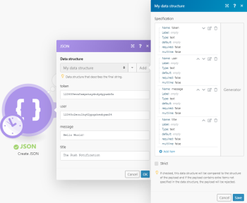

# Connect [!DNL Adobe Workfront Fusion] api 토큰 인증을 사용하는 웹 서비스에 연결할 수도 있습니다

일부 서비스에서는 다음과 같은 통합 솔루션을 허용하지 않습니다 [!DNL Adobe Workfront Fusion] 시나리오에서 쉽게 사용할 수 있는 앱을 만들려면

이 상황에 대한 해결 방법이 있습니다. 원하는 서비스(앱)를 [!DNL Workfront Fusion] 사용 [!DNL Workfront Fusion]s [!UICONTROL HTTP] 모듈.

이 문서에서는 거의 모든 웹 서비스를 [!DNL Workfront Fusion] api 키/API 토큰 사용.

## 액세스 요구 사항

이 문서의 기능을 사용하려면 다음 액세스 권한이 있어야 합니다.

<table style="table-layout:auto"> 
 <col> 
 <col> 
 <tbody> 
  <tr> 
   <td role="rowheader">[!DNL Adobe Workfront] 플랜*</td> 
   <td> <p>[!UICONTROL Pro] 이상</p> </td> 
  </tr> 
  <tr data-mc-conditions=""> 
   <td role="rowheader">[!DNL Adobe Workfront] 라이센스*</td> 
   <td> <p>[!UICONTROL Plan], [!UICONTROL Work]</p> </td> 
  </tr> 
  <tr> 
   <td role="rowheader">[!DNL Adobe Workfront Fusion] license**</td> 
   <td> <p>[!UICONTROL [!DNL Workfront Fusion] 작업 자동화 및 통합을 위한] </p> </td> 
  </tr> 
  <tr> 
   <td role="rowheader">제품</td> 
   <td>조직이 구매해야 합니다 [!DNL Adobe Workfront Fusion] 뿐만 아니라 [!DNL Adobe Workfront] 을 참조하십시오.</td> 
  </tr> 
 </tbody> 
</table>

어떤 계획, 라이센스 유형 또는 액세스 권한을 보유하고 있는지 확인하려면 [!DNL Workfront] 관리자

에 대한 자세한 정보 [!DNL Adobe Workfront Fusion] 라이센스 [[!DNL Adobe Workfront Fusion] 라이선스](../../workfront-fusion/get-started/license-automation-vs-integration.md).

## API 토큰을 사용하는 웹 서비스에 연결합니다

API 토큰을 통해 서비스를 연결하는 절차는 대부분의 웹 서비스에 대해 유사합니다.

1. 섹션에 설명된 대로 웹 서비스의 웹 사이트에서 애플리케이션을 만듭니다 [새 애플리케이션을 만들고 API 토큰을 얻습니다](#create-a-new-application-and-obtain-the-api-token) 참조하십시오.
1. API 키 또는 API 토큰을 얻습니다.
1. 추가 [!DNL Workfront Fusion]s [!UICONTROL HTTP] > [!UICONTROL 요청 만들기] 모듈에 대해 고려합니다.
1. 섹션에 설명된 대로 웹 서비스의 API 설명서에 따라 모듈을 설정하고 시나리오를 실행합니다 [설정 [!UICONTROL HTTP] 모듈](#set-up-the-http-module) 참조하십시오.

>[!NOTE]
>
>Adobe에서는 [!DNL Pushover] 이 문서 전체에서 예로서 알림 서비스를 사용할 수 있습니다.

## 새 애플리케이션을 만들고 API 토큰을 얻습니다

>[!NOTE]
>
>웹 서비스에서 API 키 또는 API 토큰을 만들고 배포하는 방법은 여러 가지가 있습니다. 원하는 웹 서비스에 대한 API 키 및 토큰을 가져오는 방법에 대한 지침은 서비스 웹 사이트로 이동하여 &quot;API 키&quot; 또는 &quot;API 토큰&quot;을 검색합니다.
>
>찾을 수 있는 사항의 예로서 Pushover API 키를 가져오는 지침을 포함합니다.

1. 에 로그인합니다. [!DNL Pushover] 계정이 필요합니다.
1. 클릭 **[!UICONTROL 애플리케이션/API 토큰 만들기]** 를 클릭합니다.
1. 응용 프로그램 정보를 입력하고 **[!UICONTROL 애플리케이션 만들기]**.
1. 제공된 API 토큰을 안전한 위치에 저장합니다. 이 서비스가 필요한 경우 [!DNL Workfront Fusion] [!UICONTROL HTTP] >[!UICONTROL 요청 만들기] 원하는 웹 서비스에 연결할 모듈([!DNL Pushover], 이 경우 ).

## 설정 [!UICONTROL HTTP] 모듈

웹 서비스를 [!DNL Workfront Fusion] 시나리오를 사용하려면 [!UICONTROL HTTP] >[!UICONTROL 요청 수행] 모듈과 모듈로 구분하여 웹 서비스의 API 설명서에 따라 모듈을 설정합니다.

1. 추가 [!UICONTROL HTTP] >[!UICONTROL 요청 만들기] 모듈에 대해 고려합니다.
1. 을 사용하여 메시지를 푸시하려면 [!DNL Workfront Fusion]를 설정하는 경우 다음과 같이 HTTP 모듈을 설정합니다.

   >[!NOTE]
   >
   >이러한 모듈 설정은 [!DNL Pushover] 웹 서비스 API 설명서. 다른 웹 서비스에 대해 설정이 다를 수 있습니다. 예를 들어 API 토큰은 [!UICONTROL Header] 그리고 [!UICONTROL 본문] 필드.

   <table style="table-layout:auto"> 
    <col> 
    <col> 
    <tbody> 
     <tr> 
      <td role="rowheader">[!UICONTROL URL]</td> 
      <td> <p><code>https://api.pushover.net/1/messages.json</code> </p> <p>URL 필드에는 웹 서비스의 API 설명서에서 찾을 수 있는 종단점이 있습니다.</p> </td> 
     </tr> 
     <tr> 
      <td role="rowheader">[!UICONTROL 메서드]</td> 
      <td> <p><code>[!DNL POST]</code> </p> <p>사용된 메서드는 해당 끝점에 따라 다릅니다. 푸시 메시지를 푸시하기 위한 Pushover 종단점은 POST 메서드를 사용합니다.</p> </td> 
     </tr> 
     <tr> 
      <td role="rowheader"> <p>[!UICONTROL Headers]</p> </td> 
      <td> <p>일부 웹 서비스에서는 헤더를 사용하여 API 토큰 인증 또는 기타 매개 변수를 지정할 수 있습니다. 메시지 푸시에 대한 Pushover의 종단점이 모든 요청 유형에 대해 Body(아래 참조)를 사용하므로 이 예제의 경우가 아닙니다.</p> </td> 
     </tr> 
     <tr> 
      <td role="rowheader"> <p>[!UICONTROL 쿼리 문자열]</p> </td> 
      <td> <p>일부 웹 서비스에서는 쿼리 문자열을 사용하여 다른 매개 변수를 지정할 수 있습니다. 이 예제에서 이는 아닙니다 [!DNL Pushover] 웹 서비스는 모든 요청 유형에 [!UICONTROL Body](아래 참조)를 사용합니다.</p> </td> 
     </tr> 
     <tr> 
      <td role="rowheader"> <p>[!UICONTROL Body Type]</p> </td> 
      <td> <p><code>Raw</code> </p> <p>이 설정을 사용하면 아래의 [!UICONTROL 컨텐츠 유형] 필드에서 JSON 컨텐츠 유형을 선택할 수 있습니다.</p> </td> 
     </tr> 
     <tr> 
      <td role="rowheader"> <p>[!UICONTROL Content Type]</p> </td> 
      <td> <p><code>JSON (application/json)</code> </p> <p>JSON은 [!UICONTROL Pushover] 앱의 필수 콘텐츠 유형입니다. 이는 다른 웹 서비스와 다를 수 있습니다.</p> </td> 
     </tr> 
     <tr> 
      <td role="rowheader"> <p>[!UICONTROL 요청 콘텐츠]</p> </td> 
      <td> <p>JSON 형식으로 [!UICONTROL Body] 요청 컨텐츠를 입력합니다. 에 설명된 대로 [!UICONTROL JSON] &gt; [!UICONTROL JSON 작성] 모듈을 사용할 수 있습니다. <a href="#json-body-mapped-using-the-json-create-json-module" class="MCXref xref">[!UICONTROL JSON] &gt; [!UICONTROL JSON 작성] 모듈을 사용하여 매핑된 JSON 본문</a> 참조하십시오. 또는 에 설명된 대로 JSON 컨텐츠를 수동으로 입력할 수 있습니다. <a href="#json-body-entered-manually" class="MCXref xref">수동으로 입력한 JSON 본문</a> 참조하십시오.</p> <p>해당 웹 서비스에 대한 필수 매개 변수에 대해서는 웹 서비스의 API 설명서를 참조하십시오.</p> </td> 
     </tr> 
    </tbody> 
   </table>

## 수동으로 입력한 JSON 본문

JSON 형식으로 매개 변수와 값을 지정합니다.

>[!INFO]
>
>**예:**
>
>
```
>{"user":"12345c2ecu1hq42ypqzhswbyam34",
>
>
"token":"123459evz8aepwtxydndydgyumbfx",
>
>
"message":"Hello World!",
>
>
"title":"The Push Notification"}
>```

<table style="table-layout:auto"> 
 <col> 
 <col> 
 <tbody> 
  <tr> 
   <td role="rowheader"> <p>[!UICONTROL user]</p> </td> 
   <td> <p>USER_KEY입니다. 다음 위치에서 찾을 수 있습니다. [!DNL Pushover] 대시보드 .</p> </td> 
  </tr> 
  <tr> 
   <td role="rowheader">[!UICONTROL 토큰] </td> 
   <td> <p>만든 API 토큰/API 키 [!DNL Pushover] 앱.</p> </td> 
  </tr> 
  <tr> 
   <td role="rowheader">[!UICONTROL message] </td> 
   <td> <p>장치로 전송되는 푸시 알림의 텍스트 콘텐츠입니다.</p> </td> 
  </tr> 
  <tr> 
   <td role="rowheader">[!UICONTROL title] </td> 
   <td> <p>(선택 사항) 메시지 제목입니다. 값을 입력하지 않으면 앱 이름이 사용됩니다. </p> </td> 
  </tr> 
 </tbody> 
</table>

## 를 사용하여 매핑된 JSON 본문 [!UICONTROL JSON] >[!UICONTROL JSON 만들기] 모듈

다음 [!UICONTROL JSON 만들기] 모듈 을 사용하면 JSON을 더 쉽게 지정할 수 있습니다. 또한 값을 동적으로 정의할 수도 있습니다.

JSON 모듈에 대한 자세한 내용은 다음을 참조하십시오. [JSON 모듈](../../workfront-fusion/apps-and-their-modules/json-modules.md).

1. JSON을 만들 값을 입력하거나 매핑합니다.

   

1. 연결 [!UICONTROL JSON] > [!UICONTROL JSON 만들기] 모듈 을 참조하십시오.
1. JSON 문자열을 [!UICONTROL JSON 만들기] 모듈로 [!UICONTROL 콘텐츠 요청] 의 필드 [!UICONTROL HTTP] >[!UICONTROL 요청 만들기] 모듈.

   이제 시나리오를 실행하면 푸시 알림이 [!DNL Pushover] 계정이 필요합니다.
