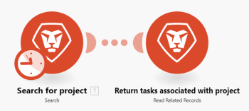

# 에서 연습 자동화 시나리오 만들기 [!DNL Adobe Workfront Fusion]

이 문서에서는 Adobe Workfront Fusion을 사용하여 자동화 시나리오를 만드는 방법에 대해 설명합니다. 자동화 시나리오는 데이터 조작 및 변형을 포함한 Workfront 프로세스를 자동화합니다. 이 예제에서는 프로젝트를 검색한 다음 해당 프로젝트와 관련된 모든 작업을 반환하는 시나리오를 만드는 프로세스를 안내합니다.

별도의 앱을 연결하는 통합 시나리오를 작성하는 방법에 대한 지침은 [Adobe Workfront Fusion에서 연습 통합 시나리오 만들기](../../workfront-fusion/get-started/create-a-practice-scenario.md).

각 Workfront Fusion 라이선스에서 사용할 수 있는 기능에 대한 자세한 내용은 을 참조하십시오. [Adobe Workfront Fusion 라이선스](../../workfront-fusion/get-started/license-automation-vs-integration.md).

## 액세스 요구 사항

이 문서의 기능을 사용하려면 다음 액세스 권한이 있어야 합니다.

<table style="table-layout:auto">
 <col> 
 <col> 
 <tbody> 
  <tr> 
   <td role="rowheader">[!DNL Adobe Workfront] 플랜*</td> 
   <td> 
[!DNL Pro] 이상
 </td> 
  </tr> 
  <tr data-mc-conditions=""> 
   <td role="rowheader">[!DNL Adobe Workfront] 라이센스*</td> 
   <td> 
[!UICONTROL Plan], [!UICONTROL Work]
 </td> 
  </tr> 
  <tr> 
   <td role="rowheader">[!UICONTROL Adobe Workfront Fusion] 라이선스**</td> 
   <td> 
[!UICONTROL [!DNL Workfront Fusion] for Work Automation and Integration] 

[!UICONTROL [!DNL Workfront Fusion] 작업 자동화용]
  </td> 
  </tr> 
  <tr> 
   <td role="rowheader">제품</td> 
   <td>조직은 다음을 구매해야 합니다. [!DNL Adobe Workfront Fusion] 뿐만 아니라 [!DNL Adobe Workfront] 이 문서에 설명된 기능을 사용하십시오.</td> 
  </tr> 
 </tbody> 
</table>
보유 중인 플랜, 라이선스 유형 또는 액세스 권한을 알아보려면 [!DNL Workfront] 관리자.

다음에 대한 정보: [!DNL Adobe Workfront Fusion] 라이센스, 참조 [[!DNL Adobe Workfront Fusion] 라이선스](../../workfront-fusion/get-started/license-automation-vs-integration.md).

## 연습 시나리오 만들기

의 역할 [!DNL Adobe Workfront Fusion] 는 동일한 작업을 반복하지 않고 새로운 작업에 집중할 수 있도록 프로세스를 자동화하는 것입니다. 앱과 서비스 내 및 간의 작업을 연결하여 데이터를 자동으로 전송하고 변환하는 시나리오를 만듭니다. 앱 또는 서비스에서 데이터에 대한 시계를 만들고 해당 데이터를 처리하여 원하는 결과를 제공하는 시나리오입니다.

시나리오는 앱 내에서 데이터를 변환하거나 앱과 웹 서비스 간에 데이터를 전송하는 방법을 나타내는 일련의 모듈로 구성됩니다.
다음 예에서는 를 검색하는 시나리오를 만드는 프로세스를 안내합니다. [!DNL Workfront] 프로젝트 를 반환하고 프로젝트의 작업을 반환합니다.

시나리오 생성은 다음과 같은 몇 가지 주요 작업으로 구성됩니다.

## 앱을 선택하고 시나리오 이름을 지정합니다.

1. 로그인 [!DNL Workfront Fusion] 계정입니다.
1. 클릭 **[!UICONTROL 시나리오]**  왼쪽 패널에서

   >[!NOTE]
   >
   >왼쪽 탐색 패널이나 해당 아이콘이 보이지 않으면 메뉴를 클릭합니다  아이콘.

   회색으로 [!UICONTROL 폴더] 패널 을 표시하면 시나리오를 폴더로 구성할 수 있습니다.

   오른쪽 메인 영역 상단에 **[!UICONTROL 모두]** 작성한 시나리오, **[!UICONTROL 활성 시나리오]**, **[!UICONTROL 비활성 시나리오]**, 및 **[!UICONTROL 개념]**. 개념은 이전에 더 많은 작업이 필요한 시나리오입니다 [!DNL Workfront Fusion] 활성 또는 비활성으로 분류할 수 있습니다.

<!--
   
-->

1. 다음에서 [!UICONTROL 폴더] 패널, 클릭 **[!UICONTROL 폴더 추가]** 아이콘 그런 다음 첫 번째 폴더에 대해 &quot;연습 시나리오&quot;와 같은 이름을 입력합니다.

1. 폴더를 열고 를 클릭합니다. **[!UICONTROL 새 시나리오 만들기]** 페이지의 오른쪽 상단 모서리에서 을 참조하십시오.

   표시되는 랜딩 페이지를 사용하여 빌드할 시나리오에서 사용할 앱을 미리 로드할 수 있습니다.

1. 이 연습에서 을(를) 검색하고 선택합니다. **[!DNL Workfront]** 앱.
1. 클릭 **[!UICONTROL 계속]** 오른쪽 상단 모서리입니다.

   시나리오 편집기 중앙에 빈 모듈이 있고 [!DNL Workfront] 미리 로드한 앱과 맨 아래에 있는 도구 모음에 있는 일부 옵션이 표시됩니다.

<!--
   
-->

새 시나리오를 만들 때 시나리오의 이름을 만드는 것으로 시작하는 것이 좋습니다.

1. 다음 항목 선택 **[!UICONTROL 새 시나리오]** 왼쪽 상단 모서리에 자리 표시자 이름을 입력한 다음 &quot;Practice scenario 1&quot;과 같은 이름을 입력합니다.
1. 계속 [첫 번째 모듈 추가 및 구성](#add-and-configure-the-first-module) 아래요.

## 첫 번째 모듈 추가 및 구성

물음표가 있는 빈 모듈은 추가해야 하는 트리거 모듈을 나타냅니다. 이 모듈은 실행될 때마다 시나리오를 시작합니다. 빈 모듈의 시계 아이콘은 예약된 모듈임을 나타냅니다.

이 모듈에는 시나리오가 감시할 데이터가 포함됩니다.

이 예제에서는 트리거 모듈을 사용하지 않습니다. 대신 이 시나리오는 검색으로 시작됩니다.

1. 빈 모듈을 클릭하여 모듈을 선택할 앱을 선택합니다.

   이전에 미리 로드한 앱이 빈 모듈 옆에 표시됩니다. 를 사용하여 모듈이 있는 다른 모든 앱을 추가할 수 있습니다. [!UICONTROL 검색] 상자.

   

1. 클릭 **[!DNL Workfront]**.

   목록이 모두 표시되도록 변경됩니다. [!DNL Workfront] 트리거 모듈로 사용할 수 있는 모듈입니다.

1. 검색 모듈을 클릭합니다 **[!UICONTROL 검색]**.

   이제 와(과)에 대한 인증된 연결을 설정해야 합니다. [!DNL Workfront] 계정입니다. 시나리오에 추가하는 모든 모듈에는 해당 앱에 대한 연결이 있어야 합니다.

1. 다음에서 **[!DNL Workfront]** 상자, 아래 **[!UICONTROL 연결]**, 클릭 **[!UICONTROL 추가]**&#x200B;을(를) 클릭한 다음 &quot;Olivia의 Workfront 계정&quot;과 같은 연결 이름을 입력하고 **[!UICONTROL 계속]**.
1. 표시되는 창에서 연결을 인증합니다.

   연결을 인증하는 프로세스는 앱 간에 약간 다를 수 있습니다. 다음 프로세스는 다음과 같습니다 [!DNL Workfront]: 그러나 이 프로세스는 많은 앱과 유사합니다.

   1. 다음을 입력하십시오. [!DNL Workfront] 도메인을 선택한 다음 **[!UICONTROL 계속]**.
   1. 에 로그인 [!DNL Workfront].
   1. 다음에 대한 액세스 권한 검사 [!DNL Workfront Fusion] 을(를) 요청한 다음 을(를) 클릭합니다. **[!UICONTROL 액세스 허용]**.

   도움이 필요한 경우 다음을 참조하십시오. [연결 기본 정보 [!DNL Adobe Workfront Fusion] 앱 또는 서비스에](../../workfront-fusion/connections/about-connecting-wf-fusion-to-app-or-service.md).

## 첫 번째 모듈 구성

연결 후 [!DNL Workfront Fusion] (으)로 [!DNL Workfront] 계정, 다음을 지정할 수 있습니다. [!DNL Workfront] 액세스 권한이 있는 요청 대기열과 첫 번째 모듈에서 처리할 데이터를 가져옵니다.

1. 다음에서 [!UICONTROL 레코드 유형] 상자, 선택 **[!UICONTROL 프로젝트]**. 이렇게 하면 프로젝트만 검색하도록 모듈이 설정됩니다.

   >[!TIP]
   >
   >다음을 찾을 수 있습니다. **[!UICONTROL 프로젝트]** &quot; &quot;라는 단어를 입력하면[!UICONTROL 프로젝트].&quot;

1. 다음에서 **[!UICONTROL 결과 집합]** 상자, 선택 **[!UICONTROL 첫 번째 일치 레코드]**. 이 옵션은 기준을 충족하는 첫 번째 레코드만 반환하도록 모듈을 설정합니다. 이 예제에서는 하나의 레코드만 반환되어야 합니다.
1. 다음에서 **[!UICONTROL 검색 기준]** 영역별로, 특정 프로젝트를 반환하는 필터를 설정합니다.

   1. 아래 첫 번째 상자에서 [!UICONTROL 검색 기준]값을 검색할 필드를 선택합니다. 이 예에서는 을 선택합니다. **[!UICONTROL 이름]**.
   1. 연산자에 대해 을 선택합니다. [!UICONTROL 다음 포함(대/소문자 구분 안 함)]. 이렇게 하면 전체 이름을 입력하지 않거나 대/소문자가 잘못된 이름(예: 모두 대문자)을 입력하더라도 모듈이 이름에 선택한 단어가 포함된 프로젝트를 찾을 수 있습니다.
   1. 의 마지막 필드에서 [!UICONTROL 검색 기준]를 클릭하고 검색 중인 프로젝트 이름에 있는 단어나 구를 입력합니다.

1. 다음에서 **[!UICONTROL 출력]** 문제를 출력하려는 필드를 나열합니다. 이 예에서는 **[!UICONTROL ID]** 및 **[!UICONTROL 이름]** 필드.

   >[!TIP]
   >
   >다음을 사용할 수 있습니다. **Cmd+F** ([!DNL Mac] OS) 또는 **Ctrl-F** ([!DNL Windows] OS)를 사용하여 필드를 신속하게 찾을 수 있습니다.

1. 클릭 **[!UICONTROL 확인]**.

   >[!NOTE]
   >
   >(정보만 해당) 트리거 모듈이 아니므로 시작할 위치를 선택하지 않습니다. 이제 트리거 모듈을 사용할 때 트리거 모듈을 시작할 위치를 선택합니다.
   >
   >
   >자세한 내용은 [트리거 모듈의 시작 위치 선택 [!DNL Adobe Workfront Fusion]](../../workfront-fusion/modules/choose-where-trigger-module-starts.md).

1. 모듈을 마우스 오른쪽 단추로 클릭하고 **[!UICONTROL 이름 바꾸기]**&#x200B;을 클릭하고, 모듈에서 수행할 작업을 설명하는 이름을 입력한 다음(&quot;프로젝트 검색&quot; 등), **[!UICONTROL 확인]**.

   모듈 바로 아래에 이름이 표시됩니다. 그 아래로는 [!DNL Workfront Fusion] 에는 모듈에서 수행한 작업 유형에 대한 간단한 설명이 포함됩니다.

   

1. 계속 [두 번째 모듈 추가 및 구성](#add-and-configure-the-second-module).

## 두 번째 모듈 추가 및 구성

1. 모듈 오른쪽에 있는 부분 원을 클릭하여 **[!UICONTROL 다른 모듈 추가]**.
1. 선택 [!DNL Workfront] 응용 프로그램 목록에서 검색 모듈을 선택합니다 **[!UICONTROL 관련 레코드 읽기]**.
1. 에 대한 연결을 이미 만들었습니다. [!DNL Workfront] 이전 모듈에 대한 것입니다. 여기서 다시 만들 필요는 없지만 이 모듈이 이전 모듈과 동일한 연결을 사용하고 있는지 확인해야 합니다.\
   다음에서 **[!UICONTROL 연결]** 상자에서 이전 모듈에 대해 생성한 연결을 선택합니다.
1. 클릭 **[!UICONTROL 레코드 유형]**&#x200B;을 선택한 다음 을 선택합니다. **[!UICONTROL 프로젝트]**, 프로젝트와 관련된 레코드를 읽으려고 하기 때문입니다.

   >[!TIP]
   >
   >다음을 찾을 수 있습니다. **[!UICONTROL 프로젝트]** &quot;project&quot;라는 단어를 입력하기 시작하면 목록에 표시됩니다.

1. 다음을 클릭합니다. **[!UICONTROL 상위 레코드 ID]** 필드. 이 필드에는 작업을 반환하려는 프로젝트의 Workfront ID가 필요합니다.

   필드를 클릭하면 **[!UICONTROL 상위 레코드 ID]** Workfront에서 프로젝트를 식별하는 필드입니다.

   

1. 변수 클릭 **[!UICONTROL ID]** 을(를) 추가하여 **[!UICONTROL 상위 레코드 ID]** 필드. 이렇게 하면 첫 번째 모듈에서 반환된 ID를 두 번째 모듈에서 작업할 프로젝트의 식별자로 사용하여 반환된 작업이 해당 프로젝트에 속하도록 할 수 있습니다.
1. 다음에서 **[!UICONTROL 컬렉션]** 필드, 선택 **[!UICONTROL 작업]**. 이 모듈은 선택한 프로젝트와 연결된 작업을 반환함을 나타냅니다.
1. 클릭 **[!UICONTROL 확인]**

   이제 작업 시나리오가 있습니다.

1. 두 번째 모듈에 &quot;프로젝트와 연결된 작업 반환&quot;과 같은 이름을 지정한 다음 [시나리오 테스트](#test-the-scenario).

## 시나리오 테스트

시나리오를 활성화하기 전에 한 번 이상 실행하고 결과를 보고 테스트하는 것이 중요합니다. 이렇게 하면 시나리오에 데이터가 흐르는 방식을 이해하고 오류를 찾는 데 도움이 됩니다.

1개의 프로젝트가 반환되고 해당 프로젝트와 관련된 작업이 반환되도록 선택했습니다. 시나리오를 실행할 경우 그렇게 해야 합니다.

1. 클릭 **[!UICONTROL 한 번 실행]** (시나리오 편집기의 왼쪽 아래 모서리)를 참조하십시오.
1. 시나리오 실행이 끝나면 첫 번째 모듈 위의 버블을 클릭합니다.

   

   표시되는 상자에서 모듈이 반환한 프로젝트에서 가져온 실제 데이터를 포함하여 모듈이 처리한 데이터 번들에 대한 정보를 볼 수 있습니다.

   

1. 두 번째 모듈 위의 실행 검사기 버블을 클릭하면 정보 입력 및 프로젝트에 포함된 작업의 집합인 출력을 볼 수 있습니다.

   

   다음 문서에서 시나리오 실행 정보를 읽는 방법에 대해 자세히 알아볼 수 있습니다.

   * 일반적인 정보는 다음을 참조하십시오. [의 시나리오 실행 흐름 [!DNL Adobe Workfront Fusion]](../../workfront-fusion/scenarios/scenario-execution-flow.md).
   * 처리된 번들에 대한 자세한 내용은 [의 시나리오 실행, 주기 및 단계 [!DNL Adobe Workfront Fusion]](../../workfront-fusion/scenarios/scenario-execution-cycles-phases.md).

1. 위치 [!DNL Workfront Fusion], 클릭 **[!UICONTROL 저장]**  왼쪽 아래 모서리 근처에 있습니다.

   >[!IMPORTANT]
   >
   >원하는 만큼 자주 저장하고 시나리오를 테스트합니다.

>[!TIP]
>
>각 모듈에 대한 메모를 추가하는 옵션이지만 유용한 방법을 권장합니다.
>
>1. 마우스 오른쪽 단추 클릭 [!DNL Workfront] 모듈을 클릭한 다음 **[!UICONTROL 메모 추가]**.
>1. 표시되는 노트에 모듈에 대한 개요를 입력합니다.
>
>    한 모듈에 대해 여러 메모를 추가할 수 있습니다.
>
>1. 닫기 **[!UICONTROL 메모]** 영역입니다.
>
>     시나리오에 메모를 추가하면 주황색 점이 **[!UICONTROL 메모]** 아이콘  시나리오 편집기 하단에서.
>
>1. 다음을 클릭합니다. **[!UICONTROL 메모]** 아이콘  메모를 확인합니다.
>

## 시나리오 활성화

이 예제 시나리오에는 트리거 모듈이 없습니다. 실제 데이터에 사용하는 시나리오인 경우 트리거 모듈로 시작하고 마지막으로 활성화할 수 있습니다. 시나리오를 활성화하면 기본적으로 15분마다 실행됩니다. 실행할 시기와 빈도를 정의하여 변경할 수 있습니다.

시나리오 활성화에 대한 자세한 내용은 다음을 참조하십시오. [에서 시나리오 활성화 또는 비활성화 [!UICONTROL Adobe Workfront Fusion]](../../workfront-fusion/scenarios/activate-or-inactivate-scenario.md).

일정에 대한 자세한 내용은 [시나리오 예약 위치 [!UICONTROL Adobe Workfront Fusion]](../../workfront-fusion/scenarios/schedule-a-scenario.md).
