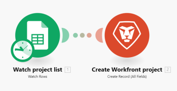

# Adobe Workfront Fusion에서 연습 통합 시나리오 만들기

이 문서에서는 Adobe Workfront Fusion과 통합 시나리오를 만드는 방법에 대해 설명합니다. 통합 시나리오는 별도의 앱을 서로 연결하여 다양한 애플리케이션을 통해 데이터를 전달할 수 있습니다.

통합 시나리오를 만들려면 조직에 [!DNL Workfront Fusion for Work Automation and Integration] 라이센스.

Workfront 전용 자동화 시나리오 빌드에 대한 지침은 [Adobe Workfront Fusion에서 연습 자동화 시나리오 만들기](../../workfront-fusion/get-started/create-a-practice-automation-scenario.md)

Workfront Fusion 라이선스에 대한 자세한 내용은 [Adobe Workfront Fusion 라이센스](../../workfront-fusion/get-started/license-automation-vs-integration.md).

>[!NOTE]
>
>조직에서 Google 시트에 대한 액세스를 허용하지 않을 수 있습니다. 이 경우 이 통합을 설정할 수 없지만 여기에 제공된 정보는 통합 시나리오가 작동하는 방식에 대한 일반적인 예로 사용할 수 있습니다.

## 액세스 요구 사항

이 문서의 기능을 사용하려면 다음 액세스 권한이 있어야 합니다.

<table style="table-layout:auto"> 
 <col> 
 <col> 
 <tbody> 
  <tr> 
    <td role="rowheader">[!DNL Adobe Workfront] 플랜*</td> 
   <td> 
[!DNL Pro] 이상
 </td> 
  </tr> 
  <tr data-mc-conditions=""> 
   <td role="rowheader">[!DNL Adobe Workfront] 라이센스*</td> 
   <td> 
[!UICONTROL Plan], [!UICONTROL Work]
 </td> 
  </tr> 
  <tr> 
   <td role="rowheader">[!UICONTROL Adobe Workfront Fusion] 라이센스**</td> 
   <td> 
[!UICONTROL [!DNL Workfront Fusion] 작업 자동화 및 통합을 위한] 
 </td> 
  </tr> 
  <tr> 
   <td role="rowheader">제품</td> 
   <td>조직이 구매해야 합니다 [!DNL Adobe Workfront Fusion] 뿐만 아니라 [!DNL Adobe Workfront] 을 참조하십시오.</td> 
  </tr> 
 </tbody> 
</table>

어떤 계획, 라이센스 유형 또는 액세스 권한을 보유하고 있는지 확인하려면 [!DNL Workfront] 관리자

에 대한 자세한 정보 [!DNL Adobe Workfront Fusion] 라이센스 [[!DNL Adobe Workfront Fusion] 라이선스](../../workfront-fusion/get-started/license-automation-vs-integration.md).

## 사례 시나리오 만들기

의 역할 [!DNL Adobe Workfront Fusion] 동일한 작업을 반복해서 반복하지 않고 새로운 작업에 집중할 수 있도록 프로세스를 자동화하는 것입니다. 앱과 서비스 내에서 및 앱과 서비스 간에 작업을 연결하여 데이터를 자동으로 전송 및 변환하는 시나리오를 만드는 방식으로 작동합니다. 사용자가 만드는 시나리오는 앱 또는 서비스의 데이터를 감시하고 원하는 결과를 제공하기 위해 해당 데이터를 처리합니다.

시나리오는 앱 내에서 또는 앱과 웹 서비스 간에 데이터를 전송하는 방법을 나타내는 일련의 모듈로 구성됩니다.

시나리오를 만들고 사용 방법을 배울 때 모범 사례를 보강하는 방법을 설명합니다. [!DNL Workfront Fusion]로 설정되면 이 문서가 단계별 프로세스를 안내합니다. 에서 새 레코드를 만드는 시나리오를 만듭니다 [!DNL Workfront] 의 모든 행에 대해 [!DNL Google Sheets] 스프레드시트.

>[!TIP]
>
>이와 같은 시나리오는 에서 프로젝트를 사용하여 작업해야 하는 프로젝트를 나열하는 스프레드시트가 있는 경우 유용합니다 [!DNL Workfront]. 시나리오는 새 행에 대한 스프레드시트를 &quot;확인&quot;하고 새 프로젝트를 [!DNL Workfront] 각 URL에 대해 공유할 수 있습니다.

시나리오를 만드는 작업은 몇 가지 주요 작업으로 구성됩니다.

## 앱을 선택하고 시나리오에 이름을 지정합니다

1. 다운로드 [스프레드시트](https://cdn.experience.workfront.com/Documentation/Workfront+Fusion/Fusion+Practice+Scenario+Sample+Sheet.xlsx)를 만든 다음 [!DNL Google Drive] 을 참조하십시오.

   또는

   간단한 제작 또는 찾기 [!DNL Google Sheets] 스프레드시트는 다음과 유사합니다.

   

1. 로그인 [!DNL Workfront Fusion] 계정이 필요합니다.
1. 클릭 **[!UICONTROL 시나리오]**  왼쪽 패널에 표시됩니다.

   표시되는 왼쪽 패널에서 시나리오를 폴더로 구성할 수 있습니다.

   오른쪽 주 영역 상단에서 볼 수 있습니다 **[!UICONTROL 모두]** 만든 시나리오, **[!UICONTROL 활성 시나리오]** 및 **[!UICONTROL 비활성 시나리오]**, 및 **[!UICONTROL 개념]**: 이전에 더 많은 작업이 필요한 시나리오입니다 [!DNL Workfront Fusion] 이 분류는 활성 또는 비활성 상태로 분류할 수 있습니다.

   

1. 왼쪽 패널에서 **[!UICONTROL 폴더 추가]** 아이콘 를 입력한 다음 첫 번째 폴더에 대해 &quot;연습 시나리오&quot;와 같은 이름을 입력합니다.

1. 폴더를 열고 을 클릭합니다. **[!UICONTROL 새 시나리오 만들기]** 페이지의 오른쪽 위 모서리에서 을(를) 클릭합니다.

   표시되는 랜딩 페이지에서 빌드하려는 시나리오에서 사용할 앱을 미리 로드할 수 있습니다.

1. 이 연습에서는 을(를) 검색하고 선택합니다 **[!UICONTROL Google 시트]** 앱.
1. 클릭 **[!UICONTROL 계속]** 오른쪽 상단 모서리에서

   시나리오 편집기에 중앙 부분에 빈 모듈이 들어 있으며 [!DNL Google Sheets] 앱을 미리 로드한 다음, 맨 아래에 있는 도구 모음에 있는 일부 옵션을 추가합니다.

   

   새 시나리오를 만들 때는 이름을 만들어 시작하는 것이 좋습니다.

1. 을(를) 선택합니다 **[!UICONTROL 새 시나리오]** 왼쪽 위 모서리에 자리 표시자 이름을 지정한 다음 &quot;연습 시나리오 1&quot;과 같은 이름을 입력합니다.
1. 계속 [첫 번째 모듈 추가 및 구성](#add-and-configure-the-first-module) 아래의 제품에서 사용할 수 있습니다.

## 첫 번째 모듈 추가 및 구성

물음표가 있는 빈 모듈은 추가해야 하는 트리거 모듈을 나타냅니다. 이 모듈은 실행될 때마다 시나리오를 시작합니다. 빈 모듈의 시계 아이콘은 예약된 모듈임을 나타냅니다.

이 모듈에는 시나리오에서 감시하려는 데이터가 포함됩니다.

1. 빈 모듈을 클릭하여 모듈을 선택할 앱을 선택합니다.

   이전에 미리 로드한 앱이 빈 모듈 옆에 표시됩니다. 를 사용하여 모듈이 있는 다른 앱을 추가할 수 있습니다 [!UICONTROL 검색] 상자.

   

1. 클릭 **[!DNL Google Sheets]**.

   목록이 모두 표시되도록 변경됩니다 [!DNL Google Sheets] 트리거 모듈로 사용할 수 있는 모듈입니다.

1. 트리거 모듈을 클릭합니다. **[!UICONTROL 레코드 감시]**.

   이제 Google 계정에 대해 인증된 연결을 설정해야 합니다. 시나리오에 추가하는 모든 모듈에는 해당 앱에 연결해야 합니다.

1. 에서 **[!DNL Google Sheets]** 상자 아래의 **[!UICONTROL 연결]**&#x200B;를 클릭합니다. **[!UICONTROL 추가]**&#x200B;를 입력한 다음 연결 이름(예: &quot;Olivia&#39;s Google 계정)을 입력한 다음 **[!UICONTROL 계속]**.
1. 표시되는 창에서 연결을 인증합니다.

   연결을 인증하는 프로세스는 앱 간에 비트를 변경할 수 있습니다. 앱에 로그인해야 할 수 있습니다. 일반적으로 **[!UICONTROL 허용]** 버튼을 클릭합니다. 도움이 필요한 경우 다음을 참조하십시오 [연결 정보 [!DNL Adobe Workfront Fusion] 앱 또는 서비스에](../../workfront-fusion/connections/about-connecting-wf-fusion-to-app-or-service.md).

## 첫 번째 모듈 구성

연결 후 [!DNL Workfront Fusion] 아래와 같이 [!DNL Google Sheets] 계정, [!DNL Google Sheets] 스프레드시트에 액세스할 수 있고 첫 번째 모듈을 처리할 데이터가 있어야 합니다.

1. 을(를) 클릭합니다. **[!UICONTROL 스프레드시트]** 상자를 선택한 다음 **[!UICONTROL Workfront Fusion 사례 시나리오] #1** 스프레드시트가 표시되는 목록의 스프레드시트입니다.

   이 스프레드시트에는 2개의 시트(탭)가 포함되어 있으므로 원하는 데이터가 포함된 시트를 지정해야 합니다.

1. 에서 **[!UICONTROL 시트]** 드롭다운 목록에서 **[!UICONTROL 프로젝트]**.

   스프레드시트에 헤더가 포함되어 있으며 모듈이 헤더를 사용하여 처리하려는 데이터를 식별하게 하려고 합니다.

   

1. Leave **[!UICONTROL 예]** 선택 **[!UICONTROL 테이블에 헤더가 있습니다.]**.

1. 에서 **[!UICONTROL 머리글 행]** box에서는 포함할 행 범위를 지정할 수 있지만 이 연습에서는 기본 A1:Z1을 여기에 남겨 두겠습니다.
1. 에서 **[!UICONTROL 제한]** 상자에 1을 입력합니다.

   이러한 방식으로 시나리오를 실행할 때마다 모듈은 스프레드시트에서 1행만 처리합니다. 이 기능은 시나리오를 작성하는 동안 테스트 실행을 간소화하는 데 유용합니다.

1. 클릭 **[!UICONTROL 확인]**.

   다음 **[!UICONTROL 시작할 위치 선택]** 상자에 모듈의 처리를 시작할 스프레드시트에서 위치를 지정하라는 메시지가 표시됩니다.

1. 클릭 **[!UICONTROL 수동으로 선택]**&#x200B;표시되는 목록에서 위쪽 옵션을 선택한 다음 를 클릭합니다. **[!UICONTROL 확인]**.
1. 모듈을 마우스 오른쪽 단추로 클릭하고 **[!UICONTROL 이름 변경]**&#x200B;를 입력한 다음 모듈의 작업을 설명하는 이름을 입력합니다(예: &quot;프로젝트 목록 보기&quot;). **[!UICONTROL 확인]**.

   이름이 모듈 바로 아래에 나타납니다. 그 아래에 [!DNL Workfront Fusion] 모듈에서 수행한 작업 유형에 대한 간단한 설명을 포함합니다.

   

1. 계속 [두 번째 모듈 추가 및 구성](#add-and-configure-the-second-module).

## 두 번째 모듈 추가 및 구성

1. 모듈의 오른쪽에 있는 부분 원을 클릭합니다 **[!UICONTROL 다른 모듈 추가]**.

   이 두 번째 모듈은 [!DNL Workfront] 모듈을 미리 로드하지 않았습니다. [!DNL Workfront] 앱.

1. 를 찾으려면 [!DNL Workfront] 앱, 입력 시작 &quot;[!DNL Workfront]앱이 표시되면 해당 앱을 클릭합니다.
1. 목록 [!DNL Workfront] 표시되는 모듈 을 클릭합니다. **[!UICONTROL 레코드 만들기]**.

1. Google 시트 앱을 사용했을 때처럼 **[!UICONTROL 추가]** 에서 [!DNL Workfront] Workfront Fusion과 Workfront 간의 연결을 추가하는 상자.

   이제 스프레드시트의 데이터로 수행할 작업을 구체화하겠습니다.

1. 클릭 **[!UICONTROL 레코드 유형]**&#x200B;를 선택하고 을 선택합니다. **[!UICONTROL 프로젝트]** 에서 프로젝트를 생성하려고 하므로 [!DNL Workfront] 스프레드시트에서 행 사용.

   >[!TIP]
   >
   >찾을 수 있습니다. **[!UICONTROL 프로젝트]** 목록에 &quot;[!UICONTROL 프로젝트].&quot;

   상자가 확장되어 사용 가능한 모든 항목이 표시됩니다 [!DNL Workfront] 첫 번째 모듈에서 찾은 정보를 입력할 수 있는 프로젝트 필드입니다.

   우리는 **[!UICONTROL 이름]** 필드: 이 모듈에서 [!DNL Workfront] 해당 [!UICONTROL Google 시트] 행을 클릭합니다.

1. 을(를) 찾아 클릭합니다. **[!UICONTROL 이름]** 필드.

   >[!TIP]
   >
   >다음을 사용할 수 있습니다 **Cmd+F** ([!DNL Mac] OS) 또는 **Ctrl-F**([!DNL Windows] OS)를 사용하여 필드를 신속하게 찾을 수 있습니다.

   그러면 에서 사용할 수 있는 변수 목록이 열립니다 **[!UICONTROL 이름]** 필드를 사용하여 Workfront에서 만든 각 프로젝트의 이름을 정의합니다.

   

   목록 상단 근처에 있는 변수는 스프레드시트의 열 헤더에 해당합니다.

   

   

1. 변수를 클릭합니다. **[!UICONTROL 내 프로젝트 이름(A)]** 에 **[!UICONTROL 이름]** 필드.

   이 시나리오에 대한 첫 번째 데이터 조각을 매핑했습니다.

   스프레드시트에서 다음 위치로 한 개의 데이터를 매핑하겠습니다 [!DNL Workfront]: 각 프로젝트의 시작 날짜입니다.

1. 을(를) 찾아 클릭합니다. **[!UICONTROL 계획 시작 날짜]** 필드를 클릭한 다음 **[!UICONTROL 계획된 시작 날짜(E)]** 변수를 사용하여 스프레드시트의 해당 열에서 데이터를 가져옵니다.

1. 클릭 **[!UICONTROL 확인]**.

   이제 작업 시나리오가 있습니다.

1. 두 번째 모듈에는 &quot;Workfront 프로젝트 만들기&quot;와 같은 이름을 지정한 다음 계속 진행합니다 [시나리오 테스트](#test-the-scenario).

## 시나리오 테스트

시나리오를 활성화하기 전에 적어도 한 번 이상 실행하고 결과를 확인하여 테스트하는 것이 중요합니다. 이렇게 하면 시나리오를 통해 데이터가 어떻게 이동되는지 이해하고 오류를 찾는 데 도움이 됩니다.

Workfront에서 프로젝트를 만들기 위해 처리된 스프레드시트에서 1행이 선택되었습니다. 시나리오를 실행하면 이렇게 됩니다.

1. 클릭 **[!UICONTROL 한 번 실행]** 시나리오 편집기의 왼쪽 아래 모서리에 있습니다.
1. 시나리오 실행이 완료되면 [!DNL Google Sheets] 모듈.

   

   표시되는 상자에서 모듈이 처리한 데이터 번들에 대한 정보를 볼 수 있습니다. 여기에는 시작된 행의 스프레드시트에서 가져온 실제 데이터가 포함됩니다.

   

1. 실행 관리자 버블을 클릭합니다. [!DNL Workfront] 모듈 을 참조하십시오. [!DNL Workfront]

   

   다음 문서에서 시나리오 실행 정보를 읽는 방법에 대해 자세히 알아볼 수 있습니다.

   * 자세한 내용은 [의 시나리오 실행 흐름 [!DNL Adobe Workfront Fusion]](../../workfront-fusion/scenarios/scenario-execution-flow.md).
   * 처리된 번들에 대한 자세한 내용은 [시나리오 실행, 주기 및 단계 [!DNL Adobe Workfront Fusion]](../../workfront-fusion/scenarios/scenario-execution-cycles-phases.md).

1. 이동 [!DNL Workfront] 시나리오를 만든 프로젝트를 보려면 &quot;soho downtown loft&quot;를 검색하십시오. 이것이 스프레드시트의 마지막 행이었습니다.
1. in [!DNL Workfront Fusion]를 클릭합니다. **[!UICONTROL 저장]**  시나리오에서 진행 상태를 저장하려면 왼쪽 아래 모서리 근처에 있습니다.

   >[!IMPORTANT]
   >
   >시나리오에 전화를 걸고 테스트할 때마다 자주 저장합니다.

## 시나리오를 완료하고 다시 테스트합니다

스프레드시트의 다른 모든 행에 대한 프로젝트를 만들려면 시나리오를 구성해야 합니다.

1. 을(를) 클릭합니다. **[!UICONTROL 보기 행]** Google 시트용으로 만든 모듈입니다.
1. 변경 **[!UICONTROL 제한]** 100까지.

   알고 있는 행 수보다 큰 숫자를 지정하면 시나리오가 모든 행을 캡처하게 됩니다.

1. 마우스 오른쪽 단추를 클릭합니다. **[!UICONTROL 보기 행]** 모듈 **[!UICONTROL 시작할 위치 선택]**&#x200B;를 클릭합니다. **[!UICONTROL 모두]**&#x200B;를 클릭한 다음 **[!UICONTROL 확인]**.

1. 클릭 **[!UICONTROL 한 번 실행]** 그리고 실행 검사기의 버블에서 무슨 일이 일어나는지 보세요.

   다음 [!DNL Google] 시트 **[!UICONTROL 보기 행]** 모듈이 한 번 실행되어 모든 행을 읽습니다. 그런 다음 Workfront **[!UICONTROL 레코드 만들기]** 모듈이 20번 실행되어 스프레드시트에 있는 나머지 20개 행에 대해 프로젝트를 만듭니다.

1. 에 대한 실행 관리자 버블을 클릭합니다. [!DNL Workfront] 모듈이 20개의 작업을 모두 보려면 작업 중 하나를 클릭하여 생성된 프로젝트에 대한 정보를 확인합니다.
1. 클릭 **[!UICONTROL 저장]**  왼쪽 아래 모퉁이에서.
1. 이동 [!DNL Workfront] 시나리오를 만든 프로젝트를 확인합니다.

>[!TIP]
>
>각 모듈에 대한 메모를 추가하는 선택 사항이지만 유용한 방법을 권장합니다.
>
>1. 마우스 오른쪽 단추를 클릭합니다. [!DNL Workfront] 모듈을 클릭한 다음 **[!UICONTROL 참고 추가]**.
>1. 표시되는 참고에 모듈에 대한 개요를 입력합니다.

>
>   이 기능은 모듈을 계속 열지 않아도 모듈에서 작업을 볼 수 있으므로 유용합니다. 이름, 계획 시작 날짜 및 스프레드시트에서 매핑된 우선 순위를 사용하여 프로젝트 만들기 와 같은 것을 입력할 수 있습니다.
>
>   대상 [!UICONTROL Google 시트] 모듈에 대해 &quot;추가된 새 행/프로젝트에 대한 프로젝트 목록 보기&quot;와 같은 것을 입력할 수 있습니다.
>
>   모듈에 대해 여러 개의 메모를 추가할 수 있습니다.
>
>1. 닫기 **[!UICONTROL 참고]** 영역.
>
>   시나리오에 메모를 추가하면 **[!UICONTROL 참고]** 아이콘  ( 시나리오 편집기 하단에 있습니다.)
>
>1. 을(를) 클릭합니다. **[!UICONTROL 참고]** 아이콘  노트를 표시합니다.

>

## 시나리오 활성화

실제 데이터에 사용하는 시나리오라면 마지막으로 활성화하는 것이 좋습니다. 시나리오를 활성화하면 기본적으로 15분마다 실행됩니다. 실행할 시기 및 빈도를 정의하여 변경할 수 있습니다.

시나리오 활성화에 대한 자세한 내용은 [Adobe Workfront Fusion에서 시나리오 활성화 또는 비활성화](../../workfront-fusion/scenarios/activate-or-inactivate-scenario.md).

예약에 대한 자세한 내용은 [Adobe Workfront Fusion에서 시나리오 예약](../../workfront-fusion/scenarios/schedule-a-scenario.md).
