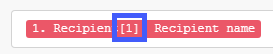

# [!DNL Adobe Workfront Fusion]의 한 모듈에서 다른 모듈로 정보 매핑

>[!IMPORTANT]
>
>Adobe Workfront Fusion 설명서가 새 위치로 이동했습니다.
>
>이 문서의 정보는 이제 문서에서 찾을 수 있습니다.
>
>* [한 모듈에서 다른 모듈로 정보를 매핑합니다](https://experienceleague.adobe.com/docs/workfront-fusion/using/create-scenarios/map-data/map-data-from-one-to-another.html)
>
>모든 책갈피를 업데이트하십시오.
>
>이 문서는 더 이상 업데이트되지 않으며 곧 제거될 예정입니다.

매핑은 항목으로 구조화된 모듈의 출력을 다른 모듈의 입력 필드에 할당하는 프로세스입니다.

시나리오의 이전 모듈에서 출력된 값을 삽입할 필드를 클릭하면 매핑 패널이 표시됩니다. 모듈 내에서 매핑에 사용할 수 있는 모든 필드에서 매핑 패널에서 사용자가 입력하는 정적 텍스트가 있는 매핑된 항목과 함수의 조합을 사용하여 수식을 만들 수 있습니다. 이러한 요소는 서로 내부에 중첩될 수 있습니다.

## 액세스 요구 사항

이 문서의 기능을 사용하려면 다음 액세스 권한이 있어야 합니다.

<table style="table-layout:auto">
 <col> 
 <col> 
 <tbody> 
  <tr> 
    <td role="rowheader">[!DNL Adobe Workfront] 플랜*</td> 
   <td> 
[!DNL Pro] 이상
 </td> 
  </tr> 
  <tr data-mc-conditions=""> 
   <td role="rowheader">[!DNL Adobe Workfront] 라이센스*</td> 
   <td> 
[!UICONTROL Plan], [!UICONTROL Work]
 </td> 
  </tr> 
  <tr> 
   <td role="rowheader">[!UICONTROL Adobe Workfront Fusion] 라이선스**</td> 
   <td>
   
현재 라이선스 요구 사항: [!DNL Workfront Fusion] 라이선스 요구 사항이 없습니다.

   
또는

   
레거시 라이선스 요구 사항: 작업 자동화 및 통합을 위한 [!UICONTROL [!DNL Workfront Fusion]] 

   </td> 
  </tr> 
  <tr> 
   <td role="rowheader">제품</td> 
   <td>
   
현재 제품 요구 사항: [!UICONTROL Select] 또는 [!UICONTROL Prime] [!DNL Adobe Workfront] 플랜이 있는 경우 조직에서 이 문서에 설명된 기능을 사용하려면 [!DNL Adobe Workfront Fusion]과(와) [!DNL Adobe Workfront]을(를) 구매해야 합니다. [!DNL Workfront Fusion]이(가) [!UICONTROL Ultimate] [!DNL Workfront] 계획에 포함되어 있습니다.

   
또는

   
레거시 제품 요구 사항: 이 문서에 설명된 기능을 사용하려면 조직에서 [!DNL Adobe Workfront Fusion]과(와) [!DNL Adobe Workfront]을(를) 구매해야 합니다.

   </td> 
  </tr> 
 </tbody> 
</table>

보유 중인 플랜, 라이선스 유형 또는 액세스 권한을 확인하려면 [!DNL Workfront] 관리자에게 문의하세요.

[!DNL Adobe Workfront Fusion] 라이선스에 대한 자세한 내용은 [[!DNL Adobe Workfront Fusion] 라이선스](../../workfront-fusion/get-started/license-automation-vs-integration.md)를 참조하세요.

## 번들 및 항목

모듈의 작동은 출력으로 0개, 1개 또는 그 이상의 번들을 생성합니다. 번들은 하나 이상의 항목으로 구성됩니다.

모듈의 출력을 탐색하려면 다음 작업을 수행하십시오.

1. 모듈을 실행하려면 **[!UICONTROL 한 번 실행]**&#x200B;을 클릭하세요.
1. 모듈 위의 버블을 클릭합니다.

   모듈의 모든 단계가 포함된 로그가 표시됩니다. **[!UICONTROL Output]** 제목 아래에서 모듈의 작업 단계에서 출력되는 번들 또는 번들을 찾을 수 있습니다. 각 번들에는 해당 항목과 각 항목의 값이 포함되어 있습니다.

>[!INFO]
>
>**예:** 이 예제는 모듈 [!UICONTROL 전자 메일] > [!UICONTROL 전자 메일 보기]를 보여 줍니다. `Date`, `Email ID (UID)`, `size` 등 다양한 항목을 포함하는 단일 번들을 생성하는 1개의 작업을 수행했음을 알 수 있습니다.
>
>

>[!NOTE]
>
>[!UICONTROL 반복자]와(과) [!UICONTROL 집계] 사이에 래핑된 모듈의 출력은 [!UICONTROL 집계] 모듈 외부에서 액세스할 수 없습니다.

## 항목 매핑

두 개 이상의 모듈을 연결하여 모듈 시퀀스를 만든 후 각 모듈은 그 앞에 오는 모듈에서 출력된 항목의 값을 처리할 수 있습니다.

항목을 모듈의 입력 필드에 할당하려면 다음과 같이 하십시오.

1. 이전 모듈의 출력을 처리해야 하는 모듈을 클릭합니다.
1. 표시되는 모듈 설정 패널에서 이전 모듈에서 출력된 항목의 값을 사용할 필드를 클릭합니다.

   매핑 패널이 열립니다.

1. 매핑 패널에서 항목을 클릭하여 필드에 삽입합니다.
1. (선택 사항) 매핑 패널에서 특정 필드를 검색하려면 매핑 패널 검색 막대를 클릭하고 검색할 용어를 입력합니다. 목록에 나타날 때 필드를 클릭합니다.

   검색 결과에는 검색어가 포함되며 대/소문자를 구분하지 않습니다.

자세한 내용은 [모듈 설정 구성 [!DNL Adobe Workfront Fusion]](../../workfront-fusion/modules/configure-a-modules-settings.md)을 참조하세요.

## 공식

여러 항목을 필드에 매핑하고, 리터럴(고정 값)과 결합하고, 연산자 및 함수를 사용하여 복잡한 공식을 작성할 수 있습니다.

매핑 패널의 탭 중 하나에서 함수 및 연산자를 찾을 수 있습니다.

패널을 열 때 표시되는 첫 번째 탭 에는 다른 모듈에서 매핑할 수 있는 항목이 표시됩니다.

다른 탭에는 다음과 같은 유형의 함수가 포함되어 있습니다.

* **일반 함수**  - 자세한 내용은 [일반 함수 [!DNL Adobe Workfront Fusion]](../../workfront-fusion/functions/general-functions.md)를 참조하십시오.

* **연산 함수**  - 자세한 내용은 [연산 함수 [!DNL Adobe Workfront Fusion]](../../workfront-fusion/functions/math-functions.md)를 참조하십시오.

* **텍스트 및 이진 함수**  - 자세한 내용은 [String 함수 [!DNL Adobe Workfront Fusion]](../../workfront-fusion/functions/string-functions.md)를 참조하십시오.

* **날짜 및 시간**  - 자세한 내용은 [날짜 및 시간 함수 [!DNL Adobe Workfront Fusion]](../../workfront-fusion/functions/date-and-time-functions.md) 및 아래 문서를 참조하십시오.

   * [ [!DNL Adobe Workfront Fusion]의 날짜 및 시간 형식에 대한 토큰](../../workfront-fusion/functions/tokens-for-date-and-time-formatting.md)
   * [Adobe Workfront Fusion의 날짜 및 시간 구문 분석용 토큰](../../workfront-fusion/functions/tokens-for-date-and-time-parsing.md)

* **배열을 사용하는 함수**  - 자세한 내용은 [배열 함수 [!DNL Adobe Workfront Fusion]](../../workfront-fusion/functions/array-functions.md)를 참조하십시오.

>[!TIP]
>
>다른 필드에서 재사용하려는 복잡한 수식을 만들 때 조합이 들어 있는 필드를 클릭하고 Command-A 또는 Ctrl-A를 사용하여 선택한 다음 복사하여 다른 필드에 붙여넣을 수 있습니다.

함수를 사용한 항목 매핑에 대한 자세한 내용은 [함수를 사용한 항목 매핑 [!DNL Adobe Workfront Fusion]](../../workfront-fusion/functions/map-using-functions.md)을 참조하십시오.

## 컬렉션

일부 항목에는 다양한 유형의 여러 값이 포함될 수 있습니다. 컬렉션 유형 항목입니다.

항목 레이블 오른쪽에 표시된 작은 검정색 사각형과 자동으로 확장된 하위 항목 목록으로 [!UICONTROL collection] 유형 항목을 식별할 수 있습니다.

>[!NOTE]
>
>대부분의 경우 전체 컬렉션을 나타내는 항목이 아니라 컬렉션의 하위 항목을 매핑합니다.

컬렉션에 대한 자세한 내용은 [!UICONTROL Adobe Workfront Fusion]](../../workfront-fusion/mapping/item-data-types.md)의 [항목 데이터 형식을 참조하십시오.

## 배열

일부 항목에는 동일한 유형의 여러 요소가 포함될 수 있습니다. 배열 유형 항목입니다.

항목 레이블 끝에 있는 대괄호로 배열 유형 항목을 식별할 수 있습니다. 항목 레이블 오른쪽에 있는 작은 검정색 사각형을 클릭하여 요소의 항목을 표시합니다.

배열에 대한 자세한 내용은 [항목 데이터 형식 [!DNL Adobe Workfront Fusion]](../../workfront-fusion/mapping/item-data-types.md)을 참조하세요.

### 배열의 첫 번째 요소 매핑

배열의 `Recipient name` 항목을 매핑하면 다음과 같이 필드에 표시됩니다.

대괄호 안의 숫자는 사용할 배열 요소를 결정하는 색인입니다. 기본적으로 1로 설정되어 있습니다.

### 배열의 n번째 요소 매핑

다른 요소에 액세스하려면 대괄호를 클릭하고 색인 값을 편집합니다.

### 지정된 키로 배열의 요소 매핑

일부 배열에는 키 및 값 항목이 있는 여러 컬렉션이 포함되어 있습니다. 일반적으로 다양한 메타데이터, 속성 등입니다.

다음 예제에서는 [!DNL Jira] 앱의 출력을 보여 줍니다.

이 예제에서는 ID가 10108인 특정 첨부 파일의 첨부 파일 배열에서 파일 이름을 가져옵니다.

[!DNL Jira]의 출력은 다음과 같습니다.

일반적인 요구 사항은 주어진 키 값으로 요소를 검색하고 값 항목에서 해당 값을 얻는 것입니다. 이 작업은 `map()` 및 `get()` 함수의 조합을 사용하는 수식으로 수행할 수 있습니다.

다음은 공식에 대한 자세한 분류입니다.

1. `map()` 함수의 첫 번째 매개 변수는 전체 배열 항목입니다.
1. 두 번째 매개 변수는 값 항목의 원시 이름입니다. 원시 이름을 얻으려면 [!UICONTROL 매핑] 패널의 항목 위로 마우스를 가져갑니다.

   

   >[!NOTE]
   >
   >모든 매개 변수는 대/소문자를 구분합니다. 이 특정 예에서 항목의 레이블은 대문자로만 원시 이름과 다르지만 레이블 값과 달리 모두 소문자 값인 원시 이름을 사용해야 합니다.

1. 세 번째 매개 변수는 키 항목의 원시 이름입니다.

   

1. 네 번째 매개 변수는 지정된 키 값입니다.

`map()` 함수는 배열을 반환하므로(지정된 키 값을 가진 요소가 더 있을 수 있으므로) `get()` 함수를 적용하여 첫 번째 요소를 가져와야 합니다.

* `get()` 함수의 첫 번째 매개 변수는 `map()` 함수의 결과입니다.

* 두 번째 매개 변수는 요소의 색인(1)입니다.

`map()` 함수에 대한 자세한 내용은 [Array 함수 [!DNL Adobe Workfront Fusion]](../../workfront-fusion/functions/array-functions.md)를 참조하십시오.

`get()` 함수에 대한 자세한 내용은 [의 일반 함수 [!DNL Adobe Workfront Fusion]](../../workfront-fusion/functions/general-functions.md)를 참조하십시오.

## 요소를 일련의 번들로 변환

배열은 [!UICONTROL 반복자] 모듈을 사용하여 일련의 번들로 변환할 수 있습니다. 자세한 내용은 [!UICONTROL Adobe Workfront Fusion]](../../workfront-fusion/modules/iterator-module.md)의 [[!UICONTROL 반복자] 모듈을 참조하십시오.

## 문제 해결

### 매핑 패널에 누락된 항목

각 모듈에 대해 매핑 패널에는 모듈 작성자가 나열한 모든 출력 항목이 표시됩니다. 경우에 따라 이 목록이 다양한 이유로 불완전할 수 있고 일부 항목이 누락될 수 있습니다. 시나리오 편집기에서 모듈을 실행할 때 [!DNL Workfront Fusion]에서 누락된 출력 항목을 자동으로 검색할 수 있습니다. 정확한 절차는 모듈 유형에 따라 약간 다릅니다.

#### 인스턴트 트리거

1. 모듈을 마우스 오른쪽 단추로 클릭한 다음 표시되는 메뉴에서 **[!UICONTROL 이 모듈만 실행]**&#x200B;을 클릭합니다.

   대기 중인 웹후크가 없는 경우 모듈은 새 웹후크가 처리되기를 기다립니다.

1. 웹후크를 생성합니다.

   예를 들어 웹후크 모듈 **[!DNL Slack]>[!UICONTROL 새 이벤트를 수신]**(채널에서 새 채널 메시지를 시청)이 채널에 메시지를 보냅니다.

1. 모듈 실행이 완료되면 모듈 위의 버블을 클릭하여 전체 출력을 탐색합니다.

   매핑 패널에는 모듈의 출력에서 발견된 모든 항목이 포함됩니다.

#### 폴링 트리거

1. 모듈을 마우스 오른쪽 단추로 클릭한 다음 표시되는 메뉴에서 **[!UICONTROL 이 모듈만 실행]**&#x200B;을 클릭합니다.
1. 출력이 없으면 **[!UICONTROL 시작할 위치 선택]**&#x200B;을 클릭하고 설정을 조정하세요.
1. 처리할 이벤트가 없는 경우 이벤트를 만들고 2단계로 돌아갑니다.

   예를 들어 Webhook 모듈 **[!UICONTROL Gmail] >[!UICONTROL 전자 메일 보기]**&#x200B;에서 모듈이 보고 있는 폴더로 전자 메일을 보냅니다.

1. 모듈 실행이 완료되면 모듈 위의 버블을 클릭하여 전체 출력을 탐색합니다.

   이제 매핑 패널에 모듈의 출력에서 발견된 모든 항목이 포함됩니다.

#### 기타 모듈

다음을 실행하도록 선택할 수 있습니다.

* 전체 시나리오(또는 모듈이 포함된 부분)입니다

  시나리오가 트리거로 시작하는 경우 위의 [인스턴트 트리거](#instant-trigger) 또는 [폴링 트리거](#polling-trigger) 섹션을 참조하십시오.

* 단일 모듈만

단일 모듈만 실행하도록 선택하는 경우:

1. 모듈을 마우스 오른쪽 단추로 클릭한 다음 표시되는 메뉴에서 **[!UICONTROL 이 모듈만 실행]**&#x200B;을 클릭합니다.
1. 입력 항목에 대한 샘플 값을 입력한 다음 **[!UICONTROL 확인]** 을 클릭합니다.
1. 모듈 실행이 완료되면 모듈 위의 버블을 클릭하여 전체 출력을 탐색합니다.

   이제 매핑 패널에 모듈의 출력에서 발견된 모든 항목이 포함됩니다.
