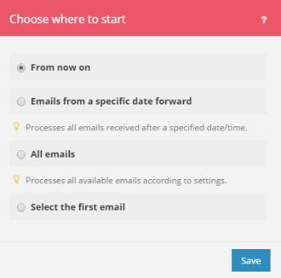

# [!DNL Adobe Workfront Fusion]에서 트리거 모듈이 시작되는 위치를 선택하십시오.

>[!IMPORTANT]
>
>Adobe Workfront Fusion 설명서가 새 위치로 이동했습니다.
>
>이 문서의 정보는 이제 문서에서 찾을 수 있습니다.
>
>* [트리거 모듈이 시작되는 위치 선택](https://experienceleague.adobe.com/docs/workfront-fusion/using/create-scenarios/add-modules/choose-where-trigger-module-starts.html)
>
>모든 책갈피를 업데이트하십시오.
>
>이 문서는 더 이상 업데이트되지 않으며 곧 제거될 예정입니다.

일부 트리거 모듈을 사용하면 번들 검색을 시작할 첫 번째 번들을 선택할 수 있습니다.

특정 날짜 이후에 모든 번들을 검색할지 아니면 번들만 검색할지 지정할 수도 있습니다.

트리거 모듈에 대한 자세한 내용은 문서 [모듈 유형](../../workfront-fusion/modules/module-types.md)의 [트리거 모듈](../../workfront-fusion/modules/module-types.md#triggers) 섹션을 참조하십시오.

## 액세스 요구 사항

+++ 을 확장하여 이 문서의 기능에 대한 액세스 요구 사항을 봅니다.

이 문서의 기능을 사용하려면 다음 액세스 권한이 있어야 합니다.

<table style="table-layout:auto">
 <col> 
 <col> 
 <tbody> 
  <tr> 
    <td role="rowheader">[!DNL Adobe Workfront] 플랜*</td> 
   <td> 
[!DNL Pro] 이상
 </td> 
  </tr> 
  <tr data-mc-conditions=""> 
   <td role="rowheader">[!DNL Adobe Workfront] 라이센스*</td> 
   <td> 
[!UICONTROL Plan], [!UICONTROL Work]
 </td> 
  </tr> 
  <tr> 
   <td role="rowheader">[!UICONTROL Adobe Workfront Fusion] 라이선스**</td> 
   <td>
   
현재 라이선스 요구 사항: [!DNL Workfront Fusion] 라이선스 요구 사항이 없습니다.

   
또는

   
레거시 라이선스 요구 사항: 작업 자동화 및 통합을 위한 [!UICONTROL [!DNL Workfront Fusion]] 

   </td> 
  </tr> 
  <tr> 
   <td role="rowheader">제품</td> 
   <td>
   
현재 제품 요구 사항: [!UICONTROL Select] 또는 [!UICONTROL Prime] [!DNL Adobe Workfront] 플랜이 있는 경우 조직에서 이 문서에 설명된 기능을 사용하려면 [!DNL Adobe Workfront Fusion]과(와) [!DNL Adobe Workfront]을(를) 구매해야 합니다. [!DNL Workfront Fusion]이(가) [!UICONTROL Ultimate] [!DNL Workfront] 계획에 포함되어 있습니다.

   
또는

   
레거시 제품 요구 사항: 이 문서에 설명된 기능을 사용하려면 조직에서 [!DNL Adobe Workfront Fusion]과(와) [!DNL Adobe Workfront]을(를) 구매해야 합니다.

   </td> 
  </tr> 
 </tbody> 
</table>

보유 중인 플랜, 라이선스 유형 또는 액세스 권한을 확인하려면 [!DNL Workfront] 관리자에게 문의하세요.

[!DNL Adobe Workfront Fusion] 라이선스에 대한 자세한 내용은 [[!DNL Adobe Workfront Fusion] 라이선스](../../workfront-fusion/get-started/license-automation-vs-integration.md)를 참조하세요.

+++

## 트리거 모듈의 시작 위치 선택

1. 트리거 모듈을 저장합니다.

   또는

   [[!UICONTROL Adobe Workfront Fusion에서 모듈 설정 구성]](../../workfront-fusion/modules/configure-a-modules-settings.md)에 설명된 대로 트리거 모듈의 설정을 변경합니다.

   또는

   [시나리오 만들기 [!DNL Adobe Workfront Fusion]](../../workfront-fusion/scenarios/create-a-scenario.md)에 설명된 대로 [!UICONTROL 시나리오 편집기]에서 트리거 모듈의 아이콘을 마우스 오른쪽 단추로 클릭합니다.

1. 표시되는 **[!UICONTROL 시작 위치 선택]** 상자에서 옵션을 선택합니다.

   

   표시되는 옵션은 제공된 서비스의 가능성에 따라 다릅니다. 여기에는 다음이 포함될 수 있습니다.

   <table style="table-layout:auto">
        <tr>
            <td>[!UICONTROL From now on] (기본값)</td>
            <td>이제부터 추가 또는 업데이트된 모든 번들(설정에 따라 다름)을 검색합니다.</td>
        </tr>
        <tr>
            <td>[!UICONTROL 특정 날짜 이후]</td>
            <td>지정된 날짜/시간 이후에 추가되거나 업데이트된 모든 번들(설정에 따라 다름)을 검색합니다.</td>
        </tr>
        <tr>
            <td>[!UICONTROL ID가 특정 값보다 크거나 같음]</td>
            <td>ID가 지정된 ID보다 크거나 같은 모든 번들을 검색합니다.</td> 
        </tr>
        <tr>
            <td>[!UICONTROL All bundles]</td>
            <td>사용 가능한 모든 번들 검색</td>
        </tr>
        <tr>
            <td>[!UICONTROL 첫 번째 번들 선택]</td>
            <td>번들 검색을 시작할 첫 번째 번들을 선택할 수 있습니다.</td>
        </tr>
   </table>
