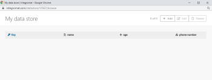

# 데이터 저장소 [!DNL Adobe Workfront Fusion]

데이터베이스 또는 단순 테이블과 유사한 데이터 저장소는 시나리오의 데이터를 저장할 수 있으므로 개별 시나리오 또는 시나리오 실행 간에 데이터를 전송할 수 있습니다. 데이터 저장소를 사용하여 동기화 중에 다양한 시스템의 새 데이터를 저장할 수 있습니다.

데이터 저장소 모듈을 사용하면 [!DNL Adobe Workfront Fusion] 데이터 저장소:

* 추가
* 바꾸기
* 업데이트
* 검색
* 삭제
* 검색
* 수

데이터 저장소 모듈 사용에 대한 자세한 내용은 [[!UICONTROL 데이터 저장소] 모듈](../../workfront-fusion/apps-and-their-modules/data-store-modules.md).

## 액세스 요구 사항

이 문서의 기능을 사용하려면 다음 액세스 권한이 있어야 합니다.

<table style="table-layout:auto">
 <col> 
 <col> 
 <tbody> 
  <tr> 
    <td role="rowheader">[!DNL Adobe Workfront] 플랜*</td> 
   <td> 
[!DNL Pro] 이상
 </td> 
  </tr> 
  <tr data-mc-conditions=""> 
   <td role="rowheader">[!DNL Adobe Workfront] 라이센스*</td> 
   <td> 
[!UICONTROL Plan], [!UICONTROL Work]
 </td> 
  </tr> 
  <tr> 
   <td role="rowheader">[!UICONTROL Adobe Workfront Fusion] 라이센스**</td> 
   <td> 
[!UICONTROL [!DNL Workfront Fusion] 작업 자동화 및 통합을 위한] 
  </td> 
  </tr> 
  <tr> 
   <td role="rowheader">제품</td> 
   <td>조직이 구매해야 합니다 [!DNL Adobe Workfront Fusion] 뿐만 아니라 [!DNL Adobe Workfront] 을 참조하십시오.</td> 
  </tr> 
 </tbody> 
</table>

어떤 계획, 라이센스 유형 또는 액세스 권한을 보유하고 있는지 확인하려면 [!DNL Workfront] 관리자

에 대한 자세한 정보 [!DNL Adobe Workfront Fusion] 라이센스 [[!DNL Adobe Workfront Fusion] 라이선스](../../workfront-fusion/get-started/license-automation-vs-integration.md).

## 에 데이터 저장소 만들기 [!DNL Workfront Fusion]

* [데이터 저장소 설정](#set-up-the-data-store)
* [데이터 구조 설정](#set-up-the-data-structure)

### 데이터 저장소 설정

모듈에서 데이터 저장소를 사용하려면 먼저 데이터 저장소를 [!DNL Workfront Fusion].

>[!NOTE]
>
>조직에 사용 가능한 데이터 저장소의 수가 제한되어 있습니다. 사용 가능한 것보다 더 많은 데이터 저장소를 만들려고 하면 [!DNL Workfront] 반환 [!UICONTROL 최대 저장소에 도달했습니다.] 오류가 발생했습니다.
>
>자세한 내용은 [최대 저장소에 도달 오류](#maximum-stores-reached-error) 참조하십시오.

1. 에 로그인합니다. [!DNL Workfront Fusion] 계정이 필요합니다.
1. 클릭 **[!UICONTROL 데이터 저장소]** 왼쪽 탐색 패널
1. 클릭 **[!UICONTROL 데이터 저장소 추가]** 화면 오른쪽 상단 모서리에서
1. 새 데이터 저장소에 대한 설정을 입력합니다.

   의 필드에 굵게 표시된 제목 [!DNL Workfront Fusion] 모듈은 필수 설정을 나타냅니다.

   <table style="table-layout:auto">
    <col> 
    <col> 
    <tbody> 
     <tr> 
      <td>[!UICONTROL 데이터 저장소 이름] </td> 
      <td> 
데이터 저장소 이름을 입력합니다. 
 </td> 
     </tr> 
     <tr> 
      <td> 
[!UICONTROL 데이터 구조]
 </td> 
      <td> 
데이터 구조는 테이블의 열 목록입니다. 이 목록은 열 이름과 데이터 유형을 나타냅니다.
 
다음 중 하나를 수행하십시오.
 
       <ul> 
        <li style="font-weight: bold;">이미 생성된 데이터 구조를 선택합니다</li> 
        <li> 
새 데이터 구조 추가
 
클릭 <strong>[!UICONTROL Add]</strong> 새 데이터 구조를 만들려면
 
자세한 내용은 <a href="#set-up-the-data-structure" class="MCXref xref">데이터 구조 설정</a> 섹션에 자세히 설명되어 있습니다.
 </li> 
        <li style="font-weight: bold;"> 
필드를 비워 둡니다.
 
데이터 구조를 선택하거나 추가하지 않으면 데이터베이스에 기본 키만 포함됩니다. 이러한 데이터베이스 유형은 키만 저장하고 특정 키가 데이터베이스에 있는지 여부만 알고 있는 경우에 유용합니다.
 </li> 
       </ul> </td> 
     </tr> 
     <tr> 
      <td> 
[!UICONTROL 데이터 저장소 크기(MB)]
 </td> 
      <td> 
전체 내부 데이터 저장소에서 데이터 저장소 크기를 할당합니다.
 
참고: 예약 금액은 언제든지 변경할 수 있습니다.
  </td> 
     </tr> 
    </tbody> 
   </table>

### 데이터 구조 설정

1. 데이터 저장소를 만들거나 편집할 때 **[!UICONTROL 추가]**.
1. 에서 **[!UICONTROL 데이터 구조 추가]** 표시되는 상자에 다음 필드를 구성합니다.

   <table style="table-layout:auto">
    <col> 
    <col> 
    <tbody> 
     <tr> 
      <td>[!UICONTROL 데이터 구조 이름]</td> 
      <td> 
 새 데이터 구조의 이름을 입력합니다.
 </td> 
     </tr> 
     <tr> 
      <td> 
[!UICONTROL Specification]
 </td> 
      <td> 
데이터 저장소의 열을 설정하려면 다음 중 하나를 수행합니다.
 
       <ul> 
        <li> 
클릭 <strong>[!UICONTROL 항목 추가]</strong> 를 눌러 한 열의 속성을 수동으로 지정합니다.
 
을(를) 입력합니다. <strong>[!UICONTROL Name]</strong> 및 <strong>[!UICONTROL Type]</strong> 데이터 저장소 열에 대해 를 정의하고 해당 속성을 정의합니다.
 </li> 
        <li> 
클릭 <strong>[!UICONTROL Generator]</strong> 를 입력하여 제공하는 샘플 데이터에서 열을 결정합니다.
 
         
Example: </b>">
          <b>예: </b> 
          
예를 들어 다음 JSON 샘플 데이터는 3개의 열을 만듭니다. 이름, 연령 및 전화 번호 전화번호는 휴대전화번호와 유선전화번호의 모음입니다
 
          
<code>&lbrace;</code> 
 
          
<code>"name":"John",</code> 
 
          
<code>"age":30,</code> 
 
          
<code>"phone number": &lbrace;</code> 
 
          
<code>"mobile":"987654321",</code> 
 
          
<code>"landline":"123456789"</code> 
 
          
<code>&rbrace;</code> 
 
          
<code>&rbrace;</code> 
 
          
데이터 저장소 보기의 빈 열:
 
          
  
 
          
그런 다음 수동으로 또는 [!DNL Workfront Fusion] 데이터 저장소 모듈.
 
         
 </li> 
       </ul> </td> 
     </tr> 
     <tr> 
      <td>[!UICONTROL Strict] </td> 
      <td> 
페이로드가 데이터 구조와 일치하는지 확인하려면 이 옵션을 활성화합니다. 데이터 구조에 지정되지 않은 추가 항목이 포함된 페이로드는 거부됩니다.
 </td> 
     </tr> 
    </tbody> 
   </table>

## 기존 데이터 저장소 편집

에서 기존 데이터 저장소의 속성 및 콘텐츠를 편집할 수 있습니다 [!UICONTROL 데이터 저장소] 영역 [!DNL Workfront Fusion].

* [데이터 저장소의 속성 편집](#edit-the-properties-of-a-data-store)
* [데이터 저장소 컨텐츠 편집](#edit-the-contents-of-a-data-store)

### 데이터 저장소의 속성 편집

데이터 저장소의 속성에는 데이터 저장소가 사용하는 데이터 구조와 데이터 저장소의 크기가 포함됩니다.

1. 클릭 **[!UICONTROL 데이터 저장소]**  왼쪽 탐색 패널에서 를 열고 [!UICONTROL 데이터 저장소] 영역.
1. 클릭 **[!UICONTROL 편집]**  를 클릭합니다.
1. (선택 사항) 이 데이터 저장소에서 사용하는 데이터 구조를 다른 기존 데이터 구조로 변경하려면 **[!UICONTROL 데이터 구조]** 드롭다운.

   또는

   (선택 사항) 이 데이터 저장소에서 사용하는 데이터 구조를 완전히 새로운 데이터 구조로 변경하려면 다음을 참조하십시오 [데이터 구조 설정](#set-up-the-data-structure) 참조하십시오.

1. (선택 사항) 새 크기를 **[!UICONTROL 데이터 저장소 크기(MB)]** 필드.
1. **[!UICONTROL 저장]**&#x200B;을 클릭합니다.

### 데이터 저장소 컨텐츠 편집

1. 을(를) 클릭합니다. **[!UICONTROL 데이터 저장소]** 아이콘  왼쪽 탐색 패널에서 를 열고 [!UICONTROL 데이터 저장소] 영역.
1. 클릭 **[!UICONTROL 찾아보기]**  를 클릭합니다.
1. (선택 사항) 열을 원하는 위치로 드래그하여 순서를 변경합니다.
1. (선택 사항) [!UICONTROL 편집] 를 클릭하여 단일 셀 **[!UICONTROL 편집]** 아이콘 해당 셀에서 원하는 값을 입력합니다.
1. (선택 사항) 다음을 클릭하여 데이터 저장소에 새 항목을 추가합니다 **[!UICONTROL 추가]**&#x200B;그런 다음 새 항목에 대한 정보를 입력합니다.
1. **[!UICONTROL 저장]**&#x200B;을 클릭합니다.

## 문제 해결

* [데이터 저장소에서 손실된 데이터 복원](#restoring-lost-data-from-a-data-store)
* [공간 부족 오류](#out-of-space-error)
* [최대 저장소에 도달 오류](#maximum-stores-reached-error)

### 데이터 저장소에서 손실된 데이터 복원

현재 손실된 데이터 복구를 자동화하는 툴은 없습니다.

#### 해결 방법

1. 항목이 데이터 저장소에 삽입된 시나리오의 모든 실행 로그를 검사합니다.

   실행 로그 검사에 대한 자세한 내용은 [에서 시나리오 실행 내역 보기 [!DNL Adobe Workfront Fusion]](../../workfront-fusion/scenarios/view-scenario-execution-history.md).

1. 데이터를 복사합니다.
1. 데이터를 데이터 저장소에 다시 삽입합니다.

   데이터 저장소에 데이터 삽입에 대한 자세한 내용은 [데이터 저장소 컨텐츠 편집](#edit-the-contents-of-a-data-store) 참조하십시오.

### [!UICONTROL 공간이 부족합니다.] 오류

An [!UICONTROL 공간 부족] 이전에 만든 데이터 저장소에 이미 할당된 데이터 저장소 저장소가 할당되었기 때문에 오류가 발생합니다.

#### 해결 방법

1. 기존 데이터 저장소를 편집하여 공간을 적게 사용합니다. 이렇게 하면 새 데이터 저장소에 공간이 확보됩니다.

   자세한 내용은 [데이터 저장소의 속성 편집](#edit-the-properties-of-a-data-store) 참조하십시오.

>[!NOTE]
>
>더 많은 데이터 저장소가 필요하지 않다고 확신하지 않는 한 모든 공간을 단일 데이터 저장소에 할당하지 않는 것이 좋습니다.

### [!UICONTROL 최대 저장소에 도달했습니다.] 오류

A [!UICONTROL 최대 저장소에 도달했습니다.] 조직에서 사용 가능한 모든 데이터 저장소를 사용하므로 오류가 발생합니다. 조직에는 사용 가능한 데이터 저장소의 수가 사용 가능한 시나리오 수의 2배에 해당합니다. 따라서 사용 가능한 데이터 저장소의 총 수는 구입한 계획에 따라 다릅니다.

예를 들어 조직에서 15개의 시나리오가 있는 플랜을 구입한 경우 조직에 최대 30개의 데이터 저장소가 있을 수 있습니다.

#### 해결 방법

기존 데이터 저장소 수를 줄이려면 다음 중 하나를 수행하는 것이 좋습니다.

* 기존 데이터 저장소 결합
* 사용하지 않은 데이터 저장소 삭제
