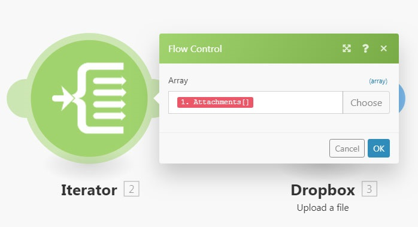
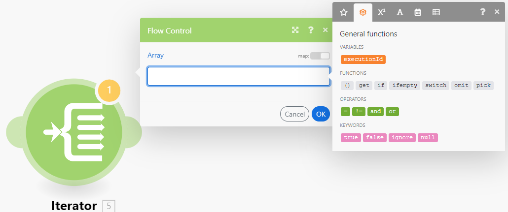

# [!DNL Adobe Workfront Fusion]의 [!UICONTROL 반복자] 모듈

>[!IMPORTANT]
>
>Adobe Workfront Fusion 설명서가 새 위치로 이동했습니다.
>
>이 문서의 정보는 이제 문서에서 찾을 수 있습니다.
>
>* [반복자 모듈](https://experienceleague.adobe.com/docs/workfront-fusion/using/references/modules/iterator-module.html)
>
>모든 책갈피를 업데이트하십시오.
>
>이 문서는 더 이상 업데이트되지 않으며 곧 제거될 예정입니다.

[!UICONTROL 반복자] 모듈은 배열을 일련의 번들로 변환하는 특별한 유형의 모듈입니다. 각 배열 항목은 별도의 번들로 출력됩니다.

자세한 내용은 [모듈 유형](../../workfront-fusion/modules/module-types.md) 및 [Adobe Workfront Fusion에서 배열 매핑](../../workfront-fusion/mapping/map-an-array.md)을 참조하십시오.

## 액세스 요구 사항

이 문서의 기능을 사용하려면 다음 액세스 권한이 있어야 합니다.

<table style="table-layout:auto">
 <col> 
 <col> 
 <tbody> 
  <tr> 
    <td role="rowheader">[!DNL Adobe Workfront] 플랜*</td> 
   <td> 
[!DNL Pro] 이상
 </td> 
  </tr> 
  <tr data-mc-conditions=""> 
   <td role="rowheader">[!DNL Adobe Workfront] 라이센스*</td> 
   <td> 
[!UICONTROL Plan], [!UICONTROL Work]
 </td> 
  </tr> 
  <tr> 
   <td role="rowheader">[!UICONTROL Adobe Workfront Fusion] 라이선스**</td> 
   <td>
   
현재 라이선스 요구 사항: [!DNL Workfront Fusion] 라이선스 요구 사항이 없습니다.

   
또는

   
레거시 라이선스 요구 사항: 작업 자동화 및 통합을 위한 [!UICONTROL [!DNL Workfront Fusion]] 

   </td> 
  </tr> 
  <tr> 
   <td role="rowheader">제품</td> 
   <td>이 문서에 설명된 기능을 사용하려면 조직에서 Adobe Workfront Fusion과 Adobe Workfront을 구매해야 합니다.</td> 
  </tr> 
 </tbody> 
</table>

보유 중인 플랜, 라이선스 유형 또는 액세스 권한을 확인하려면 Workfront 관리자에게 문의하십시오.

[!DNL Adobe Workfront Fusion] 라이선스에 대한 자세한 내용은 [[!DNL Adobe Workfront Fusion] 라이선스](../../workfront-fusion/get-started/license-automation-vs-integration.md)를 참조하세요.

## [!UICONTROL 반복자] 모듈 구성

[!UICONTROL 반복자] 모듈은 다른 모듈과 동일하게 설정합니다. [!UICONTROL Array] 필드에는 변환하거나 별도의 번들로 분할할 배열이 포함되어 있습니다.

자세한 내용은 [Adobe Workfront Fusion에서 모듈 설정 구성](../../workfront-fusion/modules/configure-a-modules-settings.md)을 참조하십시오.

>[!INFO]
>
>**예:**
>
>* 아래 시나리오는 첨부 파일이 있는 전자 메일을 검색하고 첨부 파일을 선택한 [!DNL Dropbox] 폴더에 단일 파일로 저장하는 방법을 보여 줍니다.
>
>   이메일에는 여러 첨부 파일이 포함될 수 있습니다. 첫 번째 모듈 뒤에 삽입된 [!UICONTROL 반복자] 모듈을 사용하면 각 첨부 파일을 개별적으로 처리할 수 있습니다. [!UICONTROL 반복자] 모듈은 첨부 파일의 배열을 단일 번들로 분할합니다. 첨부 파일이 한 개 있는 각 번들은 선택한 [!DNL Dropbox] 폴더에 한 번에 하나씩 저장됩니다. [!UICONTROL 반복자] 모듈 설정이 위에 표시되어 있습니다. [!UICONTROL 배열] 필드에는 `Attachments` 배열이 포함되어야 합니다.
>
>   
>
>* 사용자의 편의를 위해 많은 [!DNL Workfront Fusion] 앱에서 간소화된 설정으로 특수 [!UICONTROL 반복기] 모듈을 제공합니다. 예를 들어 [!UICONTROL Email] 앱에는 일반 [!UICONTROL 반복자] 모듈과 동일한 결과를 생성하는 특수 [!UICONTROL 반복자] 모듈 [!UICONTROL Email] > [!UICONTROL 첨부 파일 반복]이 포함되어 있습니다.
>
>   

## 문제 해결: 매핑 패널에 매핑 가능한 항목이 [!UICONTROL 반복자] 모듈에 표시되지 않습니다.

[!UICONTROL 반복자] 모듈에 배열 항목의 구조에 대한 정보가 없는 경우 [!UICONTROL 반복자] 모듈 다음에 있는 모듈의 매핑 패널에는 [!UICONTROL 반복자] 모듈 :`Total number of bundles` 및 `Bundle order position` 아래에 2개의 항목만 표시됩니다.

각 모듈은 다음 모듈의 매핑 패널에 이러한 항목이 올바르게 표시될 수 있도록 출력하는 항목에 대한 정보를 제공할 책임이 있기 때문입니다. 그러나 일부 모듈에서는 이 정보를 제공하지 못할 수도 있습니다. 예를 들어 데이터 구조가 없는 [!UICONTROL JSON] > [!UICONTROL JSON 구문 분석] 또는 [!UICONTROL Webhooks] > [!UICONTROL 사용자 지정 Webhook] 모듈이 있습니다.

해결 방법은 시나리오를 수동으로 실행하여 모듈이 출력하는 항목에 대해 학습하도록 하여 다음 모듈에 정보를 제공할 수 있도록 하는 것입니다.

예를 들어 다음과 같이 데이터 구조가 없는 [!UICONTROL JSON] > [!UICONTROL JSON 구문 분석] 모듈이 있는 경우:

그런 다음 [!UICONTROL 반복자] 모듈을 연결하면 모듈의 출력을 [!UICONTROL 반복자] 모듈의 설정 패널에 있는 배열 필드에 매핑할 수 없습니다.

이 문제를 해결하려면 시나리오 편집기에서 시나리오를 수동으로 시작합니다. [!UICONTROL JSON] > [!UICONTROL JSON 구문 분석] 모듈 뒤에 있는 모듈의 연결을 해제하여 흐름이 더 이상 진행되지 않도록 할 수 있습니다. 또는 [!UICONTROL JSON] > [!UICONTROL JSON 구문 분석] 모듈을 마우스 오른쪽 단추로 클릭하고 컨텍스트 메뉴에서 **[!UICONTROL 이 모듈만 실행]**&#x200B;을 선택하여 [!UICONTROL JSON] > [!UICONTROL JSON 구문 분석] 모듈만 실행할 수 있습니다.

[!UICONTROL JSON] > [!UICONTROL JSON 구문 분석]이 실행되면 출력한 항목에 대해 학습하고 이 정보를 반복자 모듈을 포함하여 모든 후속 모듈에 제공합니다. 그러면 반복자 설정의 매핑 패널에 다음 항목이 표시됩니다.

또한 [!UICONTROL 반복자] 모듈 뒤에 연결된 모듈의 매핑 패널에는 배열의 항목에 포함된 항목이 표시됩니다.

모듈의 매핑 패널에서 일부 항목을 볼 수 없는 경우, 시나리오를 한 번 실행하여 모든 모듈이 출력하는 항목에 대해 학습하고 이 정보를 다음 모듈에 제공합니다.
