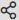

# 을 사용하여 시나리오 디버그 [!DNL Adobe Workfront Fusion] 개발 도구

다음 [!DNL Adobe Workfront Fusion] 개발 도구를 사용하면 시나리오를 이해하고 문제를 해결할 수 있습니다. 개발 도구는 [!DNL Chrome Developer Tools]. 이 디버거 패널을 사용하면 시나리오의 모든 수동 실행을 확인하고, 수행된 모든 작업을 검토하고, 수행된 모든 API 호출의 세부 사항을 볼 수 있습니다. 오류가 발생한 모듈, 작업 또는 단일 응답을 확인하고 해당 지식을 사용하여 시나리오를 구체화할 수 있습니다.

## 액세스 요구 사항

이 문서의 기능을 사용하려면 다음 액세스 권한이 있어야 합니다.

<table style="table-layout:auto"> 
 <col> 
 <col> 
 <tbody> 
  <tr> 
    <td role="rowheader">[!DNL Adobe Workfront] 플랜*</td> 
   <td> 
[!DNL Pro] 이상
 </td> 
  </tr> 
  <tr data-mc-conditions=""> 
   <td role="rowheader">[!DNL Adobe Workfront] 라이센스*</td> 
   <td> 
[!UICONTROL Plan], [!UICONTROL Work]
 </td> 
  </tr> 
  <tr> 
   <td role="rowheader">[!UICONTROL Adobe Workfront Fusion] 라이센스**</td> 
  <td> 
[!UICONTROL [!DNL Workfront Fusion] 작업 자동화 및 통합을 위한] 

[!UICONTROL [!DNL Workfront Fusion] 작업 자동화를 위한] 
  </td>    </tr> 
  </tr> 
  <tr> 
   <td role="rowheader">제품</td> 
   <td>조직이 구매해야 합니다 [!DNL Adobe Workfront Fusion] 뿐만 아니라 [!DNL Adobe Workfront] 을 참조하십시오.</td> 
  </tr> 
 </tbody> 
</table>

어떤 계획, 라이센스 유형 또는 액세스 권한을 보유하고 있는지 확인하려면 [!DNL Workfront] 관리자

에 대한 자세한 정보 [!DNL Adobe Workfront Fusion] 라이센스 [[!DNL Adobe Workfront Fusion] 라이선스](../../workfront-fusion/get-started/license-automation-vs-integration.md).

## 설치 [!DNL Chrome] 개발 도구 확장

를 사용하려면 [!DNL Workfront Fusion] DevTool을 먼저 설치해야 합니다.

1. 클릭 [이 링크](https://cdn.experience.workfront.com/Documentation/Workfront+Fusion/workfront-fusion-devtool.zip) 확장을 다운로드하려면 다음을 수행하십시오.
1. 파일이 다운로드되면 선택한 폴더에 추출합니다.
1. 에서 탭을 엽니다. [!DNL Chrome]
1. 탭의 검색 막대에서 을 입력합니다. `chrome://extensions`.
1. 을(를) 클릭합니다. **[!UICONTROL 개발자 모드]** 화면의 오른쪽 상단에서 토글하여 개발자 모드를 활성화합니다. 오른쪽으로 전환하면 개발자 모드가 활성화됩니다.
1. 클릭 **[!UICONTROL 압축을 푼 로드]**.
1. DevTool이 포함된 폴더(2단계에서 파일을 추출한 폴더)를 선택합니다.

   압축을 풀면 개발 도구가 다른 Chrome 확장 프로그램 중에 표시됩니다.

## 을(를) 찾습니다 [!DNL Workfront Fusion] 개발 도구

를 사용하려면 [!DNL Workfront Fusion] 개발 도구에서 [!DNL Workfront Fusion] 개발자 도구에 대한 확장 [!DNL Chrome] 브라우저에 설명된 대로 [Chrome DevTool 확장 설치](#install-the-chrome-devtool-extension).

1. 다음 문서를 엽니다. [!DNL Workfront Fusion] 시나리오.
1. 열기 [!DNL Chrome Developer Tools]:

   <table style="table-layout:auto"> 
    <col> 
    <col> 
    <tbody> 
     <tr> 
      <td role="rowheader">[!DNL Mac]</td> 
      <td>Command + Option + I</td> 
     </tr> 
     <tr> 
      <td role="rowheader">[!DNL Windows]</td> 
      <td> 
Control + Shift + I
 
 또는 
 
F12
 </td> 
     </tr> 
    </tbody> 
   </table>

   >[!TIP]
   >
   >을 접하는 것이 좋습니다 [!DNL Chrome Developer Console] 모듈을 더 잘 보려면 아래에 놓으십시오.

1. 을(를) 클릭합니다. **[!DNL Workfront Fusion]** 탭 [!DNL Chrome Dev Tools].

## 를 사용하십시오 [!DNL Workfront Fusion] 개발 도구

Workfront Fusion DevTool은 3개의 기본 섹션으로 구분됩니다. 개발 도구 창의 왼쪽 패널에서 찾을 수 있습니다.

* [라이브 스트림](#live-stream)
* [시나리오 디버거](#scenario-debugger)
* [도구](#tools)

### 라이브 스트림

라이브 스트림은 시나리오에서 한 번 실행 을 클릭하면 백그라운드에서 발생하는 작업을 표시합니다.

1. 을(를) 클릭합니다. **[!UICONTROL 라이브 스트림]** 아이콘  를 클릭하여 라이브 스트림 섹션을 엽니다.
1. 다음 중 하나를 수행합니다.

   <table style="table-layout:auto"> 
    <col> 
    <col> 
    <thead> 
     <tr> 
      <th>개 액션</th> 
      <th>지침</th> 
     </tr> 
    </thead> 
    <tbody> 
     <tr> 
      <td role="rowheader">요청 정보 보기</td> 
      <td> 
시나리오의 각 모듈에 대해 다음 정보를 볼 수 있습니다
 
       <ul> 
        <li> 
요청 헤더(API 엔드포인트 URL, http 메서드, 시간 및 요청이 호출된 날짜, 요청 헤더 및 쿼리 문자열)
 </li> 
        <li> 
요청 본문
 </li> 
        <li> 
응답 헤더
 </li> 
        <li> 
응답 본문
 </li> 
       </ul> 
이 정보를 보려면 페이지의 오른쪽 패널에서 해당 탭을 클릭합니다 [!DNL Workfront Fusion] 개발 도구.
 </td> 
     </tr> 
     <tr> 
      <td role="rowheader"> 
요청 및 응답 검색
 </td> 
      <td> 
왼쪽 패널의 검색 필드에 검색어를 입력합니다 [!DNL Workfront Fusion] DevTool 을 사용하여 검색어가 포함된 요청만 표시합니다.
 </td> 
     </tr> 
     <tr> 
      <td role="rowheader"> 
요청 목록 제거 
 </td> 
      <td> 
DevTool 왼쪽 패널의 오른쪽 위 모서리에 있는 휴지통 아이콘을 클릭하여 [!DNL Workfront Fusion] 개발 도구. 
 </td> 
     </tr> 
     <tr> 
      <td role="rowheader"> 
콘솔 로깅 활성화
 </td> 
      <td> 
컴퓨터 아이콘을 클릭합니다  를 클릭합니다.
 
컴퓨터 아이콘이 녹색이면 콘솔에 로깅이 활성화됩니다.
 </td> 
     </tr> 
     <tr> 
      <td role="rowheader"> 
원시 JSON 형식 또는 cURL로 요청을 검색합니다
 </td> 
      <td> 
       <ul> 
        <li> 
<strong>원시 JSON</strong> 
 
클릭 <strong>[!UICONTROL Copy RAW]</strong> 를 클릭합니다.
 </li> 
        <li> 
<strong>cURL</strong> 
 
클릭 <strong>[!UICONTROL cURL 복사]</strong> 를 클릭합니다.
 </li> 
       </ul> </td> 
     </tr> 
    </tbody> 
   </table>

### 시나리오 디버거

시나리오 디버거는 더 복잡한 시나리오에 유용합니다. 시나리오 실행 내역이 표시되고, 이름이나 ID로 모듈을 검색할 수 있습니다.

1. 을(를) 클릭합니다. **[!UICONTROL 시나리오 디버거]** 아이콘  시나리오 디버거를 엽니다.
1. (선택 사항) 의 왼쪽 창에 있는 검색 필드에 검색어(이름 또는 모듈 ID)를 입력합니다 [!DNL Workfront Fusion] 의 개발 도구 [!UICONTROL 시나리오 디버거] 섹션을 참조하십시오.
1. 모듈 이름을 두 번 클릭하여 시나리오 편집기에서 해당 설정을 엽니다.
1. 원하는 작업을 클릭하여 요청 세부 사항을 봅니다.

### 도구

다음 [!DNL Workfront Fusion] DevTool은 시나리오를 쉽게 설정하는 도구를 제공합니다.

1. 을(를) 클릭합니다. **[!UICONTROL 도구]** 아이콘  를 클릭하여 도구를 엽니다.
1. 사용할 도구를 선택합니다
1. 다음과 같이 필드를 구성합니다.
1. 클릭 **[!UICONTROL 실행]**.

도구 및 해당 필드:

* [모듈 포커스 지정](#focus-a-module)
* [매핑별 모듈 찾기](#find-modules-by-mapping)
* [앱 메타데이터 가져오기](#get-app-metadata)
* [매핑 복사](#copy-mapping)
* [필터 복사](#copy-filter)
* [연결 교체](#swap-connection)
* [변수 교체](#swap-variable)
* [앱 교체](#swap-app)
* [기본 64](#base-64)
* [모듈 이름 복사](#copy-module-name)
* [소스 다시 매핑](#remap-source)
* [앱 강조 표시](#highlight-app)
* [GS 마이그레이션](#migrate-gs)

#### [!UICONTROL 모듈 포커스 지정]

지정된 모듈의 설정을 ID로 엽니다.

<table style="table-layout:auto">
    <tr>
        <td>[!UICONTROL 모듈 ID]</td>
        <td>설정을 열 모듈의 ID를 입력합니다.</td>
    </tr>
</table>

#### [!UICONTROL 매핑별 모듈 찾기]

지정한 용어에 대해 모듈 값을 검색할 수 있습니다. 출력에 검색한 용어가 들어 있는 모듈 ID가 포함됩니다.

<table style="table-layout:auto">
 <col> 
 <col> 
 <tbody> 
  <tr> 
   <td role="rowheader">[!UICONTROL Keyword]</td> 
   <td> 
 검색할 용어를 입력합니다. 
 </td> 
  </tr> 
  <tr> 
   <td role="rowheader"> 
[!UICONTROL 값만 사용]
 </td> 
   <td> 
모듈 필드의 값만 검색하려면 이 옵션을 활성화하십시오.
 
모듈 필드의 이름에서도 검색하려면 이 옵션을 비활성화합니다.
 
이름 및 레이블 매개 변수를 통해 검색이 수행됩니다.
 </td> 
  </tr> 
 </tbody> 
</table>

#### [!UICONTROL 앱 메타데이터 가져오기]

앱의 모듈 이름 또는 ID로 앱의 메타데이터를 검색합니다. 이 기능은 시나리오에서 사용되는 앱 버전을 알아야 하는 경우 유용합니다.

<table style="table-layout:auto">
    <tr>
        <td>[!UICONTROL 소스 모듈]</td>
        <td>메타데이터를 검색할 모듈을 선택합니다.</td>
    </tr>
</table>

#### [!UICONTROL 매핑 복사]

소스 모듈의 값을 대상 모듈로 복사합니다.

>[!CAUTION]
>
>올바른 소스 및 대상 모듈을 설정해야 합니다. 다른 유형의 모듈을 선택하면 대상 모듈의 값이 삭제됩니다.

<table style="table-layout:auto">
 <col> 
 <col> 
 <tbody> 
  <tr> 
   <td role="rowheader">[!UICONTROL 소스 모듈]</td> 
   <td> 
 모듈을 선택하거나 필드 값을 복사할 모듈의 ID를 입력합니다.
 </td> 
  </tr> 
  <tr> 
   <td role="rowheader"> 
[!UICONTROL Target 모듈]
 </td> 
   <td> 
모듈을 선택하거나 소스 모듈 값을 삽입할 모듈의 ID를 입력합니다.
 
중요 사항: 대상 모듈의 값을 덮어씁니다.
 </td> 
  </tr> 
 </tbody> 
</table>

#### [!UICONTROL 필터 복사]

소스 모듈의 필터 설정을 대상 모듈로 복사합니다.

>[!NOTE]
>
>복사 작업은 선택한 모듈의 왼쪽에 있는 필터에 대해 수행됩니다.

<table style="table-layout:auto"> 
 <col> 
 <col> 
 <tbody> 
  <tr> 
   <td role="rowheader">[!UICONTROL 소스 모듈]</td> 
   <td> 
 모듈을 선택하거나 필터 값을 복사할 모듈의 ID를 입력합니다.
 </td> 
  </tr> 
  <tr> 
   <td role="rowheader"> 
[!UICONTROL Target 모듈]
 </td> 
   <td> 
모듈을 선택하거나 소스 모듈에서 필터 값을 삽입할 모듈의 ID를 입력합니다.
 
중요 사항: 대상 모듈의 값을 덮어씁니다.
 </td> 
  </tr> 
  <tr> 
   <td role="rowheader"> 
[!UICONTROL 대체 경로 설정 유지]
 </td> 
   <td> 
소스 필터는 대체 경로로 설정됩니다. 또한 대상 필터가 대체 라우트로 설정되어 있도록 설정하려면 이 옵션을 활성화하십시오.
 </td> 
  </tr> 
 </tbody> 
</table>

#### [!UICONTROL 연결 교체]

동일한 앱의 시나리오의 모든 모듈과 소스 모듈의 연결을 복제합니다.

<table style="table-layout:auto">
    <tr>
        <td>[!UICONTROL 소스 모듈]</td>
        <td>모듈을 선택하거나 연결을 복제할 모듈의 ID를 입력합니다.</td>
    </tr>
</table>

#### [!UICONTROL 변수 교체]

시나리오에서 지정된 변수를 검색하고 새 변수로 바꿉니다.

<table style="table-layout:auto">
 <col> 
 <col> 
 <tbody> 
  <tr> 
   <td role="rowheader">[!UICONTROL Variable to Find]</td> 
   <td> 
 시나리오의 모듈에서 대체할 변수 알약을 찾아 이 ([!UICONTROL Variable to Find]) 필드에 복사합니다. 필드에 중괄호가 두 개 있는 것으로 나타납니다. 예: <code>&#123;&#123;5.value&#125;&#125;</code>.
 </td> 
  </tr> 
  <tr> 
   <td role="rowheader"> 
[!UICONTROL 다음으로 바꾸기]
 </td> 
   <td> 
변수를 시나리오의 모듈에서 로 대체하려는 변수 알약을 찾아 이 ([!UICONTROL Variable to Find]) 필드에 복사합니다. 필드에 중괄호가 두 개 있는 것으로 나타납니다. 예: <code>&#123;&#123;5.value&#125;&#125;</code>.
 </td> 
  </tr> 
  <tr> 
   <td role="rowheader"> 
[!UICONTROL Module]
 </td> 
   <td> 
변수를 바꿀 모듈을 선택합니다. 선택한 모듈이 없으면 변수가 전체 시나리오에서 대체됩니다.
 </td> 
  </tr> 
 </tbody> 
</table>

#### [!UICONTROL 앱 교체]

시나리오에서 선택한 앱 버전을 다른 앱 버전으로 바꿉니다.

예를 들어 Gmail 및 Email 앱의 모듈을 최신 버전으로 업그레이드하는 데 사용할 수 있습니다.

<table style="table-layout:auto">
 <col> 
 <col> 
 <tbody> 
  <tr> 
   <td role="rowheader">[!UICONTROL 교체할 앱]</td> 
   <td> 
 바꿀 앱을 선택합니다.
 </td> 
  </tr> 
  <tr> 
   <td role="rowheader"> 
[!UICONTROL 다음으로 바꾸기]
 </td> 
   <td> 
바꿀 앱을 선택합니다.
 </td> 
  </tr> 
 </tbody> 
</table>

#### [!UICONTROL 기본 64]

입력한 데이터를 Base64로 인코딩하거나 Base64를 디코딩할 수 있습니다. 일부 요청은 Base64로 인코딩됩니다. 이 도구는 인코딩된 요청에서 특정 데이터를 검색하려는 경우 유용합니다.

<table style="table-layout:auto">
 <col> 
 <col> 
 <tbody> 
  <tr> 
   <td role="rowheader">[!UICONTROL 작업] </td> 
   <td> 
데이터를 [!UICONTROL 원시 데이터] 필드에서 Base64로 인코딩할지 또는 Base64를 원시 데이터로 디코딩할지 여부를 선택합니다.
 </td> 
  </tr> 
  <tr> 
   <td role="rowheader"> 
[!UICONTROL Raw Data]
 </td> 
   <td> 
 원시 데이터로 디코딩하려는 경우, 위의 [!UICONTROL 작업] 필드에서 선택한 옵션에 따라 Base64로 인코딩할 데이터를 입력합니다.
 </td> 
  </tr> 
 </tbody> 
</table>

#### [!UICONTROL 모듈 이름 복사]

선택한 모듈의 이름을 클립보드에 복사합니다.

<table style="table-layout:auto">
 <col> 
 <col> 
 <tbody> 
  <tr> 
   <td role="rowheader">[!UICONTROL Module] </td> 
   <td> 
이름을 복사할 모듈을 선택합니다.
 </td> 
  </tr> 
 </tbody> 
</table>

#### [!UICONTROL 소스 다시 매핑]

매핑 소스를 한 모듈에서 다른 모듈로 변경할 수 있습니다.

먼저 시나리오의 경로에 소스 모듈로 사용할 모듈을 추가해야 합니다.

<table style="table-layout:auto"> 
 <col> 
 <col> 
 <tbody> 
  <tr> 
   <td role="rowheader">[!UICONTROL 소스 모듈] </td> 
   <td> 
 시나리오에서 다른 모듈의 매핑 소스로 대체할 모듈을 선택합니다.
 </td> 
  </tr> 
  <tr> 
   <td role="rowheader"> 
[!UICONTROL Target 모듈]
 </td> 
   <td> 
새 매핑 소스로 사용할 모듈을 선택합니다.
 </td> 
  </tr> 
  <tr> 
   <td role="rowheader"> 
[!UICONTROL Module to Edit]
 </td> 
   <td> 
전체 시나리오에서 매핑을 변경하지 않으려는 경우 매핑을 변경할 모듈을 선택합니다. 
 </td> 
  </tr> 
 </tbody> 
</table>

#### [!UICONTROL 앱 강조 표시]

시나리오에 지정된 앱의 모듈을 강조 표시합니다.

<table style="table-layout:auto"> 
 <col> 
 <col> 
 <tbody> 
  <tr> 
   <td role="rowheader">[!UICONTROL 강조 표시할 앱] </td> 
   <td> 
 시나리오에서 강조 표시할 앱을 선택합니다.
 </td> 
  </tr> 
  <tr> 
   <td role="rowheader"> 
[!UICONTROL Version] 
 </td> 
   <td> 
강조 표시할 앱 버전을 선택합니다.
 </td> 
  </tr> 
  <tr> 
   <td role="rowheader"> 
[!UICONTROL 강조 색상]
 </td> 
   <td> 
 강조 표시 모듈에 사용할 색상 16진수를 입력합니다.
 </td> 
  </tr> 
 </tbody> 
</table>

#### [!UICONTROL GS 마이그레이션]

이 도구는 특별히 업그레이드하기 위해 만들어집니다 [!DNL Google Sheets] (기존) 모듈을 최신 모듈로 [!DNL Google Sheets] 버전. 시나리오 경로에서 모듈의 이전 버전 바로 뒤에 새로운 모듈 버전이 추가됩니다.

이 모듈에서는 매개 변수를 설정할 필요가 없습니다.
