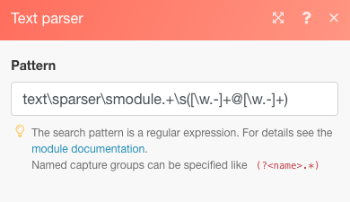
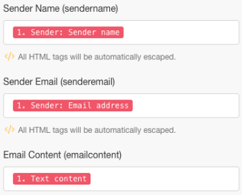
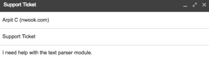

# [!DNL Adobe Workfront Fusion] 시나리오 예: 전자 메일 연결, [!UICONTROL 텍스트 파서], 및 [!DNL Google Sheets]

이 시나리오는 모든 이메일 메시지에 대한 로그를 만들고 스프레드시트에서 추가 작업을 위해 태깅하는 데 도움이 됩니다. 정규 표현식(Regex)을 검색 패턴으로 사용하여 스프레드시트에서 두 개의 별도 테이블의 이메일 본문을 캡처합니다. 첫 번째 패턴은 구문을 검색하고 두 번째 패턴은 동일한 구문과 이메일 주소를 검색합니다.

## 액세스 요구 사항

이 문서의 기능을 사용하려면 다음 액세스 권한이 있어야 합니다.

<table style="table-layout:auto"> 
 <col> 
 <col> 
 <tbody> 
  <tr> 
    <td role="rowheader">[!DNL Adobe Workfront] 플랜*</td> 
   <td> 
[!DNL Pro] 이상
 </td> 
  </tr> 
  <tr data-mc-conditions=""> 
   <td role="rowheader">[!DNL Adobe Workfront] 라이센스*</td> 
   <td> 
[!UICONTROL Plan], [!UICONTROL Work]
 </td> 
  </tr> 
  <tr> 
   <td role="rowheader">[!UICONTROL Adobe Workfront Fusion] 라이센스**</td> 
   <td> 
[!UICONTROL [!DNL Workfront Fusion] 작업 자동화 및 통합을 위한] 
  </td> 
  </tr> 
  <tr> 
   <td role="rowheader">제품</td> 
   <td>조직이 구매해야 합니다 [!DNL Adobe Workfront Fusion] 뿐만 아니라 [!DNL Adobe Workfront] 을 참조하십시오.</td> 
  </tr> 
 </tbody> 
</table>

어떤 계획, 라이센스 유형 또는 액세스 권한을 보유하고 있는지 확인하려면 [!DNL Workfront] 관리자

에 대한 자세한 정보 [!DNL Adobe Workfront Fusion] 라이센스 [[!DNL Adobe Workfront Fusion] 라이선스](../../workfront-fusion/get-started/license-automation-vs-integration.md).

## 전제 조건

이 자습서에서는 정규 표현식에 대한 기본 지식이 필요합니다. Regex에 대해 알아보려면 [https://regexone.com](https://regexone.com/).

첫 번째 모듈을 추가하고 구성합니다

1. 이메일을 검색하고 선택합니다. **[!UICONTROL 이메일 보기]** 을 트리거로 지정합니다.

   >[!NOTE]
   >
   >연결할 수 있는 동안 [!DNL Google] E를 사용한 계정메일 모듈에서는 [!DNL Gmail] 모듈.

1. 연결 [!DNL Google] 계정 또는 기타 IMAP 기반 전자 메일 클라이언트(예: [!DNL Outlook]).
1. 연결되면 볼 수신 전자 메일의 폴더(예: )를 선택합니다 [!UICONTROL 받은 편지함].
1. 아래 [!UICONTROL 기준], 선택 **[!UICONTROL 모든 이메일]** (또는 읽거나 읽지 않은 이메일로 범위를 좁힙니다.)

   가져온 이메일을 읽기 또는 읽지 않음으로 표시하도록 선택할 수도 있습니다.

1. 설정 [!UICONTROL 최대 결과 수] 1.

   

   수신한 메시지 양에 따라 변경할 수 있습니다. 그러나 낮은 값을 설정하고 시나리오를 더 자주 실행하는 것이 좋습니다.

1. 클릭 **[!UICONTROL 고급 설정 표시]** 아래에 있습니다.

   

1. 을(를) 통해 이메일 필터링 [!UICONTROL 보낸 사람 주소], [!UICONTROL 제목] 및 [!UICONTROL 구].

   따라서 관련 이메일만 볼 수 있습니다. 이 예제에서는 제목 필터만 추가하고 다른 2개를 비워둡니다.

   >[!NOTE]
   >
   >전자 메일에서 구문을 찾을 라우터를 추가하겠습니다. [!UICONTROL 일치 패턴] 반복기 및 정규 표현식(Regex)을 검색 패턴으로 사용할 수 있습니다. 이를 통해 다중 유틸리티 시나리오를 작성할 수도 있습니다.

1. 구성이 완료되면 전자 메일 보기를 시작할 위치를 지정하라는 메시지가 표시되면 을 클릭합니다. **[!DNL From now on]**.

   

1. 계속 [검색 대상 [!UICONTROL 흐름 제어] 그리고 [!UICONTROL 라우터]](#search-for-flow-control-and-add-a-router)

## 검색 대상 [!UICONTROL 흐름 제어] 그리고 [!UICONTROL 라우터]

1. 모듈 뒤에 라우터를 추가하여 데이터를 분할하거나 복제한 후에 다음 모듈로 보냅니다.

   여기에서는 [!UICONTROL 라우터] 전자 메일 본문 텍스트를 [!DNL Google Sheet].

   

## 를 사용하십시오 [!UICONTROL 텍스트 파서] 모듈

1. 추가 [!UICONTROL 일치 패턴] 변압기가 이메일에서 문구를 검색하도록 했습니다.

   &quot; 구문을 검색할 것입니다.[!UICONTROL 텍스트 파서 모듈]&quot;를 입력합니다.

   1. 패턴을 정규 표현식으로 씁니다.

      text\sparser\smodule

   1. (선택 사항) 다른 패턴 옵션을 사용합니다.

      

      텍스트에 여러 줄이 포함되어 있고 각 줄에서 패턴을 검색해야 하는 경우 여러 줄이 유용합니다. 이 자습서에서는 전체 이메일 본문 텍스트에서 패턴을 검색해야 하므로 이 패턴을 선택 취소하지 않습니다.

   1. 에서 [!UICONTROL 텍스트] 필드에서 속성을 클릭합니다. **텍스트 컨텐츠** 참조하십시오.

      

      패턴을 검색할 이메일 본문의 텍스트를 저장하는 속성입니다.

1. 다른 추가 [!UICONTROL 일치 패턴] 동일한 구문과 이메일 주소를 검색합니다.

   이 기능은 여러 사용자가 있는 고객 계정이 있는 경우에 특히 유용합니다. 시간을 절약하기 위해 [!UICONTROL 텍스트 파서] 방금 만든 모듈로 라우터에 연결합니다.

   

1. 패턴을 다음과 같이 편집합니다.

   텍스트\sparser\smodule+\s([\w-]+@[\w-]+)

   

   이 패턴은 &quot; 구문을 검색합니다.[!UICONTROL 텍스트 파서 모듈]&quot; 및 john.doe@gmail.com 같은 이메일 주소는 이메일 주소만 반환합니다.

   >[!NOTE]
   >
   >수락하는 이메일 주소의 사양에 따라 정규식을 작성하는 것이 중요하지만 위의 이메일은 대부분의 표준 이메일 주소를 처리합니다.

   * 이메일 주소만 검색하려는 경우 아래 regex를 사용할 수 있습니다.

      ([\w-]+@[\w-]+)

   * 아래 regex를 사용하여 전화 번호만 검색할 수도 있습니다.

      ^[+]?\(?(\d{1,3})\?[\s-]?\(?(\d{3})\?[\s-]?\d{3}[\s-]?\d{3,4} 위의 패턴은 전화 번호가 기록된 가장 일반적인 형식을 포함합니다.
   패턴을 테스트하려면 [[!DNL https://regex101.com]](https://regex101.com/) with [!DNL javascript] 향으로.

   나머지 구성은 이전의 구성과 동일하게 유지됩니다.

## 추가 [!DNL Google Sheets] 모듈

대상 [!DNL Sheets]먼저 필요한 헤더가 있는 스프레드시트를 만들어야 합니다.

1. 사용자 데이터를 캡처할 열이 있는 스프레드시트를 만듭니다. 기존 파일도 자유롭게 사용할 수 있습니다.

   예를 들어 &quot;이메일 데이터: 보낸 사람 이름, 보낸 사람 이메일 및 이메일 콘텐츠를 열로 사용하는 &quot;지원 티켓&quot;입니다. 다음 내용을 포함하는 워크시트의 이름을 &quot;에 지정합니다. 텍스트 파서 모듈입니다.&quot;

1. 추가 [!UICONTROL Google 시트] 모듈 **[!UICONTROL 행 추가]** 를 작업에 사용하십시오.

   

1. 연결 [!DNL Google] 계정(아직 작성하지 않은 경우) 이전에 만든 파일을 선택한 후 데이터를 캡처할 워크시트를 선택합니다.

   설정은 다음과 같습니다.

   

1. 관련 필드(열)의 속성을 매핑하여 모듈 설정을 완료합니다.

   

1. 방금 만든 모듈을 복제하고 두 번째 모듈에 연결합니다 [!UICONTROL 텍스트 파서] 모듈.

   1. 스프레드시트로 이동하여 이전에 만든 워크시트를 복제하고 이름을 지정합니다.

      예를 들어 다음 이름을 &quot;에 포함&quot;으로 지정합니다. 텍스트 파서 모듈 및 전자 메일&quot;

   1. 이메일 본문에 포함된 이메일 주소를 저장할 다른 열을 추가합니다.

      예를 들어 이름을 &quot;Email Address Shared&quot;로 지정합니다.

   1. 복제된 [!DNL Google Sheets] 모듈을 사용하여 설정을 구성합니다.
   1. 워크시트를 방금 생성한 새 워크시트로 변경합니다.
   1. 에서 출력을 매핑합니다. [!UICONTROL 일치 패턴] 모듈($1)을 추가하여 전자 메일 주소(공유 전자 메일 주소)를 저장할 열에 추가합니다.

      

      

   1. 클릭 **[!UICONTROL 확인]**&#x200B;를 눌러 시나리오를 저장하고 테스트 실행을 위해 이 시나리오를 가져옵니다.

      다음과 같이 연결된 이메일 주소로 두 개의 별도의 이메일을 보내야 합니다.

      * &quot; &quot; 구문을 포함합니다.[!UICONTROL 텍스트 파서 모듈]&quot;(및 이메일 주소 없음)

         

      * 위의 구문 및 이메일 주소 포함

         

         설정에 오류가 없으면 첫 번째 워크시트에서 &quot; &quot; 구문을 포함하는 모든 이메일을 캡처합니다.[!UICONTROL 텍스트 파서 모듈]&quot; 반면에 두 번째 워크시트는 &quot; &quot; 구문을 포함하는 항목만 캡처합니다.[!UICONTROL 텍스트 파서 모듈]&quot; 및 이메일 주소입니다. 아래 스크린샷을 참조할 수 있습니다.

         워크시트 1:

         

         워크시트 2:

         

## 리소스

* [자유 운동](https://regexone.com/) 정규 표현식에 대해 알아보기
* [전화 번호 일치에 대해 알아보기](https://regexone.com/problem/matching_phone_numbers) Regex 사용
* [이메일 일치에 대해 알아보기](https://regexone.com/problem/matching_emails) Regex 사용
* [정규 표현식 테스트](https://regex101.com/)
