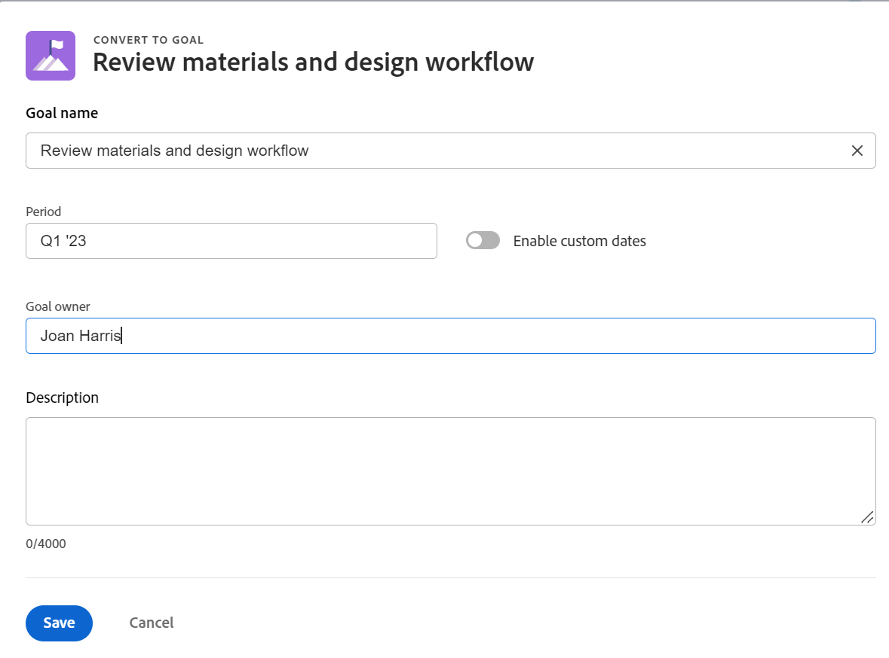

# 결과 및 활동을 목표로 변환하여 목표 정렬

두 목표를 수동으로 정렬하거나 기존 목표의 결과와 활동을 다른 목표로 변환할 수 있습니다. 전환된 결과나 활동이 원래 목표의 하위 목표가 됩니다.
두 목표를 수동으로 정렬하는 방법에 대한 자세한 내용은 [Adobe Workfront 목표에서 연결하여 목표 정렬](../../workfront-goals/goal-alignment/align-goals-by-connecting-them.md)을 참조하십시오.

## 액세스 요구 사항

<table style="table-layout:auto">
<col>
</col>
<col>
</col>
<tbody>
 <tr>
 <td role="rowheader">Adobe Workfront 플랜</td>
 <td>
 
임의

</td>
 </tr>
 <tr>
 <td role="rowheader">Adobe Workfront 라이센스*</td>
 <td>
 
새 라이선스: 기여자 이상

 또는
 
현재 라이선스: 요청 이상
 
자세한 내용은 <a href="../../administration-and-setup/add-users/access-levels-and-object-permissions/wf-licenses.md" class="MCXref xref">Adobe Workfront 라이선스 개요</a>를 참조하십시오.
 </td>
 </tr>
 <tr>
 <td role="rowheader">제품*</td>
 <td>
 
 다음 중 하나인 새 제품 요구 사항: 

<ul>
<li>Select 또는 Prime Adobe Workfront 플랜 및 추가 Adobe Workfront Goals 라이선스.</li>
<li>기본적으로 Workfront 목표를 포함하는 Ultimate Workfront 계획입니다. </li></ul>
 
또는

 
현재 제품 요구 사항: Workfront 플랜 및 Adobe Workfront 목표에 대한 추가 라이선스. 
 
자세한 내용은 <a href="../../workfront-goals/goal-management/access-needed-for-wf-goals.md" class="MCXref xref">Workfront 목표를 사용하기 위한 요구 사항</a>을 참조하십시오. 
 </td>
 </tr>
 <tr>
 <td role="rowheader">액세스 수준</td>
 <td> 
목표에 대한 액세스 편집
 </td>
 </tr>
 <tr data-mc-conditions="">
 <td role="rowheader">개체 권한</td>
 <td>
  

  
목표에 대한 또는 그 이상의 권한에 대한 보기

  
편집할 목표에 대한 권한 관리

  
목표 공유에 대한 자세한 내용은 <a href="../../workfront-goals/workfront-goals-settings/share-a-goal.md" class="MCXref xref">Workfront 목표에서 목표 공유</a>를 참조하십시오. 

  
 </td>
 </tr>
<tr>
   <td role="rowheader">
레이아웃 템플릿
</td>
   <td> 
Workfront 관리자를 포함한 모든 사용자에게 메인 메뉴의 목표 영역을 포함하는 레이아웃 템플릿을 할당해야 합니다. 
  
</td>
  </tr>
</tbody>
</table>

*자세한 내용은 [Workfront 설명서의 액세스 요구 사항](/help/quicksilver/administration-and-setup/add-users/access-levels-and-object-permissions/access-level-requirements-in-documentation.md)을 참조하십시오.

## 전제 조건

시작하려면 먼저 다음 항목이 있어야 합니다.

* 기존 결과 및 활동이 있는 기존 목표입니다.

  목표 만들기에 대한 자세한 내용은 [Adobe Workfront 목표에서 목표 만들기](../../workfront-goals/goal-management/create-goals.md)를 참조하십시오.

>[!IMPORTANT]
>
>목표는 최대 1000개의 진행 표시기를 가질 수 있습니다.

<!--drafted for goal redesign: At PRODUCTION: update the sentence above to remove Production/ Preview references-->

## 결과 및 활동을 목표로 전환할 때 고려 사항

때로는 결과나 활동이 예상보다 큰 범위를 가질 수 있으며 목표가 되는 것이 더 합리적일 수 있습니다. 기존 목표의 결과 및 활동을 새 목표로 전환할 수 있습니다. 목표를 정렬하기 위한 상향식 접근 방식입니다.

결과 및 활동을 목표로 전환할 때 다음 사항을 고려하십시오.

* 전환된 결과 또는 활동은 원래 목표의 하위 목표가 되고 두 목표가 정렬됩니다.
* 새로 만들어진 목표는 원래 목표에 대한 추가 결과 또는 활동이 없는 경우 원래 목표에 대한 단일 진행률 표시기가 됩니다. 진행 상황을 추적하려면 하위 목표에 결과 및 활동을 추가해야 합니다.
* 결과 또는 활동을 목표로 전환하는 작업은 취소할 수 없습니다. 전환한 후에는 새 하위 목표가 다시 상위 목표의 결과 또는 활동이 될 수 없습니다.

## 결과 또는 활동을 목표로 전환

<!--
Converting results and activities differs depending on what environment you use. 

### Convert a result or activity to a goal in the Production environment

1. Go to a goal that has a result or an activity that you want to convert to a goal.
1. Click the name of the goal to open the **Goal Details** panel.
1. Expand the **Results** or **Activities** right-pointing arrows to see a list of results or activities for the goal. 

1. Click the **gear icon**  to the right of the result or activity name that you want to convert, then click **Convert into a Goal**.

   

1. (Optional) Remove the name of the original activity or result owner from the **Goal Owner** field and replace it with another user, team, group, or your organization's name. By default, Workfront selects the owner of the result or the activity as the goal owner. 
1. Click **Convert**. The activity or result displays as an aligned goal in the Goal Details panel of the original goal and the original activity or result is removed from the original goal and transferred to the second goal. By default, the new goal has the same name as the original converted result or activity. 
1. (Optional) Click the name of the new goal to open the **Goal Details** panel and edit the name of the goal. For information about editing any information for an existing goal, see [Edit goals in Adobe Workfront Goals](../../workfront-goals/goal-management/edit-goals.md).
-->

1. 목표로 전환할 결과 또는 활동이 있는 목표로 이동합니다.
1. 목표의 페이지에서 왼쪽 패널의 **진행률 표시기**&#x200B;를 클릭합니다.
1. 진행 표시기 목록에서 결과나 활동을 선택한 다음 진행 표시기 목록 맨 위에 있는 **목표로 전환** 아이콘 을 클릭합니다. 목표로 변환 상자가 열립니다.

   
1. 다음 정보를 업데이트합니다.
   * **목표 이름**: 기본적으로 새 목표의 이름은 원래 결과 또는 활동과 동일합니다.
   * **기간**: 기본적으로 새 목표의 기간은 현재 분기입니다. **사용자 지정 날짜 사용** 설정을 선택하여 새 목표에 대한 사용자 지정 기간을 정의할 수 있습니다.
   * **목표 소유자**: 기본적으로 새 목표 소유자는 원래 결과 또는 활동의 소유자입니다.
   * **설명**: 새 목표에 대한 정보를 더 추가합니다.
1. **저장** 클릭

   이제 결과 또는 활동이 원래 목표의 하위 목표로 전환됩니다. 원래 목표의 진행 표시기 목록에 목표로 나열됩니다.

