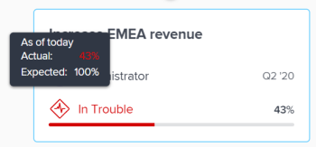

# Adobe Workfront 목표의 목표 정렬 섹션으로 이동합니다

목표 정렬 섹션을 사용하여 순서도의 전체 조직에 대한 목표 정렬의 전체적인 보기를 표시합니다. 정렬된 목표는 계층 트리에서 상호 연결하는 카드에 표시됩니다.

목표 정렬 및 목표 달성 방법에 대한 자세한 내용은 다음 문서를 참조하십시오.

* [Adobe Workfront 목표의 목표 정렬 개요](../../workfront-goals/goal-alignment/goal-alignment-overview.md)
* [Adobe Workfront 목표에 연결하여 목표 정렬](../../workfront-goals/goal-alignment/align-goals-by-connecting-them.md)

## 액세스 요구 사항

<!-- drafted for P&P release: 

You must have the following to perform the activities described in this article:

<table style="table-layout:auto">
 <col>
 </col>
 <col>
 </col>
 <tbody>
  <tr>
   <td role="rowheader">Adobe Workfront plan*</td>
   <td>
   
Current plan: Select or higher

   Or
   
Legacy plan: Pro or higher

   
   </td>
  </tr>
  <tr>
   <td role="rowheader">Adobe Workfront license*</td>
   <td>
   
Current license: Contributor or higher

   Or
   
Legacy license: Request or higher
 
For more information, see <a href="../../administration-and-setup/add-users/access-levels-and-object-permissions/wf-licenses.md" class="MCXref xref">Adobe Workfront licenses overview</a>.
 </td>
  </tr>
  <tr>
   <td role="rowheader">Product</td>
   <td>
   
 Current product requirement: If you have the Select or Prime Adobe Workfront plan, you must also buy an additional Adobe Workfront Goals license.  Workfront Goals are included in the Ultimate Workfront Plan.

   Or
   
Legacy product requirement: You must purchase an additional license for the Adobe Workfront Goals to access functionality described in this article. 
 
For information, see <a href="../../workfront-goals/goal-management/access-needed-for-wf-goals.md" class="MCXref xref">Requirements to use Workfront Goals</a>. 
 </td>
  </tr>
  <tr>
   <td role="rowheader">Access level*</td>
   <td> 
Edit access to Goals
 
<b>NOTE</b>
If you still don't have access, ask your Workfront administrator if they set additional restrictions in your access level. For information on how a Workfront administrator can change your access level, see:

     <ul>
      <li> 
<a href="../../administration-and-setup/add-users/configure-and-grant-access/create-modify-access-levels.md" class="MCXref xref">Create or modify custom access levels</a> 
 </li>
      <li> 
<a href="../../administration-and-setup/add-users/configure-and-grant-access/grant-access-goals.md" class="MCXref xref">Grant access to Adobe Workfront Goals</a> 
 </li>
     </ul> 
 </td>
  </tr>
  <tr data-mc-conditions="">
   <td role="rowheader">Object permissions</td>
   <td>
    

     
View or higher permissions to the goal to view it

     
Manage permissions to the goal to edit it

     
For information about sharing goals, see <a href="../../workfront-goals/workfront-goals-settings/share-a-goal.md" class="MCXref xref">Share a goal in Workfront Goals</a>. 

    
 </td>
  </tr>
 </tbody>
</table>

-->

이 문서에 설명된 활동을 수행하려면 다음 사항이 있어야 합니다.

<table style="table-layout:auto"> 
 <col> 
 <col> 
 <tbody> 
  <tr> 
   <td role="rowheader">Adobe Workfront 플랜*</td> 
   <td> 
Pro 이상
 </td> 
  </tr> 
  <tr> 
   <td role="rowheader">Adobe Workfrontlicense*</td> 
   <td> 
요청 이상
 
자세한 내용은 <a href="../../administration-and-setup/add-users/access-levels-and-object-permissions/wf-licenses.md" class="MCXref xref">Adobe Workfront 라이선스 개요</a>.
 </td> 
  </tr> 
  <tr> 
   <td role="rowheader">제품</td> 
   <td> 
이 문서에 설명된 기능에 액세스하려면 Adobe Workfront 목표에 대한 추가 라이센스를 구매해야 합니다. 
 
자세한 내용은 <a href="../../workfront-goals/goal-management/access-needed-for-wf-goals.md" class="MCXref xref">Workfront 목표 사용 요구 사항</a>. 
 </td> 
  </tr> 
  <tr> 
   <td role="rowheader">액세스 수준*</td> 
   <td> 
목표에 대한 액세스 편집
 
<b>메모</b>
여전히 액세스 권한이 없는 경우 Workfront 관리자에게 액세스 수준에서 추가 제한 사항을 설정하는지 문의하십시오. Workfront 관리자가 액세스 수준을 변경하는 방법에 대한 자세한 내용은 다음을 참조하십시오.
 
     <ul> 
      <li> 
<a href="../../administration-and-setup/add-users/configure-and-grant-access/create-modify-access-levels.md" class="MCXref xref">사용자 정의 액세스 수준 만들기 또는 수정</a> 
 </li> 
      <li> 
<a href="../../administration-and-setup/add-users/configure-and-grant-access/grant-access-goals.md" class="MCXref xref">Adobe Workfront 목표에 대한 액세스 권한 부여</a> 
 </li> 
     </ul> 
 </td> 
  </tr> 
  <tr data-mc-conditions=""> 
   <td role="rowheader">개체 권한</td> 
   <td> 
    
 
     
목표에 대한 권한 보기 이상
 
     
목표 공유에 대한 자세한 내용은 <a href="../../workfront-goals/workfront-goals-settings/share-a-goal.md" class="MCXref xref">Workfront 목표에서 목표 공유</a>. 
 
    
 </td> 
  </tr> 
 </tbody> 
</table>

*보유하고 있는 플랜, 라이선스 유형 또는 액세스를 알아보려면 Workfront 관리자에게 문의하십시오.

## 전제 조건

시작하려면 먼저 다음을 수행해야 합니다.

* 기본 메뉴의 목표 영역을 포함하는 레이아웃 템플릿.

## 목표 정렬 섹션으로 이동합니다

1. 을(를) 클릭합니다. **기본 메뉴** 아이콘  화면의 오른쪽 상단 모서리에서 을(를) 클릭하고 **목표**.

   <!-- Add this when Shell is available to all: or (if available), click the **Main Menu** icon  in the upper-left corner)
   -->
1. 클릭 **목표 정렬** 왼쪽 패널에 표시됩니다.
1. 정렬 차트의 오른쪽 위 모서리에 있는 필터를 사용하여 중요한 목표만 선택합니다. Workfront 목표에서 필터 사용에 대한 자세한 내용은 [Adobe Workfront 목표에서 정보 필터링](../../workfront-goals/goal-management/filter-information-wf-goals.md).

   필터와 일치하는 목표는 카드의 정렬 차트에 표시됩니다.

   다음 정보가 목표 카드에 표시됩니다.

   <table style="table-layout:auto"> 
    <col> 
    <col> 
    <tbody> 
     <tr> 
      <td role="rowheader">기간 날짜 </td> 
      <td> 
목표가 열려 있는 기간입니다. 목표는 기간의 종료 날짜까지 달성되어야 합니다. Workfront 목표는 목표에 대한 기간 및 현재 날짜를 기준으로 목표 진행 상황을 계산합니다.
 </td> 
     </tr> 
     <tr> 
      <td role="rowheader">진행 표시기</td> 
      <td>목표에 대한 진행 상태 표시기의 수입니다. 진행 상태 표시기는 목표, 결과 또는 활동을 정렬할 수 있습니다. </td> 
     </tr> 
     <tr> 
      <td role="rowheader">소유자 이름</td> 
      <td>목표 소유자로 지정된 사용자, 팀, 그룹 또는 조직의 이름입니다. </td> 
     </tr> 
     <tr> 
      <td role="rowheader">목표 이름</td> 
      <td>목표의 이름입니다. </td> 
     </tr> 
     <tr> 
      <td role="rowheader">목표 진행률 표시줄 및 진행률</td> 
      <td> 
목표 진행 상태는 현재 목표 중 어느 것이 달성되었는지를 나타냅니다. 목표 기간 시작 이후 경과된 시간을 기반으로 목표에 대한 모든 정렬된 목표, 결과 및 활동의 진행 평균을 자동으로 계산하는 계산입니다. 목표에 대한 진행 상황 계산에 대한 자세한 내용은 <a href="../../workfront-goals/goal-management/calculate-goal-progress.md" class="MCXref xref">Adobe Workfront 목표의 목표 진행 및 조건 개요</a>. 
 
       
 
        
현재 날짜별 목표의 실제 진행 상태입니다. 다음 진행 값 및 색상은 목표가 제시간에 달성될 가능성이 얼마나 큰지를 나타냅니다. 
 
        <ul> 
         <li>Target 시 (녹색 표시기): 목표는 제시간에 맞춰서 정시에 달성될 것이다.</li> 
         <li> 위험 (노란색 표시기): 목표가 뒤로 실행되며 제 시간에 달성되지 않을 수 있습니다.</li> 
         <li> 문제 발생 (빨간색 표시기): 그 목표는 제 시간에 달성되지 못할 위험이 있다. </li> 
        </ul> 
       
 </td> 
     </tr> <!--
      <tr data-mc-conditions="QuicksilverOrClassic.Draft mode"> 
       <td role="rowheader">Updated on date </td> 
       <td> 
The date when the goal was last updated
 
(NOTE: drafted because I think this was removed with the alignment chart redesign - 21.1) 
 </td> 
      </tr>
     --> 
     <tr> 
      <td role="rowheader">상태</td> 
      <td>모든 상태의 목표는 목표 정렬 섹션에 표시됩니다. </td> 
     </tr> 
    </tbody> 
   </table>

   다른 목표에 정렬된 목표에는 목표 카드 아래에 정렬된 목표 수가 표시됩니다.

   

1. 을(를) 클릭합니다. **아래쪽 방향 화살표** 아이콘을 클릭하여 하위 목표를 더 확장하고 볼 수 있습니다.

   

   >[!TIP]
   >
   >1차 하위 구성요소 목표를 정렬한 목표는 각각의 카드 아래에 정렬된 목표 수를 표시합니다.

1. (조건부) 현재 필터가 정렬에 참여하는 목표 중 일부를 제외하는 경우 일부 목표가 표시되지 않음을 나타내는 경고 메시지가 표시됩니다.

   

1. 클릭 **표시** : 필터에 의해 현재 제거된 목표를 표시합니다.

   정렬 차트에서 다음 변경 사항을 확인합니다.

   * 필터를 통해 이전에 제거한 연결된 목표가 이제 정렬 차트에 표시됩니다.
   * 오른쪽 위 모서리에 있는 필터는 현재 적용되지 않았음을 나타내는 노란색으로 윤곽이 표시되어 있습니다.

      

      필터 이름 왼쪽에 필터 다시 적용 링크가 표시됩니다.

1. (선택 사항) **필터 다시 적용** 원래 결과로 돌아가 목표 계층을 표시하려면 다음을 수행하십시오.
1. (선택 사항) 진행 표시기를 마우스로 가리키면 현재 목표 진행 상황을 이해할 수 있습니다.

   

   다음 정보가 표시됩니다.

   <table style="table-layout:auto"> 
    <col> 
    <col> 
    <tbody> 
     <tr> 
      <td role="rowheader">오늘 기준</td> 
      <td>진행 상태는 항상 최신 상태입니다. </td> 
     </tr> 
     <tr> 
      <td role="rowheader">실제 </td> 
      <td>목표의 모든 진행률 지표를 고려하여 계산된 현재 날짜별 목표의 실제 진행 상태(백분율)입니다. 목표 진행 지표 는 정렬된 목표, 활동 및 결과입니다. </td> 
     </tr> 
     <tr> 
      <td role="rowheader">예상</td> 
      <td> 
목표를 제시간에 달성할 것으로 가정할 경우 현재 날짜까지의 목표 예상 진행률(백분율)입니다.
 </td> 
     </tr> 
    </tbody> 
   </table>

1. 목표 카드를 클릭하여 목표 페이지를 엽니다. 기존 목표 편집에 대한 자세한 내용은 [Adobe Workfront 목표에서 목표 편집](../../workfront-goals/goal-management/edit-goals.md). 목표 진행 상태 업데이트에 대한 자세한 내용은 [Adobe Workfront 목표에서 목표 진행 상태 업데이트](../../workfront-goals/goal-review-and-workfront-goals-sections/check-in-goals.md).

1. 현재 수준 목표의 위쪽 방향 화살표를 클릭하여 차트 계층 구조의 이전 수준으로 돌아갑니다.

   또는

   (선택 사항) **종료 목표 계층** 를 입력하여 현재 필터와 일치하는 모든 목표에 대한 카드를 표시할 수 있습니다.

