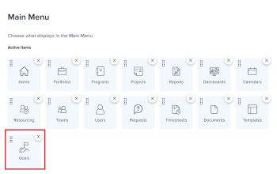

# Workfront 목표 사용 요구 사항

Adobe Workfront 목표에 액세스하려면 Adobe Workfront 관리자가 다음 조건을 모두 충족하는지 확인해야 합니다.

<!--drafted for P&P - replace the first bullet with this one when licensing changes: 
* Your company must purchase the correct Adobe Worfront plan or Adobe Workfront Goal license. For information, see the section [Obtain Workfront Goals organization access](#obtain-workfront-goals-organization-access)in this article.-->

* 조직은 Workfront 목표에 대한 올바른 라이선스를 구입해야 합니다. 자세한 내용은 이 문서의 [Workfront 목표 조직 액세스 권한 얻기](#obtain-workfront-goals-organization-access) 섹션을 참조하십시오.

* 올바른 유형의 Workfront 라이선스를 할당하십시오. 라이선스 유형 및 액세스 수준 할당에 대한 자세한 내용은 이 문서의 [라이선스 유형 및 액세스 수준 설정 업데이트](#update-license-types-and-access-level-settings) 섹션을 참조하십시오.

>[!NOTE]
>
>외부 라이선스 유형의 사용자는 Workfront 목표에 액세스할 수 없습니다.

* 액세스 수준의 목표에 대한 액세스 권한을 부여합니다. 자세한 내용은 [Adobe Workfront 목표에 대한 액세스 권한 부여](../../administration-and-setup/add-users/configure-and-grant-access/grant-access-goals.md)를 참조하십시오.

* 메인 메뉴에 목표 영역을 포함하는 레이아웃 템플릿을 지정합니다.

  >[!NOTE]
  >
  >Workfront 관리자를 포함한 모든 사용자에게 메인 메뉴의 목표 영역을 포함하는 레이아웃 템플릿을 할당해야 합니다.

  자세한 내용은 이 문서의 [레이아웃 템플릿에 Workfront 목표 추가](#add-workfront-goals-to-a-layout-template) 섹션을 참조하십시오.

* 직접 작성하지 않은 목표를 수정해야 하는 경우 목표 작성자는 목표를 사용자와 공유하고 해당 목표에 대한 관리 권한을 부여해야 합니다.

  자세한 내용은 이 문서의 [다른 사용자와 개별 목표 공유](#share-individual-goals-with-other-users) 섹션을 참조하십시오.

## Workfront 목표 조직 액세스 권한 얻기 {#obtain-workfront-goals-organization-access}

귀사가 현재 계획 중인 Workfront에 따라 다음과 같은 시나리오가 존재합니다.

* 회사에 새로운 Workfront 플랜이 있는 경우 Ultimate Workfront 플랜이 있어야 합니다. Workfront 목표는 이 계획에만 포함됩니다.

* 회사에 현재 Workfront 플랜이 있는 경우, 조직은 사용자가 Workfront 목표에 액세스할 수 있도록 Workfront 라이선스 외에 추가 라이선스를 구입해야 합니다.

  조직에서 추가 라이선스를 구매하면 Workfront에서 계정에 대해 Workfront 목표를 활성화합니다. Workfront Goals에 대한 라이선스 구매에 대한 자세한 내용은 Workfront 계정 관리자에게 문의하십시오.

Workfront 액세스 요구 사항에 대한 자세한 내용은 Workfront 설명서의 [액세스 요구 사항](/help/quicksilver/administration-and-setup/add-users/access-levels-and-object-permissions/access-level-requirements-in-documentation.md)을 참조하십시오.

## 라이선스 유형 및 액세스 수준 설정 업데이트  {#update-license-types-and-access-level-settings}

귀사가 현재 계획 중인 Workfront에 따라 다음과 같은 시나리오가 존재합니다.

* 회사에 새로운 액세스 수준 모델이 있는 경우 Workfront 관리자는 Workfront 목표에 액세스하려면 다음 Workfront 라이선스 유형 중 하나를 부여해야 합니다.

   * 기여자
   * 라이트
   * 표준

* 회사에 현재 액세스 수준 모델이 있는 경우 Workfront 관리자는 Workfront 목표에 액세스하려면 다음 Workfront 라이선스 유형 중 하나를 부여해야 합니다.

   * 플랜
   * 작업
   * 검토
   * 요청

Workfront 관리자가 이러한 라이선스 유형 중 하나를 부여하면 액세스 수준에서 목표에 대한 액세스 권한도 부여해야 합니다. 목표에 액세스하는 방법에 대한 자세한 내용은 [Adobe Workfront 목표에 대한 액세스 권한 부여](../../administration-and-setup/add-users/configure-and-grant-access/grant-access-goals.md)를 참조하십시오.

Workfront 관리자는 시스템에 있는 Workfront Goals 라이선스 수를 검토하고 현재 활성화된 라이선스 수를 파악할 수 있습니다. 자세한 내용은 [시스템에서 사용 가능한 라이선스 관리](../../administration-and-setup/get-started-wf-administration/manage-available-licenses-in-your-system.md)를 참조하십시오.

>[!NOTE]
>
>Workfront을 사용하면 구입한 더 많은 Workfront Goals 라이선스를 할당할 수 있습니다. 그러나 Workfront 목표 계약에서 허용하는 것보다 더 많은 라이선스를 할당하면 Workfront 계정 관리자가 연락하여 계약 번호를 초과했음을 알려 줍니다.

## 레이아웃 템플릿에 Workfront 목표 추가 {#add-workfront-goals-to-a-layout-template}

Workfront 또는 그룹 관리자는 사용자가 Workfront 목표에 액세스할 수 있도록 메인 메뉴의 목표 영역을 포함하는 레이아웃 템플릿을 할당해야 합니다.

Workfront 관리자 또는 그룹 관리자는 사용자가 Workfront 목표에 쉽게 액세스할 수 있도록 레이아웃 템플릿에 다음을 추가할 수도 있습니다.

* 고정된 탭
* 목표 영역을 랜딩 페이지로 설정

레이아웃 템플릿 업데이트에 대한 자세한 내용은 다음 문서를 참조하십시오.

* [레이아웃 템플릿 만들기 및 관리](../../administration-and-setup/customize-workfront/use-layout-templates/create-and-manage-layout-templates.md)
* [레이아웃 템플릿을 사용하여 기본 메뉴 사용자 지정](../../administration-and-setup/customize-workfront/use-layout-templates/customize-main-menu.md)
* [레이아웃 템플릿을 사용하여 고정된 페이지 사용자 지정](../../administration-and-setup/customize-workfront/use-layout-templates/customize-pinned-pages.md)
* [레이아웃 템플릿을 사용하여 랜딩 페이지 사용자 지정](../../administration-and-setup/customize-workfront/use-layout-templates/customize-landing-page.md)
* [레이아웃 템플릿에 사용자 할당](../../administration-and-setup/customize-workfront/use-layout-templates/assign-users-to-layout-template.md)

## 다른 사용자와 개별 목표 공유 {#share-individual-goals-with-other-users}

기본적으로 자신의 액세스 수준에 있는 목표 보기 액세스 권한 이상이 있는 모든 사용자는 Workfront에서 모든 목표를 볼 수 있습니다.

목표에 대한 편집 액세스 권한이 있는 모든 사용자는 목표를 만들 수 있으며, 자신이 만든 목표에 대한 관리 액세스 권한을 자동으로 가져옵니다. 다른 사용자의 목표를 편집해야 하는 경우 해당 목표에 대한 관리 권한이 있는 사용자가 작성하지 않은 목표를 공유해야 합니다.

사용자와 목표를 공유하고 사용자에게 관리 권한을 부여하는 방법에 대한 자세한 내용은 [Workfront 목표에서 목표 공유](../../workfront-goals/workfront-goals-settings/share-a-goal.md)를 참조하십시오.
