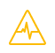

# Adobe Workfront 목표의 목표 진행 및 상태 개요

<!--Audited for P&P only: 4/2025-->

>[!IMPORTANT]
>
>이 문서에 설명된 기능을 사용하려면 조직에 다음 사항이 있어야 합니다.
>
>
>* 새 플랜 및 라이선스 구조의 경우:
>
>   * Ultimate 플랜
>    
>* 현재 플랜 및 라이선스 구조의 경우:
>
>   * Pro 이상
>   * Workfront 라이선스 외에 Adobe Workfront Goals 라이선스.
>
> Workfront Goals 라이선스에 대한 자세한 내용은 Workfront 계정 관리자에게 문의하십시오.
>
>Workfront 목표에 액세스하는 방법에 대한 자세한 내용은 [Workfront 목표 사용 요구 사항](../../workfront-goals/goal-management/access-needed-for-wf-goals.md)을 참조하십시오.

Adobe Workfront은 진행 표시기의 진행 상황을 기반으로 목표 진행 상황을 자동으로 계산합니다.

## 목표 진행 상황 및 임계값 개요

목표를 활성화하면 Workfront 목표가 진행 및 조건 계산을 시작하고 진행 필드 위로 마우스를 가져가면 다음 표시기가 표시됩니다.

| 지표 | 표시기 설명 |
|---|---|
| 실제 완료율 | 지금까지 얼마나 많은 목표가 실제로 완성됐는가. Workfront 목표는 목표와 연결된 모든 진행 표시기의 완료율을 평균하여 이 값을 계산합니다. |
| 예상 완료율 | 목표가 제시간에 완성되려면 지금까지 어느 정도의 목표를 달성해야 하는가. Workfront 목표 는 목표의 지속 기간과 현재 시간을 확인하여 이 값을 계산합니다. 정시에 완료되어야 하는 경우 목표에는 현재 시간에 이 값을 표시해야 합니다. |
| 진행 | 목표가 정시에 완료되는 목표인지 또는 완료될 위험이 있거나 완료되지 않는 문제가 있는지 여부를 나타내는 레이블입니다. |


<!--drafted for the redesign: replace the screen shot above with the redesigned one which is white, not black-->

* [실제 완료율](#actual-percent-complete)
* [예상 완료율](#expected-percent-complete)
* [진행 상황 및 조건](#progress)

### 실제 완료율 {#actual-percent-complete}

Workfront 목표는 목표 진행 표시기의 완료율 평균을 기반으로 목표의 실제 완료율을 자동으로 계산합니다.

다음 항목은 목표에 대한 진행 지표로 간주됩니다.

* 결과

  목표에 결과를 추가하는 방법에 대한 자세한 내용은 [Adobe Workfront 목표의 목표에 결과 추가](../../workfront-goals/results-and-activities/add-results-to-goals.md)를 참조하십시오.

* 활동

  목표에 프로젝트를 포함한 활동을 추가하는 방법에 대한 자세한 내용은 [Adobe Workfront 목표의 목표에 활동 추가](../../workfront-goals/results-and-activities/add-activities-to-goals.md)를 참조하십시오.

* 정렬된 하위 목표

  상위 및 하위 목표에 대한 자세한 내용은 [Adobe Workfront 목표에서 연결하여 목표 정렬](../../workfront-goals/goal-alignment/align-goals-by-connecting-them.md)을 참조하십시오.

  Workfront 목표는 다음 공식을 사용하여 실제 완료율을 계산합니다.

  ```
  Actual percent complete of goal = SUM(Percent complete of goal progress indicators)* 100 / Number of progress indicators
  ```

  예를 들어, 목표에 20% 완료된 결과, 30% 완료된 수동 진행률 표시줄, 10% 완료된 프로젝트 및 40% 완료된 하위 목표가 있는 경우 목표 완료율은 25%입니다.

### 예상 완료율 {#expected-percent-complete}

Workfront 목표는 목표 기간(일 수)과 목표 시작일 이후 경과된 일 수의 합계를 기반으로 목표의 예상 완료율을 자동으로 계산합니다.

Workfront 목표는 다음 공식을 사용하여 예상 완료율을 계산합니다.

```
Expected percent complete of goal = Number of days since the goal start date * 100/ Number of days in the goal duration
```

예를 들어 목표가 90일 후에 완료되어야 하고 오늘이 해당 기간의 45일이 되는 경우 예상 완료율은 50%입니다.

### 진행 상황 및 조건 {#progress}

Workfront 목표 는 현재 시점에 달성된 예상 완료율의 백분율을 기준으로 진행률 백분율을 계산하고 목표에 진행률 레이블을 지정합니다. 목표 완료율 표시줄의 색상이 목표의 진행률을 나타내도록 변경됩니다.

따라서 목표의 상태도 업데이트되어 목표가 제 시간에 완료하기 위한 목표에 도달했는지 또는 목표에 도달하지 못했는지를 나타냅니다.

Workfront 목표는 다음 공식을 사용하여 목표의 진행 백분율을 계산합니다.

```
Goal progress percentage = Actual percent complete * 100 / Expected percent complete
```

예를 들어 현재 시간의 예상 완료율이 53%이고 실제 완료율이 30%인 경우 목표 진행률 완료율은 56%입니다. Workfront 목표 는 &quot;문제 발생&quot; 상태로 이 목표에 레이블을 지정합니다.

다음 차트는 조건 레이블과 진행률 간의 관계를 보여 줍니다.


아래 표에는 목표 조건 레이블과 각 레이블과 연관된 목표 진행률 백분율이 나열되어 있습니다.

>[!TIP]
>
>목표 조건 레이블이 Workfront 프로젝트 조건 이름 및 색상과 일치합니다.

<table style="table-layout:auto"> 
 <col> 
 <col> 
 <col> 
 <col> 
 <tbody> 
  <tr> 
   <td><b>목표 진행률 이름</b></td> 
   <td><b>목표 진행률 정의</b></td> 
   <td><b>목표 진행률</b></td> 
   <td><b>완료율 막대 색상</b></td> 
   <td><b>조건 표시기 아이콘</b></td> 
  </tr> 
  <tr> 
   <td>신규</td> 
   <td> <p>목표가 새로 만들어져서 아직 진행률을 기록하지 못하고 있습니다. 목표 진행률은 누군가가 진행률을 처음으로 업데이트할 때까지 새로 고침으로 표시됩니다. </p> <p>목표 진행률 업데이트에 대한 자세한 내용은 <a href="../../workfront-goals/goal-review-and-workfront-goals-sections/check-in-goals.md" class="MCXref xref">Adobe Workfront 목표의 목표 진행률 업데이트</a>를 참조하십시오.</p> </td> 
   <td>백분율 없음</td> 
   <td>막대 없음</td> 
   <td></td>
  </tr> 
  <tr> 
   <td> <p><span>대상</span> </p> </td> 
   <td>목표는 예상대로 수행하고 있으며 제시간에 완료될 가능성이 크다. </td> 
   <td>90-100%</td> 
   <td>녹색</td> 
    <td></td>
  </tr> 
  <tr> 
   <td> <p><span>위험 상태</span> </p> </td> 
   <td>목표는 늦지만 그래도 제때 완성하는 것은 가능할 것 같다. </td> 
   <td>70-89.99%</td> 
   <td>노란색</td>
   <td></td> 
  </tr> 
  <tr> 
   <td> <p><span>문제 발생</span> </p> </td> 
   <td> <p>그 목표가 제때 완성되지 못할 가능성이 크다. </p> </td> 
   <td>0-69.99%</td> 
   <td>빨간색</td> 
   <td></td> 
  </tr> 
 </tbody> 
</table>
