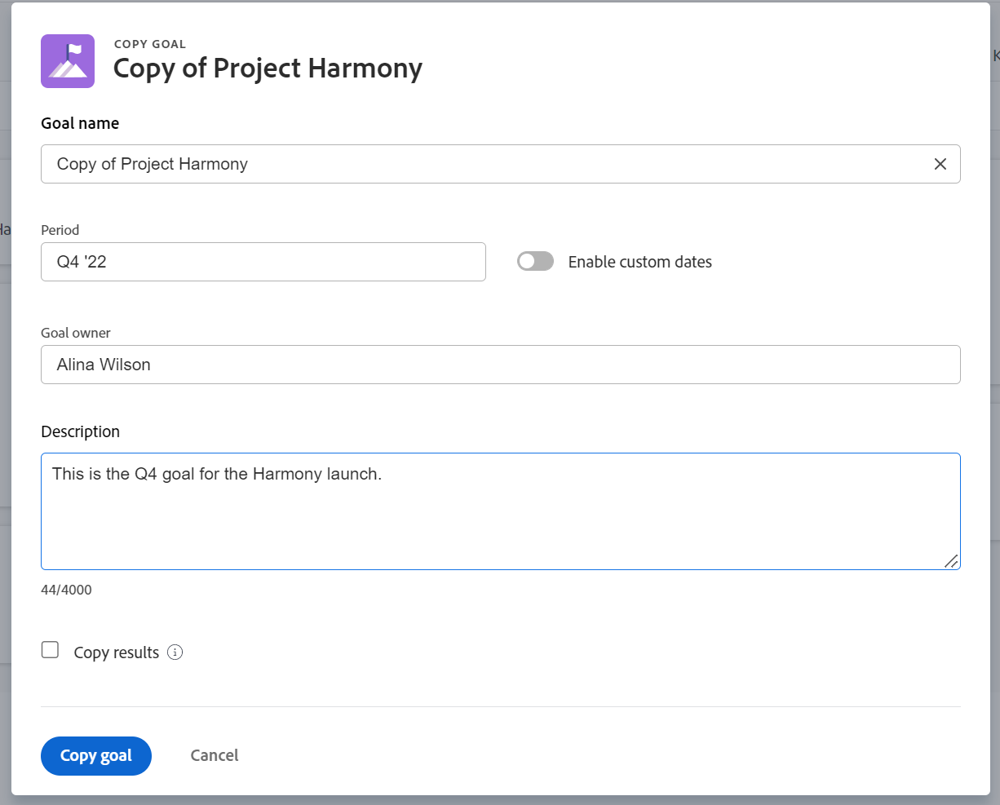

# Adobe Workfront 목표의 목표 복사

<!--Audited for P&P only: 4/2025-->

Adobe Workfront 목표에서 목표를 복사하여 목표를 생성할 수 있습니다. 원래 목표 정보 중 일부가 새 목표로 이전됩니다.

## 액세스 요구 사항

>[!NOTE]
>
>이전에 이 패키지를 구입한 경우 귀사에서 Adobe Workfront 목표를 계속 사용하도록 선택할 수 있습니다. 자세한 내용은 계정 담당자에게 문의하십시오.
>
>Adobe Workfront 목표를 더 이상 구매할 수 없습니다.

+++ 을 확장하여 이 문서의 기능에 대한 액세스 요구 사항을 봅니다. 

<table style="table-layout:auto">
<col>
</col>
<col>
</col>
<tbody>
 <tr>
  <td> 
Adobe Workfront 패키지
 </td> 
   <td> 
   
Adobe Workfront Ultimate

   </td> 
  </tr> 
 <tr>
 <tr>
 <td role="rowheader">Adobe Workfront 라이선스</td>
 <td>
 
기여자 이상

 
요청 이상
</td>
 </tr>
 <tr>
 <td role="rowheader">액세스 수준 구성</td>
 <td> 
목표에 대한 액세스 편집
 </td>
 </tr>
 <tr>
 <td role="rowheader">개체 권한</td>
 <td>
  

  
목표에 대한 또는 그 이상의 권한에 대한 보기

  
편집할 목표에 대한 권한 관리

  
 </td>
 </tr>
<tr>
   <td role="rowheader">
레이아웃 템플릿
</td>
   <td> 
시스템 관리자를 포함한 모든 사용자에게는 기본 메뉴의 목표 영역을 포함하는 레이아웃 템플릿을 할당해야 합니다. 
  
</td>
  </tr>
</tbody>
</table>

자세한 내용은 [Workfront 설명서의 액세스 요구 사항](/help/quicksilver/administration-and-setup/add-users/access-levels-and-object-permissions/access-level-requirements-in-documentation.md)을 참조하십시오.

+++

<!--Old:

<table style="table-layout:auto">
<col>
</col>
<col>
</col>
<tbody>
 <tr> 
   <td role="rowheader">Adobe Workfront plan*</td> 
   <td> 
   
For the new plan and license structure:
  <ul><li>An Ultimate plan </li></ul>
   

For the current plan and license structure: 
<ul><li> A Pro or higher </li>
  <li>An Adobe Workfront Goals license in addition to a Workfront license.</li></ul>

   </td>  
  </tr>
 <tr>
 <tr>
 <td role="rowheader">Adobe Workfront license*</td>
 <td>
 
New license: Contributor or higher

 Or
 
Current license: Request or higher
 
For more information, see <a href="../../administration-and-setup/add-users/access-levels-and-object-permissions/wf-licenses.md" class="MCXref xref">Adobe Workfront licenses overview</a>.
 </td>
 </tr>
 <tr>
 <td role="rowheader">Product*</td>
 <td>
  
 New product requirement: Workfront

 
Or

  
Current product requirement: In addition to a Workfront license, you must purchase a license for Adobe Workfront Goals. 
 
For information, see <a href="../../workfront-goals/goal-management/access-needed-for-wf-goals.md" class="MCXref xref">Requirements to use Workfront Goals</a>. 
 </td>
 </tr>
 <tr>
 <td role="rowheader">Access level</td>
 <td> 
Edit access to Goals
 </td>
 </tr>
 <tr data-mc-conditions="">
 <td role="rowheader">Object permissions</td>
 <td>
  

  
View or higher permissions to the goal to view it

  
Manage permissions to the goal to edit it

  
For information about sharing goals, see <a href="../../workfront-goals/workfront-goals-settings/share-a-goal.md" class="MCXref xref">Share a goal in Workfront Goals</a>. 

  
 </td>
 </tr>
<tr>
   <td role="rowheader">
Layout template
</td>
   <td> 
All users, including Workfront administrators,  must be assigned a layout template that includes the Goals area in the Main Menu. 
  
</td>
  </tr>
</tbody>
</table>-->

## 목표 복사에 대한 고려 사항

목표를 복사하려면 액세스 수준에서 목표 편집 액세스 권한이 있어야 합니다. 목표에 대한 액세스 권한 부여에 대한 자세한 내용은 [Adobe Workfront 목표에 대한 액세스 권한 부여](../../administration-and-setup/add-users/configure-and-grant-access/grant-access-goals.md)를 참조하십시오.

기존 목표를 복사할 수 있는 몇 가지 이유는 다음과 같습니다.

* 기간(분기 또는 연도)이 끝날 때, 다음 기간에 동일한 목표를 다시 만들려는 때.
* 목표를 완료할 수 없고 다른 기간 동안 해당 목표를 작업하려는 기간이 끝날 때.
* 여러 팀원이 유사한 목표를 가지고 있는 경우 각 팀원에 대해 목표를 하나씩 만들어야 할 수 있습니다.

>[!TIP]
>
>모든 상태에서 목표를 복사할 수 있습니다. 목표 상태에 대한 자세한 내용은 [Adobe Workfront 목표의 목표 상태 개요](../../workfront-goals/goal-management/goal-status-overview.md)를 참조하십시오.

목표를 복사할 때에는 다음 사항을 고려하십시오.

* 목표에 대한 모든 정보도 새 목표에 복사됩니다.
* 기존 목표의 결과를 복사하도록 선택할 수 있습니다. 결과의 이름이 새 목표로 전송되지만 기존 목표에 대한 결과의 현재 진행 상황이 새 목표로 복사되지 않습니다. 복사된 결과는 기본적으로 동일한 소유자에게 할당됩니다.

  >[!NOTE]
  >
  >원래 소유자가 Workfront에서 삭제되거나 비활성화된 경우 로그인한 사용자에게 새 결과가 할당됩니다.

* 목표를 복사할 때에는 목표의 활동을 복사할 수 없습니다.

## 목표 복사

<!--
Copying goals differs depending on what environment you use. 

To copy goals in the Production environment:

1. Go to a goal and click it to open the Goal Details panel.

   For information about accessing an individual goal, see the "Access individual goals" section in [Access and open goals in Adobe Workfront Goals](../../workfront-goals/goal-management/access-goals-in-wf-goals.md).

   This opens the Goal Details panel.

1. Click the **More icon** , then click **Copy**. 

1. Update any of the following information for the copied goal:

   | Field |Description  |
   |---|---|
   | New Goal |The name of the new goal. The default is the name of the original goal.  |
   | Period |The time period during which you want to achieve the goal. Select a time period from the drop-down menu or click **Define custom dates** to indicate a custom time period. By default, the Period is always the current quarter. |
   | Owner |The owner of the goal. It can be a user, team, group, or a company. The default is the owner of the original goal.  |
   | Description |Additional information about the goal.  |

1. (Conditional) Select **Copy results** if the original goal had results added to it and you want to copy them to the new goal. This duplicates the original results to the new goal. The results of the copied goal have the same owner, names and measured values as the results of the original goal.

   >[!TIP]
   >
   >* The progress of the original result does not transfer to the copied goal. 
   >* If the original owner was deleted or deactivated from Workfront, the new result is assigned to the logged in user.

1. Click **Save**.

   The copied goal is saved with a status of Draft and displays in the Goal Details panel.

   >[!IMPORTANT]
   >
   >If you have not copied the results from the original goal, you must first associate the new goal with a progress indicator before you can activate it and start working towards achieving it. 
   >
   >Do at least one of the following to be able to activate a goal: 
   >   
   >* Add a Result
   >   
   >  For information about adding results, see [Add results to goals in Adobe Workfront Goals](../../workfront-goals/results-and-activities/add-results-to-goals.md).
   >   
   >* Add an Activity
   >   
   >  For information about adding activities, see [Add activities to goals in Adobe Workfront Goals](../../workfront-goals/results-and-activities/add-activities-to-goals.md). 
   >   
   >* Align another goal to it
   >   
   >  For information about aligning goals, see [Align goals by connecting them in Adobe Workfront Goals](../../workfront-goals/goal-alignment/align-goals-by-connecting-them.md).
   >
   > For information about activating a goal, see [Activate goals in Adobe Workfront Goals](../goal-management/activate-goals.md). 

1. Click the **X** icon in the upper-right of the Goal Details panel to close it.

   The copied goal displays in the following sections:

   * Goal List 
   * Check-in (after it is activated)
   * Goal Alignment section (after it is activated) 
   * Pulse
(!--drafted - this was important when we could not update the goal timeframe in the past but we can do that now - not needed
1. (Optional and conditional) If you have copied a goal that was not achieved in a previous time period to continue working on it in the following time period, do the following:

   1. Go to the original goal in the Goal List, Check-in page, or Pulse section and comment on the goal, to indicate that this goal was copied to another, more current goal. For information about commenting on a goal, see [Manage goal comments in Adobe Workfront Goals](../../workfront-goals/goal-management/manage-goal-comments.md).
   1. Close the original goal, to preserve the progress in its original time period. For information about closing goals, see [Close and reopen goals in Adobe Workfront Goals](../../workfront-goals/goal-management/close-and-reopen-goals.md). 
   1. Update the the **Initial** value of the new Result to match the **End At** value of the previous result, so that your new goal progress will start calculating from the point you achieved in the previous period.
   
-->

1. 목표로 이동하고 **자세히** 메뉴 을 클릭한 다음 **목표 복사**&#x200B;를 클릭합니다.

   

1. 복사된 목표에 대해 다음 정보를 업데이트합니다.
   * **목표 이름**: 새 목표의 이름입니다. 복사한 목표의 기본 이름은 &quot;Copy of &lt;original goal>&quot;입니다.
   * **기간**: 목표를 달성하려는 기간입니다. 드롭다운 메뉴에서 기간을 선택합니다

     또는

     목표의 **시작** 및 **종료 날짜**&#x200B;에 대한 사용자 지정 날짜를 지정하려면 **사용자 지정 날짜 사용**&#x200B;을 선택하세요. 사용자 지정 날짜 활성화 설정은 기본적으로 비활성화되어 있습니다.

     >[!TIP]
     >
     >   사용자 지정 날짜 활성화 를 선택 해제하면 원래 목표의 기간으로 돌아갑니다.

      * **목표 소유자**: 목표의 소유자입니다. 사용자, 팀, 그룹 또는 회사일 수 있습니다. 기본값은 원래 목표의 소유자입니다.
      * **설명**: 목표에 대한 추가 정보입니다.
      * **결과 복사**: 현재 목표의 결과를 복사된 목표로 전송하려면 이 옵션을 선택합니다. 이렇게 하면 원래 결과가 복제되고 복사된 목표에 첨부됩니다. 복사된 목표의 결과는 원래 목표의 결과와 소유자, 이름 및 측정 값이 동일합니다.

        >[!NOTE]
        >
        >* 원래 결과의 진행률이 복사된 목표로 이전되지 않습니다.
        >* 원래 소유자가 Workfront에서 삭제되거나 비활성화된 경우 로그인한 사용자에게 새 결과가 할당됩니다.

1. **목표 복사**&#x200B;를 클릭합니다.

   원래 목표와 유사한 목표가 생성되고 초안 상태에 있습니다.

   >[!NOTE]
   >
   >원래 목표의 결과를 복사하지 않은 경우 새 목표를 활성화하고 달성을 위해 작업하기 전에 먼저 진행 표시기와 연결해야 합니다.
   >목표를 진행 표시기와 연관시키는 방법에 대한 자세한 내용은 다음 문서를 참조하십시오.
   >* [Adobe Workfront 목표의 목표에 결과 추가](../results-and-activities/add-results-to-goals.md)
   >* [Adobe Workfront 목표의 목표에 활동 추가](../results-and-activities/add-activities-to-goals.md)
   >* [Adobe Workfront 목표에서 연결하여 목표 정렬](../goal-alignment/align-goals-by-connecting-them.md)
   >
   >목표 활성화에 대한 자세한 내용은 [목표 활성화](../goal-management/activate-goals.md)를 참조하십시오.

