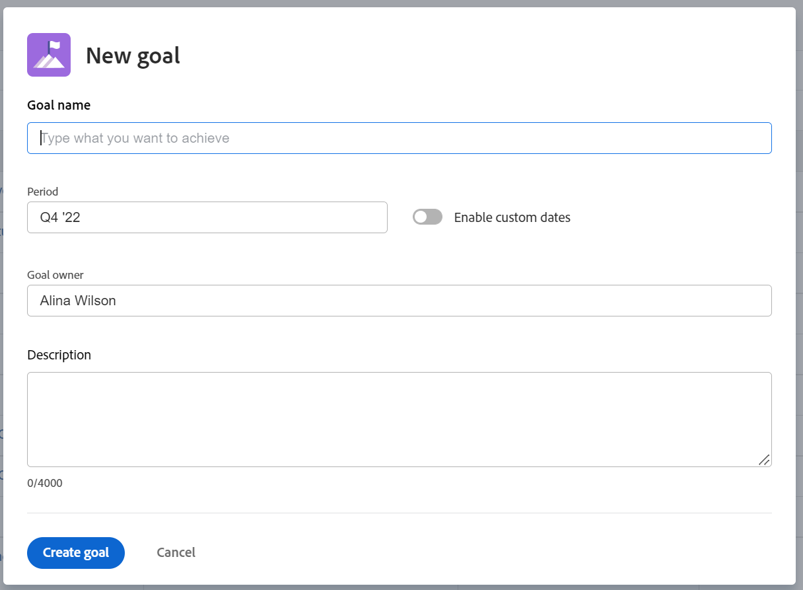

# Adobe Workfront 목표에서 목표 만들기

CEO, 관리자 또는 개별 기여자에 관계없이 Adobe Workfront 목표에서 목표를 만들어 작업을 목표 및 조직의 전략을 설명하는 목표에 맞게 조정할 수 있습니다.

## 액세스 요구 사항

다음 항목이 있어야 합니다.

<table style="table-layout:auto">
<col>
</col>
<col>
</col>
<tbody>
<tr> 
   <td role="rowheader">Adobe Workfront 플랜*</td> 
   <td> 
   
새 플랜 및 라이선스 구조의 경우:
  <ul><li>Ultimate 플랜 </li></ul>
   

현재 플랜 및 라이선스 구조의 경우: 
<ul><li> Pro 이상 </li>
  <li>Workfront 라이선스 외에 Adobe Workfront Goals 라이선스.</li></ul>

   </td> 
  </tr>
  <tr>
 <td role="rowheader">Adobe Workfront 라이센스*</td>
 <td>
 
새 라이선스: 기여자 이상

 또는
 
현재 라이선스: 요청 이상
 
자세한 내용은 <a href="../../administration-and-setup/add-users/access-levels-and-object-permissions/wf-licenses.md" class="MCXref xref">Adobe Workfront 라이선스 개요</a>를 참조하십시오.
 </td>
 </tr>
 <tr>
 <td role="rowheader">제품*</td>
 <td>
 
 다음 중 하나인 새 제품 요구 사항: 

<ul>
<li>Select 또는 Prime Adobe Workfront 플랜 및 추가 Adobe Workfront Goals 라이선스.</li>
<li>기본적으로 Workfront 목표를 포함하는 Ultimate Workfront 플랜입니다. </li></ul>
 
또는

 
현재 제품 요구 사항: Workfront 플랜 및 Adobe Workfront 목표에 대한 추가 라이선스. 
 
자세한 내용은 <a href="../../workfront-goals/goal-management/access-needed-for-wf-goals.md" class="MCXref xref">Workfront 목표를 사용하기 위한 요구 사항</a>을 참조하십시오. 
 </td>
 </tr>
<tr>
<td role="rowheader">액세스 수준</td>
<td> 
목표에 대한 액세스 편집
 </td>
</tr>
<tr data-mc-conditions="">
<td role="rowheader">개체 권한</td>
<td>

목표에 대한 또는 그 이상의 권한에 대한 보기

편집할 목표에 대한 권한 관리

목표 공유에 대한 자세한 내용은 <a href="../../workfront-goals/workfront-goals-settings/share-a-goal.md" class="MCXref xref">Workfront 목표에서 목표 공유</a>를 참조하십시오. 

</td>
</tr>
<tr>
   <td role="rowheader">
레이아웃 템플릿
</td>
   <td> 
Workfront 관리자를 포함한 모든 사용자에게 메인 메뉴의 목표 영역을 포함하는 레이아웃 템플릿을 할당해야 합니다. 
  
</td>
  </tr>
</tbody>
</table>

*자세한 내용은 [Workfront 설명서의 액세스 요구 사항](/help/quicksilver/administration-and-setup/add-users/access-levels-and-object-permissions/access-level-requirements-in-documentation.md)을 참조하십시오.

## 목표 생성을 위한 지침

Workfront 목표를 시작하기 전에 목표를 효과적으로 관리하기 위한 모범 사례 권장 사항 및 지침에 대해 읽어보는 것이 좋습니다. 목표 생성 및 관리 지침에 대한 자세한 내용은 [Adobe Workfront 목표 개요](../../workfront-goals/goal-management/wf-goals-overview.md)를 참조하십시오.

## 목표 만들기

이 문서에서는 Workfront 목표에서 전략적 목표를 생성하는 방법을 설명합니다. 비즈니스 사례 목표 만들기에 대한 자세한 내용은 [비즈니스 사례 목표 만들기](../../manage-work/projects/define-a-business-case/create-business-case-goals.md)를 참조하십시오.

다음 방법 중 하나로 전략 목표를 생성할 수 있습니다.

* [처음부터 목표 만들기](#create-a-goal-from-scratch)
* [기존 목표 복사](#copy-an-existing-goal)
* [결과 또는 활동을 목표로 전환](#convert-a-result-or-activity-to-a-goal)

### 처음부터 목표 만들기 {#create-a-goal-from-scratch}

<!--
Creating goals differs depending on what environment you use.

#### Create a goal from scratch in the Production environment 

1. Click the **Main Menu** icon  in the upper right corner, then click **Goals**.

   (!-- Add this when Shell is available to all: or (if available), click the **Main Menu** icon  in the upper-left corner)
   -)

   The Goal List displays.

1. (Conditional) Click **Goal List**, **Graphs**, **Pulse**, or **Check-in** in the left pane, then click **Add Goal** in the upper-right corner of the page. The Add Goal box displays.

   

   >[!TIP]
   >
   >You can add a goal from any section in Workfront Goals. The process for creating a goal is identical regardless of the section you choose to add the goal from.

1. Start typing what you want to achieve in the **Goal** field. This is the name of the goal and a required field. 
1. Select a time period when the goal should be executed in the **Period** drop-down menu. This is a pre-filled field. The default is the current quarter.

   Select from the following predefined options:

   * The current year
   * The quarters of the current year
   * The next two years
   * The quarters of the next two years

   Or

   Click **Define custom dates** to select a custom time frame. 

1. (Conditional) Select a **Start date** and an **End date** for your goal, if you clicked **Define custom dates**.

   >[!TIP]
   >
   >* You can create a goal with dates in any time period, including up to 2 years in the past. 
   >* When defining custom dates, they are constrained by the initial date you selected. So if you select quarter and then custom dates, you can't go beyond that quarter.

1. (Optional) Click **Reset custom dates** to return to the predefined options.

   >[!TIP]
   >
   >We recommend that everyone in your organization selects the same timeframes for similar goals or goals that are aligned. This provides better alignment between goals and ensures that everyone's work supports your over-arching strategy.

1. (Optional) Click your name in the **Owner** field, if you want to indicate someone else as the owner of the goal. By default, you are the owner of goals you create. 
1. Start typing the name of a user, team, group, or the name of your organization in the **Owner** field, then select it when it displays in the list. You can have only one owner for a goal. 
1. (Optional) Enter a **Description** for the goal. This field is optional. 
1. Click **Save**.

   The status of the new goal is Draft.

   >[!IMPORTANT]
   >
   >You must associate a goal with a progress indicator to activate it and start working on it. 
   >
   >Do at least one of the following to be able to activate a goal: 
   >
   >* Add a Result
   >
   >  For information about adding results, see [Add results to goals in Adobe Workfront Goals](../../workfront-goals/results-and-activities/add-results-to-goals.md).
   >   
   >* Add an Activity
   >   
   >  For information about adding activities, see [Add activities to goals in Adobe Workfront Goals](../../workfront-goals/results-and-activities/add-activities-to-goals.md). 
   >   
   >* Align another goal to it
   >   
   >  For information about aligning goals, see [Align goals by connecting them in Adobe Workfront Goals](../../workfront-goals/goal-alignment/align-goals-by-connecting-them.md).

1. Click the **X** icon in the upper-right of the Goal Details panel to close it.

-->

1. 오른쪽 상단의 **주 메뉴** 아이콘 을 클릭한 다음 **목표**&#x200B;를 클릭합니다.

   <!-- Add this when Shell is available to all: or (if available), click the **Main Menu** icon  in the upper-left corner)
   -->

   목표 목록이 표시됩니다.
1. **새 목표**&#x200B;를 클릭합니다.

   새 목표 상자가 표시됩니다.

   

1. 다음 필드에 정보를 입력합니다.
   * **목표 이름**: 목표 이름을 입력하십시오. 필수 필드입니다.
   * **기간**: **기간** 드롭다운 필드에서 사전 정의된 분기 또는 연도를 선택합니다.

     또는

     **사용자 지정 날짜 사용** 옵션을 선택한 다음 목표에 대해 **시작** 및 **종료 날짜**&#x200B;를 선택하십시오.

     이전, 현재 및 다음 연도와 해당 분기가 기간 드롭다운 필드에 사전 정의된 옵션으로 나열됩니다.

     목표 기간은 목표가 완료될 것으로 예상되는 기간을 나타냅니다.

   * **목표 소유자**: 목표의 소유자를 나타내려면 사용자, 팀, 그룹 또는 조직의 이름을 입력하세요. 기본적으로 사용자가 목표의 소유자로 선택됩니다.
   * **설명**: 목표에 대한 추가 정보를 입력하십시오.
1. **목표 만들기**&#x200B;를 클릭합니다.

   새 목표는 목표 목록에 나열되며 **초안** 상태입니다.

   목표를 활성화하고 작업을 시작하려면 진행 표시기와 연결해야 합니다.

   다음 중 적어도 하나를 수행하여 활성화할 목표를 준비하십시오.
   * 결과 추가

     결과 추가에 대한 자세한 내용은 [Adobe Workfront 목표의 목표에 결과 추가](../results-and-activities/add-results-to-goals.md)를 참조하십시오.
   * 활동 추가

     활동 추가에 대한 자세한 내용은 [Adobe Workfront 목표의 목표에 활동 추가](../results-and-activities/add-activities-to-goals.md)를 참조하십시오.
   * 다른 목표 정렬

     목표 정렬에 대한 자세한 내용은 [Adobe Workfront 목표에서 연결하여 목표 정렬](../goal-alignment/align-goals-by-connecting-them.md)을 참조하십시오.

### 기존 목표 복사 {#copy-an-existing-goal}

기존 목표를 복사하여 목표를 생성할 수 있습니다.

목표 복사에 대한 자세한 내용은 [Adobe Workfront 목표의 목표 복사](../../workfront-goals/goal-management/copy-goals.md)를 참조하십시오.

### 결과 또는 활동을 목표로 전환 {#convert-a-result-or-activity-to-a-goal}

기존 목표의 결과나 활동을 목표로 전환하여 목표를 생성할 수 있습니다. 새 목표가 원래 목표와 정렬됩니다.

결과 및 활동을 목표로 전환하는 방법에 대한 자세한 내용은 [결과 및 활동을 목표로 전환하여 목표 정렬](../../workfront-goals/goal-alignment/align-goals-by-converting-results-activities.md)을 참조하십시오.

