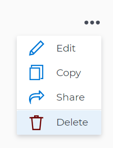

# Adobe Workfront 목표에서 목표 삭제 및 비활성화

<!--Audited for P&P only: 10/2025-->

목표 작업을 시작할 때 조직에서 관련이 없게 되면 삭제하는 대신 비활성화하는 것이 좋습니다. 목표를 비활성화하면 기록 정보가 유지되며 나중에 다시 활성화할 수 있습니다. 그러나 목표를 삭제할 때 목표 목록을 정확하게 유지하는 것이 적절할 수 있습니다.

## 액세스 요구 사항

>[!NOTE]
>
>이전에 이 패키지를 구입한 경우 귀사에서 Adobe Workfront 목표를 계속 사용하도록 선택할 수 있습니다. 자세한 내용은 계정 담당자에게 문의하십시오.
>
>Adobe Workfront 목표를 더 이상 구매할 수 없습니다.

+++ 이 문서의 기능에 대한 액세스 요구 사항을 보려면 확장하십시오. 

<table style="table-layout:auto">
<col>
</col>
<col>
</col>
<tbody>
 <tr>
  <td> 
Adobe Workfront 패키지
 </td> 
   <td> 
   
Adobe Workfront Ultimate

   </td> 
  </tr>
 <tr>
 <td role="rowheader">Adobe Workfront 라이선스</td>
 <td>
 
기여자 이상

요청 이상
</td>
 </tr>
  <tr>
 <td role="rowheader">액세스 수준 구성</td>
 <td> 
목표에 대한 액세스 편집
 </td>
 </tr>
 <tr data-mc-conditions="">
 <td role="rowheader">개체 권한</td>
 <td>
  

  
목표에 대한 또는 그 이상의 권한에 대한 보기

  
편집할 목표에 대한 권한 관리

  
 </td>
 </tr>
<tr>
   <td role="rowheader">
레이아웃 템플릿
</td>
   <td> 
시스템 관리자를 포함한 모든 사용자에게는 기본 메뉴의 목표 영역을 포함하는 레이아웃 템플릿을 할당해야 합니다. 
  
</td>
  </tr>
</tbody>
</table>

자세한 내용은 [Workfront 설명서의 액세스 요구 사항](/help/quicksilver/administration-and-setup/add-users/access-levels-and-object-permissions/access-level-requirements-in-documentation.md)을 참조하십시오.

+++

<!--Old:
<table style="table-layout:auto">
<col>
</col>
<col>
</col>
<tbody>
 <tr> 
   <td role="rowheader">Adobe Workfront plan*</td> 
   <td> 
   
For the new plan and license structure:
  <ul><li>An Ultimate plan </li></ul>
   

For the current plan and license structure: 
<ul><li> A Pro or higher </li>
  <li>An Adobe Workfront Goals license in addition to a Workfront license.</li></ul>

   </td>  
  </tr>
 <tr>
 <tr>
 <td role="rowheader">Adobe Workfront license*</td>
 <td>
 
New license: Contributor or higher

 Or
 
Current license: Request or higher
 
For more information, see <a href="../../administration-and-setup/add-users/access-levels-and-object-permissions/wf-licenses.md" class="MCXref xref">Adobe Workfront licenses overview</a>.
 </td>
 </tr>
 <tr>
 <td role="rowheader">Product*</td>
 <td>
  
 New product requirement: Workfront

 
Or

  
Current product requirement: In addition to a Workfront license, you must purchase a license for Adobe Workfront Goals. 
 
For information, see <a href="../../workfront-goals/goal-management/access-needed-for-wf-goals.md" class="MCXref xref">Requirements to use Workfront Goals</a>. 
 </td>
 </tr>
 <tr>
 <td role="rowheader">Access level</td>
 <td> 
Edit access to Goals
 </td>
 </tr>
 <tr data-mc-conditions="">
 <td role="rowheader">Object permissions</td>
 <td>
  

  
View or higher permissions to the goal to view it

  
Manage permissions to the goal to edit it

  
For information about sharing goals, see <a href="../../workfront-goals/workfront-goals-settings/share-a-goal.md" class="MCXref xref">Share a goal in Workfront Goals</a>. 

  
 </td>
 </tr>
<tr>
   <td role="rowheader">
Layout template
</td>
   <td> 
All users, including Workfront administrators,  must be assigned a layout template that includes the Goals area in the Main Menu. 
  
</td>
  </tr>
</tbody>
</table>-->

## 목표 비활성화

더 이상 관련성이 없고 나중에 다시 활성화할 수 있는 목표를 비활성화할 수 있습니다.

* [목표를 비활성화할 때의 고려 사항](#considerations-when-deactivating-goals)
* [목표 비활성화](#deactivate-goals)

### 목표를 비활성화할 때 고려 사항

목표를 비활성화할 때는 다음 사항을 기억하십시오.

* 활성 상태의 목표만 비활성화할 수 있습니다. 목표 활성화에 대한 자세한 내용은 [Adobe Workfront 목표에서 목표 활성화](../../workfront-goals/goal-management/activate-goals.md)를 참조하십시오.

  >[!TIP]
  >
  >초안 상태에서는 목표를 비활성화할 수 없습니다.

* Workfront이 비활성화된 목표의 진행 상황 계산을 중지합니다.
* 비활성 목표는 더 이상 Workfront 목표의 그래프 섹션에 표시되거나 고려되지 않습니다. Workfront 목표 그래프에 대한 자세한 내용은 [Adobe Workfront 목표의 목표 진행 트렌드를 이해하려면 그래프 검토](../../workfront-goals/goal-review-and-workfront-goals-sections/review-goal-graphs.md)를 참조하십시오.

  <!--* The Check-in section. For information about the Check-in page, see [Update goal progress in Adobe Workfront Goals](../../workfront-goals/goal-review-and-workfront-goals-sections/check-in-goals.md). -->

* 비활성화된 목표에 대해서는 더 이상 업데이트할 수 없습니다.
* 목표 및 해당 정렬에 대한 정보를 편집할 수 있습니다.
* 이전에 비활성화된 목표를 다시 활성화할 수 있습니다.

### 목표 비활성화

<!--
Deactivating goals differs depending on which environment you use.

### Deactivate goals in the Production environment

1. Go to the goal that you want to deactivate.

   For example, go to the Goal List and click the name of a goal.

   The Goal Details panel opens on the right.

   >[!TIP]
   >
   >You can open goals from any sections of Workfront Goals.

1. Click the **More icon** , then click **Deactivate**.

   

   The goal status changes to Inactive. 

1. Click the **X** icon in the upper-right to close Goal Details.
-->

{{step1-to-goals}}

목표 목록이 표시됩니다.

1. (선택 사항) 활성 상태인 목표만 표시하도록 필터를 수정합니다.

   Workfront 목표의 정보 필터링에 대한 자세한 내용은 [Adobe Workfront 목표의 정보 필터링](../goal-management/filter-information-wf-goals.md)을 참조하십시오.

1. 활성 목표를 클릭합니다.

   목표 페이지가 열립니다.

   

1. 목표 이름 오른쪽에 있는 **자세히** 메뉴 을 클릭한 다음 **비활성화**&#x200B;를 클릭합니다.

1. 목표가 비활성화되고 상태는 비활성으로 설정됩니다.

## 목표 삭제

더 이상 관련이 없거나 없을 수 있는 목표를 삭제할 수 있습니다.

* [목표를 삭제할 때 고려 사항](#considerations-when-deleting-goals)
* [목표 삭제](#delete-goals)

### 목표 삭제 시 고려 사항 {#considerations-when-deleting-goals}

* 마감된 목표를 포함하여 모든 상태에서 목표를 삭제할 수 있습니다.
* 삭제된 목표는 복구할 수 없습니다.
* 목표에 첨부된 결과 및 수동 진행률 표시줄 활동도 삭제됩니다.
* 목표와 연결된 프로젝트는 삭제되지 않지만 목표와의 연결은 제거됩니다.

### 목표 삭제

<!--
Deleting  goals differs depending on which environment you use.

#### Delete goals in the Production environment

1. Go to the goal that you want to delete.

   For example, go to the Goal List and click a goal.

   The Goal Details panel opens on the right. 

1. Click the **More icon** , then click **Delete**.

   

1. Click **Yes, delete**.

   The goal is removed from the Goal List and cannot be recovered.
-->

{{step1-to-goals}}

목표 목록이 표시됩니다.

1. 목표의 이름을 클릭합니다. 목표 페이지가 열립니다.
1. 목표 이름 오른쪽에 있는 **자세히** 메뉴 을 클릭한 다음 **목표 삭제**, **삭제**&#x200B;를 클릭합니다.

   목표와 그 활동 및 결과도 삭제되며 복구할 수 없습니다. 목표 또는 하위 목표와 연관된 프로젝트는 삭제되지 않습니다.

