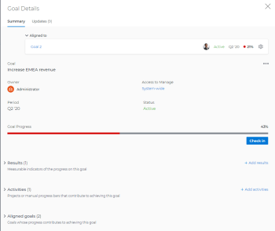

# Adobe Workfront 목표의 목표 세부 사항 섹션에서 목표 업데이트

<!--drafted for the goal redesign:
- change the title for Production to Update goals in the Goal details section in Adobe Workfront Goals. 
- update the description in the metadata above
-->

목표 세부 정보 패널에 액세스하여 개별 목표에 대한 정보를 업데이트할 수 있습니다.

>[!NOTE]
>
>마감 상태의 목표는 업데이트할 수 없습니다.

## 액세스 요구 사항

다음 항목이 있어야 합니다.

<table style="table-layout:auto">
<col>
</col>
<col>
</col>
<tbody>
 <tr> 
   <td role="rowheader">Adobe Workfront 플랜*</td> 
   <td> 
   
새 플랜 및 라이선스 구조의 경우:
  <ul><li>궁극적인 플랜 </li>
  또는
  <li>Prime 또는 Select Adobe Workfront 플랜에 대한 Adobe Workfront Goals에 대한 추가 라이센스입니다. </li></ul> 

현재 플랜 및 라이선스 구조의 경우: 
<ul><li> Pro 이상 </li>
  <li>Workfront 라이선스 외에 Adobe Workfront Goals 라이선스.</li></ul>

   </td> 
  </tr>
 <tr>
 <td role="rowheader">Adobe Workfront 라이센스*</td>
 <td>
 
새 라이선스: 기여자 이상

 또는
 
현재 라이선스: 요청 이상
 
자세한 내용은 <a href="../../administration-and-setup/add-users/access-levels-and-object-permissions/wf-licenses.md" class="MCXref xref">Adobe Workfront 라이선스 개요</a>를 참조하십시오.
 </td>
 </tr>
 <tr>
 <td role="rowheader">제품*</td>
 <td>
 
 다음 중 하나인 새 제품 요구 사항: 

<ul>
<li>Select 또는 Prime Adobe Workfront 플랜 및 추가 Adobe Workfront Goals 라이선스.</li>
<li>기본적으로 Workfront 목표를 포함하는 Ultimate Workfront 계획입니다. </li></ul>
 
또는

 
현재 제품 요구 사항: Workfront 플랜 및 Adobe Workfront 목표에 대한 추가 라이선스. 
 
자세한 내용은 <a href="../../workfront-goals/goal-management/access-needed-for-wf-goals.md" class="MCXref xref">Workfront 목표를 사용하기 위한 요구 사항</a>을 참조하십시오. 
 </td>
 </tr>
 <tr>
 <td role="rowheader">액세스 수준*</td>
 <td> 
목표에 대한 액세스 편집
 </td>
 </tr>
 <tr data-mc-conditions="">
 <td role="rowheader">개체 권한</td>
 <td>
  

  
목표에 대한 또는 그 이상의 권한에 대한 보기

  
편집할 목표에 대한 권한 관리

  
목표 공유에 대한 자세한 내용은 <a href="../../workfront-goals/workfront-goals-settings/share-a-goal.md" class="MCXref xref">Workfront 목표에서 목표 공유</a>를 참조하십시오. 

  
 </td>
 </tr>
 <tr>
   <td role="rowheader">
레이아웃 템플릿
</td>
   <td> 
Workfront 관리자를 포함한 모든 사용자에게 메인 메뉴의 목표 영역을 포함하는 레이아웃 템플릿을 할당해야 합니다. 
  
</td>
  </tr>
</tbody>
</table>

*자세한 내용은 [Workfront 설명서의 액세스 요구 사항](/help/quicksilver/administration-and-setup/add-users/access-levels-and-object-permissions/access-level-requirements-in-documentation.md)을 참조하십시오.

## 목표 세부 사항 섹션의 목표 업데이트

목표 목록에서 개별 목표에 액세스할 수 있습니다.

<!--

Updating goals in the Goal Details panel differs depending on where you access the goal from. 

### Update goals in the Goal Details panel in the Production environment

1. Click the **Main Menu** icon  > **Goals** in the upper-right corner.

   (!-- Add this when Shell is available to all: or (if available), click the **Main Menu** icon  in the upper-left corner)
   --)

   This opens the Goals area in Workfront. 

1. Click the name of a goal in the Goal List, then click the name of a goal.

   This opens the Goal Details panel on the right.
   

   >[!TIP]
   >
   >You can also click the name of a goal in the Goal Alignment, Check-in, or Pulse sections. 
   >
   ><!-- drafted for goal redesign:
   >Add this to the TIP above with goal redesign: 
   >
   >The Check-in and Pulse sections have been removed from the Preview environment.
   >

1. On the Summary tab, click the **More icon** , then click any of the following options:

   1. **Edit**. For information about editing goals, see [Edit goals in Adobe Workfront Goals](../../workfront-goals/goal-management/edit-goals.md).
   1. **Copy**. For information about copying goals, see [Copy goals in Adobe Workfront Goals](../../workfront-goals/goal-management/copy-goals.md).
   1. **Activate**. This option is available only for drafted and inactive goals.

      For information about activating goals, see [Access and open goals in Adobe Workfront Goals](../../workfront-goals/goal-management/access-goals-in-wf-goals.md). 
   
   1. **Close**, then click**Close Goal**. This option is available only for active goals.

      For information about closing goals, see [Close and reopen goals in Adobe Workfront Goals](../../workfront-goals/goal-management/close-and-reopen-goals.md). 
   
   1. **Deactivate**. This option is available only for active goals. This deactivates the goal immediately.

      For information about deactivating goals, see [Delete and deactivate goals in Adobe Workfront Goals](../../workfront-goals/goal-management/delete-and-deactivate-goals.md).
   
   1. **Delete**, then click **Yes, Delete**.

      For information about deleting goals, see [Delete and deactivate goals in Adobe Workfront Goals](../../workfront-goals/goal-management/delete-and-deactivate-goals.md).

      >[!NOTE]
      >
      >Deleted goals cannot be recovered.

   1. **Reopen**, then click **Reopen**. This option is available only for closed goals that are from a current time period.

      For information about reopening goals, see [Close and reopen goals in Adobe Workfront Goals](../../workfront-goals/goal-management/close-and-reopen-goals.md). 
   
   1. (Conditional) If you clicked any of the options between steps a-i above except Delete or Reopen, click **Save**.    
   
      (!--ensure this is accurate)--)

1. Click **Align to another goal** in the upper-right of the Summary tab, then specify the name of a goal in the **Align to** **another goal** field that you want to align the current goal to. The current goal becomes the child of the goal you align it to. For information about child and parent goals, see [Align goals by connecting them in Adobe Workfront Goals](../../workfront-goals/goal-alignment/align-goals-by-connecting-them.md). 
1. Click **Add results**. Results drive the progress of your goal. For information about adding results, see [Add results to goals in Adobe Workfront Goals](../../workfront-goals/results-and-activities/add-results-to-goals.md).

1. Click **Add activities**. Activities drive the progress of your goal. For information about adding activities, see [Add activities to goals in Adobe Workfront Goals](../../workfront-goals/results-and-activities/add-activities-to-goals.md). 

1. Click the **Updates** tab. Here, you can view goal comments and review the entire editing history of the goal, activities, and results, to understand who changed what and when.

   

1. (Optional) Deselect any of the following options if you want to not display them in the Updates tab.&nbsp;They are selected by default: 

   | Option |Description  |
   |---|---|
   | Progress Updates |Displays information about the history of progress updates on results and activities.  |
   | Comments |Displays comments made by users on the goal.  |
   | Editing History |Displays information about creating and updating the goal, results, and activities.  |

1. (Optional) Click **Details** under a progress or an editing history update to display additional information about the update.

   

-->

1. 목표 목록에서 목표 이름을 클릭한 다음, 목표 이름을 클릭합니다.

   왼쪽에 **목표 세부 정보** 섹션이 열립니다.

   

1. 오른쪽 상단의 **편집 아이콘** 을 클릭한 다음 **모두 편집** 또는 **개요**&#x200B;를 클릭합니다

   또는

   목표 세부 정보 섹션의 편집 가능한 필드 중 하나에 정보를 입력하십시오. 섹션을 편집할 수 있게 됩니다.

   >[!IMPORTANT]
   >
   >목표 세부 사항 섹션에 표시되는 일부 필드는 편집할 수 없습니다. Workfront은 일부 필드를 계산하며 읽기 전용입니다.

1. 다음 필드를 업데이트하거나 검토합니다.

   * **설명**: 목표에 대한 정보를 추가하거나 업데이트합니다.
   * **진행**: 지금까지 완료된 목표의 백분율을 나타냅니다. 목표의 진행 상황을 수동으로 업데이트할 수 없습니다. 목표 진행률은 모든 진행률 지표를 계산한 것이다.
   * **조건**: 목표가 새 목표이며 아직 업데이트되지 않았는지, 제 시간에 완료될 대상에 있는지 또는 지연되고 있는지 여부를 나타냅니다. 목표의 상태는 업데이트할 수 없습니다. 목표의 상태는 Workfront에 의해 자동으로 계산됩니다.\
     목표 조건 및 진행률에 대한 자세한 내용은
     [Adobe Workfront 목표의 목표 진행 상황 및 상태 개요](../goal-management/calculate-goal-progress.md).
   * **상태**: 목표의 상태를 수동으로 업데이트할 수 없습니다. 자세한 내용은 [Adobe Workfront 목표의 목표 상태 개요](../goal-management/goal-status-overview.md)를 참조하십시오.
   * **목표 소유자**: 목표 소유자의 이름을 업데이트하려면 클릭하세요. 사용자, 팀, 그룹 또는 조직의 이름을 입력한 다음 목록에 표시될 때 선택합니다. 목표에 대해 소유자는 한 명만 있을 수 있습니다.
   * **상위 목표**: 선택한 목표의 상위로 설정할 목표의 이름을 입력하세요. 선택한 목표의 진행률은 상위 목표의 진행률을 자동으로 업데이트합니다.

     >[!TIP]
     >
     >상위 목표에 대한 다음 정보는 업데이트할 수 없습니다.
     >    * 상위 목표 기간
     >    * 상위 목표 진행 상황
     >    * 상위 목표 소유자.
     >      
     >상위 목표 자체에 대한 이 정보를 업데이트해야 합니다.

   * **기간**: 목표의 기간을 업데이트하려면 클릭하십시오.\
     또는\
     목표의 **시작** 및 **종료 날짜**&#x200B;에 대한 날짜를 지정하려면 **사용자 지정 날짜 사용**&#x200B;을 선택하세요.
   * **마감 메모**: 이 필드는 [닫힘] 상태의 목표에만 표시됩니다. 종료된 목표는 편집할 수 없습니다. 마감된 목표를 다시 열면 마감된 메모가 영구적으로 삭제됩니다.

