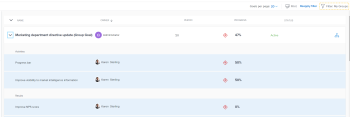

# Adobe Workfront 목표 목표 목표 목표 목록에서 목표 관리

<!-- printing or exporting goals is no longer possible, but see if they add it later-->

사용자나 다른 사용자가 목표를 만들면 목표 목록에서 진행 상황과 정보를 검토할 수 있습니다. 목표 만들기에 대한 내용은 [Adobe Workfront 목표에서 목표 만들기](../../workfront-goals/goal-management/create-goals.md).

## 액세스 요구 사항

<!--drafted - replace the table below with this one when P&P releases: 

<table style="table-layout:auto">
 <col>
 </col>
 <col>
 </col>
 <tbody>
  <tr>
   <td role="rowheader">Adobe Workfront plan*</td>
   <td>
   
Current plan: Select or higher

   Or
   
Legacy plan: Pro or higher

   
   </td>
  </tr>
  <tr>
   <td role="rowheader">Adobe Workfront license*</td>
   <td>
   
Current license: Contributor or higher

   Or
   
Legacy license: Request or higher
 
For more information, see <a href="../../administration-and-setup/add-users/access-levels-and-object-permissions/wf-licenses.md" class="MCXref xref">Adobe Workfront licenses overview</a>.
 </td>
  </tr>
  <tr>
   <td role="rowheader">Product</td>
   <td>
   
 Current product requirement: If you have the Select or Prime Adobe Workfront plan, you must also buy an additional Adobe Workfront Goals license.  Workfront Goals are included in the Ultimate Workfront Plan.

   Or
   
Legacy product requirement: You must purchase an additional license for the Adobe Workfront Goals to access functionality described in this article. 
 
For information, see <a href="../../workfront-goals/goal-management/access-needed-for-wf-goals.md" class="MCXref xref">Requirements to use Workfront Goals</a>. 
 </td>
  </tr>
  <tr>
   <td role="rowheader">Access level*</td>
   <td> 
Edit access to Goals
 
<b>NOTE</b>
If you still don't have access, ask your Workfront administrator if they set additional restrictions in your access level. For information on how a Workfront administrator can change your access level, see:

     <ul>
      <li> 
<a href="../../administration-and-setup/add-users/configure-and-grant-access/create-modify-access-levels.md" class="MCXref xref">Create or modify custom access levels</a> 
 </li>
      <li> 
<a href="../../administration-and-setup/add-users/configure-and-grant-access/grant-access-goals.md" class="MCXref xref">Grant access to Adobe Workfront Goals</a> 
 </li>
     </ul> 
 </td>
  </tr>
  <tr data-mc-conditions="">
   <td role="rowheader">Object permissions</td>
   <td>
    

     
View or higher permissions to the goal to view it

     
Manage permissions to the goal to edit it

     
For information about sharing goals, see <a href="../../workfront-goals/workfront-goals-settings/share-a-goal.md" class="MCXref xref">Share a goal in Workfront Goals</a>. 

    
 </td>
  </tr>
 </tbody>
</table>
-->

이 문서에 설명된 작업을 수행하려면 다음 액세스 권한이 있어야 합니다.

<table style="table-layout:auto"> 
 <col> 
 <col> 
 <tbody> 
  <tr> 
   <td role="rowheader">Adobe Workfront 플랜*</td> 
   <td> 
Pro 이상
 </td> 
  </tr> 
  <tr> 
   <td role="rowheader">Adobe Workfront 라이선스*</td> 
   <td> 
요청 이상
 
자세한 내용은 <a href="../../administration-and-setup/add-users/access-levels-and-object-permissions/wf-licenses.md" class="MCXref xref">Adobe Workfront 라이선스 개요</a>.
 </td> 
  </tr> 
  <tr> 
   <td role="rowheader">제품</td> 
   <td> 
이 문서에 설명된 기능에 액세스하려면 Adobe Workfront 목표에 대한 추가 라이센스를 구매해야 합니다. 
 
자세한 내용은 <a href="../../workfront-goals/goal-management/access-needed-for-wf-goals.md" class="MCXref xref">Workfront 목표 사용 요구 사항</a>. 
 </td> 
  </tr> 
  <tr> 
   <td role="rowheader">액세스 수준*</td> 
   <td> 
목표에 대한 액세스 권한 보기 이상
 
<b>메모</b>
여전히 액세스 권한이 없는 경우 Workfront 관리자에게 액세스 수준에서 추가 제한 사항을 설정하는지 문의하십시오. Workfront 관리자가 액세스 수준을 변경하는 방법에 대한 자세한 내용은 다음을 참조하십시오.
 
     <ul> 
      <li> 
<a href="../../administration-and-setup/add-users/configure-and-grant-access/create-modify-access-levels.md" class="MCXref xref">사용자 정의 액세스 수준 만들기 또는 수정</a> 
 </li> 
      <li> 
<a href="../../administration-and-setup/add-users/configure-and-grant-access/grant-access-goals.md" class="MCXref xref">Adobe Workfront 목표에 대한 액세스 권한 부여</a> 
 </li> 
     </ul> 
 </td> 
  </tr> 
  <tr data-mc-conditions=""> 
   <td role="rowheader">개체 권한</td> 
   <td> 
    
 
     
목표에 대한 권한 보기 이상
 
     
목표 공유에 대한 자세한 내용은 <a href="../../workfront-goals/workfront-goals-settings/share-a-goal.md" class="MCXref xref">Workfront 목표에서 목표 공유</a>. 
 
    
 </td> 
  </tr> 
 </tbody> 
</table>

*보유하고 있는 플랜, 라이선스 유형 또는 액세스를 알아보려면 Workfront 관리자에게 문의하십시오.

## 전제 조건

시작하려면 먼저 다음을 수행해야 합니다.

* 기본 메뉴의 목표 영역을 포함하는 레이아웃 템플릿.

## 목표 목록에서 목표 관리

다음 Workfront 목표 섹션에서 목표를 보고 관리할 수 있습니다.

* 목표 목록
* 목표 정렬

각 섹션에는 목표가 약간 다른 형식으로 표시됩니다. 사용 중인 섹션은 목표 작업 시 달성하려는 목적에 따라 다릅니다.

자세한 내용은 [Adobe Workfront 목표 섹션 개요](../../workfront-goals/goal-review-and-workfront-goals-sections/overview-of-wf-goals-sections.md).

이 문서에서는 목표 목록에서 목표를 검토하는 방법을 설명합니다.

목표 목록을 검토할 때 다음 사항을 고려하십시오.

* 사용자 또는 조직의 다른 사용자가 목표 목록에서 만든 목표를 볼 수 있습니다. 목표를 편집하려면 목표에 대한 관리 권한이 있어야 합니다.

<!--

### Manage the Goal List in the Production environment

1. Click the **Main Menu** icon  in the upper-right corner, then click **Goals**.

   (!-- Add this when Shell is available to all: or (if available), click the **Main Menu** icon  in the upper-left corner)
   --)

   The Goal List section displays by default. You can view goals regardless of their status, period, or owner, by default.

   The list of goals contains the following columns with information about each goal, result, or activity: 

   <table style="table-layout:auto"> 
    <col> 
    <col> 
    <tbody> 
     <tr> 
      <td role="rowheader"> 
       
 
        
Name 
 
       
 </td> 
      <td>The name of the goal, result, or activity.</td> 
     </tr> 
     <tr> 
      <td role="rowheader">Owner</td> 
      <td>The name of the goal, result, or activity owner. </td> 
     </tr> 
     <tr> 
      <td role="rowheader">Period</td> 
      <td>The time period for which the goal is scheduled.</td> 
     </tr> 
     <tr> 
      <td role="rowheader">Progress </td> 
      <td> 
The progress indicator for the goal includes the following:
 
       <ul> 
      <li> 
The progress label. 
 
For information, see <a href="../../workfront-goals/goal-management/calculate-goal-progress.md" class="MCXref xref">Overview of goal progress and condition in Adobe Workfront Goals</a>. 
 </li> 
      <li> 
The percent complete of the goal, activity, or result. 
 </li> 
       </ul> </td> 
     </tr> 
     <tr> 
      <td role="rowheader"> 
Status (includes alignment icon)
 
  
 </td> 
      <td> 
The status of the goal which can be one of the following:
 
       <ul> 
        <li>Active</li> 
        <li>Draft</li> 
        <li>Inactive</li> 
        <li>Closed</li> 
       </ul> 
For information about goal status, see <a href="../../workfront-goals/goal-management/goal-status-overview.md" class="MCXref xref">Goal status overview in Adobe Workfront Goals</a>. 
 
The alignment icon appears on goals that are aligned to other goals. For information about aligning goals, see <a href="../../workfront-goals/goal-alignment/align-goals-by-connecting-them.md" class="MCXref xref">Align goals by connecting them in Adobe Workfront Goals</a>.
 </td> 
     </tr> 
    </tbody> 
   </table>

1. Use the filters in the upper-right corner of the goal list to select only goals that are important to you. For information about using filters in Workfront Goals, see [Filter information in Adobe Workfront Goals](../../workfront-goals/goal-management/filter-information-wf-goals.md)
1. Click any of the fields in the column headers to sort it by that field.

   An arrow displays to the right of the field by which the list is sorted.

   

1. (Optional) Click the field in the column again to sort the same column in a descending order. 
1. Click the right-pointing arrow to the left of the goal name to expand a goal

   Or

   Click the right-pointing arrow  in the header of the list to expand all the goals in the list and view additional information about each goal, including any of the following:

   * Results names, owners, and progress

     For information about results, see [Add results to goals in Adobe Workfront Goals](../../workfront-goals/results-and-activities/add-results-to-goals.md).
   
   * Activity names, owners, and progress

     For information about activities, see [Add activities to goals in Adobe Workfront Goals](../../workfront-goals/results-and-activities/add-activities-to-goals.md).

1. Click the name of a goal to open the **Goal Details** panel on the right and review more information about the goal as well as manage it. For information about reviewing individual goals, see [Update goals in the Goal details section in Adobe Workfront Goals](../../workfront-goals/goal-management/update-goals-in-goal-details-panel.md).
1. (Optional) Expand the **Goals per page** drop-down menu and select from the following options to display additional goals:

   * 20  
      
      This is the default selection. 
   * 50
   * 100

1. Click **Print** to export a list of goals, results, and activities to a .pdf file.

   >[!TIP]
   >
   >* When printing a list of goals, the file produced contains only the information displayed on the screen. Items eliminated by filtering a list of goals do not display in the .pdf file.
   >* When you do not expand the goals in the list before printing the list, the .pdf file displays only goals without their results and activities.

   For more information, see [Print the Goal List in Adobe Workfront Goals](../../workfront-goals/goal-management/print-the-goal-list.md). 

1. Click the **Alignment icon**  next to an aligned to open the goal's card in the Goal Alignment section. For more information, see [Navigate the Goal Alignment section in Adobe Workfront Goals](../../workfront-goals/goal-alignment/navigate-goal-alignment-chart.md).
-->

목표 목록에서 목표를 관리하려면 다음을 수행하십시오.

1. 을(를) 클릭합니다. **기본 메뉴** 아이콘   오른쪽 위 모서리에서 을(를) 클릭하고 **목표**.

   <!-- Add this when Shell is available to all: or (if available), click the **Main Menu** icon  in the upper-left corner)
   -->

   기본적으로 목표 목록 섹션이 표시됩니다. 기본적으로 상태, 기간 또는 소유자에 관계없이 목표를 볼 수 있습니다.

   목표 목록에는 각 목표에 대한 정보가 있는 다음 필드가 포함되어 있습니다.

   * **이름**: 목표의 이름입니다.
   * **소유자**: 목표 소유자의 이름입니다.
   * **기간**: 목표가 예약된 기간입니다.
   * **상태**: 목표 상태는 다음 중 하나일 수 있습니다.
      * 활성
      * 초안
      * 비활성
      * 마감됨

      목표 상태에 대한 자세한 내용은 [Adobe Workfront 목표의 목표 상태 개요](../goal-management/goal-status-overview.md).

      정렬 아이콘은 다른 목표에 정렬된 목표에 나타납니다. 목표 정렬에 대한 자세한 내용은 [Adobe Workfront 목표에 연결하여 목표 정렬](../goal-alignment/align-goals-by-connecting-them.md).

   * **조건**: 목표가 완료되도록 할당된 기간 내에 진행되는 방식에 대한 시각적 표현.

      목표 조건은 다음 중 하나일 수 있습니다.

      * 신규
      * 대상
      * 위험 상태
      * 문제 발생

      목표 조건에 대한 자세한 내용은 [Adobe Workfront 목표의 목표 진행 및 조건 개요](../goal-management/calculate-goal-progress.md).

   * **진행률**: 목표에 대한 진행률 표시기입니다(백분율 값). 진행률 표시기의 색상은 목표 조건의 색상에 일치합니다.

      자세한 내용은 [Adobe Workfront 목표의 목표 진행 상황 계산](../goal-management/calculate-goal-progress.md).

1. 필터 아이콘을 클릭합니다  목표 목록의 오른쪽 상단 모서리에서 및 필터를 적용하여 중요한 목표만 표시합니다.

   Workfront 목표에서 필터 사용에 대한 자세한 내용은 [Adobe Workfront 목표에서 정보 필터링](../goal-management/filter-information-wf-goals.md).

1. 열 헤더에서 필드를 클릭하여 목록을 해당 필드에 따라 정렬합니다.
목록이 정렬되는 필드 오른쪽에 화살표가 표시됩니다.

1. (선택 사항) 동일한 열을 내림차순으로 정렬하려면 열의 필드를 다시 클릭합니다.
1. 목표 페이지를 열려면 목표 이름을 클릭합니다.
1. 목록에서 목표를 한 개 선택한 다음 목록의 맨 위에서 다음 옵션 중 하나를 클릭합니다.
   * **편집** 아이콘  목표에 대한 정보를 편집하려면 다음을 수행하십시오. 자세한 내용은 [Adobe Workfront 목표에서 목표 편집](../goal-management/edit-goals.md).
   * **공유** 아이콘  목표를 다른 사람과 공유하기 위해. 자세한 내용은 [Adobe Workfront 목표에서 목표 공유](../workfront-goals-settings/share-a-goal.md).
   * **정렬 열기** 아이콘  목표 정렬 영역을 엽니다. 이 옵션은 선택한 목표가 다른 목표에 정렬된 경우에만 표시됩니다.
   * **삭제** 아이콘  목표를 삭제하려면 **삭제** 확인합니다.  자세한 내용은 [Adobe Workfront 목표에서 목표 삭제 및 비활성화](../goal-management/delete-and-deactivate-goals.md).

