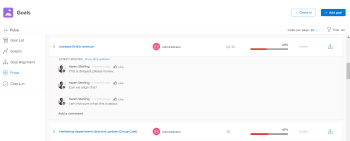

# Adobe Workfront 목표 섹션 개요

<!--Audited for P&P only: 10/2025-->

>[!NOTE]
>
>이전에 이 패키지를 구입한 경우 귀사에서 Adobe Workfront 목표를 계속 사용하도록 선택할 수 있습니다. 자세한 내용은 계정 담당자에게 문의하십시오.
>
>Adobe Workfront 목표를 더 이상 구매할 수 없습니다.
>
>Workfront 목표에 액세스하는 방법에 대한 자세한 내용은 [Workfront 목표 사용 요구 사항](/help/quicksilver/workfront-goals/goal-management/access-needed-for-wf-goals.md)을 참조하십시오.

<!--Old:

>[!IMPORTANT]
>
>Your organization must have the following to use the functionality described in this article:
>
>* For the new plan and license structure:
>
>   * The Ultimate Workfront plan 
>    
>* For the current plan and license structure: 
>
>   * A Pro or higher Workfront plan
>   * An Adobe Workfront Goals license in addition to a Workfront license.
>
>Contact your Workfront account manager to learn about a Workfront Goals license.    
> 
>For additional information about access to Workfront Goals, see [Requirements to use Workfront Goals](/help/quicksilver/workfront-goals/goal-management/access-needed-for-wf-goals.md).   -->

Workfront 관리자가 Workfront 목표에 대한 액세스 권한을 부여하면 본인이나 조직의 다른 사용자가 Workfront 목표 영역에서 만든 목표를 볼 수 있습니다.

목표 또는 개별 목표 목록에 액세스하고 Workfront 목표의 여러 섹션에서 관리할 수 있습니다. 사용할 섹션은 목표 작업을 수행할 때 달성하고자 하는 목적에 따라 다릅니다.

필터를 적용하여 각 섹션에서 자신에게 중요한 목표만 표시할 수 있습니다.

>[!TIP]
>
>한 섹션에서 업데이트된 필터는 목표 목록, 그래프 및 목표 정렬 섹션에 자동으로 적용됩니다. 이렇게 하면 한 번만 업데이트할 수 있습니다. 자세한 내용은 [Adobe Workfront 목표의 정보 필터링](../../workfront-goals/goal-management/filter-information-wf-goals.md)을 참조하십시오.

다음은 Workfront 목표 의 섹션과 목표 관리에 사용할 수 있는 옵션에 대한 간략한 개요입니다. Workfront 목표의 각 섹션 내에서 수행할 수 있는 추가 작업에 대한 자세한 내용은 다음 문서도 참조하십시오.

* [Adobe Workfront 목표에서 목표 만들기](../../workfront-goals/goal-management/create-goals.md)
* [Adobe Workfront 목표의 목표 진행 상황 업데이트](../../workfront-goals/goal-review-and-workfront-goals-sections/check-in-goals.md)
* [Adobe Workfront 목표의 정보 필터링](../../workfront-goals/goal-management/filter-information-wf-goals.md)

## 목표 목록

목표 목록을 사용하여 사용자, 팀, 그룹 또는 조직에 속한 목표를 검토할 수 있습니다. 모든 상태와 기간에서 목표를 볼 수 있습니다.

목표 목록 탐색 및 목표 관리에 대한 자세한 내용은 [Adobe Workfront 목표의 목표 목록에서 목표 관리](../../workfront-goals/goal-review-and-workfront-goals-sections/manage-goals-in-goal-list.md)를 참조하십시오.

목표 목록을 사용하여 다음을 수행합니다.

* 사용자, 팀, 그룹 또는 조직에 속한 목표를 봅니다.
* 목표 및 해당 정보(예: 이름, 소유자, 진행 상황 또는 조건)를 검토합니다.
* 새 목표를 추가합니다.

  자세한 내용은 [Adobe Workfront 목표에서 목표 만들기](../../workfront-goals/goal-management/create-goals.md)를 참조하십시오.

* 목표의 페이지에 액세스하고 목표, 결과 또는 활동을 편집하고 업데이트합니다

  자세한 내용은 [Adobe Workfront 목표의 목표 편집](../../workfront-goals/goal-management/edit-goals.md)을 참조하십시오.

* 목표 편집.

## 그래프

그래프 섹션을 사용하여 사용자 또는 조직에 속한 목표의 상태에 대한 거시적인 보기를 얻을 수 있습니다. 이 섹션에서 기간의 모든 상태에 있는 목표의 진행 정보를 볼 수 있습니다.

그래프 섹션을 사용하는 방법에 대한 자세한 내용은 [그래프 검토](../../workfront-goals/goal-review-and-workfront-goals-sections/review-goal-graphs.md)를 참조하여 Adobe Workfront 목표의 목표 진행률 트렌드를 파악하십시오.

그래프 섹션을 사용하여 다음을 수행합니다.

* 사용자, 팀, 그룹 또는 조직에 속한 목표의 성과를 봅니다.
* 주어진 진행 상태의 목표 수를 확인합니다.
* 매주 목표가 어떻게 수행되는지 이해합니다.

## 목표 정렬

목표가 서로 일치하면 목표 정렬 섹션을 사용하여 조직의 모든 목표와 목표를 서로 정렬한 사항을 표시하고 검토할 수 있습니다. 정렬된 목표는 여기에 연결된 카드에 표시되어 서로 정렬된 상태를 보여 줍니다. 상위 목표가 먼저 표시되고 하위 목표가 그 뒤에 쌓입니다. 이 섹션에서 모든 상태 및 기간의 목표를 볼 수 있습니다.

목표 관리를 위한 목표 정렬 섹션 탐색에 대한 자세한 내용은 [Adobe Workfront 목표의 목표 정렬 섹션 탐색](../../workfront-goals/goal-alignment/navigate-goal-alignment-chart.md)을 참조하십시오.

목표 정렬에 대한 자세한 내용은 다음 문서를 참조하십시오.

* [Adobe Workfront 목표에서 연결하여 목표 정렬](../../workfront-goals/goal-alignment/align-goals-by-connecting-them.md)
* [결과 및 활동을 목표로 변환하여 목표 정렬](../../workfront-goals/goal-alignment/align-goals-by-converting-results-activities.md)

[목표 정렬] 섹션을 사용하여 다음을 수행합니다.

* 사용자 또는 조직에 속한 목표를 카드 형식으로 봅니다.
* 목표 계층을 표시하고 정렬된 하위 목표를 봅니다.
* 목표 페이지에 액세스하여 목표, 결과 또는 활동을 업데이트합니다.

<!--
## Pulse

 The Pulse section has been removed from the Preview environment and will be removed from Workfront Goals with the 23.1 release. Use the Goal List area to review goals that you or your teams are responsible for. 

You can use the Pulse section to review and request updates to goals that might influence the progress of your goals. These could be your own goals, or goals that belong to your teams, groups, or your organization. You can view goals in any status and from any time period in this section.

>[!TIP]
>
>Only goals that have been checked in on at least once display in the Pulse section.

For information about reviewing goals using the Pulse section, see [Review goals in the Adobe Workfront Goals Pulse section](../../workfront-goals/goal-review-and-workfront-goals-sections/review-goals-in-pulse.md).

Use the Pulse section to do the following:

* View goals that belong to your teams, groups, or organization. 
* Review goal progress and updates, including aligned goals, their results, and activities. 
* Make or ask for updates to a goal by adding a comment. 
* Access the Goal Details panel and edit and update the goal, its results, or activities.
* Add new goals. 
* Check in on goals.

  >[!TIP]
  >
  >Clicking Check in opens the Check-in section in the left panel.

## Check-in

 The Check-in section has been removed from the Preview environment and will be removed from Workfront Goals with the 23.1 release. Use the Goal List area to review goals that you or your teams are responsible for.

You must have access to Edit Goals in your access level before you can access the Check- in section. For information about granting access to Goals, see  [Grant access to Adobe Workfront Goals](../../administration-and-setup/add-users/configure-and-grant-access/grant-access-goals.md).

You can use the Check-in section to update active goals and any results and activities that you are the owner of. You can primarily view only goals in an Active status in this section. Children goals aligned to active parents also display in the Check-in section, regardless of their status.

>[!IMPORTANT]
>
>* A goal displays in the Check-in section only if it is assigned to you or if it has a result or activity that is assigned to you. 
>* If a goal assigned to you is the child goal of a parent that is not assigned to you and your goal (the child goal) is closed, inactive, or a draft, the parent goal does not display in your Check-in section. 
>

For information about managing goals in the Goal List, see [Manage goals in the Goal List of Adobe Workfront Goals](../../workfront-goals/goal-review-and-workfront-goals-sections/manage-goals-in-goal-list.md).

Use the Check-in section to do the following:

* Review goal progress and updates, including aligned goals, their results, and activities. 
* Update the progress on the results and activities that are assigned to you. For information about updating goals by checking in on them, see [Update goal progress in Adobe Workfront Goals](../../workfront-goals/goal-review-and-workfront-goals-sections/check-in-goals.md).

  >[!IMPORTANT]
  >
  >You can check in only on the results and activities assigned to you in the Check-in section, and not those that are assigned to other entities.

* Add a comment to a goal, then click Post to make or ask for updates to a goal. 
* Access the Goal Details panel and edit and update the goal, its results, or activities.
* Add new goals.
-->
