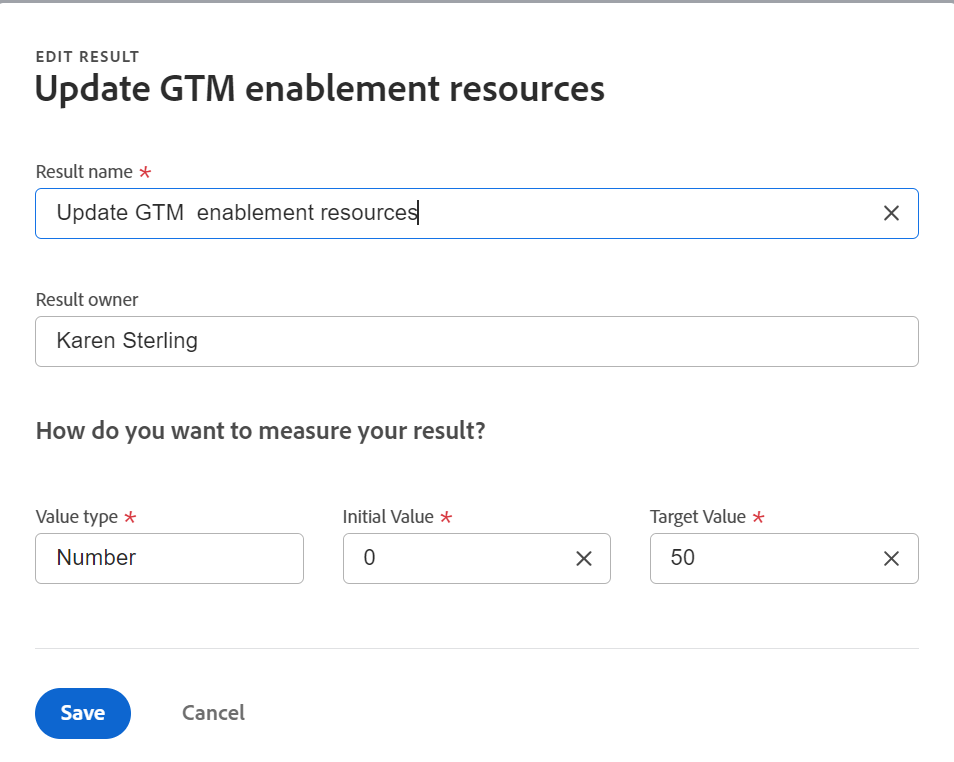
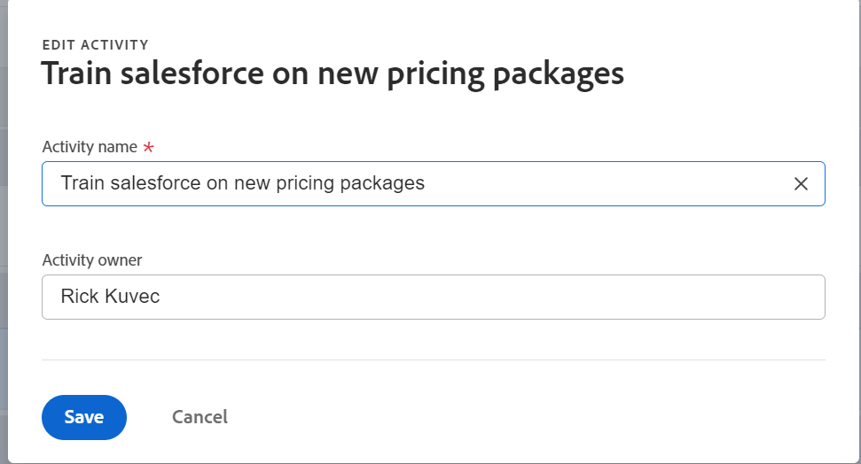

# Adobe Workfront 목표의 결과 및 활동 편집

Adobe Workfront 관리자가 Adobe Workfront 목표에 대한 올바른 액세스 권한을 부여하면 목표, 결과 및 활동을 만들고 편집할 수 있습니다.

목표, 결과 및 활동 생성에 대한 자세한 내용은 다음 문서를 참조하십시오.

* [Adobe Workfront 목표에서 목표 만들기](../../workfront-goals/goal-management/create-goals.md)
* [Adobe Workfront 목표의 결과 및 활동 시작](../../workfront-goals/results-and-activities/get-started-with-results-and-activities.md)
* [Adobe Workfront 목표에 결과 추가](../../workfront-goals/results-and-activities/add-results-to-goals.md)
* [Adobe Workfront 목표의 목표에 활동 추가](../../workfront-goals/results-and-activities/add-activities-to-goals.md)

## 액세스 요구 사항

<!--drafted for P&P release: replace the table below with this: 

<table style="table-layout:auto">
 <col>
 </col>
 <col>
 </col>
 <tbody>
  <tr>
   <td role="rowheader">Adobe Workfront plan*</td>
   <td>
   
Current plan: Select or higher

   Or
   
Legacy plan: Pro or higher

   
   </td>
  </tr>
  <tr>
   <td role="rowheader">Adobe Workfront license*</td>
   <td>
   
Current license: Contributor or higher

   Or
   
Legacy license: Request or higher
 
For more information, see <a href="../../administration-and-setup/add-users/access-levels-and-object-permissions/wf-licenses.md" class="MCXref xref">Adobe Workfront licenses overview</a>.
 </td>
  </tr>
  <tr>
   <td role="rowheader">Product</td>
   <td>
   
 Current product requirement: If you have the Select or Prime Adobe Workfront plan, you must also buy an additional Adobe Workfront Goals license.  Workfront Goals are included in the Ultimate Workfront Plan.

   Or
   
Legacy product requirement: You must purchase an additional license for the Adobe Workfront Goals to access functionality described in this article. 
 
For information, see <a href="../../workfront-goals/goal-management/access-needed-for-wf-goals.md" class="MCXref xref">Requirements to use Workfront Goals</a>. 
 </td>
  </tr>
  <tr>
   <td role="rowheader">Access level*</td>
   <td> 
Edit access to Goals
 
<b>NOTE</b>
If you still don't have access, ask your Workfront administrator if they set additional restrictions in your access level. For information on how a Workfront administrator can change your access level, see:

     <ul>
      <li> 
<a href="../../administration-and-setup/add-users/configure-and-grant-access/create-modify-access-levels.md" class="MCXref xref">Create or modify custom access levels</a> 
 </li>
      <li> 
<a href="../../administration-and-setup/add-users/configure-and-grant-access/grant-access-goals.md" class="MCXref xref">Grant access to Adobe Workfront Goals</a> 
 </li>
     </ul> 
 </td>
  </tr>
  <tr data-mc-conditions="">
   <td role="rowheader">Object permissions</td>
   <td>
    

     
View or higher permissions to the goal to view it

     
Manage permissions to the goal to edit it

     
For information about sharing goals, see <a href="../../workfront-goals/workfront-goals-settings/share-a-goal.md" class="MCXref xref">Share a goal in Workfront Goals</a>. 

    
 </td>
  </tr>
 </tbody>
</table>

-->
다음 항목이 있어야 합니다.

<table style="table-layout:auto"> 
 <col> 
 <col> 
 <tbody> 
  <tr> 
   <td role="rowheader">Adobe Workfront 플랜*</td> 
   <td> 
Pro 이상
 </td> 
  </tr> 
  <tr> 
   <td role="rowheader">Adobe Workfront 라이선스*</td> 
   <td> 
요청 이상
 
자세한 내용은 <a href="../../administration-and-setup/add-users/access-levels-and-object-permissions/wf-licenses.md" class="MCXref xref">Adobe Workfront 라이선스 개요</a>.
 </td> 
  </tr> 
  <tr> 
   <td role="rowheader">제품</td> 
   <td> 
이 문서에 설명된 기능에 액세스하려면 Adobe Workfront 목표에 대한 추가 라이센스를 구매해야 합니다. 
 
자세한 내용은 <a href="../../workfront-goals/goal-management/access-needed-for-wf-goals.md" class="MCXref xref">Workfront 목표 사용 요구 사항</a>. 
 </td> 
  </tr> 
  <tr> 
   <td role="rowheader">액세스 수준 구성*</td> 
   <td> 
목표에 대한 액세스 편집
 
<b>메모</b>

여전히 액세스 권한이 없는 경우 Workfront 관리자에게 액세스 수준에서 추가 제한 사항을 설정하는지 문의하십시오. Workfront 관리자가 액세스 수준을 변경하는 방법에 대한 자세한 내용은 다음을 참조하십시오.
 
     <ul> 
      <li> 
<a href="../../administration-and-setup/add-users/configure-and-grant-access/create-modify-access-levels.md" class="MCXref xref">사용자 정의 액세스 수준 만들기 또는 수정</a> 
 </li> 
      <li> 
<a href="../../administration-and-setup/add-users/configure-and-grant-access/grant-access-goals.md" class="MCXref xref">Adobe Workfront 목표에 대한 액세스 권한 부여</a> 
 </li> 
     </ul> 
 </td> 
  </tr> 
  <tr data-mc-conditions=""> 
   <td role="rowheader">개체 권한</td> 
   <td> 
    
 
     
목표에 대한 권한 관리
 
     
목표 공유에 대한 자세한 내용은 <a href="../../workfront-goals/workfront-goals-settings/share-a-goal.md" class="MCXref xref">Workfront 목표에서 목표 공유</a>. 
 
    
 </td> 
  </tr> 
 </tbody> 
</table>

*보유하고 있는 플랜, 라이선스 유형 또는 액세스를 알아보려면 Workfront 관리자에게 문의하십시오.

## 전제 조건

시작하려면 먼저 다음을 수행해야 합니다.

* 기본 메뉴의 목표 영역을 포함하는 레이아웃 템플릿.

## 결과 및 활동을 편집할 때의 고려 사항

<!--
According to Vazgen, access levels will add more considerations.)
-->

* 만든 목표에 속하는 결과 및 활동이나, 관리할 권한이 있는 목표에 대한 편집을 수행할 수 있습니다.
* Workfront 목표의 활동으로 목표에 연결된 프로젝트의 진행 상태는 편집할 수 없습니다. 프로젝트 진행 상태는 프로젝트의 작업이 완료되면 업데이트됩니다. 프로젝트 연결을 해제하여 목표에서 프로젝트를 제거할 수 있습니다. 자세한 내용은 문서의 &quot;프로젝트 연결 끊기&quot; 섹션을 참조하십시오 [Adobe Workfront 목표에 있는 결과, 활동 및 프로젝트를 제거합니다](../../workfront-goals/results-and-activities/remove-results-activities-from-goals.md).

   >[!NOTE]
   >
   >다음 프로젝트 정보가 프로젝트 수준에서 업데이트되면 Workfront 목표는 목표 수준에서 자동으로 업데이트됩니다.
   >
   >   
   >   
   >   * 프로젝트 소유자
   >   * 프로젝트 이름
   >   * 프로젝트 완료율

   >   
   >   
   >목표에 프로젝트 연결에 대한 자세한 내용은 [Adobe Workfront 목표의 목표에 프로젝트 추가](../../workfront-goals/results-and-activities/connect-projects-to-goals-overview.md).

* 목표 진행과 더 이상 관련이 없는 경우 목표에서 결과 및 활동을 삭제할 수 있습니다. 삭제된 결과 및 활동을 복구할 수 없습니다. 결과 및 활동 삭제에 대한 자세한 내용은 [Adobe Workfront 목표에 있는 결과, 활동 및 프로젝트를 제거합니다](../../workfront-goals/results-and-activities/remove-results-activities-from-goals.md).
* 과거에 을 포함하여 어떤 기간에서든 목표와 연관된 결과 및 활동을 편집할 수 있습니다.
* 결과 및 활동을 편집해도 해당 설정이 업데이트되고 진행 상태가 업데이트되지 않습니다. 결과 및 활동의 진행 상태를 업데이트해야 합니다. 목표, 결과 및 활동에 대한 진행 상황을 업데이트하는 방법에 대한 자세한 내용은 [Adobe Workfront 목표에서 목표 진행 상태 업데이트](../../workfront-goals/goal-review-and-workfront-goals-sections/check-in-goals.md).

## 결과 편집

<!--
Editing results differs depending on which environment you use.

### Edit results in the Production environment

1. Go to the goal for which you want to edit a result and click the goal name to open the **Goal Details** panel.
1. Click **Results**.
1. Click the **gear icon**  to the right of the result you want to edit.

   

1. Click **Edit** to edit the following information:

   | Field |Description|
   |---|---|
   | Name |The name of the result. |
   | Owner |The owner of result.  |
   | Value |How you measure the progress of the result. |
   | Initial |The original value of the result. |
   | Target |The desired value when the result is completed. |

1. Click **Save**.
-->

1. 을(를) 클릭합니다. **기본 메뉴** , 그런 다음 **목표**.
1. 목표 목록에서 목표 페이지를 열 목표 이름을 클릭합니다.
1. 클릭 **진행률 표시기** 왼쪽 패널에 표시됩니다.
1. 진행 지표 목록에서 결과를 선택하고 **편집** 아이콘 .

   결과 편집 상자가 열립니다.

   

1. 다음 정보를 편집합니다.
   * **결과 이름**: 결과의 이름입니다. 목표를 완료하기 위해 획득해야 하는 결과를 설명하는 이름을 사용합니다.
   * **결과 소유자**: 결과 소유자입니다. 소유자는 활성 Workfront 사용자여야 합니다.
   * **값 유형**: 결과의 진행 상황을 측정하는 방법입니다.
   * **초기값**: 결과의 원래 값입니다.
   * **Target 값**: 결과가 완료되었을 때 원하는 값입니다.
결과 필드에 대한 자세한 내용은 [목표에 결과 추가](../results-and-activities/add-results-to-goals.md).
1. **저장**&#x200B;을 클릭합니다.

## 활동 편집

<!--
Editing activities differs depending on which environment you use.

### Edit activities in the Production environment

>[!TIP]
>
>You cannot edit the Activity Type after you saved an activity on a goal.

1. Go to the goal for which you want to edit an activity and click the goal name to open the **Goal Details** panel.
1. Click **Activities**.
1. Click the **gear icon**  to the right of the activity you want to edit .

   

1. Click **Edit** to edit the following information:

   | Field |Description |
   |---|---|
   | Name |The name of the activity. |
   | Owner |The owner of activity.  |

1. Click **Save**.
-->

1. 을(를) 클릭합니다. **기본 메뉴** , 그런 다음 **목표**.
1. 목표 목록에서 목표 페이지를 열 목표 이름을 클릭합니다.
1. 클릭 **진행률 표시기** 왼쪽 패널에 표시됩니다.
1. 진행 지표 목록에서 활동을 선택하고 **편집** 아이콘 .

   활동 편집 상자가 열립니다.

   

1. 다음 정보를 편집합니다.
   * **활동 이름**: 활동의 이름입니다. 목표가 완료되었음을 나타내기 위해 수행해야 하는 활동을 설명하는 이름을 사용합니다.
   * **활동 소유자:** 활동의 소유자입니다. 소유자는 활성 Workfront 사용자여야 합니다.\
      활동 필드에 대한 자세한 내용은 [목표에 활동 추가](../results-and-activities/add-activities-to-goals.md).
1. **저장**&#x200B;을 클릭합니다.

