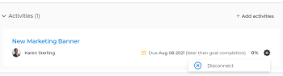

# Adobe Workfront 목표의 목표에서 진행 상태 표시기 제거

<!-- for goal redesign PRODUCTION RELEASE: Should this article be called "Remove or disconnect progress indicators from goals" when this is available to ALL progress indicators (including "disconnect goals")-- if yes, updte the title everywhere else where this is linked?
-->

결과, 활동 및 프로젝트가 더 이상 관련이 없는 경우 대상에서 제거할 수 있습니다.

목표 작성, 결과 및 활동 추가에 대한 자세한 내용은 다음 문서를 참조하십시오.

* [Adobe Workfront 목표에서 목표 만들기](../../workfront-goals/goal-management/create-goals.md)
* [Adobe Workfront 목표의 목표에 활동 추가](../../workfront-goals/results-and-activities/add-activities-to-goals.md)
* [Adobe Workfront 목표에 결과 추가](../../workfront-goals/results-and-activities/add-results-to-goals.md)
* [Adobe Workfront 목표의 결과 및 활동 편집](../../workfront-goals/results-and-activities/edit-results-and-activities.md)

목표를 상위 목표에 맞게 정렬하여 하위 목표를 만들 수도 있습니다. 하위 목표도 상위 목표의 진행 지표입니다.

목표 간의 연결을 제거하여 목표 간 정렬을 제거할 수 있습니다. 자세한 내용은 [Adobe Workfront 목표에서 목표 정렬 제거](../goal-alignment/remove-goal-alignment.md).

## 액세스 요구 사항

<!--drafted - replace the table below with this one when P&P releases: 

<table style="table-layout:auto">
 <col>
 </col>
 <col>
 </col>
 <tbody>
  <tr>
   <td role="rowheader">Adobe Workfront plan*</td>
   <td>
   
Current plan: Select or higher

   Or
   
Legacy plan: Pro or higher

   
   </td>
  </tr>
  <tr>
   <td role="rowheader">Adobe Workfront license*</td>
   <td>
   
Current license: Contributor or higher

   Or
   
Legacy license: Request or higher
 
For more information, see <a href="../../administration-and-setup/add-users/access-levels-and-object-permissions/wf-licenses.md" class="MCXref xref">Adobe Workfront licenses overview</a>.
 </td>
  </tr>
  <tr>
   <td role="rowheader">Product</td>
   <td>
   
 Current product requirement: If you have the Select or Prime Adobe Workfront plan, you must also buy an additional Adobe Workfront Goals license.  Workfront Goals are included in the Ultimate Workfront Plan.

   Or
   
Legacy product requirement: You must purchase an additional license for the Adobe Workfront Goals to access functionality described in this article. 
 
For information, see <a href="../../workfront-goals/goal-management/access-needed-for-wf-goals.md" class="MCXref xref">Requirements to use Workfront Goals</a>. 
 </td>
  </tr>
  <tr>
   <td role="rowheader">Access level*</td>
   <td> 
Edit access to Goals
 
<b>NOTE</b>
If you still don't have access, ask your Workfront administrator if they set additional restrictions in your access level. For information on how a Workfront administrator can change your access level, see:

     <ul>
      <li> 
<a href="../../administration-and-setup/add-users/configure-and-grant-access/create-modify-access-levels.md" class="MCXref xref">Create or modify custom access levels</a> 
 </li>
      <li> 
<a href="../../administration-and-setup/add-users/configure-and-grant-access/grant-access-goals.md" class="MCXref xref">Grant access to Adobe Workfront Goals</a> 
 </li>
     </ul> 
 </td>
  </tr>
  <tr data-mc-conditions="">
   <td role="rowheader">Object permissions</td>
   <td>
    

     
View or higher permissions to the goal to view it

     
Manage permissions to the goal to edit it

     
For information about sharing goals, see <a href="../../workfront-goals/workfront-goals-settings/share-a-goal.md" class="MCXref xref">Share a goal in Workfront Goals</a>. 

    
 </td>
  </tr>
 </tbody>
</table>
-->

다음 항목이 있어야 합니다.

<table style="table-layout:auto"> 
 <col> 
 <col> 
 <tbody> 
  <tr> 
   <td role="rowheader">Adobe Workfront 플랜*</td> 
   <td> 
Pro 이상
 </td> 
  </tr> 
  <tr> 
   <td role="rowheader">Adobe Workfront 라이선스*</td> 
   <td> 
요청 이상
 
자세한 내용은 <a href="../../administration-and-setup/add-users/access-levels-and-object-permissions/wf-licenses.md" class="MCXref xref">Adobe Workfront 라이선스 개요</a>.
 </td> 
  </tr> 
  <tr> 
   <td role="rowheader">제품</td> 
   <td> 
이 문서에 설명된 기능에 액세스하려면 Adobe Workfront 목표에 대한 추가 라이센스를 구매해야 합니다. 
 
자세한 내용은 <a href="../../workfront-goals/goal-management/access-needed-for-wf-goals.md" class="MCXref xref">Workfront 목표 사용 요구 사항</a>. 
 </td> 
  </tr> 
  <tr> 
   <td role="rowheader">액세스 수준 구성*</td> 
   <td> 
목표 이상에 대한 액세스 편집
 
<b>메모</b>
여전히 액세스 권한이 없는 경우 Workfront 관리자에게 액세스 수준에서 추가 제한 사항을 설정하는지 문의하십시오. Workfront 관리자가 액세스 수준을 변경하는 방법에 대한 자세한 내용은 다음을 참조하십시오.
 
     <ul> 
      <li> 
<a href="../../administration-and-setup/add-users/configure-and-grant-access/create-modify-access-levels.md" class="MCXref xref">사용자 정의 액세스 수준 만들기 또는 수정</a> 
 </li> 
      <li> 
<a href="../../administration-and-setup/add-users/configure-and-grant-access/grant-access-goals.md" class="MCXref xref">Adobe Workfront 목표에 대한 액세스 권한 부여</a> 
 </li> 
     </ul> 
 </td> 
  </tr> 
  <tr data-mc-conditions=""> 
   <td role="rowheader">개체 권한</td> 
   <td> 
    
 
     
목표에 대한 권한 관리
 
     
목표 공유에 대한 자세한 내용은 <a href="../../workfront-goals/workfront-goals-settings/share-a-goal.md" class="MCXref xref">Workfront 목표에서 목표 공유</a>. 
 
    
 </td> 
  </tr> 
 </tbody> 
</table>

*보유하고 있는 플랜, 라이선스 유형 또는 액세스를 알아보려면 Workfront 관리자에게 문의하십시오.

## 전제 조건

시작하려면 먼저 다음을 수행해야 합니다.

* 기본 메뉴의 목표 영역을 포함하는 레이아웃 템플릿.
* 결과, 활동 또는 프로젝트가 있는 목표.

## 결과, 활동 제거 및 목표에서 프로젝트 연결 끊기 위한 고려 사항

* 활성 목표에서만 결과 및 활동을 제거할 수 있습니다.
* 결과 및 활동을 삭제하여 목표에서 제거할 수 있습니다. 삭제된 결과 및 활동을 복구할 수 없습니다.
* 목표에서 결과나 활동을 제거하면 제거된 결과 또는 활동의 진행 상태가 목표의 전체 진행 상태에 영향을 줍니다.
* 목표에서 프로젝트를 삭제할 수는 없지만 목표에 대한 연결을 끊을 수 있습니다. 프로젝트에서 목표로부터 프로젝트 연결을 끊으면 프로젝트 완료율이 더 이상 목표 진행에 영향을 주지 않습니다.

   프로젝트가 목표 진행에 미치는 영향에 대한 자세한 내용은 [Adobe Workfront 목표의 목표에 프로젝트 추가](../../workfront-goals/results-and-activities/connect-projects-to-goals-overview.md).

* 목표에서 결과나 활동을 제거할 수 없으며, 목표의 마지막 진행 표시자인 경우 하위 목표나 프로젝트의 연결을 끊을 수 없습니다.
* 프로젝트 영역에서 프로젝트가 삭제되고 목표의 마지막 진행 상태 표시자인 경우 목표가 비활성 상태가 됩니다.

## 목표에서 결과 및 활동 삭제

결과 및 활동을 삭제하여 목표에서 제거합니다. 목표에서 결과와 활동을 삭제하는 것은 동일합니다.

<!--
How you delete results and activities differs depending on the environment you use.

### Delete results and activities in the Production environment

1. Click the **Main Menu** icon  > **Goals** in the upper-right corner.

   (!-- Add this when Shell is available to all: or (if available), click the **Main Menu** icon  in the upper-left corner)
   --)

   This opens the Workfront Goals area and the Goal List displays by default. 

1. Click the name of a goal you want to remove results and activities from.

   This opens the Goal Details panel on the right.

1. Click **Results** to remove results or **Activities** to remove activities. 

1. Click the **gear icon**  to the right of the result or activity name, then click **Delete** > **Yes, delete**.

   

   The result or activity is deleted and cannot be recovered. The percent complete of the goal updates to exclude the deleted activity or result.

-->

1. 을(를) 클릭합니다. **기본 메뉴** 아이콘  오른쪽 위 모서리에서 을(를) 클릭하고 **목표**.

   <!-- Add this when Shell is available to all: or (if available), click the **Main Menu** icon  in the upper-left corner)
   -->
   이렇게 하면 Workfront 목표 영역이 열리고 목표 목록이 기본적으로 표시됩니다.

1. 결과 및 활동을 제거할 목표의 이름을 클릭합니다.

   목표 페이지가 열립니다.

1. 클릭 **진행률 표시기** 왼쪽 패널에 표시됩니다.

1. 결과 또는 활동을 선택한 다음 **삭제** 아이콘  를 클릭합니다.

1. 클릭 **삭제** 를 클릭하여 삭제를 확인합니다. 결과 또는 활동이 삭제되어 복구할 수 없습니다. 목표 완료율이 삭제된 활동 또는 결과를 제외하도록 업데이트됩니다.

## 목표에서 프로젝트 제거

<!--
Dsconnecting projects from goals differs depending on the environment you use.

### Disconnect projects from goals in the Production environment

1. Click the **Main Menu** icon  > **Goals** in the upper-right corner.

   (!-- Add this when Shell is available to all: or (if available), click the **Main Menu** icon  in the upper-left corner)
   --)

   This opens the Workfront Goals area and the Goal List displays by default. 

1. Click the name of a goal you want to remove results and activities from.

   This opens the Goal Details panel on the right.

1. Click the **right-pointing arrow** to the left of the Activities sections to expand it. 
1. Click the **gear icon**  to the right of the project name, then click **Disconnect**.

   

   The project is disconnected from the goal. The percent complete of the goal updates to exclude the percent complete of the disconnected project.
-->

1. 을(를) 클릭합니다. **기본 메뉴** 오른쪽 상단 모서리의 아이콘을 클릭한 다음 **목표**.

   <!-- Add this when Shell is available to all: or (if available), click the **Main Menu** icon  in the upper-left corner)
   -->

   이렇게 하면 Workfront 목표 영역이 열리고 목표 목록이 기본적으로 표시됩니다.

1. 결과 및 활동을 제거할 목표의 이름을 클릭합니다.

   목표 페이지가 열립니다.
1. 클릭 **진행률 표시기** 왼쪽 패널에 표시됩니다.
1. 프로젝트를 선택한 다음 **연결 끊기** 아이콘  를 클릭합니다.
1. 클릭 **연결 끊기** 확인합니다.

   프로젝트는 더 이상 목표에 연결되지 않습니다. 연결이 끊어진 프로젝트를 제외하는 목표 업데이트의 완료율.

