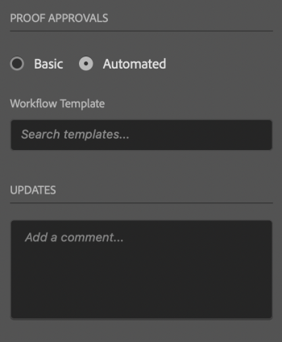

# 에서 증명 업로드 [!DNL Illustrator]

아트 보드를 증명을 바로 다음 위치에 업로드할 수 있습니다 [!DNL Adobe Workfront] 철저한 검토와 승인을 위해.

## 액세스 요구 사항

이 문서의 절차를 수행하려면 다음 액세스 권한이 있어야 합니다.

<table style="table-layout:auto"> 
 <col> 
 <col> 
 <tbody> 
 <tr> 
   <td role="rowheader">[!DNL Adobe Workfront] 플랜*</td> 
   <td> 
현재 계획: [!UICONTROL Pro] 이상
 
또는
 
기존 계획: [!UICONTROL Premium]
 
다양한 플랜으로 언어 교정에 대한 자세한 내용은 를 참조하십시오.
 </td> 
  </tr> 
  <tr> 
   <td role="rowheader">[!DNL Adobe Workfront] 라이센스*</td> 
   <td> 
현재 계획: [!UICONTROL Work] 또는 [!UICONTROL Proof]
 
기존 계획: 모두(사용자가 교정을 사용하도록 설정되어 있어야 함)
 </td> 
  </tr> 
  <tr> 
   <td role="rowheader">제품</td> 
   <td>다음을 수행해야 합니다. [!DNL Adobe Creative Cloud] 라이센스 [!DNL Workfront] 라이센스.</td> 
  </tr> 
  <tr> 
   <td role="rowheader">증명 권한 프로필 </td> 
   <td>[!UICONTROL Manager] 이상</td> 
  </tr> 
  <tr> 
   <td role="rowheader">개체 권한</td> 
   <td> 
[!UICONTROL Documents]에 대한 액세스 편집
 
추가 액세스 요청에 대한 자세한 내용은 <a href="../../workfront-basics/grant-and-request-access-to-objects/request-access.md" class="MCXref xref">개체에 대한 액세스 요청 </a>.
 </td> 
  </tr> 
 </tbody> 
</table>

&#42;어떤 계획, 역할 또는 증명 권한 프로필을 보유하고 있는지 알아보려면 [!DNL Workfront] 또는 [!DNL Workfront Proof] 관리자

## 전제 조건

* 을(를) 설치해야 합니다. [!DNL Adobe Workfront for design and video] 플러그인에서 증명을 업로드하기 전에 [!DNL Illustrator].

   자세한 내용은 [설치 [!DNL Adobe Workfront for design and video]](/help/quicksilver/workfront-integrations-and-apps/adobe-workfront-for-creative-cloud/wf-install-cc.md).

## 기본 증명 업로드

1. 을(를) 클릭합니다. **[!UICONTROL 메뉴]** 오른쪽 상단 모서리의 아이콘을 클릭한 다음 **[!UICONTROL 작업 목록]**. 메뉴를 사용하여 상위 객체를 탐색할 수도 있습니다.

   

1. 증명을 업로드할 작업 항목으로 이동합니다.
1. 을(를) 클릭합니다. **[!UICONTROL 문서]** 아이콘  을 클릭합니다.
1. 클릭 **[!UICONTROL 새 파일]** 플러그인의 하단 근처에 있습니다.
1. 를 활성화합니다 **[!UICONTROL 증명 만들기]** 토글.
1. 을(를) 선택합니다 **[!UICONTROL 자산 유형]** 를 클릭합니다.

   

1. 에서 **[!UICONTROL 증명 승인]** 섹션, **[!UICONTROL 기본]**.
1. (선택 사항) 승인자를 추가합니다.
1. (선택 사항) **[!UICONTROL 업데이트]** 영역.

   

1. (선택 사항)에 증명의 이름을 입력합니다 **[!UICONTROL 증명 이름]** 텍스트 상자
1. (선택 사항) 선택 **[!UICONTROL 외부 파일 추가]** 컴퓨터에서 파일을 추가하려면
1. 클릭 **[!UICONTROL 업로드]**&#x200B;그런 다음 위에서 선택한 자산 유형을 기준으로 원하는 내보내기 옵션을 구성합니다.

   \
   문서가 [!UICONTROL 문서] 영역(플러그인 및 데스크탑 앱)을 포함합니다.

## 자동화된 증명 업로드

1. 을(를) 클릭합니다. **[!UICONTROL 메뉴]** 오른쪽 상단 모서리의 아이콘을 클릭한 다음 **[!UICONTROL 작업 목록]**. 메뉴를 사용하여 상위 객체를 탐색할 수도 있습니다.

   

1. 증명을 업로드할 작업 항목으로 이동합니다.
1. 을(를) 클릭합니다. **[!UICONTROL 문서]** 아이콘  을 클릭합니다.

1. 클릭 **[!UICONTROL 새 파일]** 플러그인의 하단 근처에 있습니다.
1. 를 활성화합니다 **[!UICONTROL 증명 만들기]** 토글, 선택 **[!UICONTROL 자산 유형]** 를 클릭합니다.

   

1. 에서 **[!UICONTROL 증명 승인]** 섹션, **[!UICONTROL 자동화된]**.
1. (선택 사항)에서 **[!UICONTROL 워크플로우 템플릿]** 상자에 증명 워크플로우 템플릿의 이름을 입력합니다.

{{adjust-proof-settings}}

1. (선택 사항) **[!UICONTROL 업데이트]** 영역.

    <!-- new screenshot -->

1. (선택 사항)에 증명의 이름을 입력합니다 **[!UICONTROL 증명 이름]** 텍스트 상자
1. (선택 사항) 선택 **[!UICONTROL 외부 파일 추가]** 컴퓨터에서 파일을 추가하려면
1. 클릭 **[!UICONTROL 업로드]**&#x200B;그런 다음 위에서 선택한 자산 유형을 기준으로 원하는 내보내기 옵션을 구성합니다.

   \
   문서가 [!UICONTROL 문서] 영역(플러그인 및 데스크탑 앱)을 포함합니다.

## 새 증명 버전 업로드

새로운 버전의 증명을 업로드할 수 있습니다. 이 플러그인은 이전 버전에 설정된 교정 작업 과정을 기억하지만, 원할 경우 변경할 수 있습니다.

1. 을(를) 클릭합니다. **[!UICONTROL 메뉴]** 오른쪽 상단 모서리의 아이콘을 클릭한 다음 **[!UICONTROL 작업 목록]**. 메뉴를 사용하여 상위 객체를 탐색할 수도 있습니다.

   

1. 문서를 업로드해야 하는 작업 항목으로 이동합니다.
1. 을(를) 클릭합니다. **[!UICONTROL 문서]** 아이콘 을 클릭합니다.

1. 클릭 **[!UICONTROL 새 버전]** 플러그인의 하단 근처에 있습니다.
1. 을(를) 선택합니다 **[!UICONTROL 자산 유형]** 를 클릭합니다.
1. 를 활성화합니다 **[!UICONTROL 증명 만들기]** 토글, 선택 **[!UICONTROL 자산 유형]** 를 클릭합니다.

   

1. 에서 *[!UICONTROL *증명 승인]** 섹션, **[!UICONTROL 기본]** 또는 **[!UICONTROL 자동화된]**.

1. 추가 **[!UICONTROL 검토자]** 또는 **[!UICONTROL 워크플로우 템플릿]** 7단계에서 선택한 승인 유형에 따라 다릅니다.

1. (선택 사항) **[!UICONTROL 업데이트]** 영역.
1. 클릭 **[!UICONTROL 업로드]**그런 다음 위에서 선택한 자산 유형을 기준으로 원하는 내보내기 옵션을 구성합니다.
문서가 [!UICONTROL 문서] 영역(플러그인 및 데스크탑 앱)을 포함합니다.
