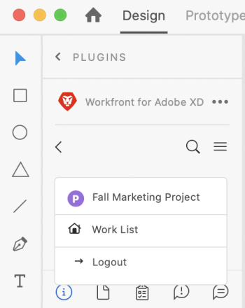

# [!DNL XD]개의 아트보드를 [!DNL Workfront]에 문서로 업로드

빠른 검토 및 승인을 위해 또는 간단히 [!DNL Adobe Workfront]에 저장할 문서로 아트보드를 업로드할 수 있습니다.

## 액세스 요구 사항

이 문서의 단계를 수행하려면 다음 액세스 권한이 있어야 합니다.

<table style="table-layout:auto"> 
 <col> 
 <col> 
 <tbody> 
  <tr> 
   <!-- <td role="rowheader">[!DNL Adobe Workfront] plan*</td> 
   <td> 
[!UICONTROL Pro] or higher
 </td> 
  </tr> 
  <tr data-mc-conditions=""> 
   <td role="rowheader">[!DNL Adobe Workfront] license*</td> 
   <td> 
[!UICONTROL Work] or [!UICONTROL Plan]
 </td> 
  </tr> 
  <tr> -->
   <td role="rowheader">제품</td> 
   <td>[!DNL Workfront] 라이선스 외에 [!DNL Adobe Creative Cloud] 라이선스가 있어야 합니다.</td> 
  </tr> 
  <tr> 
   <td role="rowheader">액세스 수준 구성*</td> 
   <td> 
[!UICONTROL 문서]에 대한 액세스 편집
 
참고: 여전히 액세스 권한이 없는 경우 [!DNL Workfront] 관리자에게 액세스 수준에 추가 제한을 설정했는지 문의하십시오. [!DNL Workfront] 관리자가 액세스 수준을 수정하는 방법에 대한 자세한 내용은 <a href="../../administration-and-setup/add-users/configure-and-grant-access/create-modify-access-levels.md" class="MCXref xref">사용자 지정 액세스 수준 만들기 또는 수정</a>을 참조하십시오.
 </td> 
  </tr> 
  <tr> 
   <td role="rowheader">개체 권한</td> 
   <td> 
문서를 업로드할 오브젝트에 대한 [!UICONTROL 보기] 이상 액세스 권한이 있습니다.
 
추가 액세스 요청에 대한 자세한 내용은 <a href="../../workfront-basics/grant-and-request-access-to-objects/request-access.md" class="MCXref xref">개체 </a>에 대한 액세스 요청 을 참조하십시오.
 </td> 
  </tr> 
 </tbody> 
</table>

&#42;플랜, 라이선스 유형 또는 액세스 권한을 확인하려면 [!DNL Workfront] 관리자에게 문의하세요.

## 전제 조건

* XD Art 게시판을 Workfront에 문서로 업로드하려면 먼저 [!DNL Adobe Workfront for XD] 플러그인을 설치해야 합니다.

지침은 [설치 [!DNL Adobe Workfront for XD]](/help/quicksilver/workfront-integrations-and-apps/adobe-workfront-for-creative-cloud/wf-adobe-xd-install.md)를 참조하십시오.

## 새 문서 추가

1. 오른쪽 상단의 **[!UICONTROL 메뉴]** 아이콘을 클릭한 다음 **[!UICONTROL 작업 목록]**&#x200B;을 선택합니다. 메뉴를 사용하여 상위 객체로 이동할 수도 있습니다.

   

1. 문서를 업로드할 작업 항목으로 이동합니다.
1. 탐색 모음에서 **[!UICONTROL 문서]** 아이콘 을(를) 클릭합니다.

1. 플러그 인 아래쪽의 **[!UICONTROL 새 파일]**&#x200B;을 클릭합니다.
1. 업로드할 아트보드를 선택합니다.

   >[!TIP]
   >
   >둘 이상의 대지를 선택하려면 원하는 대지 위로 마우스를 클릭하여 끕니다.
1. (선택 사항) **[!UICONTROL 업데이트]** 영역에 댓글을 입력합니다.
1. 드롭다운 메뉴에서 **[!UICONTROL 자산 유형]**&#x200B;을(를) 선택합니다.

   <table style="table-layout:auto">
    <col>
    <col>
    <tbody>
     <tr>
      <td colspan="2" role="rowheader">[!UICONTROL 내보내기 형식]</td>
     </tr>
     <tr>
      <td role="rowheader">PNG</td>
      <td>아트보드는 [!DNL Workfront]에 있는 작업 항목의 [!UICONTROL 문서] 탭에 PNG로 업로드됩니다. </td>
     </tr>
     <tr>
      <td role="rowheader">JPG</td>
      <td>아트보드는 [!DNL Workfront]에 있는 작업 항목의 [!UICONTROL 문서] 탭에 JPG으로 업로드됩니다.  </td>
     </tr>
     <tr>
      <td role="rowheader">SVG</td>
      <td>아트보드는 [!DNL Workfront]에 있는 작업 항목의 [!UICONTROL 문서] 탭에 SVG으로 업로드됩니다. </td>
     </tr>
     <tr>
      <td role="rowheader">PDF</td>
      <td>선택한 대지를 <strong>단일 PDF 파일</strong> 또는 <strong>여러 PDF 파일</strong>(으)로 업로드하려면 선택하십시오. 아트보드는 [!DNL Workfront]에 있는 작업 항목의 [!UICONTROL 문서] 탭에 PDF으로 업로드됩니다.</td>
     </tr>
    </tbody>
   </table>

1. **[!UICONTROL 업로드]**&#x200B;를 클릭합니다.\
   플러그 인 및 데스크톱 앱의 [!UICONTROL 문서] 영역에 문서가 표시됩니다.

## 새 버전 추가

1. 오른쪽 상단의 **[!UICONTROL 메뉴]** 아이콘을 클릭한 다음 **[!UICONTROL 작업 목록]**&#x200B;을 선택합니다. 메뉴를 사용하여 상위 객체로 이동할 수도 있습니다.

   

1. 문서를 업로드할 작업 항목으로 이동합니다.
1. 탐색 모음에서 **[!UICONTROL 문서]** 아이콘 을(를) 클릭합니다.

1. 새 버전을 추가할 문서를 클릭합니다.
1. 플러그 인의 맨 아래에 있는 **[!UICONTROL 새 버전]**&#x200B;을 클릭합니다.
1. 업로드할 아트보드를 선택합니다.

   >[!NOTE]
   >
   >새 버전의 SVG, PNG 또는 JPG을 업로드하려는 경우 하나의 아트보드만 업로드할 수 있습니다.

1. (선택 사항) **[!UICONTROL 업데이트]** 영역에 댓글을 입력합니다.

1. 드롭다운 메뉴에서 **[!UICONTROL 자산 유형]**&#x200B;을(를) 선택합니다.

   <table style="table-layout:auto">
    <col>
    <col>
    <tbody>
     <tr>
      <td colspan="2" role="rowheader">내보내기 형식</td>
     </tr>
     <tr>
      <td role="rowheader">PNG</td>
      <td>아트보드는 [!DNL Workfront]에 있는 작업 항목의 [!UICONTROL 문서] 탭에 PNG로 업로드됩니다. </td>
     </tr>
     <tr>
      <td role="rowheader">JPG</td>
      <td>아트보드는 [!DNL Workfront]에 있는 작업 항목의 [!UICONTROL 문서] 탭에 JPG으로 업로드됩니다.  </td>
     </tr>
     <tr>
      <td role="rowheader">SVG</td>
      <td>아트보드가 [!DNL Workfront]에 있는 작업 항목의 [!UICONTROL 문서] 탭에 SVG으로 업로드됩니다. </td>
     </tr>
     <tr>
      <td role="rowheader">PDF</td>
      <td>
아트보드는 [!DNL Workfront]에 있는 작업 항목의 [!UICONTROL 문서] 탭에 PDF으로 업로드됩니다.

      
<strong>참고</strong>: 새 문서 버전에 대해 하나의 아트보드만 업로드할 수 있습니다.

      </td>
     </tr>
    </tbody>
   </table>

1. **[!UICONTROL 업로드]**&#x200B;를 클릭합니다.\
   플러그 인 및 데스크톱 앱의 [!UICONTROL 문서] 영역에 문서가 표시됩니다.
