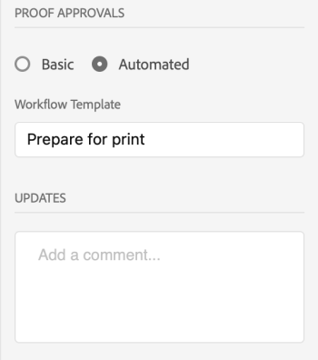
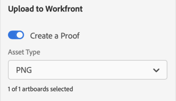

# [!DNL XD]개의 아트보드를 [!DNL Workfront]에 증명으로 업로드

대지를 증명으로 [!DNL Adobe Workfront]에 직접 업로드하여 검토 및 승인을 철저히 할 수 있습니다.

## 액세스 요구 사항

+++ 을 확장하여 이 문서의 기능에 대한 액세스 요구 사항을 봅니다.

이 문서의 단계를 수행하려면 다음 액세스 권한이 있어야 합니다.

<table style="table-layout:auto"> 
 <col> 
 <col> 
 <tbody> 
  <tr> 
   <td role="rowheader">[!DNL Adobe Workfront] 플랜*</td> 
   <td> 
현재 플랜: [!UICONTROL Pro] 이상
 
또는
 
레거시 플랜: [!UICONTROL Premium]
 
다른 플랜의 증명 액세스에 대한 자세한 내용은 을 참조하십시오.
 </td> 
  </tr> 
  <tr> 
   <td role="rowheader">[!DNL Adobe Workfront] 라이센스*</td> 
   <td> 
현재 계획: [!UICONTROL Work] 또는 [!UICONTROL Proof]
 
기존 계획: 모두(사용자에 대해 증명이 활성화되어 있어야 함)
 </td> 
  </tr> 
  <tr> 
   <td role="rowheader">제품</td> 
   <td>[!DNL Workfront] 라이선스 외에 [!DNL Adobe Creative Cloud] 라이선스가 있어야 합니다.</td> 
  </tr> 
  <tr> 
   <td role="rowheader">교정쇄 권한 프로필 </td> 
   <td>[!UICONTROL Manager] 이상</td> 
  </tr> 
  <tr> 
   <td role="rowheader">개체 권한</td> 
   <td> 
[!UICONTROL 문서]에 대한 액세스 편집
 
추가 액세스 요청에 대한 자세한 내용은 <a href="../../workfront-basics/grant-and-request-access-to-objects/request-access.md" class="MCXref xref">개체 </a>에 대한 액세스 요청 을 참조하십시오.
 </td> 
  </tr> 
 </tbody> 
</table>

&#42;플랜, 역할 또는 증명 권한 프로필이 있는지 확인하려면 [!DNL Workfront] 또는 [!DNL Workfront Proof] 관리자에게 문의하세요.

+++

## 전제 조건

* [!DNL Adobe XD]에서 증명을 업로드하려면 먼저 [!DNL Adobe Workfront for XD] 플러그인을 설치해야 합니다.

  지침은 [설치 [!DNL Adobe Workfront for XD]](/help/quicksilver/workfront-integrations-and-apps/adobe-workfront-for-creative-cloud/wf-adobe-xd-install.md)를 참조하십시오.

## 정적 증명 업로드

1. 오른쪽 상단의 **[!UICONTROL 메뉴]** 아이콘을 클릭한 다음 **[!UICONTROL 작업 목록]**&#x200B;을 선택합니다. 메뉴를 사용하여 상위 객체로 이동할 수도 있습니다.

   

1. 정적 증명을 업로드할 작업 항목으로 이동합니다.
1. 탐색 모음에서 **[!UICONTROL 문서]** 아이콘 을 클릭합니다.

1. 플러그 인 아래쪽의 **[!UICONTROL 새 파일]**&#x200B;을 클릭합니다.
1. 업로드할 아트보드를 선택합니다.

   >[!TIP]
   >
   >* 아트보드는 선택한 순서대로 증명에 나타납니다. 첫 번째로 선택한 대지는 증명의 첫 번째 페이지가 됩니다.
   >* 둘 이상의 대지를 빠르게 선택하려면 원하는 대지 위로 마우스를 클릭하여 끕니다. 따라서 증명에서 대지의 순서를 제어할 수 없습니다.

1. **[!UICONTROL 증명 만들기]**&#x200B;를 사용하도록 설정합니다.

1. 증명 이름을 지정합니다.

1. 원하는 증명 승인 유형을 선택합니다.

   <table style="table-layout:auto"> 
    <col> 
    <col> 
    <tbody> 
     <tr> 
      <td role="rowheader">[!UICONTROL Basic]: </td> 
      <td> 
기본 승인 프로세스는 임시로 진행되며 필요에 따라 다양한 검토자를 포함할 수 있습니다. 
 
       <ul> 
        <li> 
(선택 사항) 상자에 <strong>승인자</strong>를 추가합니다.
 </li> 
       </ul> </td> 
     </tr> 
     <tr> 
      <td role="rowheader">[!UICONTROL Automated]</td> 
      <td> 
자동 승인 프로세스는 관리자가 미리 빌드하며 특정 검토자와 단계를 포함합니다. 자세한 내용은 <a href="../../review-and-approve-work/proofing/proofing-overview/automated-workflow.md" class="MCXref xref">자동화된 워크플로 개요</a>를 참조하십시오.
 
       <ul> 
        <li> 
드롭다운 메뉴에서 [!UICONTROL 워크플로우 템플릿]을 선택합니다.
 </li> 
       </ul> </td> 
     </tr> 
    </tbody> 
   </table>

{{adjust-proof-settings}}

1. (선택 사항) **[!UICONTROL 업데이트]** 영역에 댓글을 입력합니다.

   

1. **[!UICONTROL 자산 유형]** 드롭다운 메뉴에서 내보내기 형식을 선택합니다.

1. (선택 사항) PDF을 에셋 유형으로 선택하고 둘 이상의 아트보드를 선택한 경우, 아트보드를 **[!UICONTROL 단일 PDF 파일]s** 또는 **M[!UICONTROL 여러 PDF 파일]**(으)로 내보내시겠습니까?

1. (선택 사항) PDF 이름을 지정합니다.

   

1. **[!UICONTROL 업로드]**&#x200B;를 클릭합니다.\
   플러그 인 및 데스크톱 앱의 [!UICONTROL 문서] 영역에 문서가 표시됩니다.

## 대화형 증명 업로드 {#upload-an-interactive-proof}

[!DNL Workfront for Adobe] 플러그인으로 대지에 대한 대화형 증명을 만들 수 있습니다. 2단계 프로세스입니다. 먼저 대화형 링크를 만든 다음 작업 항목에 증명을 업로드해야 합니다.

### 아트보드용 대화형 링크 만들기  {#create-an-interactive-link-for-your-art-board}

1. 대지를 연 다음 화면의 왼쪽 상단 영역에서 **[!UICONTROL 공유]**&#x200B;를 클릭합니다.
1. 링크 설정을 지정합니다.

   1. 링크의 이름을 지정합니다.
   1. 보기 설정을 선택합니다.
   1. **[!UICONTROL 링크 액세스]** 섹션에서 **[!UICONTROL 이 링크가 있는 모든 사용자]**&#x200B;를 선택했는지 확인하십시오.

      대화형 증명을 생성하려면 이 유형의 액세스를 활성화해야 합니다.

   1. **[!UICONTROL 링크 만들기]**&#x200B;를 클릭합니다.

1. 화면의 왼쪽 상단 영역에서 **[!UICONTROL 디자인]**(으)로 돌아가기 를 클릭합니다. 아래의 [대화형 증명 업로드](#upload-an-interactive-proof) 섹션을 계속합니다.

   >[!NOTE]
   >
   >화면의 왼쪽 아래 모서리에 있는 플러그인 패널을 다시 열어야 할 수도 있습니다.

### 대화형 증명 업로드

1. 오른쪽 상단의 **[!UICONTROL 메뉴]** 아이콘을 클릭한 다음 **[!UICONTROL 작업 목록]**&#x200B;을 선택합니다. 메뉴를 사용하여 상위 객체로 이동할 수도 있습니다.

   

1. 대화형 증명을 업로드할 작업 항목으로 이동합니다.
1. 탐색 모음에서 **[!UICONTROL 문서]** 아이콘 을 클릭합니다.

1. 플러그 인 아래쪽의 **[!UICONTROL 새 파일]**&#x200B;을 클릭합니다.
1. **[!UICONTROL 증명 만들기]**&#x200B;를 사용하도록 설정합니다.

1. 원하는 증명 승인 유형을 선택합니다.

   <table style="table-layout:auto"> 
    <col> 
    <col> 
    <tbody> 
     <tr> 
      <td role="rowheader">[!UICONTROL Basic]: </td> 
      <td> 
기본 승인 프로세스는 임시로 진행되며 필요에 따라 다양한 검토자를 포함할 수 있습니다. 
 
       <ul> 
        <li> 
(선택 사항) 상자에 <strong>승인자</strong>를 추가합니다.
 </li> 
       </ul> </td> 
     </tr> 
     <tr> 
      <td role="rowheader">[!UICONTROL Automated]</td> 
      <td> 
자동 승인 프로세스는 관리자가 미리 빌드하며 특정 검토자와 단계를 포함합니다. 자세한 내용은 <a href="../../review-and-approve-work/proofing/proofing-overview/automated-workflow.md" class="MCXref xref">자동화된 워크플로 개요</a>를 참조하십시오.
 
       <ul> 
        <li> 
드롭다운 메뉴에서 [!UICONTROL 워크플로우 템플릿]을 선택합니다.
 </li> 
       </ul> </td> 
     </tr> 
    </tbody> 
   </table>

{{adjust-proof-settings}}

1. (선택 사항) **[!UICONTROL 업데이트]** 영역에 댓글을 입력합니다.

   

1. **[!UICONTROL 자산 유형]** 드롭다운 메뉴에서 **공유 링크** 탭에서 방금 만든 링크를 선택합니다. 자세한 내용은 [아트보드용 대화형 링크 만들기](#create-an-interactive-link-for-your-artboard)를 참조하십시오.\
   

1. **[!UICONTROL 업로드]**&#x200B;를 클릭합니다.

   플러그 인 및 데스크톱 앱의 [!UICONTROL 문서] 영역에 문서가 표시됩니다.

   >[!IMPORTANT]
   >
   >대화형 증명을 검토하고 승인하려면 사용자가 [!UICONTROL 데스크톱 증명 뷰어]에 액세스할 수 있어야 합니다. 자세한 내용은 [Desktop Proofing Viewer 설치]](../../review-and-approve-work/proofing/use-the-desktop-proofing-viewer/installing-desktop-proofing-viewer.md)를 참조하십시오.[!UICONTROL 

## 새 증명 버전 업로드

새 증명 버전을 업로드할 수 있습니다. 플러그인은 이전 버전에 설정된 증명 워크플로를 기억하지만, 원할 경우 변경할 수 있습니다.

1. 오른쪽 상단의 **[!UICONTROL 메뉴]** 아이콘을 클릭한 다음 **[!UICONTROL 작업 목록]**&#x200B;을 선택합니다. 메뉴를 사용하여 상위 객체로 이동할 수도 있습니다.

   

1. 문서를 업로드해야 하는 작업 항목으로 이동합니다.
1. 탐색 모음에서 **[!UICONTROL 문서]** 아이콘 을 클릭합니다.

1. 플러그 인의 맨 아래에 있는 **[!UICONTROL 새 버전]**&#x200B;을 클릭합니다.
1. **[!UICONTROL 증명 만들기]**&#x200B;를 사용하도록 설정합니다.
1. 업로드할 아트보드를 선택합니다.

   >[!NOTE]
   >
   >새 버전의 .svg, .png 또는 .jpg를 업로드하려는 경우 하나의 아트보드만 업로드할 수 있습니다.

1. 원하는 증명 승인 유형을 선택합니다.

   <table style="table-layout:auto"> 
    <col> 
    <col> 
    <tbody> 
     <tr> 
      <td role="rowheader">[!UICONTROL Basic]: </td> 
      <td> 
기본 승인 프로세스는 임시로 진행되며 필요에 따라 다양한 검토자를 포함할 수 있습니다. 
 
       <ul> 
        <li> 
(선택 사항) 상자에 <strong>승인자</strong>를 추가합니다.
 </li> 
       </ul> </td> 
     </tr> 
     <tr> 
      <td role="rowheader">[!UICONTROL Automated]</td> 
      <td> 
자동 승인 프로세스는 관리자가 미리 빌드하며 특정 검토자와 단계를 포함합니다. 자세한 내용은 <a href="../../review-and-approve-work/proofing/proofing-overview/automated-workflow.md" class="MCXref xref">자동화된 워크플로 개요</a>를 참조하십시오.
 
       <ul> 
        <li> 
드롭다운 메뉴에서 [!UICONTROL 워크플로우 템플릿]을 선택합니다.
 </li> 
       </ul> </td> 
     </tr> 
    </tbody> 
   </table>

{{adjust-proof-settings}}

1. **[!UICONTROL 자산 유형]** 드롭다운 메뉴에서 내보내기 형식을 선택합니다.

   

1. (선택 사항) **[!UICONTROL 업데이트]** 영역에 댓글을 입력합니다.

   

1. (선택 사항) PDF을 에셋 유형으로 선택하고 둘 이상의 아트보드를 선택한 경우, 아트보드를 **[!UICONTROL 단일 PDF 파일]s** 또는 **M[!UICONTROL 여러 PDF 파일]**(으)로 내보내시겠습니까?

1. (선택 사항) PDF 이름을 지정합니다.

   PDF 옵션

1. **[!UICONTROL 업로드]**&#x200B;를 클릭합니다.\
   플러그 인 및 데스크톱 앱의 [!UICONTROL 문서] 영역에 문서가 표시됩니다.
