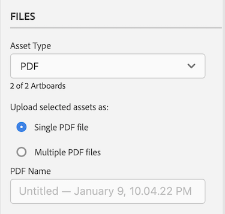

# 업로드 [!DNL XD] 증명을 사용하여 보드 [!DNL Workfront]

대지에 증명을 바로 업로드할 수 있습니다 [!DNL Adobe Workfront] 철저한 검토와 승인을 위해.

## 액세스 요구 사항

이 문서의 절차를 수행하려면 다음 액세스 권한이 있어야 합니다.

<table style="table-layout:auto"> 
 <col> 
 <col> 
 <tbody> 
  <tr> 
   <td role="rowheader">[!DNL Adobe Workfront] 플랜*</td> 
   <td> 
현재 계획: [!UICONTROL Pro] 이상
 
또는
 
기존 계획: [!UICONTROL Premium]
 
다양한 플랜으로 언어 교정에 대한 자세한 내용은 를 참조하십시오.
 </td> 
  </tr> 
  <tr> 
   <td role="rowheader">[!DNL Adobe Workfront] 라이센스*</td> 
   <td> 
현재 계획: [!UICONTROL Work] 또는 [!UICONTROL Proof]
 
기존 계획: 모두(사용자가 교정을 사용하도록 설정되어 있어야 함)
 </td> 
  </tr> 
  <tr> 
   <td role="rowheader">제품</td> 
   <td>다음을 수행해야 합니다. [!DNL Adobe Creative Cloud] 라이센스 [!DNL Workfront] 라이센스.</td> 
  </tr> 
  <tr> 
   <td role="rowheader">증명 권한 프로필 </td> 
   <td>[!UICONTROL Manager] 이상</td> 
  </tr> 
  <tr> 
   <td role="rowheader">개체 권한</td> 
   <td> 
[!UICONTROL Documents]에 대한 액세스 편집
 
추가 액세스 요청에 대한 자세한 내용은 <a href="../../workfront-basics/grant-and-request-access-to-objects/request-access.md" class="MCXref xref">개체에 대한 액세스 요청 </a>.
 </td> 
  </tr> 
 </tbody> 
</table>

&#42;어떤 계획, 역할 또는 증명 권한 프로필을 보유하고 있는지 알아보려면 [!DNL Workfront] 또는 [!DNL Workfront Proof] 관리자

## 전제 조건

* 을(를) 설치해야 합니다. [!DNL Adobe Workfront for XD] 플러그인에서 증명을 업로드하기 전에 [!DNL Adobe XD].

   자세한 내용은 [설치 [!DNL Adobe Workfront for XD]](/help/quicksilver/workfront-integrations-and-apps/adobe-workfront-for-creative-cloud/wf-adobe-xd-install.md).

## 정적 증명 업로드

1. 을(를) 클릭합니다. **[!UICONTROL 메뉴]** 오른쪽 상단 모서리의 아이콘을 클릭한 다음 **[!UICONTROL 작업 목록]**. 메뉴를 사용하여 상위 객체를 탐색할 수도 있습니다.

   

1. 정적 증명을 업로드할 작업 항목으로 이동합니다.
1. 을(를) 클릭합니다. **[!UICONTROL 문서]** 아이콘  을 클릭합니다.

1. 클릭 **[!UICONTROL 새 파일]** 플러그인의 하단 근처에 있습니다.
1. 업로드할 대지를 선택합니다.

   >[!TIP]
   >
   >두 개 이상의 대지를 선택하려면 원하는 대지를 클릭하여 드래그합니다.

1. 활성화 **[!UICONTROL 증명 만들기]**.

1. 증명 이름을 지정합니다.

1. 원하는 증명 승인 유형을 선택합니다.

   <table style="table-layout:auto"> 
    <col> 
    <col> 
    <tbody> 
     <tr> 
      <td role="rowheader">[!UICONTROL Basic]: </td> 
      <td> 
기본 승인 프로세스는 임시로 수행되며, 필요에 따라 서로 다른 검토자를 포함할 수 있습니다. 
 
       <ul> 
        <li> 
(선택 사항) 추가 <strong>승인자</strong> 상자에 표시합니다.
 </li> 
       </ul> </td> 
     </tr> 
     <tr> 
      <td role="rowheader">[!UICONTROL Automated]</td> 
      <td> 
자동 승인 프로세스는 관리자가 미리 작성하여 특정 검토자와 단계를 포함합니다. 자세한 내용은 <a href="../../review-and-approve-work/proofing/proofing-overview/automated-workflow.md" class="MCXref xref">자동화된 워크플로우 개요</a>.
 
       <ul> 
        <li> 
드롭다운 메뉴에서 [!UICONTROL Workflow Template] 을 선택합니다.
 </li> 
       </ul> </td> 
     </tr> 
    </tbody> 
   </table>

1. (선택 사항) **[!UICONTROL 업데이트]** 영역.

   

1. 에서 내보내기 형식을 선택합니다 **[!UICONTROL 자산 유형]** 드롭다운 메뉴

1. (선택 사항) PDF을 자산 유형으로 선택하고 둘 이상의 대지를 선택한 경우 대지를 다른 이름으로 내보내려면 선택합니다 **[!UICONTROL 단일 PDF 파일]s** 또는 **M[!UICONTROL 여러 PDF 파일]**.

1. (선택 사항) PDF 이름을 지정합니다.

   

1. 클릭 **[!UICONTROL 업로드]**.\
   문서가 [!UICONTROL 문서] 영역(플러그인 및 데스크탑 앱)을 포함합니다.

## 대화형 증명 업로드 {#upload-an-interactive-proof}

를 사용하여 문서에 대한 대화형 증명을 만들 수 있습니다 [!DNL Workfront for Adobe] 플러그인. 2단계 프로세스입니다. 먼저 대화형 링크를 만들어야 하는 경우, 증명을 작업 항목에 업로드해야 합니다.

### 아트보드용 대화형 링크 만들기  {#create-an-interactive-link-for-your-art-board}

1. 대지를 열고 **[!UICONTROL 공유]** 화면 왼쪽 위 영역에 있습니다.
1. 링크 설정을 지정합니다.

   1. 링크 이름을 지정합니다.
   1. 보기 설정을 선택합니다.
   1. 에서 **[!UICONTROL 링크 액세스]** 섹션, **[!UICONTROL 이 링크를 가진 모든 사용자]** 이 선택되어 있습니다.

      대화형 증명을 생성하려면 이러한 유형의 액세스를 활성화해야 합니다.

   1. 클릭 **[!UICONTROL 링크 만들기]**.

1. 뒤로 를 클릭하여 **[!UICONTROL 디자인]** 화면 왼쪽 위 영역에 있습니다. 계속 [대화형 증명 업로드](#upload-an-interactive-proof) 섹션을 참조하십시오.

   >[!NOTE]
   >
   >화면의 왼쪽 하단 모서리에 있는 플러그인 패널을 다시 열어야 할 수 있습니다.

### 대화형 증명 업로드

1. 을(를) 클릭합니다. **[!UICONTROL 메뉴]** 오른쪽 상단 모서리의 아이콘을 클릭한 다음 **[!UICONTROL 작업 목록]**. 메뉴를 사용하여 상위 객체를 탐색할 수도 있습니다.

   

1. 대화형 증명을 업로드할 작업 항목으로 이동합니다.
1. 을(를) 클릭합니다. **[!UICONTROL 문서]** 아이콘  을 클릭합니다.

1. 클릭 **[!UICONTROL 새 파일]** 플러그인의 하단 근처에 있습니다.
1. 활성화 **[!UICONTROL 증명 만들기]**.

1. 원하는 증명 승인 유형을 선택합니다.

   <table style="table-layout:auto"> 
    <col> 
    <col> 
    <tbody> 
     <tr> 
      <td role="rowheader">[!UICONTROL Basic]: </td> 
      <td> 
기본 승인 프로세스는 임시로 수행되며, 필요에 따라 서로 다른 검토자를 포함할 수 있습니다. 
 
       <ul> 
        <li> 
(선택 사항) 추가 <strong>승인자</strong> 상자에 표시합니다.
 </li> 
       </ul> </td> 
     </tr> 
     <tr> 
      <td role="rowheader">[!UICONTROL Automated]</td> 
      <td> 
자동 승인 프로세스는 관리자가 미리 작성하여 특정 검토자와 단계를 포함합니다. 자세한 내용은 <a href="../../review-and-approve-work/proofing/proofing-overview/automated-workflow.md" class="MCXref xref">자동화된 워크플로우 개요</a>.
 
       <ul> 
        <li> 
드롭다운 메뉴에서 [!UICONTROL Workflow Template] 을 선택합니다.
 </li> 
       </ul> </td> 
     </tr> 
    </tbody> 
   </table>

1. (선택 사항) **[!UICONTROL 업데이트]** 영역.

   

1. 에서 **[!UICONTROL 자산 유형]** 드롭다운 메뉴에서 **공유 링크** 탭. 자세한 내용은 [아트보드용 대화형 링크 만들기](#create-an-interactive-link-for-your-artboard).\
   

1. 클릭 **[!UICONTROL 업로드]**.

   문서가 [!UICONTROL 문서] 영역(플러그인 및 데스크탑 앱)을 포함합니다.

   >[!IMPORTANT]
   >
   >사용자는 [!UICONTROL 데스크탑 언어 교정 뷰어] 대화형 증명을 검토하고 승인하려면 다음을 수행하십시오. 자세한 내용은 [[!UICONTROL 데스크탑 증명 뷰어 설치를 참조하십시오]](../../review-and-approve-work/proofing/use-the-desktop-proofing-viewer/installing-desktop-proofing-viewer.md).

## 새 증명 버전 업로드

새로운 버전의 증명을 업로드할 수 있습니다. 이 플러그인은 이전 버전에 설정된 교정 작업 과정을 기억하지만, 원할 경우 변경할 수 있습니다.

1. 을(를) 클릭합니다. **[!UICONTROL 메뉴]** 오른쪽 상단 모서리의 아이콘을 클릭한 다음 **[!UICONTROL 작업 목록]**. 메뉴를 사용하여 상위 객체를 탐색할 수도 있습니다.

   

1. 문서를 업로드해야 하는 작업 항목으로 이동합니다.
1. 을(를) 클릭합니다. **[!UICONTROL 문서]** 아이콘 을 클릭합니다.

1. 클릭 **[!UICONTROL 새 버전]** 플러그인의 하단 근처에 있습니다.
1. 활성화 **[!UICONTROL 증명 만들기]**.
1. 업로드할 대지를 선택합니다.

   >[!NOTE]
   >
   >새 버전의 .svg, .png 또는 .jpg를 업로드하려면 하나의 대지만 업로드할 수 있습니다.

1. 원하는 증명 승인 유형을 선택합니다.

   <table style="table-layout:auto"> 
    <col> 
    <col> 
    <tbody> 
     <tr> 
      <td role="rowheader">[!UICONTROL Basic]: </td> 
      <td> 
기본 승인 프로세스는 임시로 수행되며, 필요에 따라 서로 다른 검토자를 포함할 수 있습니다. 
 
       <ul> 
        <li> 
(선택 사항) 추가 <strong>승인자</strong> 상자에 표시합니다.
 </li> 
       </ul> </td> 
     </tr> 
     <tr> 
      <td role="rowheader">[!UICONTROL Automated]</td> 
      <td> 
자동 승인 프로세스는 관리자가 미리 작성하여 특정 검토자와 단계를 포함합니다. 자세한 내용은 <a href="../../review-and-approve-work/proofing/proofing-overview/automated-workflow.md" class="MCXref xref">자동화된 워크플로우 개요</a>.
 
       <ul> 
        <li> 
드롭다운 메뉴에서 [!UICONTROL Workflow Template] 을 선택합니다.
 </li> 
       </ul> </td> 
     </tr> 
    </tbody> 
   </table>

1. 에서 내보내기 형식을 선택합니다 **[!UICONTROL 자산 유형]** 드롭다운 메뉴

   

1. (선택 사항) **[!UICONTROL 업데이트]** 영역.

   

1. (선택 사항) PDF을 자산 유형으로 선택하고 둘 이상의 대지를 선택한 경우 대지를 다른 이름으로 내보내려면 선택합니다 **[!UICONTROL 단일 PDF 파일]s** 또는 **M[!UICONTROL 여러 PDF 파일]**.

1. (선택 사항) PDF 이름을 지정합니다.

   

1. 클릭 **[!UICONTROL 업로드]**.\
   문서가 [!UICONTROL 문서] 영역(플러그인 및 데스크탑 앱)을 포함합니다.
