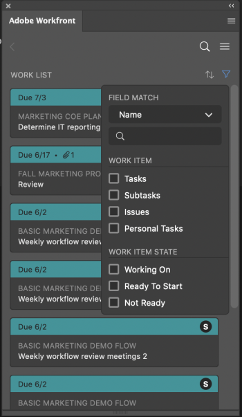

# 다음 아이콘을 사용하여 작업 찾기 [!DNL Adobe Workfront] 플러그인

에서 자신에게 할당된 작업을 찾습니다. [!DNL Adobe Workfront] 다음 사항을 종료하지 않고 [!DNL Adobe Creative Cloud] 애플리케이션:

{{cc-app-list}}

## 액세스 요구 사항

이 문서의 절차를 수행하려면 다음 액세스 권한이 있어야 합니다.

<table style="table-layout:auto"> 
 <col> 
 <col> 
 <tbody> 
 <!-- <tr> 
   <td role="rowheader">[!DNL Adobe Workfront] plan*</td> 
   <td> 
[!UICONTROL Pro] or higher
 </td> 
  </tr> 
  <tr data-mc-conditions=""> 
   <td role="rowheader">[!DNL Adobe Workfront] license*</td> 
   <td> 
[!UICONTROL Work] or [!UICONTROL Plan]
 </td> 
  </tr> -->
  <tr> 
   <td role="rowheader">제품</td> 
   <td>다음을 수행해야 합니다. [!DNL Adobe Creative Cloud] 라이센스 [!DNL Workfront] 라이센스.</td> 
  </tr> 
 </tbody> 
</table>

&#42;어떤 계획, 라이센스 유형 또는 액세스 권한을 보유하고 있는지 확인하려면 [!DNL Workfront] 관리자

## 전제 조건

{{cc-install-prereq}}

## 를 사용하십시오 [!UICONTROL 작업 목록] 중요한 정보에 액세스

다음 [!UICONTROL 작업 목록] 자신에게 할당된 모든 작업 및 문제를 한 곳에서 볼 수 있습니다. 를 사용할 수 있습니다 [!UICONTROL 정렬 기준] 항목을 함께 그룹화한 다음 [!UICONTROL 필터] 완성해야 하는 일에 집중하기 위해서.

### 유사한 작업 항목을 와 함께 그룹화 [!DNL Sort By] 옵션

를 사용하십시오 [!UICONTROL 정렬 기준] 옵션을 사용하여 [!UICONTROL 작업 목록]. 다음을 기준으로 정렬할 수 있습니다.

<table style="table-layout:auto"> 
 <col> 
 <col> 
 <tbody> 
  <tr> 
   <td> 
    <ul> 
     <li>[!UICONTROL 기한]</li> 
     <li>[!UICONTROL Name]</li> 
     <li>[!UICONTROL 프로젝트 이름]</li> 
     <li>[!UICONTROL My Priority]</li> 
    </ul> </td> 
   <td>  </td> 
  </tr> 
 </tbody> 
</table>

### 필터를 사용하여 포커스 좁히기

를 사용하십시오 [!UICONTROL 필터] 특정 작업 항목으로 포커스를 좁히려면 다음을 수행합니다. 필터를 사용하는 두 가지 방법이 있습니다.

 

<table style="table-layout:auto"> 
 <col> 
 <col> 
 <tbody> 
  <tr> 
   <td> 
첫 번째 단계는 작업 항목 유형 또는 속성만 기준으로 필터링합니다.
 
    <ul> 
     <li><strong>작업 항목</strong>: 작업, 하위 작업, 문제 또는 개인 작업</li> 
     <li><strong>작업 항목 상태</strong>: [!UICONTROL 작업 중], [!UICONTROL 시작 준비] 또는 [!UICONTROL 준비 안 됨]</li> 
    </ul> 
두 번째는 작업 항목과 작업 항목 상태를 함께 사용하여 필터링하는 것입니다. 예를 들어 작업 및 [!UICONTROL 시작 준비]를 선택하여 작업 목록에서 작업 준비가 된 모든 작업을 찾을 수 있습니다.
 
[!UICONTROL 필드 일치] 를 사용하여 필터 세트 내에서 특정 항목을 검색할 수도 있습니다. 
 </td> 
   <td>  </td> 
  </tr> 
 </tbody> 
</table>

## 작업 검색

를 사용하십시오 [!UICONTROL 검색] 필요한 프로젝트, 작업, 문제 및 문서를 찾기 위한 막대형

<table style="table-layout:auto"> 
 <col> 
 <col> 
 <tbody> 
  <tr> 
   <td> 
    <ul> 
     <li>최근 항목을 참조하십시오. Workfront의 데스크탑 또는 플러그인 버전을 통해 액세스한 최신 작업 항목 중 최대 5개를 볼 수 있습니다.</li> 
     <li>고정된 항목 찾기: 새로운 Adobe Workfront 환경에서 고정한 프로젝트, 작업, 문제 및 문서에 액세스할 수 있습니다.</li> 
     <li>즐겨찾기 찾기: 즐겨찾기로 저장한 프로젝트, 작업, 문제 또는 문서를 볼 수 있습니다.</li> 
    </ul> </td> 
   <td>  </td> 
  </tr> 
 </tbody> 
</table>

## 를 사용하십시오 [!UICONTROL 메뉴] 프로젝트 탐색

를 사용할 수 있습니다 [!UICONTROL 메뉴] 아이콘을 클릭하여 프로젝트의 상위 항목으로 이동합니다.

