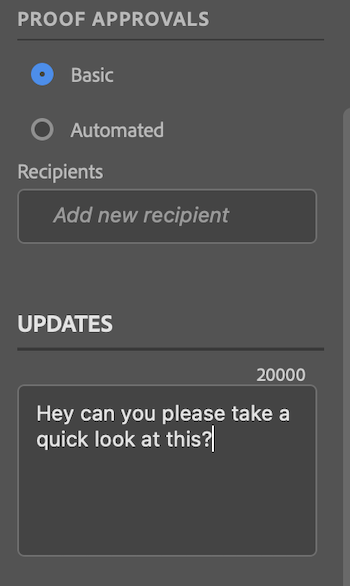
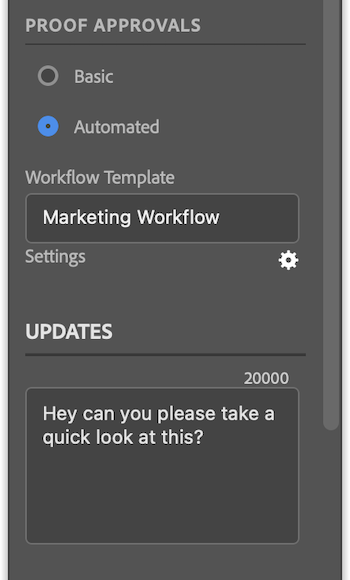

# [!DNL Photoshop]에서 증명 업로드

특정 Photoshop 문서 사전 설정 유형을 증명으로 [!DNL Adobe Workfront]에 직접 업로드하여 철저히 검토하고 승인할 수 있습니다.

>[!IMPORTANT]
>
>파일은 [Photoshop의 템플릿 및 사전 설정](https://helpx.adobe.com/kr/photoshop/using/create-documents.html)에 설명된 대로 사진 문서 사전 설정이어야 합니다.

## 액세스 요구 사항

+++ 을 확장하여 이 문서의 기능에 대한 액세스 요구 사항을 봅니다.

이 문서의 단계를 수행하려면 다음 액세스 권한이 있어야 합니다.

<table style="table-layout:auto"> 
 <col> 
 <col> 
 <tbody> 
  <tr> 
   <td role="rowheader">[!DNL Adobe Workfront] 플랜*</td> 
   <td> 
현재 플랜: [!UICONTROL Pro] 이상
 
또는
 
레거시 플랜: [!UICONTROL Premium]
 
다른 플랜의 증명 액세스에 대한 자세한 내용은 을 참조하십시오.
 </td> 
  </tr> 
  <tr> 
   <td role="rowheader">[!DNL Adobe Workfront] 라이센스*</td> 
   <td> 
현재 계획: [!UICONTROL Work] 또는 [!UICONTROL Proof]
 
기존 계획: 모두(사용자에 대해 증명이 활성화되어 있어야 함)
 </td> 
  </tr> 
  <tr> 
   <td role="rowheader">제품</td> 
   <td>[!DNL Workfront] 라이선스 외에 [!DNL Adobe Creative Cloud] 라이선스가 있어야 합니다.</td> 
  </tr> 
  <tr> 
   <td role="rowheader">교정쇄 권한 프로필 </td> 
   <td>[!UICONTROL Manager] 이상</td> 
  </tr> 
  <tr> 
   <td role="rowheader">개체 권한</td> 
   <td> 
[!UICONTROL 문서]에 대한 액세스 편집
 
추가 액세스 요청에 대한 자세한 내용은 <a href="../../workfront-basics/grant-and-request-access-to-objects/request-access.md" class="MCXref xref">개체에 대한 액세스 요청</a>을 참조하십시오.
 </td> 
  </tr> 
 </tbody> 
</table>

&#42;보유 중인 플랜, 역할 또는 증명 권한 프로필을 확인하려면 Workfront 또는 Workfront Proof 관리자에게 문의하십시오.

+++

## 전제 조건

* [!DNL Adobe Photoshop]에서 증명을 업로드하려면 먼저 [!DNL Adobe Workfront for Photoshop]을(를) 설치해야 합니다.

  지침은 [설치 [!DNL Adobe Workfront for Photoshop]](../../workfront-integrations-and-apps/adobe-workfront-for-creative-cloud/wf-cc-install-ps.md)를 참조하십시오.

## 기본 증명 업로드

1. 오른쪽 상단의 **[!UICONTROL 메뉴]** 아이콘을 클릭한 다음 **[!UICONTROL 작업 목록]**&#x200B;을 선택합니다. 메뉴를 사용하여 상위 객체로 이동할 수도 있습니다.

   

1. 증명을 업로드할 작업 항목으로 이동합니다.
1. 탐색 모음에서 **[!UICONTROL 문서]** 아이콘 을 클릭합니다.
1. [!DNL Workfront] 패널 아래쪽에 있는 **[!UICONTROL 새 파일]**&#x200B;을 클릭합니다.
1. **[!UICONTROL 증명 만들기]** 토글을 사용하도록 설정합니다.
1. (선택 사항) **[!UICONTROL 증명 이름]** 텍스트 상자에 증명 이름을 입력합니다.
1. **[!UICONTROL 증명 승인]** 섹션에서 **[!UICONTROL 기본]**&#x200B;을(를) 선택합니다.
1. (선택 사항) 승인자를 추가합니다.
1. (선택 사항) **[!UICONTROL 업데이트]** 영역에 댓글을 입력합니다.

   

1. 드롭다운 메뉴에서 **[!UICONTROL 자산 유형]**&#x200B;을(를) 선택합니다.

1. (선택 사항) **[!UICONTROL 외부 파일 추가]**&#x200B;를 선택하여 컴퓨터에서 파일을 추가합니다.
1. **[!UICONTROL 업로드]**&#x200B;를 클릭한 다음 위에서 선택한 자산 유형에 따라 원하는 내보내기 옵션을 구성합니다.

   \
   문서가 [!DNL Photoshop]의 [!DNL Workfront] 패널 및 [!DNL Workfront] 데스크톱 앱의 [!UICONTROL 문서] 영역에 표시됩니다.

## 자동화된 증명 업로드

1. 오른쪽 상단의 **[!UICONTROL 메뉴]** 아이콘을 클릭한 다음 **[!UICONTROL 작업 목록]**&#x200B;을 선택합니다. 메뉴를 사용하여 상위 객체로 이동할 수도 있습니다.

   

1. 증명을 업로드할 작업 항목으로 이동합니다.
1. 탐색 모음에서 **[!UICONTROL 문서]** 아이콘 을 클릭합니다.

1. [!DNL Workfront] 패널 아래쪽에 있는 **[!UICONTROL 새 파일]**&#x200B;을 클릭합니다.
1. **[!UICONTROL 증명 만들기]** 토글을 사용하도록 설정합니다.
1. (선택 사항) **[!UICONTROL 증명 이름]** 텍스트 상자에 증명 이름을 입력합니다.
1. **[!UICONTROL 증명 승인]** 섹션에서 **[!UICONTROL 자동화]**&#x200B;를 선택합니다.
1. (선택 사항) **[!UICONTROL 워크플로 템플릿]** 상자에 증명 워크플로 템플릿의 이름을 입력합니다.

{{adjust-proof-settings}}

>[!NOTE]
>
> 워크플로 템플릿에 비어 있는 필수 필드가 있는 경우 자동 증명 설정이 자동으로 열리며, 증명을 업로드하려면 해당 필드를 채워야 합니다.

1. (선택 사항) **[!UICONTROL 업데이트]** 영역에 댓글을 입력합니다.

   

1. 드롭다운 메뉴에서 **[!UICONTROL 자산 유형]**&#x200B;을(를) 선택합니다.
1. (선택 사항) **[!UICONTROL 외부 파일 추가]**&#x200B;를 선택하여 컴퓨터에서 파일을 추가합니다.
1. **[!UICONTROL 업로드]**&#x200B;를 클릭한 다음 위에서 선택한 자산 유형에 따라 원하는 내보내기 옵션을 구성합니다.
문서가 [!DNL Photoshop]의 [!DNL Workfront] 패널 및 [!DNL Workfront] 데스크톱 앱의 [!UICONTROL 문서] 영역에 표시됩니다.

## 새 증명 버전 업로드

새 증명 버전을 업로드할 수 있습니다. 플러그인은 이전 버전에 설정된 증명 워크플로를 기억하지만, 원할 경우 변경할 수 있습니다.

1. 오른쪽 상단의 **[!UICONTROL 메뉴]** 아이콘을 클릭한 다음 **[!UICONTROL 작업 목록]**&#x200B;을 선택합니다. 메뉴를 사용하여 상위 객체로 이동할 수도 있습니다.

   

1. 문서를 업로드해야 하는 작업 항목으로 이동합니다.
1. 탐색 모음에서 **[!UICONTROL 문서]** 아이콘 을 클릭합니다.

1. [!DNL Workfront] 패널 아래쪽에 있는 **[!UICONTROL 새 버전]**&#x200B;을 클릭합니다.
1. **[!UICONTROL 증명 만들기]** 토글을 사용하도록 설정합니다.

1. *[!UICONTROL *증명 승인] **&#x200B; 섹션에서 &#x200B;** [!UICONTROL 기본] **&#x200B; 또는 &#x200B;** [!UICONTROL 자동화]**&#x200B;를 선택합니다.

1. 7단계에서 선택한 승인 유형에 따라 **[!UICONTROL 검토자]** 또는 **[!UICONTROL 워크플로 템플릿]**&#x200B;을 추가하십시오.

1. (선택 사항) **[!UICONTROL 업데이트]** 영역에 댓글을 입력합니다.
1. 드롭다운 메뉴에서 **[!UICONTROL 자산 유형]**&#x200B;을(를) 선택합니다.
1. **[!UICONTROL 업로드]**&#x200B;를 클릭한 다음 위에서 선택한 자산 유형에 따라 원하는 내보내기 옵션을 구성합니다.
문서가 [!DNL Photoshop]의 [!DNL Workfront] 패널 및 [!DNL Workfront] 데스크톱 앱의 [!UICONTROL 문서] 영역에 표시됩니다.
