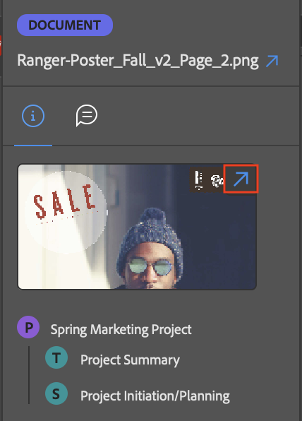

# [!DNL Adobe Workfront] 플러그인을 사용하여 작업 항목 정보 보기

다음 [!DNL Adobe Creative Cloud]개의 응용 프로그램에서 프로젝트, 작업, 문제 및 문서에 대한 정보를 볼 수 있습니다.

{{cc-app-list}}

## 액세스 요구 사항

+++ 을 확장하여 이 문서의 기능에 대한 액세스 요구 사항을 봅니다.

이 문서의 단계를 수행하려면 다음 액세스 권한이 있어야 합니다.

<table style="table-layout:auto"> 
 <col> 
 </col> 
 <col> 
 </col> 
 <tbody> 
  <!--<tr> 
   <td role="rowheader">[!DNL Adobe Workfront] plan*</td> 
   <td> 
[!UICONTROL Pro] or higher
 </td> 
  </tr> 
  <tr data-mc-conditions=""> 
   <td role="rowheader">[!DNL Adobe Workfront] license*</td> 
   <td> 
[!UICONTROL Work] or [!UICONTROL Plan]
 </td> 
  </tr> -->
  <tr> 
   <td role="rowheader">제품</td> 
   <td>[!DNL Workfront] 라이선스 외에 [!DNL Adobe Creative Cloud] 라이선스가 있어야 합니다.</td> 
  </tr> 
  <tr> 
   <td role="rowheader">액세스 수준 구성*</td> 
   <td> 
프로젝트, 작업 또는 문제에 대한 [!UICONTROL 보기] 액세스 권한
 
참고: 여전히 액세스 권한이 없는 경우 [!DNL Workfront] 관리자에게 액세스 수준에 추가 제한을 설정했는지 문의하십시오. [!DNL Workfront] 관리자가 액세스 수준을 수정하는 방법에 대한 자세한 내용은 <a href="../../administration-and-setup/add-users/configure-and-grant-access/create-modify-access-levels.md" class="MCXref xref">사용자 지정 액세스 수준 만들기 또는 수정</a>을 참조하십시오.
 </td> 
  </tr> 
  <tr> 
   <td role="rowheader">개체 권한</td> 
   <td> 
보려는 객체에 대한 액세스 권한을 봅니다. 
 
추가 액세스 요청에 대한 자세한 내용은 <a href="../../workfront-basics/grant-and-request-access-to-objects/request-access.md" class="MCXref xref">개체 </a>에 대한 액세스 요청 을 참조하십시오.
 </td> 
  </tr> 
 </tbody> 
</table>

&#42;플랜, 라이선스 유형 또는 액세스 권한을 확인하려면 [!DNL Workfront] 관리자에게 문의하세요.

+++

## 전제 조건

{{cc-install-prereq}}

## 세부 정보 및 사용자 정의 양식 데이터 보기

1. 오른쪽 상단의 **[!UICONTROL 메뉴]** 아이콘을 클릭한 다음 **[!UICONTROL 작업 목록]**&#x200B;을 선택합니다. 메뉴를 사용하여 상위 객체로 이동할 수도 있습니다.

   

1. 보려는 작업 항목을 선택합니다.

   >[!TIP]
   >
   >**[!UICONTROL Menu]** 아이콘을 사용하여 작업 항목의 상위 개체로 이동하십시오.

1. 다음을 보려면 탐색 막대에서 **[!UICONTROL 세부 정보]** 아이콘 을 클릭하세요.

   * [!UICONTROL 설명]
   * [!UICONTROL 계획된 완료 일자]
   * [!UICONTROL 상태]
   * [!UICONTROL 할당 대상]
   * [!UICONTROL 프로젝트 소유자] (프로젝트만 해당)
   * 사용자 정의 양식 데이터

## 문서 세부 정보 보기

1. 오른쪽 상단의 **[!UICONTROL 메뉴]** 아이콘을 클릭한 다음 **[!UICONTROL 작업 목록]**&#x200B;을 선택합니다. 메뉴를 사용하여 상위 객체로 이동할 수도 있습니다.

   

1. 보려는 작업 항목을 선택합니다.

   >[!TIP]
   >
   >**[!UICONTROL Menu]** 아이콘을 사용하여 작업 항목의 상위 개체로 이동하십시오.

1. 탐색 막대에서 **[!UICONTROL 문서]** 아이콘 을 클릭한 다음 문서를 두 번 클릭하여 다음 내용을 봅니다.

   * [!UICONTROL 설명]
   * [!UICONTROL 파일 형식]
   * [!UICONTROL 증명 상태] (증명에만 사용 가능)
   * [!UICONTROL 버전]
   * [!UICONTROL 크기]
   * 사용자 정의 양식 데이터

## 증명 세부 정보 보기

1. 오른쪽 상단의 **[!UICONTROL 메뉴]** 아이콘을 클릭한 다음 **[!UICONTROL 작업 목록]**&#x200B;을 선택합니다. 메뉴를 사용하여 상위 객체로 이동할 수도 있습니다.

   

1. 보려는 작업 항목을 선택합니다.

   >[!TIP]
   >
   >**[!UICONTROL Menu]** 아이콘을 사용하여 작업 항목의 상위 개체로 이동하십시오.

1. 탐색 막대에서 **[!UICONTROL 문서]** 아이콘 을 클릭한 다음 증명을 두 번 클릭합니다.

1. 썸네일의 오른쪽 위 모서리에 있는 화살표 아이콘을 클릭하여 [!DNL Workfront]에서 증명 세부 정보를 엽니다.

## 증명 상태 보기

1. 오른쪽 상단의 **[!UICONTROL 메뉴]** 아이콘을 클릭한 다음 **[!UICONTROL 작업 목록]**&#x200B;을 선택합니다. 메뉴를 사용하여 상위 객체로 이동할 수도 있습니다.

   

1. 보려는 작업 항목을 선택합니다.

   >[!TIP]
   >
   >**[!UICONTROL Menu]** 아이콘을 사용하여 작업 항목의 상위 개체로 이동하십시오.

1. 탐색 막대에서 **[!UICONTROL 문서]** 아이콘 을 클릭한 다음 증명을 두 번 클릭합니다.

1. 맨 아래로 스크롤하여 증명의 현재 상태를 확인합니다. SOCD(전송, 열림, 주석, 의사 결정) 세부 정보에 대한 자세한 내용은 [문서 세부 정보 개요](/help/quicksilver/documents/managing-documents/document-details-overview.md)를 참조하십시오.

## 하위 작업 및 문제 보기

1. 오른쪽 상단의 **[!UICONTROL 메뉴]** 아이콘을 클릭한 다음 **[!UICONTROL 작업 목록]**&#x200B;을 선택합니다. 메뉴를 사용하여 상위 객체로 이동할 수도 있습니다.

   

1. 보려는 작업 항목을 선택합니다.

   >[!TIP]
   >
   >**[!UICONTROL Menu]** 아이콘을 사용하여 작업 항목의 상위 개체로 이동하십시오.

1. **[!UICONTROL 문제]** 아이콘  또는 **하위 작업** 아이콘 을 클릭합니다.

1. 작업 또는 문제를 선택한 다음 탐색 막대에서 **[!UICONTROL 세부 정보]** 아이콘 을(를) 클릭하여 다음을 확인합니다.

   * [!UICONTROL 계획된 완료 일자]
   * [!UICONTROL 상태]
   * [!UICONTROL 할당 대상]
   * 사용자 정의 양식 데이터
