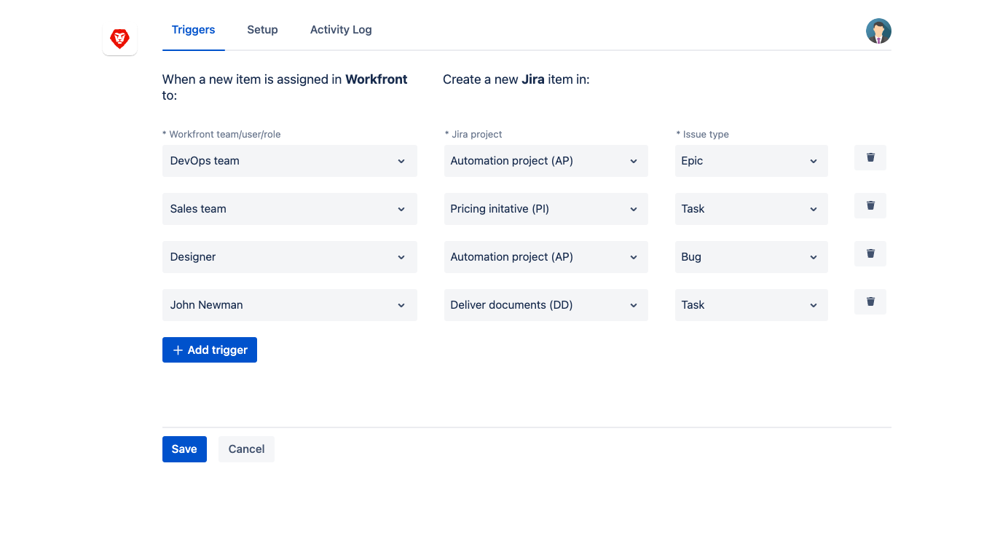
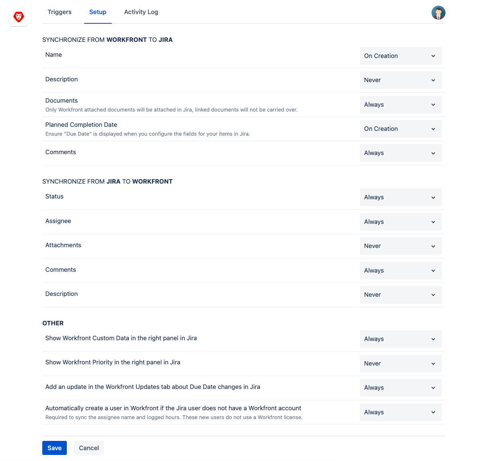
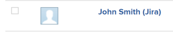

# Configure [!DNL Adobe Workfront for Jira]

다음을 사용할 수 있습니다 [!DNL Adobe Workfront for Jira] 를 [!DNL Jira] 및 [!DNL Workfront] 시스템.

추가 기능을 설치한 후 워크플로우를 정의하여 [!DNL Jira] 문제 발생 시 [!DNL Workfront] 작업 항목이 만들어집니다. 두 응용 프로그램의 항목이 연결되고, 두 시스템에서 일부 정보가 자동으로 업데이트됩니다.

의 모든 사용자 [!DNL Workfront] 및 [!DNL Jira] 은 이 통합을 통해 이점을 얻을 수 있습니다. 두 시스템 모두 사용할 수 없고 가장 많이 작동하는 시스템에 대한 라이센스가 필요합니다.

이 추가 기능은 [!UICONTROL 서버] 및 [!UICONTROL OnDemand] 또는 [!UICONTROL 클라우드]) 버전 [!DNL Jira] 소프트웨어.

목록 [!DNL Jira] 버전 [!DNL Workfront for Jira] 현재 지원됨 [[!DNL Workfront for Jira]](https://marketplace.atlassian.com/apps/1218653/workfront-for-jira?hosting=cloud&amp;tab=overview) at [!DNL Atlassian Marketplace].

## 액세스 요구 사항

다음 항목이 있어야 합니다.

<table style="table-layout:auto"> 
 <col> 
 <col> 
 <tbody> 
  <tr> 
   <td role="rowheader"><a href="https://www.workfront.com/plans" target="_blank">[!DNL [!DNL Adobe Workfront] 플랜]</a>*</td> 
   <td> 
[!UICONTROL Pro] 이상
 </td> 
  </tr> 
  <tr> 
   <td role="rowheader"><a href="../../administration-and-setup/add-users/access-levels-and-object-permissions/wf-licenses.md" class="MCXref xref">Adobe [!DNL Workfront] 라이선스 개요</a>*</td> 
   <td> 
[!UICONTROL 계획]
 </td> 
  </tr> 
  <tr> 
   <td role="rowheader">[!DNL Jira] 액세스</td> 
   <td> 
시스템 관리자 액세스
 
중요 사항: 에서 별도의 시스템 관리자 계정을 만드는 것이 좋습니다. [!DNL Jira] 및 [!DNL Workfront] 사용자에게 첨부할 수 있는 기존 항목을 사용하는 대신 이 통합에 전념할 수 있습니다.
 </td> 
  </tr> 
  <tr> 
   <td role="rowheader">액세스 수준 구성*</td> 
   <td> 
넌 [!DNL Workfront] 관리자 에 대한 자세한 정보 [!DNL Workfront] 관리자 <a href="../../administration-and-setup/add-users/configure-and-grant-access/grant-a-user-full-administrative-access.md" class="MCXref xref">사용자에게 전체 관리자 액세스 권한 부여</a>.
 
참고: 여전히 액세스할 수 없는 경우 [!DNL Workfront] 관리자가 액세스 수준에서 추가 제한을 설정한 경우 자세한 내용은 [!DNL Workfront] 관리자는 액세스 수준을 수정할 수 있습니다. <a href="../../administration-and-setup/add-users/configure-and-grant-access/create-modify-access-levels.md" class="MCXref xref">사용자 정의 액세스 수준 만들기 또는 수정</a>.
 </td> 
  </tr> 
 </tbody> 
</table>

&#42;어떤 계획, 라이센스 유형 또는 액세스 권한을 보유하고 있는지 확인하려면 [!DNL Workfront] 관리자

## 전제 조건

구성하기 전에 [!DNL Workfront for Jira]:

* 설치 [!DNL Workfront for Jira]\
   설치 지침 [!DNL Workfront for Jira]를 참조하십시오. [설치 [!DNL Adobe Workfront for Jira]](../../workfront-integrations-and-apps/use-workfront-with-jira/install-workfront-for-jira.md).

## Configure [!DNL Workfront for Jira]

구성 [!DNL Workfront for Jira] 다음을 수행할 수 있습니다.

* 만들 트리거를 정의합니다. [!DNL Jira] 항목 [!DNL Workfront] 항목이 만들어집니다.
* 간에 연결된 항목 간에 동기화해야 하는 필드를 지정합니다 [!DNL Jira] 및 [!DNL Workfront].

>[!NOTE]
>
>* 구성 후 [!DNL Workfront for Jira] 설정 [!DNL Jira] 환경, 모든 [!DNL Jira] 사용자가 [!DNL Workfront] 오른쪽 패널 [!DNL Jira] 항목. 패널에는 연결할 수 있는 항목에 대한 정보가 포함되어 있습니다 [!DNL Workfront] 또는 no로 지정합니다. [!DNL Workfront] 항목이 연결된 항목 [!DNL Jira] 항목.
>* 를 사용할 때 [!DNL Jira Server] 설치 시 Workfront 통합을 위한 트리거로 식별된 프로젝트와 관련된 문제만 Workfront 패널이 표시됩니다. 에 대한 트리거 설정에 대한 자세한 내용은 [!DNL Workfront to Jira] 워크플로우, [사이에 항목을 자동으로 연결하도록 트리거를 구성합니다 [!DNL Jira] 및 [!DNL Workfront]](#configure-triggers-for-automatically-linking-items-between-jira-and-workfront).
>

구성하려면 [!DNL Workfront for Jira]:

1. 에 로그인합니다. [!DNL Jira] 로서의 [!DNL Jira] 관리자
1. 클릭 **[!UICONTROL 설정]** 주 [!DNL Jira] 메뉴 아래의 제품에서 사용할 수 있습니다.
1. 클릭 **[!UICONTROL 추가 기능]**&#x200B;를 클릭한 다음 **[!UICONTROL 추가 기능 관리]**.

1. 를 확장합니다. **[!DNL Workfront]** 추가 기능.
1. 클릭 **[!UICONTROL 구성]**.
1. 화면의 지침에 따라 로그인하십시오 [!DNL Workfront].

   >[!NOTE]
   >
   >[!UICONTROL Workfront] 연결 대상 [!DNL Jira] using OAuth 2.0(사용자 인증 및 권한 부여를 위해 대부분의 웹 기반 통합에서 사용하는 표준)

   에 로그인해야 합니다. [!DNL Workfront] 로서의 [!DNL Workfront] 구성을 계속하려면 관리자가 필요합니다.

   >[!NOTE]
   >
   >* 도메인 입력 메시지가 표시되면 [!DNL Workfront] 다음 형식으로 입력하십시오. *yourCompany&#39;sDomain.my.workfront.com*. 일반적으로 회사의 도메인은 회사의 이름입니다.
   >* Enhanced Authentication 은 [!DNL Workfront] 관리자가 이 통합을 위해 이 통합을 사용하도록 설정합니다.

1. 을(를) 선택합니다 **[!UICONTROL Triggers]** 탭하여 자동 만들기 구성 [!DNL Jira] 항목을 새 항목으로 [!DNL Workfront] 항목이 만들어집니다.

   Workfront에 대한 트리거 설정에 대한 자세한 내용은 [!DNL Jira] 워크플로우, [사이에 항목을 자동으로 연결하도록 트리거를 구성합니다 [!DNL Jira] 및 [!DNL Workfront]](#configure-triggers-for-automatically-linking-items-between-jira-and-workfront).

1. 을(를) 선택합니다 **[!UICONTROL 설정]** 탭 - 연결된 필드 간에 필드 동기화 구성 [!DNL Jira] 및 [!DNL Workfront] 항목.

   간의 필드 동기화 설정에 대한 자세한 정보 [!DNL Jira] 및 [!DNL Workfront]를 참조하십시오. [필드 동기화 구성 [!DNL Jira] 및 [!DNL Workfront] 항목](#configure-field-synchronization-between-jira-and-workfront-items).

   >[!NOTE]
   >
   >트리거 및 두 애플리케이션 간의 필드 동기화를 정의한 후에는 [!DNL Workfront] 작업이나 문제를 만들 수 있는 사용자는 잠재적으로 [!DNL Jira]. 사용자는 만드는 항목의 기준이 의 트리거와 일치하는 경우 항목을 만들 수 있습니다 [!DNL Jira]: 사용자에게 [!DNL Jira] 라이센스. 또한, [!DNL Jira] 사용자는 즉시 작업 시작 [!DNL Jira] 항목 및 해당 업데이트가 [!DNL Workfront]하지만 그들이 [!DNL Workfront] 라이센스. 의 모든 업데이트 [!DNL Workfront] 다음에도 표시됩니다 [!DNL Jira] 항목.

1. (선택 사항) **[!UICONTROL 활동 로그]** 탭에서 통합 중에 발생할 수 있는 오류를 검토합니다.

   에 대한 자세한 정보 [!UICONTROL 활동 로그]를 참조하십시오. [보기 [!DNL Jira] [!UICONTROL 활동 로그]](../../workfront-integrations-and-apps/use-workfront-with-jira/view-the-jira-activity-log.md).

## 사이에 항목을 자동으로 연결하도록 트리거를 구성합니다 [!DNL Jira] 및 [!DNL Workfront]

로서의 [!DNL Jira] 시스템 관리자는 [!DNL Jira] 항목이 [!DNL Workfront] 특정 기준을 충족합니다.

>[!NOTE]
>
>통합에서 새 문제를 만드는 데 최대 10분이 걸릴 수 있습니다 [!DNL Jira].

만들기 트리거를 구성할 때 다음 사항을 고려하십시오 [!DNL Jira] 항목을 [!DNL Workfront] 항목이 만들어집니다.

* 통합은 일방향입니다. 에서 만드는 항목만 트리거할 수 있습니다 [!DNL Workfront] 에서 자동으로 만들기 [!DNL Jira]. 에서 만드는 항목은 트리거할 수 없습니다 [!DNL Jira] 에서 자동으로 만들기 [!DNL Workfront].
* 가질 수 있는 트리거의 수에 제한이 없습니다.
* 사용자가 만드는 항목이 [!DNL Workfront] 두 개 이상의 트리거와 일치하는 경우 하나의 항목만 [!DNL Jira]. 항목이 [!DNL Jira] 첫 번째 트리거에 따라 [!DNL Jira]). 다른 모든 트리거는 무시됩니다.
* 에 한 항목만 [!DNL Workfront] Jira의 한 항목에 연결할 수 있습니다. 연결할 수 없습니다 [!DNL Workfront] 복수 [!DNL Jira] 문제 또는 하나 [!DNL Jira] 여러 [!DNL Workfront] 항목.

에서 항목을 자동으로 만들기 위한 트리거를 구성하려면 [!DNL Jira]:

1. 에 로그인합니다. [!DNL Jira] 시스템 관리자
1. 클릭 **[!UICONTROL 설정]** 주 [!DNL Jira] 메뉴 아래의 제품에서 사용할 수 있습니다.
1. 클릭 **[!UICONTROL 추가 기능]**, 그런 다음 **[!UICONTROL 추가 기능 관리]**.

1. 를 확장합니다. **[!DNL Workfront]** 추가 기능.
1. 클릭 **[!UICONTROL 구성]**.
1. 에 로그인합니다. [!DNL Workfront] 시스템 관리자

   다음 **[!UICONTROL Triggers]** 기본적으로 탭이 선택되어 있습니다.

   

1. 클릭 **[!UICONTROL 트리거 추가]** 새 트리거를 추가하려면
1. 에서 **[!UICONTROL Workfront 팀/사용자/역할]** 필드에서 이름 지정 [!DNL Workfront] 팀, 사용자 또는 작업 역할을 클릭한 다음 목록에 표시될 때 클릭하여 선택합니다.

   >[!NOTE]
   >
   >동일한 팀, 사용자 또는 역할에 대해 여러 트리거를 가질 수는 없습니다.

   작업이나 문제를 만들어 이러한 엔티티 중 하나에 할당하면 [!DNL]에서 문제가 자동으로 생성됩니다 [!DNL Jira]]

1. 에서 **[!UICONTROL [!DNL Jira]프로젝트]** 필드, 이름 입력 시작 [!DNL Jira] 프로젝트를 클릭한 다음 목록에 표시될 때 클릭하여 선택합니다.

   이 [!DNL Jira] 문제가 만들어지면 여기에서 지정하는 프로젝트에 문제가 배치됩니다.

1. 선택 **I[!UICONTROL 사용 유형]** 를 클릭합니다.

   이것은 에서 만들어진 문제 유형을 나타냅니다 [!DNL Jira] 이 트리거의 조건이 충족되는 경우에서 해당 특정 프로젝트에 대한 설정에 따라 [!DNL Jira].

1. **[!UICONTROL 저장]**&#x200B;을 클릭합니다.

   이 구성을 사용할 때마다 [!DNL Workfront] 사용자가 지정된 트리거와 일치하는 항목을 만들면 [!DNL Jira].

## 필드 동기화 구성 [!DNL Jira] 및 [!DNL Workfront] 항목

로서의 [!DNL Jira] 관리자는 다음 사이에 연결된 항목에 대해 자동으로 동기화해야 하는 필드를 정의할 수 있습니다 [!DNL Workfront] 그리고 지라 특정 필드는 [!DNL Workfront] 변환 후 [!DNL Jira] 항목과 다른 항목은 Jira에서 Workfront으로 동기화됩니다.

두 애플리케이션 간에 연결된 항목에 대해 자동으로 동기화해야 하는 필드를 정의하려면

1. 에 로그인합니다. [!DNL Jira] jira 관리자로.
1. 클릭 **[!UICONTROL 설정]** 주 [!DNL Jira] 메뉴 아래의 제품에서 사용할 수 있습니다.
1. 클릭 **[!UICONTROL 추가 기능]**, 그런 다음 **[!UICONTROL 추가 기능 관리]**.

1. 를 확장합니다. **[!DNL Workfront]** 추가 기능.
1. 클릭 **[!UICONTROL 구성]**.
1. 에 로그인합니다. [!DNL Workfront] Workfront 관리자로.
1. 을(를) 클릭합니다. **[!UICONTROL 설정]** 탭.

   

1. 에서 **[!UICONTROL Jira에서 Workfront으로 동기화]** 섹션에서 업데이트할 필드를 선택합니다 [!DNL Jira] Workfront에서 업데이트되는 시점.

   1. 필드가 동기화된 다음 빈도 중 하나를 선택합니다.

      <table style="table-layout:auto">
         <tr>
              <td>[!UICONTROL On Creation]</td>
              <td>지정하는 필드는 연결된 Workfront과 간에 동기화됩니다 [!DNL Jira] Workfront에서 항목을 만들 때 사용하는 항목입니다.</td>
          </tr>
          <tr>
              <td>[!UICONTROL Always]</td>
              <td>지정하는 필드는 연결된 Workfront과 간에 동기화됩니다 [!DNL Jira] Workfront에서 필드를 업데이트할 때 항목이 표시됩니다. </td>
          </tr>
          <tr>
              <td>[!UICONTROL Never]</td>
              <td>지정한 필드는 연결된 필드 간에 동기화되지 않습니다 [!DNL Workfront] 및 [!DNL Jira] 항목. 에 아무런 표시가 없습니다 [!DNL Jira] 필드가 [!DNL Workfront]. </td>
          </tr>
      </table>

   1. 다음 필드를 동기화하려면 을(를) 선택합니다. [!DNL Workfront] to [!DNL Jira]:

      <table style="table-layout:auto">
       <col>
       <col>
       <tbody>
        <tr>
         <td role="rowheader">[!UICONTROL Name]</td>
         <td>
의 작업 또는 문제 이름 [!DNL Workfront] 은 연결된 문제 이름이 됩니다 [!DNL Jira].

참고: 에서 새 항목을 만들 때 [!DNL Jira] 자동으로 [!DNL Workfront] 이름은 항상 [!DNL Jira] 이 필드를 여기에서 사용할지 여부에 관계없이 항목을 지정합니다. 다음의 경우 [!DNL Jira] 항목이 수동으로 [!DNL Workfront] 항목, 이름 [!DNL Workfront] 항목 전용 업데이트 [!DNL Jira] 을(를) 선택하면 <strong>항상</strong> 이 필드를 동기화합니다. 수동으로 또는 자동으로 항목 연결에 대한 자세한 내용은 <a href="../../workfront-integrations-and-apps/use-workfront-with-jira/link-items-between-wf-jira.md" class="MCXref xref">다음 사이 항목 연결 [!DNL Adobe Workfront] 및 [!DNL Jira]</a>.
</td>
        </tr>
        <tr>
         <td role="rowheader">[!UICONTROL Description]</td>
         <td>작업 또는 문제에 대한 설명 [!DNL Workfront] 은 연결된 문제에 대한 설명이 됩니다 [!DNL Jira].</td>
        </tr>
        <tr>
         <td role="rowheader">문서</td>
         <td>
작업 또는 의 문제에 첨부된 문서 [!DNL Workfront] 또한 Jira에서 연결되는 문제에 첨부됩니다. 새 문서 버전 [!DNL Workfront] 는 Jira에 별도의 문서로 추가되며 <i>_v&lt;version number=""&gt;</i> Workfront에서 번호 버전을 가리키도록 업데이트하는 것이 좋습니다. 

예를 들어 의 문서 이름이 [!DNL Workfront] is <strong>기본 광고</strong>및에 새 버전을 추가합니다. [!DNL Workfront]로 설정되면 새 버전은으로 전송됩니다. [!DNL Jira] 새 문서로 이름 지정 <strong>기본 Ad_v2</strong>.

중요: 
문서를 동기화할 때 다음 사항을 고려하십시오.

           <ul>
            <li>
5MB보다 큰 문서는 동기화되지 않습니다. 문서가 너무 커서 문서 동기화가 실패하면 작업 로그에 오류가 기록됩니다. 

활동 로그에 대한 자세한 내용은 <a href="../../workfront-integrations-and-apps/use-workfront-with-jira/view-the-jira-activity-log.md" class="MCXref xref">Jira 활동 로그 보기</a>.
</li>
            <li>
외부 서버의 작업 및 문제에 연결된 문서는 [!DNL Jira] 항목. 작업 또는 의 문제에 직접 업로드된 문서만 [!DNL Workfront] 의 연결된 문제로 전송됩니다. [!DNL Jira].
</li>
            <li>
문서에서 증명을 만들려면 [!DNL Workfront]. 

증명 생성에 대한 자세한 내용은 <a href="../../review-and-approve-work/proofing/creating-proofs-within-workfront/generate-proof-for-a-document.md#create" class="MCXref xref">기존 문서에 대한 증명 만들기 </a>in <a href="../../review-and-approve-work/proofing/creating-proofs-within-workfront/generate-proof-for-a-document.md" class="MCXref xref">문서에 대한 증명 만들기</a>. 
</li>
           </ul>
</td>
        </tr>
        <tr>
         <td role="rowheader">[!UICONTROL 계획된 완료 날짜]</td>
         <td>
작업 또는 의 문제에 대한 [!UICONTROL 계획된 완료 날짜] [!DNL Workfront] 은 연결된 문제의 [!UICONTROL 기한]이 됩니다 [!DNL Jira].

참고: 다음을 표시합니다 <strong>[!UICONTROL 기한]</strong> on [!DNL Jira] 이 값이 동기화되는 데 문제가 있습니다.
</td>
        </tr>
       </tbody>
      </table>

1. 에서 **[!UICONTROL 동기화 위치 [!DNL Jira] to[!DNL Workfront]]** 섹션에서 업데이트할 필드를 선택합니다 [!DNL Workfront] 업데이트한 시기 [!DNL Jira].

   1. 필드가 동기화된 다음 빈도 중 하나를 선택합니다.

      <table style="table-layout:auto">
       <col>
       <col>
       <tbody>
        <tr>
         <td role="rowheader">[!UICONTROL Always]</td>
         <td>지정하는 필드는 항상 연결된 필드 간에 동기화됩니다 [!DNL Workfront] 및 [!DNL Jira] 필드를 [!DNL Jira]. </td>
        </tr>
        <tr>
         <td role="rowheader">[!UICONTROL Never]</td>
         <td>
지정한 필드는 연결된 필드 간에 동기화되지 않습니다 [!DNL Workfront] 및 [!DNL Jira] 항목. 에 아무런 표시가 없습니다 [!DNL Workfront] 필드가 [!DNL Jira]. 

참고: 사용 안 함을 선택하면 [!DNL Workfront] 필드는 여전히 [!DNL Jira] 왼쪽 [!DNL Workfront] 패널의 [!DNL Jira] 문제. 이러한 업데이트는 [!DNL Workfront] 항목 [!DNL Jira] 및 [!DNL Workfront] 아님 [!DNL Jira] 항목.
</td>
        </tr>
       </tbody>
      </table>

   1. 다음 필드를 동기화하려면 을(를) 선택합니다. [!DNL Jira] to [!DNL Workfront]:

      <table style="table-layout:auto">
       <col>
       <col>
       <tbody>
        <tr>
         <td role="rowheader">[!UICONTROL 상태]</td>
         <td>의 문제에 대한 [!UICONTROL 상태] [!DNL Jira] 은 연결된 작업 또는 문제의 [!UICONTROL 상태]가 됩니다 [!DNL Workfront]. 에 대한 자세한 정보 [!DNL Workfront] 상태 <a href="../../administration-and-setup/customize-workfront/creating-custom-status-and-priority-labels/create-or-edit-a-status.md" class="MCXref xref">상태 만들기 또는 편집</a>.</td>
        </tr>
        <tr>
         <td role="rowheader">[!UICONTROL Assignee]</td>
         <td>
의 문제에 대한 [!UICONTROL 할당자] [!DNL Jira] 는 연결된 작업의 [!UICONTROL Assignee]가 됩니다 [!DNL Workfront].

중요 사항: 에서 항목을 지정할 때 [!DNL Jira] 이 없는 사용자에게 [!DNL Workfront] 계정, 통합은에서 새 활성 사용자를 생성합니다. [!DNL Workfront] 단지 <strong>에서 사용자를 자동으로 만들기 [!DNL Workfront] if [!DNL Jira] 사용자에게 없음 [!DNL Workfront] account</strong> 가 로 설정되어 있습니다. <strong>[!UICONTROL Always]</strong>. 이 사용자는 [!DNL Workfront] 라이센스. 활성 사용자는 의 작업 항목에 할당할 수 있습니다 [!DNL Workfront], 에는 포함할 수 없습니다. 
</td>
        </tr>
        <tr>
         <td role="rowheader">[!UICONTROL 첨부 파일]</td>
         <td>의 문제 첨부 파일 [!DNL Jira] 또한 연결된 작업 또는 문제에 연결됩니다 [!DNL Workfront]. </td>
        </tr>
        <tr>
         <td role="rowheader">[!UICONTROL Comments]</td>
         <td>
에 대한 댓글 [!DNL Jira] 연결된 항목에도 게시됩니다 [!DNL Workfront] [!UICONTROL Updates] 영역의 항목입니다. 반대로 [!UICONTROL Updates] 영역에 게시되는 주석이 [!DNL Workfront] 작업 또는 문제가 [!DNL Jira]연결된 문제에 대한 의 기본 주석 스트림입니다. 

이 변수는으로 설정되어 있습니다 <strong>[!UICONTROL Always]</strong> 기본적으로 제공됩니다. 선택하는 경우 <strong>[!UICONTROL Never]</strong> 여기에서 [!DNL Workfront] 또는 [!DNL Jira].
</td>
        </tr>
       </tbody>
      </table>

1. 에서 **[!UICONTROL 기타]** 섹션에서 연결된 항목 간에 업데이트할 추가 필드를 선택합니다.

   1. 옵션을 선택하여 지정하는 필드에 대해 **[!UICONTROL 항상]** 또는 **[!UICONTROL 절대 안 함]** 업데이트 위치 [!DNL Jira] 또는 [!DNL Workfront] 수정한 시기

   1. 다음 필드 및 업데이트 중에서 선택합니다.

      <table style="table-layout:auto">
       <col>
       <col>
       <tbody>
        <tr>
         <td role="rowheader">[!UICONTROL Copy [!DNL Workfront] 의 오른쪽 패널에 있는 사용자 지정 데이터 [!DNL Jira]]</td>
         <td>
를 표시합니다 [!DNL Workfront] 에 있는 항목의 사용자 지정 데이터 [!DNL Workfront] 오른쪽 패널.

참고: 사용자 지정 양식 섹션은 [!DNL Workfront] 액세스 수준이 [!DNL Workfront] 시스템 관리자
</td>
        </tr>
        <tr>
         <td role="rowheader">[!UICONTROL Copy [!DNL Workfront] 의 오른쪽 패널에서 우선 순위 [!DNL Jira]]</td>
         <td>를 표시합니다 [!DNL Workfront] 에서 항목의 우선 순위 [!DNL Workfront] 오른쪽 패널.</td>
        </tr>
        <tr>
         <td role="rowheader">[!UICONTROL 다음에서 업데이트를 추가합니다. [!DNL Workfront] 업데이트 탭에서 기한 변경 사항에 대해 [!DNL Jira]]</td>
         <td>의 [!UICONTROL 업데이트] 탭에 주석을 추가합니다. [!DNL Workfront] 연결된 항목에서 [!UICONTROL 기한]이 변경되는 경우 [!DNL Jira] 항목.</td>
        </tr>
        <tr>
         <td role="rowheader">[!UICONTROL 사용자를에서 자동으로 만들기 [!DNL Workfront] if [!DNL Jira] 사용자에게 없음 [!DNL Workfront] account]</td>
         <td>
다음 시나리오가 있습니다.

          <ul>
           <li>선택 시 <strong>[!UICONTROL Always]</strong> 통합을 활성화하여 [!DNL Jira] 사용자 없이 [!DNL Workfront] 계정은 연결된 [!DNL Jira] 문제:
            <ul>
             <li>에 할당됨 [!DNL Jira] 문제</li>
             <li>
에 시간 기록 [!DNL Jira] 문제

이 새 사용자는 [!DNL Workfront] 라이센스. 기본 설정은 항상 입니다. 사용자가 이 방식으로 생성되었습니다. [!DNL Workfront] 에 "[!UICONTROL Jira]"가 추가되었습니다.

</li>
            </ul></li>
           <li>선택 시 <strong>[!UICONTROL Never]</strong>, 다음의 상황이 발생합니다.
            <ul>
             <li>볼 수 없습니다 [!DNL Jira] 에 지정 [!DNL Workfront] 항목. 이 경우 지정된 할당만 [!DNL Workfront] 에 표시 [!DNL Workfront] 항목.</li>
             <li>연결된 항목에 기록된 시간 [!DNL Jira] 사용자가 [!DNL Workfront] 계정이 연결된 계정으로 자동으로 전송되지 않습니다 [!DNL Workfront] 항목. 여전히 [!DNL Workfront] 의 오른쪽 패널에 있는 항목 [!DNL Jira] 문제.</li>
            </ul></li>
          </ul></td>
        </tr>
       </tbody>
      </table>

1. **[!UICONTROL 저장]**&#x200B;을 클릭합니다.

   이제 사용자가 이 구성에 지정된 필드를 업데이트하여 [!DNL Jira] 또는 [!DNL Workfront]를 업데이트하면 다른 애플리케이션의 연결된 항목도 업데이트됩니다.

## 문제 해결

### 항목은에서 만들 수 없습니다 [!DNL Jira] &quot;[!UICONTROL 찾을 수 없음]&quot;

#### 문제

오류가 발생한 경우 [!DNL Workfront for Jira] 애플리케이션, [!DNL Workfront] 트리거를 비활성화하여 추가 합병증을 방지합니다. 이러한 트리거를 비활성화하면 &quot;로 표시됩니다.[!UICONTROL 찾을 수 없음]&quot;.

#### 솔루션

트리거를 비활성화한 오류를 찾습니다. 에서 오류를 찾을 수 있습니다. [!DNL Workfront for Jira] &quot;[!UICONTROL 활동 로그]&quot;.

이 동작의 가장 일반적인 원인은 오류 &quot; 입니다.[!UICONTROL &#39;duedate&#39; 필드를 설정할 수 없습니다. 해당 화면에 없거나 알 수 없습니다.]&quot;

이 오류는 &quot;[!UICONTROL 계획 완료 일자]&quot; [!DNL Workfront] to [!DNL Jira]. 이렇게 하려면 [!DNL Jira] 객체에는 &quot;[!UICONTROL 기한]&quot;. 이 필드가 없으면 [!DNL Workfront] 이(가) 계획된 완료 날짜를 동기화할 수 없습니다. [!DNL Workfront] 및 은 트리거를 비활성화합니다.

이 오류를 해결하려면 다음 중 하나를 수행하십시오.

* 질문하기 [!DNL Jira] 영향을 받는 사용자를 업데이트하려면 [!DNL Jira] 기한 필드가 있는지 확인하는 개체입니다.
* 동기화 비활성화 [!DNL Workfront]Workfront의 계획 완료 날짜 &quot;[!UICONTROL 설정]&quot; 페이지
