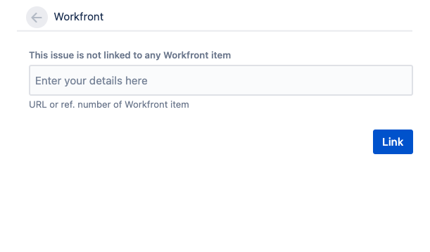

# 다음 사이 항목 연결 [!DNL Adobe Workfront] 및 [!DNL Jira]

연결할 수 있습니다 [!DNL Jira] 문제 [!DNL Adobe Workfront] 작업 또는 문제가 자동으로 또는 수동으로 수행됩니다.

에 한 항목만 [!DNL Workfront] 의 한 항목에 연결할 수 있습니다. [!DNL Jira]. 연결할 수 없습니다 [!DNL Workfront] 복수 [!DNL Jira] 문제 없음 [!DNL Jira] 여러 [!DNL Workfront] 항목.

## 액세스 요구 사항

다음 항목이 있어야 합니다.

<table style="table-layout:auto"> 
 <col> 
 <col> 
 <tbody> 
  <tr> 
   <td role="rowheader"><a href="https://www.workfront.com/plans" target="_blank">[!DNL [!DNL Adobe Workfront] 플랜]</a>*</td> 
   <td> 
[!UICONTROL Pro] 이상
 </td> 
  </tr> 
  <tr> 
   <td role="rowheader"><a href="../../administration-and-setup/add-users/access-levels-and-object-permissions/wf-licenses.md" class="MCXref xref">Adobe [!DNL Workfront] 라이선스 개요</a>*</td> 
   <td> 
플랜
 </td> 
  </tr> 
  <tr> 
   <td role="rowheader">Jira 액세스</td> 
   <td> 
시스템 관리자 액세스
 
<b>중요 사항</b>

에서 별도의 시스템 관리자 계정을 만드는 것이 좋습니다. [!DNL Jira] 및 [!DNL Workfront] 사용자에게 첨부할 수 있는 기존 항목을 사용하는 대신 이 통합에 전념할 수 있습니다.
 </td>
</tr> 
  <tr> 
   <td role="rowheader">액세스 수준 구성*</td> 
   <td> 
넌 [!DNL Workfront] 관리자 에 대한 자세한 정보 [!DNL Workfront] 관리자 <a href="../../administration-and-setup/add-users/configure-and-grant-access/grant-a-user-full-administrative-access.md" class="MCXref xref">사용자에게 전체 관리자 액세스 권한 부여</a>.
 
<b>메모</b>

여전히 액세스할 수 없는 경우 [!DNL Workfront] 관리자가 액세스 수준에서 추가 제한을 설정한 경우 자세한 내용은 [!DNL Workfront] 관리자는 액세스 수준을 수정할 수 있습니다. <a href="../../administration-and-setup/add-users/configure-and-grant-access/create-modify-access-levels.md" class="MCXref xref">사용자 정의 액세스 수준 만들기 또는 수정</a>.
 </td>
</tr> 
 </tbody> 
</table>

&#42;어떤 계획, 라이센스 유형 또는 액세스 권한을 보유하고 있는지 확인하려면 [!DNL Workfront] 관리자

## 전제 조건

항목 사이에 항목을 연결하려면 먼저 [!DNL Workfront] 및 [!DNL Jira]:

* 설치 [!DNL Workfront] 대상 [!DNL Jira]

   Jira용 Workfront 설치에 대한 지침은 [Jira용 Adobe Workfront 설치](../../workfront-integrations-and-apps/use-workfront-with-jira/install-workfront-for-jira.md).

* 구성 [!DNL Workfront] Jira

   Jira용 Workfront 구성에 대한 지침은 [Jira용 Adobe Workfront 구성](../../workfront-integrations-and-apps/use-workfront-with-jira/configure-workfront-for-jira.md).

## 자동 링크 [!DNL Workfront] 항목 대상 [!DNL Jira] 문제

로서의 [!DNL Workfront] 관리자는 [!DNL Jira] 특정 조건이 작업 또는 [!DNL Workfront]. Workfront 및 [!DNL Jira] 항목이 연결됩니다.

구성을 완료한 후 [!DNL Workfront] Jira의 경우 항목이 [!DNL Workfront] 트리거와 일치하도록 새 항목이 자동으로 [!DNL Jira].\
Workfront 항목을 만들고 업데이트하는 Workfront 사용자는 필요하지 않습니다 [!DNL Jira] 의 항목 만들기를 트리거하는 라이선스 [!DNL Jira].

Jira 문제를 자동으로 생성하기 위한 트리거를 정의하는 방법에 대한 자세한 내용은  [구성 [!DNL Adobe Workfront] Jira](../../workfront-integrations-and-apps/use-workfront-with-jira/configure-workfront-for-jira.md).

>[!NOTE]
>
>다음을 만들 수 있습니다 [!DNL Jira] 프로젝트에 템플릿을 첨부하여 자동으로 항목이 표시됩니다. 템플릿에 을 충족하는 할당이 있는 작업이 포함된 경우 [!DNL Jira] 트리거, 새 작업이 새 생성 [!DNL Jira] 문제.

자동 연결 [!DNL Workfront] 문제를 [!DNL Jira] 문제는 자동으로 연결되는 것과 동일합니다 [!DNL Workfront] 작업에 [!DNL Jira] 문제.

자동으로 [!DNL Workfront] 작업에 [!DNL Jira] 문제:

1. 에서 [!DNL Jira] 시스템 관리자가 자동으로 만들기 위한 트리거를 구성했습니다. [!DNL Jira] 문제 발생 시 [!DNL Workfront] 항목이 할당되면 로그인한 다음 [!DNL Workfront] 액세스 수준을 사용하여 작업을 만들 수 있습니다.

   작업 액세스에 대한 자세한 내용은 [작업에 대한 액세스 권한 부여](../../administration-and-setup/add-users/configure-and-grant-access/grant-access-tasks.md).

1. 프로젝트로 이동하여 를 선택합니다 **[!UICONTROL 작업]**  왼쪽 패널에 표시됩니다.

1. 클릭 **[!UICONTROL 새 작업]**

   또는

   기존 작업을 선택한 다음 **편집**.

1. 작업에 사용할 수 있는 필드를 지정하거나 업데이트합니다.
1. 클릭 **[!UICONTROL 지정]** 및 에서는 트리거로 지정된 사용자, 역할 또는 팀에 작업을 할당합니다 [!DNL Jira] 통합.

1. 클릭 **변경 내용 저장**.

   Workfront에서 새 작업이 만들어집니다.

   에서 **[!UICONTROL 업데이트]** 새 작업의 영역에는 새 문제가 [!DNL Jira].

   

1. (선택 사항) Jira 문제에 대한 링크를 클릭하여 Jira에서 엽니다.

   또는

   을(를) 클릭합니다. **[!UICONTROL 지라로 이동]** 링크 위치 **[!UICONTROL 통합]** 의 영역 **[!UICONTROL 세부 사항]** 섹션 또는 작업 또는 문제 헤더에서 [!DNL Jira] 문제.

   시스템 또는 그룹 관리자가 [!UICONTROL 통합] 필드를 레이아웃 템플릿에 추가하여 작업 또는 문제 헤더에 표시합니다. 자세한 내용은 [레이아웃 템플릿을 사용하여 개체 머리글 사용자 지정](../../administration-and-setup/customize-workfront/use-layout-templates/customize-object-headers.md).

   임의 [!DNL Jira] 사용자는 [!DNL Workfront] 및 해당 업데이트가 [!DNL Workfront] 라이센스가 필요 없는 [!DNL Workfront] 활성화해줄 수 있습니다.

   로서의 필드만 [!DNL Workfront] 관리자가 [!DNL Workfront] 추가 기능이 업데이트되었습니다.

   Workfront과 Jira 간의 필드 동기화에 대한 자세한 내용은 [Jira용 Workfront 구성](../../workfront-integrations-and-apps/use-workfront-with-jira/configure-workfront-for-jira.md#configuring-the-add-on-for-jira) 섹션  [Jira용 Adobe Workfront 구성](../../workfront-integrations-and-apps/use-workfront-with-jira/configure-workfront-for-jira.md).

   >[!NOTE]
   >
   >다음 [!DNL Jira] 문제는 [!DNL Jira] Workfront에서 자동으로 만들어집니다.

## 수동 링크 [!DNL Jira] 문제 [!DNL Workfront] 항목

에서 항목을 만든 후 [!DNL Jira] 및 [!DNL Workfront]와는 별도로 [!DNL Jira] 기존 [!DNL Workfront] 작업 또는 문제입니다.\
를 수동으로 연결할 수 없습니다 [!DNL Workfront] 항목: [!DNL Workfront] 기존 [!DNL Jira] 항목.

>[!NOTE]
>
>만약 [!DNL Jira] 에서 트리거로 식별되지 않는 프로젝트에 문제가 없습니다 [!DNL Workfront] 통합 을 사용하면 통합을 사용할 때 Workfront 항목에 수동으로 연결할 수 없습니다 [!DNL Jira] 온-프레미스.\
>Jira 워크플로우에 대한 Workfront 트리거 설정에 대한 자세한 내용은 [Workfront 항목을 Jira 문제에 자동으로 연결](#automatically-link-workfront-items-to-jira-issues).

When [!DNL Workfront] 및 [!DNL Jira] 항목이 연결되어 있으면 한 항목의 특정 필드가 다른 항목에 자동으로 업데이트됩니다.\
연결된 항목 업데이트에 대한 자세한 내용은 [Jira와 Adobe Workfront 간 연결된 항목 업데이트](../../workfront-integrations-and-apps/use-workfront-with-jira/update-linked-items-between-jira-wf.md).

수동으로 연결하려면 [!DNL Jira] 문제 [!DNL Workfront] 항목:

1. (조건부) 로그인 [!DNL Workfront] 연결할 문제 또는 작업을 찾습니다 [!DNL Jira] 문제.
1. (조건부) 항목의 주소 표시줄에서 **URL** Workfront에 있는 항목의 수입니다.

   또는

   에서 [!UICONTROL 세부 사항] 영역 , 복사 **[!UICONTROL 참조 번호]** Workfront에 있는 항목의 수입니다.

   >[!NOTE]
   >
   >다음을 수행해야 합니다. [!DNL Workfront] 로그인하기 위한 라이선스 [!DNL Workfront]. 그렇지 않으면 [!DNL Workfront] 사용자는 이 정보를 제공해야 합니다.

1. in [!DNL Jira]에 수동으로 연결할 문제로 이동합니다. [!DNL Workfront] 항목.
1. 에서 [!DNL Workfront] 오른쪽 패널, 붙여넣기 **URL** 또는 **[!UICONTROL 참조 번호]** 의 [!DNL Workfront] 연결할 항목입니다.\
   

1. 클릭 **[!UICONTROL 링크]**.

   두 항목이 연결되고 [!DNL Workfront] 오른쪽 패널에는 [!DNL Workfront] 항목.

   다음 [!DNL Workfront] 다음 위치에 필드가 표시됩니다. [!DNL Jira]기본적으로 [!DNL Workfront] 오른쪽 패널:

   * 다음 **[!UICONTROL 이름]** 항목: 에 액세스할 수 있습니다 [!DNL Workfront] 항목을 드래그하여 선택합니다.
   * **[!UICONTROL 프로젝트 이름]**
   * 다음 **[!UICONTROL 상태]** 항목
   * 다음 **[!UICONTROL 우선순위]** 항목
   * 만든 날짜입니다. [!DNL Workfront]
   * 다음 **[!UICONTROL 계획 시간]** 항목
   * 다음 **[!UICONTROL 참조 번호]**: 에 액세스할 수 있습니다 [!DNL Workfront] 항목을 클릭하여 [!UICONTROL 참조 번호] 클릭합니다.

오른쪽 패널에 추가 필드를 표시할 수 있도록 하는 방법에 대한 자세한 내용은 [필드 동기화 구성 [!DNL Jira] 및 [!DNL Workfront] 항목](../../workfront-integrations-and-apps/use-workfront-with-jira/configure-workfront-for-jira.md#setting-up-field-synchronization) 섹션 [구성 [!DNL Adobe Workfront for Jira]](../../workfront-integrations-and-apps/use-workfront-with-jira/configure-workfront-for-jira.md). 의 댓글 [!DNL Workfront] 통합과 관련된 관리자는 **[!DNL Workfront]** 의 탭 [!DNL Jira] 새 [!DNL Jira] 항목이 생성되었습니다. 주석에는 [!DNL Jira] 문제.

## 간 항목 연결 해제 [!DNL Jira] 및 [!DNL Workfront]

간 연결된 항목 [!DNL Jira] 및 [!DNL Workfront] 에서 수동으로 연결 해제할 수 있습니다. [!DNL Jira].\
연결을 끊을 수 없습니다 [!DNL Workfront] 품목 [!DNL Jira] 상대 [!DNL Workfront].

수동으로 연결된 항목의 연결을 끊으려면 다음 액세스 권한이 필요합니다.

* 항목을 수동으로 연결한 사용자입니다
* 당신은 [!DNL Jira] 시스템 관리자

전용 [!DNL Workfront] 관리자는 자동으로 연결된 항목의 연결을 끊을 수 있습니다.

연결을 해제하려면 [!DNL Jira] 문제 [!DNL Workfront] 항목:

1. in [!DNL Jira]로 이동하여 [!DNL Workfront] 작업 또는 문제입니다.
1. 로 이동합니다. [!DNL Workfront] 오른쪽 패널에서 **[!UICONTROL 연결 해제]** 아이콘을 클릭한 다음 **[!UICONTROL 연결 해제]**.\
   \
   이전에 연결된 [!DNL Jira] 및 [!DNL Workfront] 이제 항목이 연결 해제되었습니다. 나중에 개별적으로 업데이트될 수 있는 필드, 주석 또는 문서는 다른 애플리케이션에서 이전 상대 필드에 대해 업데이트되지 않습니다.
