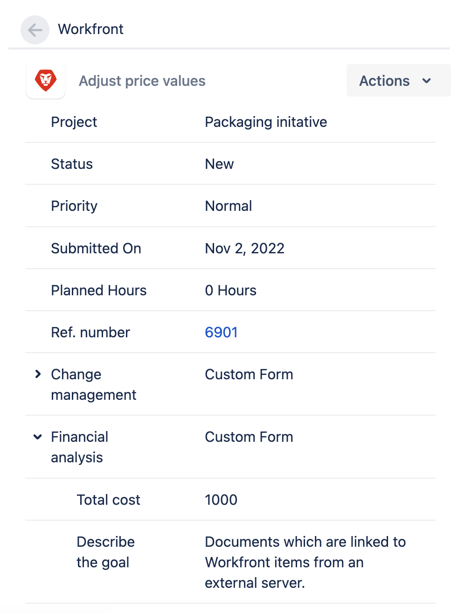

# 간 연결된 항목 업데이트 [!DNL Jira] 및 [!DNL Adobe Workfront]

연결할 때 [!DNL Jira] 문제 [!DNL Adobe Workfront] 작업이나 문제는 사용자가 하나의 응용 프로그램에서 항목을 업데이트할 수 있고 해당 항목의 상대자도 두 번째 응용 프로그램에서 작업하는 사용자를 위해 업데이트됩니다.

간 항목 연결에 대한 자세한 정보 [!DNL Workfront] 및 [!DNL Jira]를 참조하십시오. [Adobe Workfront과 Jira 간 링크 항목](../../workfront-integrations-and-apps/use-workfront-with-jira/link-items-between-wf-jira.md).

설정할 때 [!DNL Workfront] 대상 [!DNL Jira], 로서의 [!DNL Jira] 시스템 관리자는 하나의 응용 프로그램에서 특정 필드를 구성하여 다른 응용 프로그램의 링크된 항목의 필드와 동기화할 수 있습니다.

연결된 필드 간 동기화에 대한 자세한 정보 [!DNL Jira] 및 [!DNL Workfront] 항목: [구성 [!DNL Adobe Workfront for Jira]](../../workfront-integrations-and-apps/use-workfront-with-jira/configure-workfront-for-jira.md).

## 액세스 요구 사항

다음 항목이 있어야 합니다.

<table style="table-layout:auto"> 
 <col> 
 </col> 
 <col> 
 </col> 
 <tbody> 
  <tr> 
   <td role="rowheader"><a href="https://www.workfront.com/plans" target="_blank">[!DNL Adobe Workfront] 플랜</a>*</td> 
   <td> 
[!UICONTROL Pro] 이상
 </td> 
  </tr> 
  <tr> 
   <td role="rowheader"><a href="../../administration-and-setup/add-users/access-levels-and-object-permissions/wf-licenses.md" class="MCXref xref">Adobe [!DNL Workfront] 라이선스 개요</a>*</td> 
   <td> 
[!UICONTROL 계획]
 </td> 
  </tr> 
  <tr> 
   <td role="rowheader">[!DNL Jira] 액세스</td> 
   <td> 
시스템 관리자 액세스
 
중요 사항: 에서 별도의 시스템 관리자 계정을 만드는 것이 좋습니다. [!DNL Jira] 및 [!DNL Workfront] 사용자에게 첨부할 수 있는 기존 항목을 사용하는 대신 이 통합에 전념할 수 있습니다.
 </td> 
  </tr> 
  <tr> 
   <td role="rowheader">액세스 수준 구성*</td> 
   <td> 
넌 [!DNL Workfront] 관리자 에 대한 자세한 정보 [!DNL Workfront] 관리자 <a href="../../administration-and-setup/add-users/configure-and-grant-access/grant-a-user-full-administrative-access.md" class="MCXref xref">사용자에게 전체 관리자 액세스 권한 부여</a>.
 
참고: 여전히 액세스할 수 없는 경우 [!DNL Workfront] 관리자가 액세스 수준에서 추가 제한을 설정한 경우 자세한 내용은 [!DNL Workfront] 관리자는 액세스 수준을 수정할 수 있습니다. <a href="../../administration-and-setup/add-users/configure-and-grant-access/create-modify-access-levels.md" class="MCXref xref">사용자 정의 액세스 수준 만들기 또는 수정</a>.
 </td> 
  </tr> 
 </tbody> 
</table>

&#42;어떤 계획, 라이센스 유형 또는 액세스 권한을 보유하고 있는지 확인하려면 [!DNL Workfront] 관리자

## 전제 조건

항목 사이에 항목을 연결하려면 먼저 [!DNL Workfront] 및 [!DNL Jira]:

* 설치 [!DNL Workfront for Jira].

   설치 지침 [!DNL Workfront for Jira]를 참조하십시오. [설치 [!DNL Adobe Workfront for Jira]](../../workfront-integrations-and-apps/use-workfront-with-jira/install-workfront-for-jira.md).

* Configure [!DNL Workfront for Jira].

   구성에 대한 지침 [!DNL Workfront for Jira]를 참조하십시오. [구성 [!DNL Adobe Workfront for Jira]](../../workfront-integrations-and-apps/use-workfront-with-jira/configure-workfront-for-jira.md).

* 다음 사이 항목 연결 [!DNL Workfront] 및 [!DNL Jira].

   자세한 내용은 [다음 사이 항목 연결 [!DNL Adobe Workfront] 및 [!DNL Jira]](../../workfront-integrations-and-apps/use-workfront-with-jira/link-items-between-wf-jira.md).

## 에서 연결된 항목 업데이트 [!DNL Workfront]

주로 [!DNL Workfront]의 작업 항목을 업데이트할 수 있습니다. [!DNL Workfront] 그리고 상대방과 [!DNL Jira] 또한 업데이트합니다. 이 업데이트는 [!DNL Workfront] 대상 [!DNL Jira] 이 경우 [!DNL Jira] 라이센스.

당신이 [!DNL Workfront] 관리자가 구성됨 [!DNL Workfront for Jira] 연결된 항목 간에 필드를 동기화하려면 [!DNL Workfront] 연결된 항목에 대한 업데이트도 [!DNL Jira] 문제. 항목 업데이트에 대한 자세한 내용은 [!DNL Workfront]를 참조하십시오. [문제 편집](../../manage-work/issues/manage-issues/edit-issues.md) 및 [작업 편집](../../manage-work/tasks/manage-tasks/edit-tasks.md).

다음 목록에는 다음 중 어떤 것이 표시됩니다 [!DNL Workfront] 와 동기화 [!DNL Jira] 연결된 항목에 대한 필드:

<table style="table-layout:auto"> 
 <col> 
 <col> 
 <thead> 
  <tr> 
   <th><strong>업데이트됨 [!DNL Workfront] 필드</strong> </th> 
   <th><strong>동기화됨 [!DNL Jira] 필드/ 업데이트</strong> </th> 
  </tr> 
 </thead> 
 <tbody> 
  <tr> 
   <td>[!UICONTROL 문제 또는 작업 이름]</td> 
   <td> 
[!UICONTROL 문제 이름]
 
이름 변경에 대한 주석이 <strong>[!DNL Workfront]</strong> 의 탭 [!DNL Jira] 문제. 
 </td> 
  </tr> 
  <tr> 
   <td>[!UICONTROL 문제 또는 작업 설명]</td> 
   <td> 
 [!UICONTROL 문제 설명]
 
업데이트된 설명에 대한 설명이 <strong>[!DNL Workfront]</strong> 의 탭 [!DNL Jira] 문제. 
 </td> 
  </tr> 
  <tr> 
   <td> 
 [!UICONTROL Updated Documents]
 
참고: 연결된 문서 [!DNL Workfront] 외부 서버의 항목은 [!DNL Jira] 문제. 에 바로 업로드된 문서만 [!DNL Workfront] 연결된 항목에도 업데이트됩니다 [!DNL Jira] 문제. 
 </td> 
   <td> 
[!UICONTROL 첨부 파일]
 
업로드된 첨부 파일에 대한 주석이 추가됩니다 <strong>[!DNL Workfront]</strong> 의 탭 [!DNL Jira] 문제. 
 </td> 
  </tr> 
  <tr> 
   <td>[!UICONTROL 계획된 완료 날짜]</td> 
   <td> 
[!UICONTROL 기한]
 
변경된 [!UICONTROL 기한]에 대한 설명이 [!DNL Workfront] 의 탭 [!DNL Jira] 문제. 
 
참고: 활성화 <strong>[!UICONTROL 기한]</strong> 에 대해 [!DNL Jira] [!UICONTROL Jira]에서 업데이트된 이 필드를 볼 수 있는 문제. 
 </td> 
  </tr> 
  <tr> 
   <td>사용자 지정 Forms 및 사용자 지정 필드</td> 
   <td> 
 에 표시 [!DNL Workfront] 의 오른쪽 패널 [!DNL Jira] 문제.  실제 값이 있는 사용자 지정 필드만 패널에 표시됩니다. 
 
참고: 사용자 지정 양식 섹션은 [!DNL Workfront] 관리자 
 </td> 
  </tr> 
  <tr> 
   <td>[!UICONTROL 문제 또는 작업 우선 순위]</td> 
   <td>에 표시됩니다. [!DNL Workfront] 의 오른쪽 패널 [!DNL Jira] 문제.  이 설정은 문제를 업데이트하지 않습니다 <strong>[!UICONTROL Priority]</strong> 필드 [!DNL Jira]. </td> 
  </tr> 
  <tr> 
   <td>[!UICONTROL 로그 시간] </td> 
   <td> 
로그된 시간에 대한 주석이 <strong>[!DNL Workfront]</strong> 의 탭 [!DNL Jira] 문제. 여기에는 시간을 기록하는 사용자의 이름과 시간이 다른 경우 로그인한 사용자의 이름이 포함됩니다. 에 로그인한 시간이 없습니다. <strong>[!UICONTROL 작업 로그]</strong> 탭 [!DNL Jira]. 
 </td> 
  </tr> 
  <tr> 
   <td>[!UICONTROL Comments]</td> 
   <td> 
댓글은 <strong>[!DNL Workfront]</strong> 의 탭 [!DNL Jira] 문제. 에는 추가되지 않습니다 <strong>[!UICONTROL Comments]</strong> 의 탭 [!DNL Jira] 문제
 
참고: 두 개의 기존 항목을 수동으로 연결하면 [!DNL Workfront] 연결하기 전 [!DNL Jira] 와 동기화 안 함 [!DNL Jira] 문제. 
 </td> 
  </tr> 
 </tbody> 
</table>

## 에서 연결된 항목 업데이트 [!DNL Jira]

주로 [!DNL Jira]의 작업 항목을 업데이트할 수 있습니다. [!DNL Jira] 그리고 상대방과 [!DNL Workfront] 또한 업데이트합니다. 그럴 필요 없어요 [!DNL Workfront] 라이센스 [!DNL Workfront] 에 연결된 항목 [!DNL Jira] 업데이트 수신 문제 [!DNL Jira].

조건이 [!DNL Workfront] 관리자가 구성됨 [!DNL Workfront] 대상 [!DNL Jira] 연결된 항목 간에 필드를 동기화하려면 [!DNL Jira] 연결된 항목에 대한 업데이트도 [!DNL Workfront] 항목.

다음 목록에는 다음 중 어떤 것이 표시됩니다 [!DNL Jira] 와 동기화 [!DNL Workfront] 연결된 항목에 대한 필드:

<table style="table-layout:auto"> 
 <col> 
 <col> 
 <thead> 
  <tr> 
   <th><strong>업데이트됨 [!DNL Jira] 필드</strong> </th> 
   <th><strong>동기화됨 [!DNL Workfront] 필드/업데이트</strong> </th> 
  </tr> 
 </thead> 
 <tbody> 
  <tr> 
   <td>[!UICONTROL 문제 상태]</td> 
   <td> 
 [!UICONTROL 문제 또는 작업 상태]
 
의 문제 상태 [!DNL Jira] Workfront에서 다음 상태 또는 다음 상태와 동일한 상태와 동기화됩니다.
 
    <ul> 
     <li> 
[!UICONTROL 신규] ([!UICONTROL NEW])
 </li> 
     <li> 
[!UICONTROL 진행 중] ([!UICONTROL INP])
 </li> 
     <li> 
[!UICONTROL Closed]/[!UICONTROL Complete] ([!UICONTROL CLS]/[!UICONTROL CPL])
 </li> 
    </ul> 
참고: 다음 [!DNL Jira] 상태가 첫 번째 [!DNL Workfront] 적절한 상태와 일치하는 상태입니다.
 
의 항목 상태에 대한 자세한 정보 [!DNL Workfront]를 참조하십시오. <a href="../../administration-and-setup/customize-workfront/creating-custom-status-and-priority-labels/create-or-edit-a-status.md" class="MCXref xref">상태 만들기 또는 편집</a>.
 </td> 
  </tr> 
  <tr> 
   <td>[!UICONTROL 문제 담당자]</td> 
   <td> 
 [!UICONTROL 문제 또는 작업 할당자]
 
중요 사항: 에서 항목을 지정할 때 [!DNL Jira] 이 없는 사용자에게 [!DNL Workfront] 계정, 통합은에서 새 활성 사용자를 생성합니다. [!DNL Workfront] "[!UICONTROL 옵션이 사용자를 자동으로 만들 때만 [!DNL Workfront] if [!DNL Jira] 사용자에게 없음 [!DNL Workfront] account]"이 [!UICONTROL Always]로 설정되어 있습니다. 이 사용자는 [!DNL Workfront] 라이센스. 활성 사용자는 의 작업 항목에 할당할 수 있습니다 [!DNL Workfront], 에는 포함할 수 없습니다. 자동 만들기 구성에 대한 자세한 내용은 [!DNL Workfront] 사용자 [!DNL Jira]를 참조하십시오. <a href="../../workfront-integrations-and-apps/use-workfront-with-jira/configure-workfront-for-jira.md">구성 [!DNL Workfront for Jira]</a>.
 </td> 
  </tr> 
  <tr> 
   <td>[!UICONTROL 문제 첨부 파일]</td> 
   <td> [!UICONTROL Issue or Task Documents] 에서 새 문서 업로드에 대한 주석 [!DNL Jira] 가 의 [!UICONTROL 업데이트] 탭에 추가되었습니다. [!DNL Workfront] 문제 또는 작업입니다.  </td> 
  </tr> 
  <tr> 
   <td>[!UICONTROL 기한]</td> 
   <td> 
 의 [!UICONTROL 기한] 변경에 대한 설명 [!DNL Jira] 가 의 [!UICONTROL 업데이트] 탭에 추가되었습니다. [!DNL Workfront] 문제 또는 작업입니다. 
 
참고: 에서 날짜가 변경되지 않음 [!DNL Workfront] 문제 또는 작업입니다. 
 </td> 
  </tr> 
  <tr> 
   <td> 로그인 시간 [!DNL Workfront] 오른쪽 패널 또는 [!DNL Jira] 문제 </td> 
   <td> 
시간 연결된 항목에 Jira에 로그인한 시간을 추가하는 것 외에도 [!DNL Workfront] 항목이 있을 경우, 로깅 시간에 대한 주석이 페이지의 [!UICONTROL Updates] 탭에 추가됩니다 [!DNL Workfront] 항목.
 
연결된 항목에 대한 로깅 시간에 대한 자세한 정보 [!DNL Jira] 업데이트 등의 문제 [!DNL Jira] 로그인한 사용자 [!DNL Workfront]를 참조하십시오. <a href="#log-time-for-linked-jira-and-workfront-items" class="MCXref xref">연결 로그 시간 [!DNL Jira] 및 [!DNL Workfront] 항목</a>.
 </td> 
  </tr> 
  <tr> 
   <td> 댓글   </td> 
   <td> 
주석은 [!DNL Workfront] 문제 또는 작업 <strong>[!UICONTROL Comments]</strong> [!UICONTROL 설정] 탭의 [!UICONTROL에서 WORKFRONT으로 동기화] 섹션에서 <strong>[!UICONTROL Always]</strong>.
 
의 Workfront 설정 구성에 대한 자세한 내용은 [!DNL Jira]를 참조하십시오. <a href="../../workfront-integrations-and-apps/use-workfront-with-jira/configure-workfront-for-jira.md">구성 [!DNL Workfront for Jira]</a>.
 
연결된 항목의 항목에 대한 댓글 달기에 대한 자세한 내용은 [!DNL Jira] 문제 <a href="#comment-from-a-linked-jira-issue" class="MCXref xref">연결된 항목에서 주석 [!DNL Jira] 문제</a>.
 </td> 
  </tr> 
 </tbody> 
</table>

## 연결 시 로그 시간 [!DNL Jira] 문제

다음에 대해 기록하는 시간 [!DNL Jira] 항목 [!DNL Jira] 연결된 링크에도 전송됩니다. [!DNL Workfront] 에 상관없이 [!DNL Jira] 시간 기록\
Jira에 로그인할 때 [!DNL Workfront] 패널, 시간은 [!DNL Workfront].\
녹음한 시간 [!DNL Workfront] 에 연결된 문제 시간에 영향을 주지 않음 [!DNL Jira].

>[!NOTE]
>
>시간을 [!DNL Jira] 에 연결된 항목 [!DNL Workfront] 작업, [!UICONTROL 시간 유형] - 시간 [!DNL Workfront] is [!UICONTROL 작업 시간]. 시간을 [!DNL Jira] 에 연결된 항목 [!DNL Workfront] 문제, [!UICONTROL 시간 유형] - 시간 [!DNL Workfront] is [!UICONTROL 문제 시간].

에 댓글이 추가됩니다. **[!DNL Workfront]** 탭 [!DNL Jira] 및 **[!UICONTROL 업데이트]** 의 항목 탭 [!DNL Workfront] 로깅 시간을 기록하려면\
시간은 **[!UICONTROL 시간]** 의 탭 [!DNL Workfront] 항목.

* [연결 로그 시간 [!DNL Jira] 및 [!DNL Workfront] 항목](#log-time-for-linked-jira-and-workfront-items)
* [로그 시간 [!DNL Jira] 변환 후 [!DNL Workfront] 항목](#log-time-from-jira-to-a-workfront-item)

### 연결 로그 시간 [!DNL Jira] 및 [!DNL Workfront] 항목

에서 시간을 기록할 수 있습니다. [!DNL Jira] 에 연결된 문제 [!DNL Workfront] 항목 및 시간은 둘 다 [!DNL Jira] 문제 및 [!DNL Workfront] 항목.

>[!IMPORTANT]
>
>사용자가 로그인하는 경우 [!DNL Jira] 에 존재하지 않음 [!DNL Workfront]로 지정하는 경우, 통합은 **[!UICONTROL 에서 사용자를 자동으로 만들기 [!DNL Workfront]다음&#x200B;으로 [!DNL Jira] 사용자에게 없음&#x200B;*[!DNL Workfront]&#x200B; 계정]**가**[!UICONTROL &#x200B;항상&#x200B;]**. 이 사용자는 [!DNL Workfront] 라이센스. 활성 사용자를 의 작업 항목에 할당할 수 있습니다 [!DNL Workfront]하지만 업데이트에 포함할 수 없습니다. 자동 만들기 구성에 대한 자세한 내용은 [!DNL Workfront] 사용자 [!DNL Jira]를 참조하십시오. [구성 [!DNL Workfront for Jira]](../../workfront-integrations-and-apps/use-workfront-with-jira/configure-workfront-for-jira.md).

에 있는 항목에 대한 시간을 기록하려면 [!DNL Jira] 그리고 둘 다 [!DNL Jira] 및 [!DNL Workfront]:

1. 에 로그인합니다. [!DNL Jira].
1. 로 이동합니다. [!DNL Jira] 에 연결된 문제 [!DNL Workfront] 항목.
1. 를 확장합니다. **[!UICONTROL 자세히]** 메뉴를 클릭하고 **[!UICONTROL 로그 작업]**.\
   

1. 에서 **[!UICONTROL 체류 시간]** 필드에서 이 문제에 대해 작업하는 데 걸린 시간을 지정합니다. 다음 기간을 사용하여 시간을 지정해야 합니다.

   * [!UICONTROL 주] (w)
   * [!UICONTROL 일] 라.
   * [!UICONTROL 시간] 아.

1. 을 포함하여 시간 항목에 정보를 계속 추가합니다. **[!UICONTROL 작업 설명]**&#x200B;를 클릭한 다음 **[!UICONTROL 로그]**.\
   시간이 **[!UICONTROL 작업 로그]** 의 탭 [!DNL Jira] 항목 및 [!DNL Workfront] 연결된 항목입니다.\
   시간 항목의 작업 설명은 의 시간 항목에 대한 메모로 기록됩니다. [!DNL Workfront].

### 로그 시간 [!DNL Jira] 변환 후 [!DNL Workfront] 항목

연결된 [!DNL Workfront] 항목 [!DNL Jira] 이번에는 기록하지 않고 문제를 해결했습니다. [!DNL Jira] 문제.

1. 에 로그인합니다. [!DNL Jira].
1. 로 이동합니다. [!DNL Jira] 에 연결된 문제 [!DNL Workfront] 항목.

   세부 사항 [!DNL Workfront] 항목이 [!DNL Workfront] 문제의 오른쪽 패널.

1. 을(를) 클릭합니다. **[!UICONTROL 로그 시간]** 아이콘.

   

1. 의 양을 지정합니다. **[!UICONTROL 시간]** 및 **[!UICONTROL 분]** 문제를 기록하려는 경우

1. 클릭 **[!UICONTROL 로그 시간]**.

   시간이 [!DNL Workfront] 항목.

   이 시간은 [!UICONTROL 작업 로그] 의 탭 [!DNL Jira] 문제.

## 연결된 항목에서 주석 [!DNL Jira] 문제 {#comment-from-a-linked-jira-issue}

다음에 대해 댓글을 달면 [!DNL Jira] 항목 [!DNL Workfront] 오른쪽 패널 [!DNL Jira]로 설정되어 있는 경우, 댓글은 [!UICONTROL 업데이트] Workfront에 있는 연결된 항목의 탭입니다.

에서 주석을 달려면 [!DNL Jira] 변환 후 [!DNL Workfront] 항목:

1. 에 로그인합니다. [!DNL Jira].
1. 로 이동합니다. [!DNL Jira] 에 연결된 문제 [!DNL Workfront] 항목.

   세부 사항 [!DNL Workfront] 항목이 [!DNL Workfront] 문제의 오른쪽 패널.

1. 을(를) 클릭합니다. **[!UICONTROL 댓글]** 아이콘( [!DNL Workfront] 패널 또는 **[!UICONTROL 댓글]** 탭. 

1. 댓글 입력을 시작한 다음 **[!UICONTROL 보내기]**.

   주석은 다음에 추가됩니다.

   * 다음 **[!DNL Workfront]** 의 탭 [!DNL Jira] 문제.
   * 다음 **[!UICONTROL 댓글]** 의 탭 [!DNL Jira] 문제.
   * 다음 **[!UICONTROL 업데이트]** Workfront에 있는 연결된 항목의 탭입니다.
