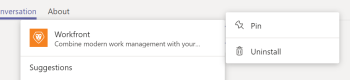

# 설치 [!DNL Adobe Workfront] Microsoft Teams

다음 [!DNL Adobe Workfront for Microsoft Teams] 앱에서 의 기본 작업을 수행할 수 있습니다. [!DNL Workfront] 그냥 [!DNL Microsoft Teams] 채팅 채널.

>[!NOTE]
>
>[!DNL Microsoft Teams] 더 이상 지원되지 않음 [!DNL Internet Explorer]. 를 사용하려면 [!DNL Adobe Workfront for Microsoft Teams integration]를 채울 때는 다음 이외의 웹 브라우저를 사용해야 합니다 [!DNL Internet Explorer].

## 액세스 요구 사항

이 문서의 절차를 수행하려면 다음 액세스 권한이 있어야 합니다.

<table style="table-layout:auto"> 
 <col> 
 <col> 
 <tbody> 
  <tr> 
   <td role="rowheader">[!DNL Adobe Workfront] 플랜*</td> 
   <td> 
모든
 </td> 
  </tr> 
  <tr> 
   <td role="rowheader">[!DNL Adobe Workfront] 라이센스*</td> 
   <td> 
[!UICONTROL Work], [!UICONTROL Plan]
 </td> 
  </tr> 
 </tbody> 
</table>

&#42;어떤 계획, 라이센스 유형 또는 액세스 권한을 보유하고 있는지 확인하려면 [!DNL Workfront] 관리자

## 전제 조건

에서 팀 소유자라야 합니다. [!DNL Microsoft Teams] 를 설치합니다. [!DNL Workfront] 대상 [!DNL Microsoft Teams].

## 설치 [!DNL Workfront for Microsoft Teams]

의 팀 소유자로서 [!DNL Microsoft Teams]를 설치한 다음 [!DNL Workfront for Microsoft Teams] 앱에서 [!DNL Microsoft] 에서 제공한 파일에서 또는 저장 [!DNL Workfront].

* [설치 [!DNL Workfront for Microsoft Teams] Microsoft 스토어에서](#install-workfront-for-microsoft-teams-from-the-microsoft-store)
* [설치 [!DNL Workfront for Microsoft Teams] 개인 파일에서](#install-workfront-for-microsoft-teams-from-a-private-file)

### 설치 [!DNL Workfront for Microsoft Teams] 에서 [!DNL Microsoft] 스토어

1. 에 로그인합니다. [!DNL Microsoft Teams] 팀 소유자로서
1. 설치할 팀을 선택합니다 [!DNL Workfront for Microsoft Teams] 앱.
1. 클릭 **[!UICONTROL 스토어]** 을 클릭합니다.

   

1. 에서 **[!UICONTROL 모두 검색]** 상자, 유형 *[!DNL Workfront]*.

1. 을(를) 클릭합니다. **[!DNL Workfront]** 카드를 표시하고 마법사의 지침을 따릅니다.
1. (권장) **[!UICONTROL 팀에 추가]** 드롭다운 메뉴를 사용하여 **[!UICONTROL 예]** 앱에 팀을 추가하는 옵션.

   

1. 선택 **[!UICONTROL 일반]** 선택한 팀에 대해 해당 채널의 앱을 사용하려면 **[!UICONTROL 설정]**.

   

1. 설치가 완료되면 설치가 성공적으로 수행되었다는 알림이 [!UICONTROL 일반] 선택한 팀의 채널입니다. 팀의 모든 구성원이 이 알림을 볼 수 있습니다.
1. (선택 사항) [!DNL Workfront] 액세스 편의성을 위한 앱:

   1. 을(를) 클릭합니다. **[!UICONTROL 자세히]** 아이콘 아래의 메시지 필드( [!UICONTROL 일반] 채널.

   1. 마우스 [!DNL Workfront] 앱에서 을 클릭한 다음 **[!UICONTROL 자세히]** 아이콘 오른쪽을 누릅니다.

      

   1. 클릭 **[!UICONTROL 핀]**.

      이 옵션을 선택하면 [!DNL Workfront] 아이콘 아래에 표시됩니다. 에 빠르게 액세스할 수 있습니다 [!UICONTROL 검색] 이 지역

      검색 방법에 대한 자세한 내용 [!DNL Workfront] 항목: [검색 및 공유 [!DNL Adobe Workfront] 항목 [!DNL Microsoft Teams]](../../workfront-integrations-and-apps/using-workfront-with-microsoft-teams/search-for-and-share-wf-items-in-ms-teams.md).

1. 클릭 **[!UICONTROL 에 로그인합니다.[!DNL Workfront]]** 액세스 권한 [!DNL Workfront from Microsoft Teams].

   로그인하는 방법에 대한 자세한 내용 [!DNL Workfront]를 참조하고 [Microsoft Teams에서 Workfront에 로그인](#log-in-to-workfront-from-microsoft-teams) 섹션에 자세히 설명되어 있습니다.

### 설치 [!DNL Workfront for Microsoft Teams] 개인 파일에서

조직에서 앱 다운로드에 대한 액세스를 제한하는 경우 [!DNL Microsoft] Adobe 지원 팀에 문의하여 [!DNL Workfront for Microsoft Teams] 앱을 설치하는 중입니다.

지원 팀에 문의하는 방법에 대한 자세한 내용은 [고객 지원에 문의](../../workfront-basics/tips-tricks-and-troubleshooting/contact-customer-support.md).

설치하려면 [!DNL Workfront for Microsoft Teams] 개인 파일에서 다음을 수행합니다.

1. 받은 개인 파일을 저장합니다 [!DNL Workfront] 사용자 컴퓨터에 저장
1. 에 로그인합니다. [!DNL Microsoft Teams] 로서의 [!DNL Microsoft] 팀 소유자.
1. 을(를) 클릭합니다. **[!UICONTROL 자세히]** 설치할 팀의 아이콘 [!DNL Workfront for Microsoft Teams].

   

1. 클릭 **[!UICONTROL 팀 관리]**.
1. 을(를) 선택합니다 **[!UICONTROL 앱]** 탭을 클릭한 다음 **[!UICONTROL 사용자 지정 앱 업로드]** 화면 오른쪽 아래 모서리에 있습니다.

1. 컴퓨터에 저장한 개인 파일을 찾은 다음 설치 단계에 따라 설치합니다 [!DNL Workfront for Microsoft Teams].
1. 설치가 완료되면 선택한 팀의 일반 채널에 설치가 성공적으로 수행되었다는 알림이 나타납니다. 팀의 모든 구성원이 이 알림을 볼 수 있습니다.
1. (선택 사항) **[!UICONTROL 자세히]** 아이콘 아래의 **[!UICONTROL 여기에 질문 입력]** 필드.

1. (선택 사항) 마우스를 [!DNL Workfront] 앱에서 을 클릭한 다음 **[!UICONTROL 자세히]** 아이콘 오른쪽을 누릅니다.

   

1. (선택 사항) **[!UICONTROL 핀]**.

   이 옵션을 선택하면 [!DNL Workfront] 아이콘 아래의 [!UICONTROL 여기에 질문 입력] 필드. 에 빠르게 액세스할 수 있습니다 [!UICONTROL 검색] 이 지역\
   Workfront 항목 검색에 대한 자세한 내용은 [검색 및 공유 [!DNL Adobe Workfront] 항목 [!DNL Microsoft Teams]](../../workfront-integrations-and-apps/using-workfront-with-microsoft-teams/search-for-and-share-wf-items-in-ms-teams.md).

## 에 로그인합니다. [!DNL Workfront] 변환 전: [!DNL Microsoft] 팀

로서의 [!DNL Microsoft Teams] 팀 소유자, [!DNL Workfront for Microsoft Teams] 사용자 또는 팀원이 로그인하기 전에 [!DNL Workfront from Microsoft Teams].

에 로그인하면 [!DNL Workfront] 변환 전: [!DNL Microsoft Teams]: [!DNL Workfront] 의 알림 [!DNL Workfront] 보트 채널이나 [!DNL Workfront] 변환 전: [!DNL Microsoft Teams].

설치 관련 정보 [!DNL Workfront] 앱을 보려면 [설치 [!DNL Workfront for Microsoft Teams]](#install-workfront-for-microsoft-teams) 섹션에 자세히 설명되어 있습니다.

액세스 방법에 대한 자세한 정보 [!DNL Workfront] 변환 전: [!DNL Microsoft Teams] 특정 작업을 수행하려면 다음을 참조하십시오. [액세스 [!DNL Adobe Workfront] 변환 전: [!DNL Microsoft Teams]](../../workfront-integrations-and-apps/using-workfront-with-microsoft-teams/access-workfront-from-ms-teams.md).

에 로그인하려면 [!DNL Workfront] 변환 전: [!DNL Microsoft Teams]:

1. 로 이동합니다. **[!UICONTROL 일반]** 팀 채널 [!DNL Workfront for Microsoft Teams] 앱이 설치되고 을 클릭합니다. **[!UICONTROL Workfront에 로그인]**.

   다음 [!DNL Workfront] 보트 채팅 채널이 [!DNL Microsoft Teams] 채팅 채널.

   

1. 로 이동합니다. [!DNL Workfront] 보트 채팅 채널 [!DNL Microsoft Teams] 및 유형 *[!UICONTROL 로그인]* 에서 **[!UICONTROL 여기에 질문 입력]** 필드.

   또는

   클릭 **[!UICONTROL 로그인]**.

   

   새 브라우저 탭이 열립니다.

1. 화면의 지침에 따라 로그인하십시오 [!DNL Workfront] 고급 인증, OAuth 2.0 또는 SAML(Security Assertion Markup Language) URL을 사용합니다.

   >[!NOTE]
   >
   >* 도메인 입력 메시지가 표시되면 [!DNL Workfront] 다음 형식으로 입력하십시오. *yourCompany&#39;sDomain.my.workfront.com*. 일반적으로 회사의 도메인은 회사의 이름입니다.
   >* Enhanced Authentication 은 [!DNL Workfront] 관리자가 이 통합을 위해 이 통합을 사용하도록 설정합니다.

1. 로그인하고 다시 시작하는 데 사용한 브라우저 탭을 닫습니다. [!DNL Microsoft Teams].

   알림은에 표시됩니다 [!DNL Workfront] 채팅 채널을 보냄에 로그인했는지 확인 [!DNL Workfront] 성공적으로 수행되었습니다.
