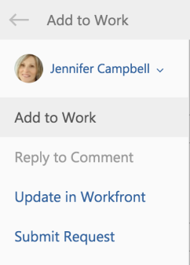

# 추가 [!DNL Outlook] 작업 목록에 작업으로 전자 메일 보내기

변환할 수 있습니다 [!DNL Outlook] 전자 메일 [!DNL Adobe Workfront] 작업. 전자 메일이 변환된 후에는 [!UICONTROL 작업] 의 목록 [!UICONTROL 홈] 영역.

## 액세스 요구 사항

이 문서의 절차를 수행하려면 다음 액세스 권한이 있어야 합니다.

<table style="table-layout:auto"> 
 <col> 
 <col> 
 <tbody> 
  <tr> 
   <td role="rowheader">[!DNL Adobe Workfront] 플랜*</td> 
   <td> 
모든
 </td> 
  </tr> 
  <tr> 
   <td role="rowheader">[!DNL Adobe Workfront] 라이센스*</td> 
   <td> 
[!UICONTROL Work], [!UICONTROL Plan]
 </td> 
  </tr> 
 </tbody> 
</table>

&#42;어떤 계획, 라이센스 유형 또는 액세스 권한을 보유하고 있는지 확인하려면 [!DNL Workfront] 관리자

## 전제 조건

사용자 [!DNL Workfront] 관리자 활성화 [!DNL Outlook for Office] with [!DNL Workfront] 먼저 이 통합을 사용합니다.

## 추가 [!DNL Outlook] 작업 목록에 작업으로 전자 메일 보내기

1. 내에서 이메일을 선택합니다 [!DNL Outlook] 작업 로 변환할 수 있습니다.
1. 을(를) 클릭합니다. **[!DNL Workfront]** 이메일 메시지 오른쪽 위 모서리에 있는 아이콘을 통해 [!DNL Workfront] 추가 기능.\
   전자 메일의 오른쪽 상단에 있는 아래쪽 화살표를 클릭하여 [!DNL Workfront] 아이콘.

1. 을(를) 클릭합니다. **[!UICONTROL 메뉴]** 사용 가능한 목록 표시 아이콘 [!DNL Workfront] 옵션.\
   

1. 클릭 **[!UICONTROL 작업에 추가]**.\
   

1. 선택 취소 **[!UICONTROL 프로젝트에 추가]** 필드.
1. (선택 사항) 전자 메일에서 다음 정보를 업데이트한 후 작업으로 저장할 수 있습니다.

   * **[!UICONTROL 작업 이름]:** 기본적으로 작업 이름은 이메일 제목과 동일합니다. 원하는 대로 작업 이름을 수정할 수 있습니다.
   * **[!UICONTROL 설명]:** 기본적으로 설명은 이메일 본문과 동일합니다. 원하는 대로 설명을 수정할 수 있습니다.
   * **[!UICONTROL 첨부 파일]:** 모든 전자 메일 첨부 파일은 [!UICONTROL 문서] 작업의 영역입니다. 전자 메일을 작업으로 저장하기 전에 모든 첨부 파일을 삭제할 수 있습니다.

1. 클릭 **[!UICONTROL 추가]**.\
   작업이 [!UICONTROL 작업 목록] 허용 날짜가 없는 홈 영역에서

1. (선택 사항) **[!UICONTROL Workfront에서 보기]** 작업을 [!DNL Workfront] 응용 프로그램을 새 탭에 추가합니다.

1. (선택 사항) 뒤로 이동 [!DNL Outlook], 원본 이메일을 선택합니다.\
   맨 위에 [!DNL Workfront] 추가 기능 패널에서 이메일이 작업으로 Workfront에 추가되었다는 링크가 포함된 확인을 알 수 있습니다. 링크에는 변환된 날짜가 포함됩니다.\
   
