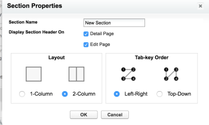

# 구성 [!DNL Adobe Workfront] 섹션 [!DNL Salesforce] 사용자

A [!UICONTROL Pro] [!DNL Workfront] 이 기능을 사용하려면 계획이 필요합니다. 사용 가능한 다양한 계획에 대한 자세한 내용은 [[!DNL Workfront] 계획.](https://www.workfront.com/plans)

설치 후 [!DNL Adobe Workfront] 대상 [!DNL Salesforce] 로서의 [!DNL Workfront] 관리자는 사용자가 새 섹션에 추가하여 사용 가능하게 만들 수 있습니다 [!UICONTROL 기회] 및 [!UICONTROL 계정]
페이지 레이아웃 [!UICONTROL Salesforce].

설치에 대한 자세한 정보 [!DNL Workfront for Salesforce]를 참조하십시오. [설치 [!DNL Adobe Workfront for Salesforce]](../../workfront-integrations-and-apps/using-workfront-with-salesforce/install-workfront-for-salesforce.md).

사용자가 [!DNL Workfront] 두 위치에서 모두 사용 가능 [!DNL Classic] 및 [!DNL Lightning Experience] 프레임워크를 추가하려면 [!DNL WorkfrontOpportunities] 그리고 [!DNL WorkfrontAccounts] [!UICONTROL Visualforce] 페이지를 [!UICONTROL 기회] 및 [!UICONTROL 계정] 각각 페이지 레이아웃.

## 액세스 요구 사항

이 문서에 설명된 기능을 사용하려면 다음 액세스 권한이 있어야 합니다.

<table style="table-layout:auto"> 
 <col> 
 <col> 
 <tbody> 
  <tr> 
   <td role="rowheader">[!DNL Adobe Workfront] 플랜*</td> 
   <td> 
[!UICONTROL Pro] 이상
 </td> 
  </tr> 
  <tr> 
   <td role="rowheader">[!DNL Adobe Workfront] 라이센스*</td> 
   <td> 
[!UICONTROL 계획]
 </td> 
  </tr> 
 </tbody> 
</table>

&#42;어떤 계획, 라이센스 유형 또는 액세스 권한을 보유하고 있는지 확인하려면 [!DNL Workfront] 관리자

## 전제 조건

* 다음을 수행해야 합니다. [!DNL Salesforce] 시스템 관리자 계정에 액세스할 수 있는 인스턴스입니다.
* 다음을 수행해야 합니다. [!DNL Workfront] 시스템 관리자 계정에 액세스할 수 있는 인스턴스입니다.

## 구성 [!DNL Workfront] 의 섹션 [!DNL Salesforce Classic] 프레임워크

1. 에 로그인합니다. [!DNL Salesforce] Workfront 관리자로.
1. 클릭 **[!UICONTROL 설정].**
1. 에서 **[!UICONTROL 빌드]** 섹션, 확장 **[!UICONTROL 사용자 지정].**

1. 확장 **[!UICONTROL 기회]**&#x200B;를 클릭한 다음 **[!UICONTROL 페이지 레이아웃]** 를 추가하려면 [!DNL Workfront] 섹션을 Opportunity 로 설정합니다.

   또는

   확장 **[!UICONTROL 계정]**&#x200B;를 클릭한 다음 **[!UICONTROL 페이지 레이아웃]** 를 추가하려면 [!DNL Workfront] 섹션에 자세히 설명되어 있습니다.

1. 클릭 **[!UICONTROL 편집]** 추가 콘텐츠만 사용할 수 있습니다.

   또는

   클릭 **[!UICONTROL 새로 만들기]** 새 레이아웃을 추가하려면

1. (선택 사항) **[!UICONTROL 섹션]** 구성 요소를 레이아웃에 넣고 원하는 위치에 놓습니다.\
   

1. (선택 사항) 새 섹션의 이름을 지정합니다.

   이 섹션의 이름을 지정하는 것이 좋습니다 **[!DNL Workfront]**.

1. (선택 사항) 원하는 를 지정합니다 **[!UICONTROL 레이아웃]** 및 **[!UICONTROL 탭 키 순서]** 새 섹션에 대해 자세히 알아보십시오.

   선택하는 것이 좋습니다 **[!UICONTROL 1-열]** 레이아웃 [!DNL Workfront] 섹션을 참조하십시오.

1. 클릭 **[!UICONTROL 확인]**.
1. 에서 **[!UICONTROL 레이아웃]** 영역을 클릭합니다. **[!UICONTROL Visualforce 페이지].**

1. 을(를) 끌어다 놓습니다 **[!UICONTROL WorkfrontOpportunity]** 구성 요소를 **[!UICONTROL 기회]** 레이아웃.

   또는

   을(를) 끌어다 놓습니다 **[!UICONTROL WorkfrontAccounts]** 구성 요소를  **[!UICONTROL 계정]** 레이아웃.\
   ![[!DNL WorkfrontAccounts_component].png](assets/workfrontaccounts-component-350x139.png)

1. 을(를) 클릭합니다. **[!UICONTROL 속성]** 새로 추가된 구성 요소의 오른쪽 상단에 있는 아이콘.\
   

1. 최적의 디스플레이를 얻으려면 다음 속성을 [!DNL Workfront Visualforce] 페이지:

   * **[!UICONTROL 너비(픽셀 또는 %)]**: 100%
   * **[!UICONTROL 높이(픽셀 단위)]**: 600년
   * 선택 **[!UICONTROL 스크롤 막대 표시]**.

1. 클릭 **[!UICONTROL 확인]**.
1. 클릭 **[!UICONTROL 저장]** 레이아웃을 저장하려면 을 클릭합니다.

   이제 이 레이아웃이 할당된 모든 사용자가 [!DNL Workfront] 섹션 [!UICONTROL 기회] 또는 [!UICONTROL 계정] 개체.

   사용자에게 [!DNL Workfront] 로그인 화면 [!DNL Workfront] 섹션을 참조하십시오. 없는 경우 [!DNL Workfront] 계정에서는 섹션을 축소하지만 레이아웃에서 제거할 수 없습니다.

   ![[!DNL salesforce_classic_opportunity_with_workfront_panel].png](assets/salesforce-classic-opportunity-with-workfront-panel-350x161.png)

## 구성 [!DNL Workfront] 의 섹션 [!DNL Salesforce Lightning Experience] 프레임워크

을(를) 추가할 수 있습니다 [!DNL Workfront] 섹션 을 클릭하여 [!DNL Salesforce] [!UICONTROL 기회] 또는 [!DNL Salesforce Lightning Experience] 다음 방법 중 하나로 [!UICONTROL 설정] 영역 또는 계정 또는 [!UICONTROL 기회] 개체.

* [구성 [!DNL Workfront] 섹션에 있습니다. [!UICONTROL 설정] 수준](#configure-the-workfront-section-at-the-setup-level-configure-the-workfront-section-at-the-setup-level)
* [구성 [!DNL Workfront] Opportunity 또는 Account 레벨의 섹션](#configure-the-workfront-section-at-the-opportunity-or-account-level-configure-the-workfront-section-at-the-opportunity-or-account-level)

### 구성 [!DNL Workfront] 섹션에 있습니다. [!UICONTROL 설정] 수준 {#configure-the-workfront-section-at-the-setup-level}

1. 에 로그인합니다. [!DNL Salesforce] 시스템 관리자
1. 을(를) 클릭합니다. **[!UICONTROL 설정]** 아이콘을 클릭한 다음 **[!UICONTROL 설정]**.

1. 확장 **[!UICONTROL 개체 및 필드]**&#x200B;를 클릭한 다음 **[!UICONTROL 개체 관리자]**.

1. 클릭 **[!UICONTROL 기회]** Opportunity 의 레이아웃을 사용자 정의할 수 있습니다.

   또는

   클릭 **[!UICONTROL 계정]** 계정 레이아웃을 사용자 지정하는 방법

1. 클릭 **[!UICONTROL 페이지 레이아웃]**.
1. 기존 페이지 레이아웃의 이름을 클릭하여 편집합니다.

   또는

   클릭 **[!UICONTROL 새로 만들기]** 새 페이지 레이아웃을 만들려면

1. 계속 [구성 [!DNL Workfront] Opportunity 또는 Account 레벨의 섹션](#configure-the-workfront-section-at-the-opportunity-or-account-level-configure-the-workfront-section-at-the-opportunity-or-account-level) 아래의 제품에서 사용할 수 있습니다.

### 구성 [!DNL Workfront] Opportunity 또는 Account 레벨의 섹션 {#configure-the-workfront-section-at-the-opportunity-or-account-level}

1. 에 로그인합니다. [!DNL Salesforce] 시스템 관리자
1. 로 이동 **[!UICONTROL 기회]** 또는 **[!UICONTROL 계정]**.

1. 을(를) 클릭합니다. **[!UICONTROL 설정]** 아이콘을 클릭한 다음 **[!UICONTROL 페이지 편집]**.\
   

1. 를 확장합니다. **[!UICONTROL 사용자 지정 관리]** 섹션을 참조하십시오.
1. 을(를) 끌어다 놓습니다 **[!DNL Workfront]** 구성 요소 [!UICONTROL 기회] 또는 계정 페이지에서 사용할 수 있습니다.

   페이지의 전체 너비를 사용하는 것이 좋습니다 [!DNL Workfront] 섹션에 있는 마지막 항목이 될 필요가 없습니다.

   ![[!DNL salesforce_lightning_builder].png](assets/salesforce-lightning-builder-350x229.png)

1. **[!UICONTROL 저장]**&#x200B;을 클릭합니다.

   이제 이 레이아웃이 할당된 모든 사용자가 [!DNL Workfront] 섹션 [!UICONTROL 기회] 또는 [!UICONTROL 계정] 개체.

   >[!NOTE]
   >
   >사용자에게 [!DNL Workfront] 로그인 화면 [!DNL Workfront] 섹션을 참조하십시오. 없는 경우 [!DNL Workfront] 계정에서는 섹션을 축소하지만 레이아웃에서 제거할 수 없습니다. 사용자는 활성화한 인증 방법을 사용하여 로그인할 수 있습니다. Enhanced Authentication 또는 SAML(Security Assertion Markup Language) URL입니다.

   ![[!DNL salesforce_lightning__workfront_panel].png](assets/salesforce-lightning--workfront-panel-350x127.png)
