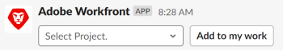
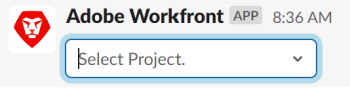

# 작업 및 문제 만들기 [!DNL Slack]

설치 및 구성 후 [!DNL Adobe Workfront for Slack], 작업 및 문제를 [!DNL Slack] 에서 프로젝트와 연결할 수 있습니다. [!DNL Workfront].

구성에 대한 자세한 정보 [!DNL Workfront] with [!DNL Slack]를 참조하십시오. [구성 [!DNL Adobe Workfront for Slack]](../../workfront-integrations-and-apps/using-workfront-with-slack/configure-workfront-for-slack.md).

액세스 수준에서 작업 및 문제를 만들 수 있는 액세스 권한이 있어야 하며 [!UICONTROL Contribute] 연결하는 프로젝트에 대한 권한.

액세스 수준에 대한 자세한 내용은 [액세스 수준 개요](../../administration-and-setup/add-users/access-levels-and-object-permissions/access-levels-overview.md). 객체에 대한 권한에 대한 자세한 내용은 [개체에 대한 권한 공유 개요](../../workfront-basics/grant-and-request-access-to-objects/sharing-permissions-on-objects-overview.md).

## 액세스 요구 사항

다음 항목이 있어야 합니다.

<table style="table-layout:auto"> 
 <col> 
 </col> 
 <col> 
 </col> 
 <tbody> 
  <tr> 
   <td role="rowheader"><a href="https://www.workfront.com/plans" target="_blank">[!DNL [!DNL Adobe Workfront] 플랜]</a>*</td> 
   <td> 
[!UICONTROL Pro] 이상
 </td> 
  </tr> 
 </tbody> 
</table>

&#42;어떤 계획, 라이센스 유형 또는 액세스 권한을 보유하고 있는지 확인하려면 [!DNL Workfront] 관리자\

## 전제 조건

먼저 작업 및 문제를 [!DNL Slack]:

* 구성 [!DNL Workfront] Slack\
   구성에 대한 지침 [!DNL Workfront for Slack]를 참조하십시오. [구성 [!DNL Adobe Workfront for Slack]](../../workfront-integrations-and-apps/using-workfront-with-slack/configure-workfront-for-slack.md).

## 작업 만들기 위치 [!DNL Slack]

1. 에 로그인합니다. [!DNL Slack] 인스턴스 및 로그인 [!DNL Workfront] 변환 전: [!DNL Slack].\
   Workfront에 로그인하는 방법에 대한 자세한 내용은 [!DNL Slack]에 로그인하는 것은 [!DNL Workfront] 변환 전: [!DNL Slack]&quot; 섹션 [액세스 [!DNL Adobe Workfront] 변환 전: [!DNL Slack]](../../workfront-integrations-and-apps/using-workfront-with-slack/access-workfront-from-slack.md).

1. 채널에서 메시지 필드에 다음 명령을 입력합니다.

   `/workfront add task <Task Name>`

   >[!NOTE]
   >
   >명령은 대/소문자를 구분합니다. 명령을 `/wf` 대신 `/workfront`.
   >  
   >작업 이름은 [!DNL Workfront] 대괄호 또는 큰따옴표가 없는 인터페이스.\
   >

1. (선택 사항) 새 작업을 연결할 프로젝트의 이름을 입력하고 목록에 표시할 때 선택합니다.\
   작업이 선택한 프로젝트에 추가되었음을 나타내는 확인 메시지가 표시됩니다.
1. (선택 사항) 확인 메시지에서 작업 이름을 클릭하여 열기 [!DNL Workfront]새 브라우저 탭에서 전송하는 것이 좋습니다.

## 다음에서 문제 만들기 [!DNL Slack]

1. 에 로그인합니다. [!DNL Slack] 인스턴스 및 로그인 [!DNL Workfront] 변환 전: [!DNL Slack].\
   로그인하는 방법에 대한 자세한 정보 [!DNL Workfront] 변환 전: [!DNL Slack]에 로그인하는 것은 [!DNL Workfront] 변환 전: [!DNL Slack]&quot; 섹션 [액세스 [!DNL Adobe Workfront] 변환 전: [!DNL Slack]](../../workfront-integrations-and-apps/using-workfront-with-slack/access-workfront-from-slack.md).

1. 채널에서 메시지 필드에 다음 명령을 입력합니다.

   `/workfront add issue <Issue Name>`

   >[!NOTE]
   >
   >명령은 대/소문자를 구분합니다. &#39;/workfront&#39; 대신 &#39;/wf&#39;로 명령을 시작할 수 있습니다. \
   >문제 이름은 [!DNL Workfront] 대괄호 또는 큰따옴표가 없는 인터페이스.\
   >

1. (선택 사항) 새 문제를 연결할 프로젝트의 이름을 입력하고 목록에 표시할 때 선택합니다.\
   문제가 선택한 프로젝트에 추가되었다는 확인 메시지가 나타납니다.
1. (선택 사항) 확인 메시지에서 문제 이름을 클릭하여 에서 엽니다 [!DNL Workfront]새 브라우저 탭에서 전송하는 것이 좋습니다.
