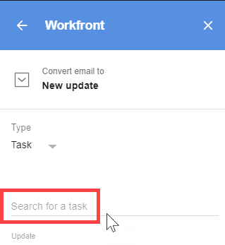

# 업데이트 [!DNL Adobe Workfront] 항목: [!DNL G Suite] 이메일 콘텐츠 사용

>[!NOTE]
>
>다음 항목이 있습니다 [알려진 문제](https://experienceleague.adobe.com/docs/workfront-known-issues/issues/new-workfront-experience/wf-current/wf-integrations-error-when-opening-wf-for-gsuite.html?lang=en) 현재 버전의 [!DNL Workfront for G Suite] 예상대로 작동하지 않습니다. Adobe는 새 버전에서 작업하고 있으며 Launch가 [!DNL Google Marketplace] 가까운 미래에.

기존 프로젝트, 작업 또는 문제가 아닌[!DNL Adobe Workfront] 이메일.

## 액세스 요구 사항

이 문서의 절차를 수행하려면 다음 액세스 권한이 있어야 합니다.

<table style="table-layout:auto"> 
 <col> 
 <col> 
 <tbody> 
  <tr> 
   <td role="rowheader">[!DNL Adobe Workfront] 플랜*</td> 
   <td> 
모든
 </td> 
  </tr> 
  <tr> 
   <td role="rowheader">[!DNL Adobe Workfront] 라이센스*</td> 
   <td> 
[!UICONTROL Work], [!UICONTROL Plan]
 </td> 
  </tr> 
 </tbody> 
</table>

&#42;어떤 계획, 라이센스 유형 또는 액세스 권한을 보유하고 있는지 확인하려면 [!DNL Workfront] 관리자

## 전제 조건

를 업데이트하기 전에 [!DNL Workfront] 전자 메일 콘텐츠를 사용하는 항목 [!DNL G Suite]:

* 설치 [!DNL Workfront for G suite]\
   자세한 내용은 [설치 [!DNL Adobe Workfront for G Suite]](../../workfront-integrations-and-apps/workfront-for-g-suite/install-workfront-for-gsuite.md).

## 업데이트 [!DNL Workfront] 전자 메일 콘텐츠를 사용하는 항목 [!DNL G Suite]

1. 만약 [!UICONTROL G Suite용 Workfront] 패널이 표시되지 않으면 Workfront 아이콘을 클릭합니다  에서 [!DNL G Suite] 페이지 맨 오른쪽에 있는 추가 기능 사이드바.
1. 전자 메일 메시지를 연 상태에서 [!DNL G Suite]를 클릭합니다. **[!UICONTROL 새 업데이트로 게시]** 에서 [!DNL G Suite] 패널.
1. 아래 **[!UICONTROL 유형]**&#x200B;드롭다운 화살표를 클릭한 다음 업데이트를 추가할 개체 유형을 클릭합니다.
1. 을(를) 클릭합니다. **[!UICONTROL 검색 대상]** 옵션을 선택하고 업데이트를 추가할 객체의 이름을 입력한 다음 아래 목록에 표시될 항목을 선택합니다.

   

   이 옵션은 3단계에서 선택한 내용에 따라 달라집니다. 그럴 수도 있지 **[!UICONTROL 프로젝트 검색]**, **[!UICONTROL 작업 검색]**, 또는 **[!UICONTROL 문제 검색]**.

   >[!NOTE]
   >
   >작업 이름을 입력할 때 임시 개인 작업은 아래 표시되는 이름 목록에서 제외됩니다.

1. 다음 옵션 변경 작업을 수행합니다.

   <table style="table-layout:auto"> 
    <col> 
    <col> 
    <tbody> 
     <tr> 
      <td role="rowheader">[!UICONTROL 업데이트]</td> 
      <td>이메일의 제목 줄 및 본문 텍스트에서 가져온 이 텍스트의 일부를 편집합니다.</td> 
     </tr> 
     <tr data-mc-conditions=""> 
      <td role="rowheader">[!UICONTROL 전자 메일 첨부 파일 포함]</td> 
      <td>
이메일에 하나 이상의 첨부 파일이 포함된 경우에만 사용할 수 있습니다. 작업 또는 문제에 대한 [!UICONTROL 문서] 탭에 첨부 파일을 저장하려면 이 옵션을 클릭합니다. 

첨부 파일을 저장하지 않으려면 해당 이름의 오른쪽에 있는 X 를 클릭합니다. 

전자 메일에 의 문서에 대한 링크가 포함되어 있는 경우 [!DNL Google Drive]를 입력하면 생성 중인 작업 또는 문제의 [!UICONTROL 개요] 탭에 링크가 저장됩니다. 

중요 사항: 이렇게 하려면[!DNL Workfront] 관리자 권한 부여 [!DNL Google Drive] 다음으로 작업 [!DNL Workfront]

      
이 옵션을 활성화하면 작업, 문제 및 업데이트로 전환하는 다른 이메일에 대해 활성화됩니다.
</td> 
     </tr> 
     <tr data-mc-conditions=""> 
      <td role="rowheader">알림</td> 
      <td>클릭 <strong>[!UICONTROL Notify]</strong>를 클릭하고 <strong>[!UICONTROL 사용자 또는 팀 검색]</strong> 옵션이 표시되면 개인이나 팀의 이름을 입력하고 아래 목록에 나타나면 클릭합니다. 추가할 각 사용자 및 팀에 대해 이 작업을 반복한 다음 을 클릭합니다 <strong>[!UICONTROL Save]</strong>.</td> 
     </tr> 
    </tbody> 
   </table>

1. 클릭 **[!UICONTROL 업데이트]**.

   브라우저를 새로 고치면, [!DNL Workfront for G Suite] 패널에서 이메일을 업데이트로 전환했음을 확인합니다.

   

   링크를 클릭하여 [!UICONTROL 업데이트] 탭 [!DNL Workfront] 4단계에서 지정한 객체에 대해 해당됩니다.

   이 단계를 반복하여 동일한 이메일을 업데이트, 작업 및 문제로 변환할 수 있습니다( [이메일 콘텐츠를 사용하여 [!DNL G Suite]에서 Adobe Workfront 문제 만들기](../../workfront-integrations-and-apps/workfront-for-g-suite/create-wf-issue-in-g-suite-using-email-content.md)). 브라우저를 새로 고치거나 다른 시간에 이메일로 돌아가면 전자 메일에 대해 만든 모든 링크가 의 맨 아래에 나열됩니다 [!UICONTROL G Suite용 Workfront] 패널.

1. (선택 사항)에서 업데이트를 계속 사용합니다. [!DNL Workfront] 다음 중 하나를 수행하여 추가 기능 패널:

   * 에 다른 업데이트를 추가하려면 **[!UICONTROL 업데이트]** 탭, **[!UICONTROL 새 업데이트 시작]** 정보를 입력합니다.

   * 에 대한 업데이트에 응답하려면 **[!UICONTROL 업데이트]** 탭, **[!UICONTROL 회신]** 답변을 입력합니다.

      위의 두 옵션 모두에 대해 **[!UICONTROL 알림]** 5단계와 같이 응답에 대한 수신자를 지정하려면 준비가 되면 을(를) 클릭합니다. **[!UICONTROL Post]** 업데이트 또는 응답을 추가하려면 다음을 수행합니다.

   * 을(를) 클릭합니다. **[!UICONTROL 세부 사항]** 새 프로젝트, 작업 또는 문제에 대한 세부 정보를 보려면 탭을 클릭하십시오.
