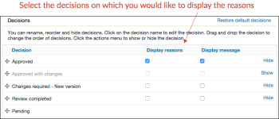

# [!DNL Workfront Proof]에서 승인 결정 옵션 구성

>[!IMPORTANT]
>
>이 문서는 독립 실행형 제품 [!DNL Workfront Proof]의 기능을 참조합니다. [!DNL Adobe Workfront] 내부의 증명에 대한 자세한 내용은 [증명](../../../review-and-approve-work/proofing/proofing.md)을 참조하십시오.

Select 또는 Premium 버전 플랜을 사용하는 [!DNL Workfront Proof] 관리자는 조직의 [!DNL Workfront Proof] 사용자가 만든 모든 증명에 대해 다음과 같은 방법으로 승인 결정 옵션을 구성할 수 있습니다.

* 결정의 이름 변경
* 증명 뷰어에 표시된 결정의 순서 변경
* 표시할 결정 결정 결정 결정

이 문서에서는 다음 사항에 대해 설명합니다.

## 의사 결정 설정 구성

1. **[!UICONTROL 계정 설정]**&#x200B;을 클릭합니다.
1. **[!UICONTROL 결정]** 탭을 엽니다.
1. 다음 중 하나를 변경합니다.

   * 결정을 숨기려면 필요 없는 결정 오른쪽에 있는 **[!UICONTROL 숨기기]**&#x200B;를 클릭합니다.
   * 결정의 이름을 변경하려면 결정 이름을 클릭하고 편집한 다음, 상자의 외부를 클릭하거나 Enter 키를 누릅니다. [!DNL Workfront Proof]은(는) 시스템의 모든 기존 증명에 대한 결정 이름을 업데이트합니다.

     >[!IMPORTANT]
     >
     >결정의 이름을 바꿀 때 결정의 논리를 유지합니다. 예를 들어 기본 결정 &quot;거부됨&quot;을 &quot;새 버전 필요&quot;로 변경할 수 있지만 &quot;프린터로 보내기&quot;로 변경해서는 안 됩니다.)

     [!DNL Workfront Proof] 기본값으로 돌아가려면 [기본 결정 복원]을 클릭합니다.

>[!NOTE]
>
>* 다양한 수준의 결정이 여러 개 있는 경우 의사 결정 뒤의 논리를 사용하여 증명 워크플로의 전체 상태를 계산합니다.
>* &quot;승인됨&quot; 및 &quot;변경 사항과 함께 승인됨&quot; 결정은 자동 워크플로우의 다음 단계를 트리거합니다.
>* 결정의 이름을 바꾸고 논리를 확인하려면 왼쪽 탐색 패널에서 **[!UICONTROL 활동]**&#x200B;을 클릭하고 원래 결정이 대괄호로 표시되는 활동 로그를 확인할 수 있습니다.
>
>  >

## 의사 결정 이유 만들기

의사 결정 이유는 증명에 대한 추가 의사 결정 정보를 캡처하는 좋은 방법입니다.

1. **[!UICONTROL 설정]** > **[!UICONTROL 계정 설정]**&#x200B;을 클릭합니다.

1. **[!UICONTROL 결정]** 탭을 엽니다.
기본적으로 증명에 대한 모든 의사 결정자가 이유를 사용할 수 있지만 기본 의사 결정자로만 제한할 수 있습니다.
요구 사항에 따라 여러 가지 이유를 선택하도록 허용하거나 하나의 선택 목록으로 만들 수 있습니다. 이유를 필수 항목으로 지정할 수도 있습니다. 즉, 검토자가 증명을 저장하기 전에 이유를 선택해야 합니다.
   

1. **[!UICONTROL 이유]** 섹션에서 **[!UICONTROL 새 이유]**를 클릭합니다.
   

1. **[!UICONTROL Reason]** 아래에 나타나는 상자에 이유 섹션의 제목을 입력합니다.
1. 텍스트 상자를 포함하려면 **[!UICONTROL 텍스트 상자 포함]**&#x200B;을 선택합니다.
1. **[!UICONTROL 저장]**을 클릭합니다.
   
가장 중요한 단계는 이유가 표시되어야 하는 결정을 선택하는 것입니다. 만약 당신이 그것을 잊었다면, 이유는 당신의 증명에 나타나지 않을 것이다.

1. 페이지 상단의 결정 목록에서 **[!UICONTROL 표시 이유]** 열의 상자를 선택합니다. 필요에 따라 하나 이상의 결정을 선택할 수 있습니다.
   

## Post 의사 결정 메시지 만들기

검토자가 증명에 결정 내용을 저장한 후 표시할 사후 결정 메시지를 만들 수 있습니다.

1. **[!UICONTROL 설정]** > **[!UICONTROL 계정 설정]**&#x200B;을 클릭합니다.

1. **[!UICONTROL 결정]** 탭을 엽니다.
1. **[!UICONTROL Post 결정 메시지]** 섹션에서 **[!UICONTROL 메시지]** 행 끝에 있는 **[!UICONTROL 편집]**을 클릭합니다.
메시지를 모든 의사 결정자에게 표시할지 또는 기본 의사 결정자로 제한할지 결정할 수도 있습니다.
   

1. **[!UICONTROL 메시지 표시]** 열에서 이 메시지를 표시할 결정을 지정합니다.
하나 이상의 결정을 선택하지 않으면 증명에 메시지가 표시되지 않습니다. 이 열에 있는 상자를 하나 이상 선택해야 합니다.
   
