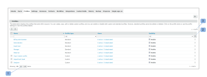

# [!DNL Workfront Proof]에서 사용자 지정 프로필 구성

>[!IMPORTANT]
>
>이 문서는 독립 실행형 제품 [!DNL Workfront] 증명의 기능을 참조합니다. [!DNL Adobe Workfront] 내부의 증명에 대한 자세한 내용은 [증명](../../../review-and-approve-work/proofing/proofing.md)을 참조하십시오.

[!DNL Workfront Proof] 청구 관리자 또는 [!DNL Workfront Proof] 관리자는 다른 사용자에 대한 사용자 지정 프로필을 구성할 수 있습니다.

사용자 지정 프로필을 사용하면 계정의 사용자에게 세분화된 권한을 할당하고 계정의 항목에 대해 사용자가 가지는 액세스 및 권한 수준을 정의할 수 있습니다. 사용자 지정 프로필에 대한 자세한 내용은 [다음을 사용하여 사용자 지정 프로필 만들기 및 관리 [!DNL Workfront Proof]](../../../workfront-proof/wp-mnguserscontacts/users/create-and-manage-custom-profiles.md)를 참조하십시오.

다음과 관련된 정보만 표시하도록 페이지 레이아웃을 조정할 수 있습니다.

* 표시되는 항목 수를 조정할 수 있습니다(1)
* 프로필 목록을 필터링하여 작업할 프로필(2)을 찾을 수 있습니다.
* 계정에서 보유하고 있는 프로필 수를 쉽게 확인할 수 있습니다. (3)\
   

## 프로필 탭

[!UICONTROL 프로필] 탭에서는 사용자 지정 프로필을 편리하게 추가하고 관리할 수 있습니다. 여기에서 다음 작업을 수행할 수 있습니다.

* 새 프로필 추가(1)
* 프로필에 대해 일괄 작업을 수행합니다.
* 여러 프로필 삭제 (2)
* 여러 프로필 비활성화(3)
* 여러 프로필 활성화(4)
* 프로필 세부 정보 액세스(5)
* 프로필 복사 (6)
* 프로필 비활성화(7)

프로필 탭을 사용자 지정하는 방법에 대한 자세한 내용은 [다음을 사용하여 사용자 지정 프로필 만들기 및 관리 [!DNL Workfront Proof]](../../../workfront-proof/wp-mnguserscontacts/users/create-and-manage-custom-profiles.md)를 참조하십시오.

## 프로필 세부 정보

프로필 세부 정보 페이지에서는 사용자 정의 프로필에 대해 활성화된 권한을 수정하고, 프로필을 복사하고, 프로필을 삭제하고, 프로필이 할당된 사용자 목록을 볼 수 있습니다.

이 페이지에서 수행할 수 있는 작업에 대한 자세한 내용은 &quot;[다음을 사용하여 사용자 지정 프로필 만들기 및 관리 [!DNL Workfront Proof]](../../../workfront-proof/wp-mnguserscontacts/users/create-and-manage-custom-profiles.md)를 참조하십시오.

* [프로필 세부 정보 페이지 액세스](#accessing-the-profile-details-page)
* [프로필이 할당된 사용자 목록 보기](#viewing-the-list-of-users-with-a-profile-assigned)

### 프로필 세부 정보 페이지 액세스 {#accessing-the-profile-details-page}

프로필 세부 정보에 액세스하려면:

1. 프로필 이름을 클릭합니다.
1. 

### 프로필이 할당된 사용자 목록 보기 {#viewing-the-list-of-users-with-a-profile-assigned}

특정 프로필이 지정된 사용자 목록을 보려면 다음과 같이 하십시오.

1. 이 프로필 (1)을 가진 활성 및 비활성화된 사용자 수를 표시하는 링크를 클릭합니다.
1. 또는 이 목록이 프로필 세부 정보 페이지에 표시됩니다.
1. 

1. 해당 프로필이 할당된 계정의 활성 사용자와 비활성화된 사용자가 모두 이 목록에 표시됩니다. 목록이 너무 길면 페이지의 레이아웃을 편리하게 조정하여 원하는 정보만 볼 수 있습니다.
1. 
