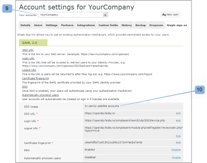
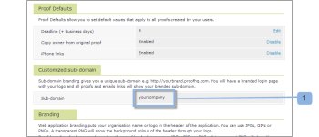

# [!DNL Workfront Proof] 사용자에 대한 SSO(Single Sign-On) 구성

>[!IMPORTANT]
>
>이 문서는 독립 실행형 제품 [!DNL Workfront Proof]의 기능을 참조합니다. [!DNL Adobe Workfront] 내부의 증명에 대한 자세한 내용은 [증명](../../../review-and-approve-work/proofing/proofing.md)을 참조하십시오.

Select 또는 Premium 플랜이 있으면 기존 조직의 사용자 이름과 암호를 사용하여 [!DNL Workfront Proof] 계정에 액세스할 수 있는 SSO(Single Sign-On) 기능을 제공할 수 있습니다.

즉, [!DNL Workfront Proof] 로그인 페이지가 아니라 사용자의 로그인 시스템에 대해 인증합니다.

>[!NOTE]
>
>SAML을 사용하려면 [!DNL Workfront Proof] 계정에 사용자 지정 하위 도메인 또는 도메인이 설정되어 있어야 합니다. 사용자 정의 하위 도메인은 자유롭게 설정할 수 있습니다. 자세한 내용은 [브랜딩](https://support.workfront.com/hc/en-us/sections/115000921208-Branding)을 참조하세요.[사이트 브랜딩 [!DNL Workfront Proof] 사이트 - 고급](../../../workfront-proof/wp-acct-admin/branding/brand-wp-site-advanced.md)에서 완전히 맞춤화된 도메인에 대한 자세한 내용을 볼 수 있습니다.

## [!DNL Workfront Proof] 내에서 SSO 활성화

SSO(Single Sign-On) 기능은 [!UICONTROL 계정 설정]의 [!UICONTROL SSO(Single Sign-On)] 탭에서 활성화할 수 있으며 [!DNL Workfront Proof] 계정의 모든 사용자에게 적용됩니다. 자세한 내용은 [계정 설정](https://support.workfront.com/hc/en-us/sections/115000912147-Account-settings)을 참조하세요.

## 엔티티 ID

서비스 공급자로서 엔티티 ID를 여기에 게시했습니다.

[https://yoursubdomain.proofhq.com/saml/module.php/saml/sp/metadata.php/phq](https://yoursubdomain.proofhq.com/saml/module.php/saml/sp/metadata.php/phq)&#x200B;(&quot;yoursubdomain&quot;은 계정의 하위 도메인임)

[!DNL Workfront Proof]에는 다음 특성 중 하나로 전달할 수 있는 고유 식별자로 사용자의 전자 메일 주소가 필요합니다.

* urn:mace:dir:attribute-def:emailAddress
* http://schemas.xmlsoap.org/ws/2005/05/identity/claims/emailaddress
* http://schemas.xmlsoap.org/claims/EmailAddress
* urn:oid:0.9.2342.19200300.100.1.3
* http://axschema.org/contact/email
* openid.sreg.email
* 메일
* 이메일
* emailAddress

SSO를 구성하려면 다음을 수행하십시오.

1. **[!UICONTROL Single Sign-On]** 탭을 엽니다(1).
1. **SSO URL**(2)을 입력하십시오.
SSO 서버에 대한 링크입니다(예: **https://sso.mycompany.com/opensso**).

1. **로그인 URL**(3)을 입력하십시오.
사용자를 ID 공급자로 리디렉션하기 위해 호출되는 URL입니다.

   이는 브라우저에 입력하는 실제 URL이 아니라 로그인 화면을 표시하기 위해 전송하는 정보를 처리하는 엔드포인트입니다.

1. **로그아웃 URL**(4)을(를) 입력하십시오.
예를 들어 로그아웃한 후 반환되는 URL입니다.

   **https://www.yourcompany.com/services/logout.asp**

1. **인증서 지문**(5)을 입력하십시오.
1. SAML ID 공급자가 제공하는 SAML 인증서의 SHA1 지문.
1. ID 공급자에서 키 정보를 설정하여 키 정보를 포함해야 합니다.
1. **SSO**&#x200B;을(를) **[!UICONTROL 사용]**(6)(으)로 전환합니다.
SSO가 활성화되면 사용자 및 사용자 계정의 다른 사용자가 고유한 인증 메커니즘을 사용하여 로그인합니다. 즉, 사용자가 [!DNL Workfront Proof] 계정 로그인 화면(예: **yourcompany.proofhq.com/login**)에 액세스하면 자신의 인증 로그인 페이지에 대한 전송 창이 표시됩니다.

1. (선택 사항) **자동으로 사용자 제공** 사용(7).
이 옵션이 활성화되면 자신의 [!DNL Workfront Proof] 프로필이 없지만 SSO(Single Sign-On) 자격 증명을 사용하여 [!DNL Workfront Proof] 계정에 액세스하는 사용자에 대해 사용자 계정이 자동으로 만들어집니다. 계정에서 사용자 제한에 아직 도달하지 않은 경우에만 작업이 수행됩니다.

1. 프로비저닝된 새 사용자는 기본적으로 관리자 프로필 권한이 할당됩니다. 자세한 내용은 [증명 권한 프로필 [!DNL Workfront Proof]](../../../workfront-proof/wp-acct-admin/account-settings/proof-perm-profiles-in-wp.md)을 참조하세요.

## 위성 계정에 대해 SSO 활성화

허브 계정에 연결된 위성 계정이 있으면 허브 계정 수준에서 관리할 수 있습니다.

Single Sign-On은 Select 및 Premium 기능이므로 Select 및 Premium 플랜에 있는 위성에서만 Single Sign-On을 활성화할 수 있습니다.

1. **[!UICONTROL 설정]** > **[!UICONTROL 계정 설정]**(1)을 클릭합니다.

1. 드롭다운 메뉴에서 위성 계정 을(를) 클릭합니다(2).
1. **[!UICONTROL Single Sign-On]** 탭을 엽니다(3).
1. SSO 구성 편집을 시작합니다(4).
1. 
여기에서는 두 가지 구성 방법 (5)이 있습니다.

1. **상속됨:** 허브 계정에서 구성을 사용하는 SSO.
사용자가 **기본 로그인 페이지**([https://business.adobe.com/products/workfront/proofing-approvals.html](https://business.adobe.com/products/workfront/proofing-approvals.html))를 통해 [!DNL Workfront Proof]에 액세스하면 **두 수준의 권한 부여가 있습니다**: 먼저 사용자에게 [!DNL Workfront Proof] 액세스 데이터(전자 메일 및 암호)를 사용하여 로그인하도록 요청 받은 다음 SSO 창을 통해 SSO 로그인 페이지로 사용자가 전송됩니다.
따라서 SSO 서비스를 사용하도록 설정한 상태에서 고유한 [!DNL Workfront Proof] 하위 도메인/도메인을 통해 로그인하는 것이 좋습니다.

   >[!NOTE]
   >
   >현재 [!DNL Workfront Proof] 계정에서 SSO(Single Sign-On)가 활성화되면 해당 자격 증명으로 iPhone 앱에 로그인할 수 없습니다.

   1. **수동**(기본값): 다른 구성을 사용하는 SSO(예: 다른 ID 공급자를 지정).

      >[!NOTE]
      >
      >위성 계정이 허브 계정에서 SSO 구성을 상속하면 로그인 화면이 허브 계정의 로그인 화면이 됩니다. 위성 계정 사용자가 이 페이지에 SSO 로그인 세부 정보를 입력하면 위성 계정으로 다시 리디렉션됩니다.

      

   1. **[!UICONTROL 저장]**(6)을 클릭합니다.

## Hub 계정에서 상속된 SSO 설정

Hub 계정에서 설정을 상속하도록 선택하면 이제 모든 필드가 Hub 계정의 데이터로 채워지고(7) Single Sign-On이 기본 계정에서처럼 자동으로 활성화/비활성화(8)됩니다. 이제 Satellite 계정에 대한 전체 SSO 구성이 허브 계정에서 설정 및 관리되므로, 필드에는 더 이상 편집 링크가 없습니다.

허브 계정(9)에서 [!UICONTROL SSO 사용량] 필드에 위성 계정(10)에서 이 구성을 사용 중임을 표시됩니다.\

## SSO가 수동으로 구성됨

위성 계정 (1)에 대해 수동 SSO 구성을 선택한 경우 SSO(Single Sign-On)에 대한 데이터를 수동으로 입력해야 합니다.

1. **[!UICONTROL 설정]** > **[!UICONTROL 계정 설정]**(1)을 클릭합니다.

1. **[!UICONTROL Single Sign-On]** 탭을 엽니다.
1. **[!UICONTROL 편집],**&#x200B;을 클릭하여 필드를 채운 다음 **[!UICONTROL 저장]**(2)을 클릭합니다.

1. **[!UICONTROL SSO]** 행에서 **[!UICONTROL 사용]**(3)을 클릭합니다.

## SSO 로그인

1. **[!UICONTROL 설정]** > **[!UICONTROL 계정 설정]**(1)을 클릭합니다.

1. **[!UICONTROL Single Sign-On]** 탭을 엽니다.
1. [!DNL Workfront Proof] 도메인/하위 도메인(1)이 설정되어 있고 사용자가 이 사용자 지정된 도메인/하위 도메인을 통해 [!DNL Workfront Proof] 계정에 액세스하는지 확인하십시오.
   
SSO(Single Sign-On)가 활성화되면 하위 도메인 로그인 URL(예: yourcompany.proofhq.com/login)에 SSO 로그인 페이지로 바로 이동하는 전송 화면(2)이 표시됩니다.
   

1. 사용자가 **기본 로그인 페이지**([https://business.adobe.com/products/workfront/proofing-approvals.html](https://business.adobe.com/products/workfront/proofing-approvals.html))를 통해 [!DNL Workfront Proof]에 액세스하면 **두 수준의 권한 부여가**&#x200B;됩니다. 먼저 사용자에게 [!DNL Workfront Proof] 액세스 데이터(전자 메일 및 암호)를 사용하여 로그인하라는 메시지가 표시됩니다. 그런 다음, 사용자는 SSO 창(2)을 통해 SSO 로그인 페이지로 전송됩니다.\
   따라서 SSO 서비스를 사용하도록 설정한 상태에서 고유한 [!DNL Workfront Proof] 하위 도메인/도메인을 통해 로그인하는 것이 좋습니다.

1. 현재 Workfront Proof 계정에서 SSO(Single Sign-On)가 활성화되면 해당 자격 증명으로 iPhone 앱에 로그인할 수 없습니다.

## 새 사용자 추가 정보

[!DNL Workfront Proof] 계정에서 SSO(Single Sign-On) 기능을 사용하도록 설정하면 새 사용자는 자신의 계정이 자동으로 활성화되고 사용할 준비가 되었으므로 확인 이메일을 받지 못합니다.

[!DNL Workfront Proof] 로그인 페이지에서 [!UICONTROL 로그인] 단추를 클릭하면 사용자가 SSO 로그인 페이지로 이동하며 SSO 로그인 자격 증명을 입력하라는 메시지가 표시됩니다.

>[!IMPORTANT]
>
>사용자는 인증 프로세스 중에 이메일 주소를 통해 식별됩니다. 즉, SSO 로그인에 사용되는 이메일 계정은 계정에 등록된 사용자의 이메일 주소여야 합니다.

## AD FS(Active Directory Federation Services)

AD FS(Active Directory Federation Services)는 Windows Server 운영 체제에 설치하여 사용자에게 조직 경계를 넘어 위치한 시스템 및 응용 프로그램에 대한 Single Sign-On 액세스를 제공할 수 있는 [!DNL Microsoft] 소프트웨어 구성 요소입니다. 자세한 내용은 Microsoft Developer Network 웹 사이트의 &quot;Active Directory Federation Services&quot;를 참조하십시오.

[!DNL Workfront Proof] 시스템은 SAML 2.0을 지원하며 AD FS 버전 2.0 이상에서만 호환됩니다.

자세한 지침은 [Single Sign-On in [!DNL Workfront Proof]: AD FS 구성](../../../workfront-proof/wp-acct-admin/account-settings/sso-in-wp-adfs-configuration.md)을 참조하십시오.
