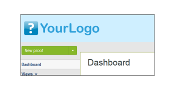

# 브랜드 [!DNL Workfront Proof] 사이트 - 고급

>[!IMPORTANT]
>
>이 문서는 독립형 제품의 기능을 참조합니다 [!DNL Workfront Proof]. 내부 교정에 대한 자세한 정보 [!DNL Adobe Workfront]를 참조하십시오. [교정](../../../review-and-approve-work/proofing/proofing.md).

고급 브랜딩은 Select 및 Premium 계획에서 사용할 수 있으며 계획 비용에 포함됩니다.

로그인 페이지, 이메일 알림 및 증명을 포함하는 기본 브랜딩에 대한 자세한 내용은 [브랜드 [!DNL Workfront Proof] 사이트](../../../workfront-proof/wp-acct-admin/branding/brand-wp-site.md).

고급 브랜딩 옵션에는 다음 영역의 사용자 지정이 포함됩니다.

* 머리글 및 텍스트 색상
* 웹 애플리케이션 헤더
* 메뉴 막대 및 텍스트 색상
* 대시보드 시작 상자 및 빠른 시작 상자
* 바닥글 텍스트
* Favicon
* 페이지 제목
* 도움말 링크

다음 섹션에서는 고급 브랜딩에 대해 자세히 설명합니다.

## 고급 브랜딩 개요

다음을 찾을 수 있습니다. [!UICONTROL 브랜딩 구성] 섹션에 있는 [계정 설정](https://support.workfront.com/hc/en-us/sections/115000912147-Account-Settings) 페이지. 계정에 변경 사항을 적용하려면 브랜딩 옵션이 [!UICONTROL 활성화됨] (1).

고급 브랜딩 옵션(2-14)을 구성하는 방법에 대한 자세한 내용은 아래 섹션을 참조하십시오.

## 고급 브랜딩 구성

다음 영역을 브랜딩할 수 있습니다 [!DNL Workfront Proof]:

* [웹 애플리케이션](#web-application)
* [머리글](#header)
* [헤더 링크](#header-links)
* [사이드바](#sidebar)
* [시작 상자](#welcome-box)
* [섹션 머리글](#section-headers)

### 웹 애플리케이션 {#web-application}

웹 애플리케이션 헤더(2)에 대해 세 가지 브랜딩 옵션 중 하나를 선택할 수 있습니다.

* 헤더의 브랜딩 이미지
* 헤더에 계정 이름이 있습니다.
* 브랜딩을 사용하지 않는 경우 [!DNL Workfront Proof] 로고는 웹 앱 헤더에 남아 있습니다

브랜딩 이미지 - 최대 크기 550x90px로 크기를 조정합니다. JPG, GIF 또는 PNG를 사용할 수 있으며 투명한 배경이 지원됩니다.

계정 이름 - 계정 세부 정보에서 가져와서 흰색 글꼴로 표시됩니다. 계정 이름은 최대 60자(공백 및 구두점 표시 포함)까지 사용할 수 있습니다.

### 머리글 {#header}

이 필드(3)에서는 헤더의 배경을 설정할 수 있고 단색 또는 배경 이미지를 선택할 수 있습니다.

색상 - 여기서는 색상 구성표 구성의 다른 모든 브랜딩 필드와 같이 원하는 16진수 색상 값을 입력하거나 편리한 색상 선택기를 사용할 수 있습니다(텍스트 필드를 클릭하면 팝업이 열립니다). 기본 헤더 배경색은 #232d2e.

배경 이미지 - 브랜딩 이미지와 함께 결합할 수 있습니다.

* 투명도가 흰색 배경색이 표시되는 파일에 대해 JPG, GIF 또는 PNG를 사용할 수 있습니다.
* 헤더의 높이는 96px이며 업로드된 이미지 크기는 다음에 대해 조정되지 않습니다 [!UICONTROL 반복 없음] 선택 사항입니다.
* 배경 이미지는 왼쪽 상단에 배치됩니다.

### 헤더 링크 {#header-links}

이 필드(4)에서는 계정의 오른쪽 상단 모서리에 표시되는 헤더 메뉴에 있는 링크의 사용자 이름 색상 및 색상을 수정할 수 있습니다.

### 사이드바 {#sidebar}

메뉴 모음(5) 및 메뉴 글꼴(6)의 색상을 선택하여 사이드바를 사용자 지정합니다

>[!NOTE]
>
>마우스로 가리키면 색상이 선택한 메뉴 막대 색상에 상수 16진수 값을 추가하여 자동으로 조정됩니다.

새 증명 단추 색상을 사용자 지정할 수 없습니다.

### 시작 상자 {#welcome-box}

이 필드(7)에서는 대시보드 페이지에 표시되는 시작 상자 색상을 설정할 수 있습니다.

### 섹션 머리글 {#section-headers}

이러한 필드에서는 [[!UICONTROL 계정 설정]](https://support.workfront.com/hc/en-us/sections/115000912147-Account-Settings) 페이지.

**바닥글**

브랜딩 구성의 이 필드(10)에서는 모든 계정 페이지의 하단에 표시될 바닥글을 작성할 수 있습니다. 내장된 WYSIWYG 편집기를 사용하거나 사용자 고유의 디자인을 붙여넣을 수 있습니다.

>[!NOTE]
>
>바닥글 텍스트 편집기에서 HTML을 편집할 수는 없지만 복사한 디자인(모든 링크 및 이미지 포함)을 붙여넣을 수 있습니다.

**파비콘 및 페이지 제목**

사용자 지정 방법 [!DNL Workfront Proof] 페이지는 고유한 favicon 이미지(.ICO 파일)(11) 및 페이지 제목(12)을 설정하여 브라우저에 표시됩니다. 이 페이지는 모든 계정 페이지에 대한 브라우저의 탭/windows 헤더에 표시됩니다.

>[!NOTE]
>
>favicon은 또한 [!DNL Workfront Proof] 계정에서 만든 모든 증명을 위한 뷰어 창입니다.

**도움말 링크**

사용자 도움말 링크를 사용자 지정하여 사용자와 검토자가 자신의 콘텐츠를 가리키도록 할 수 있습니다. 이 설정을 활성화하려면 [!UICONTROL 도움말 링크] 옵션(13)을 활성화하여 다음 필드(14)에 링크를 추가합니다. 최대 4개의 링크를 구성할 수 있으며 다음 링크를 사용할 수 있습니다.

* 에서 [!UICONTROL Header] 메뉴 아래의 [!UICONTROL 도움말] 링크
   

* 에서 [!UICONTROL 도움말] 패널의 [!DNL Workfront Proof] [!UICONTROL 뷰어] 사이드바
   

추가 비용을 위해 엔터프라이즈 플랜의 고객은 다음을 완전히 사용자 정의할 수 있습니다.

* 랜딩 페이지를 완전히 사용자 지정합니다(예: 로그인 및 로그아웃 페이지, 암호 페이지 분실)
* 도메인 사용자 정의

추가 브랜딩 옵션에 대한 자세한 내용은 sales.team@workfront.com으로 문의하십시오.

<!--
<h2 data-mc-conditions="QuicksilverOrClassic.Draft mode">Custom Domains</h2>
-->

<!--

Our Select and Premium plans include the option to purchase a fully-branded domain. This means that you can customize your URL as well as all links included in notification emails.&nbsp;

-->

<!--

For more information, please see&nbsp;<a href="../../../workfront-proof/wp-acct-admin/branding/configure-branded-domain-in-wp.md" class="MCXref xref">Configure a branded domain in Workfront Proof</a>.

-->

<!--
<h2 data-mc-conditions="QuicksilverOrClassic.Draft mode">Custom Page Branding</h2>
-->

<!--

Custom branding of the Workfront Proof pages is a paid service and by default&nbsp;includes full customization of the following:

-->

<!--
  <li data-mc-conditions="QuicksilverOrClassic.Draft mode"><a href="https://app.proofhq.com/login">Log in/landing page</a> </li>
  -->

<!--
  <li data-mc-conditions="QuicksilverOrClassic.Draft mode"><a href="https://app.proofhq.com/logout">Logout page</a> </li>
  -->

<!--
  <li data-mc-conditions="QuicksilverOrClassic.Draft mode"><a href="https://app.proofhq.com/login/password">Forgot password page</a> </li>
  -->

<!--
<h3 data-mc-conditions="QuicksilverOrClassic.Draft mode">Design Elements</h3>
-->

<!--

Please create your design&nbsp;in&nbsp;a .PSD file with all the elements placed in the separate layers - this will allow us to prepare the scalable pages for you.

-->

<!--

There are no particular restrictions on the .PSD files, and the look and layout of the pages is completely up to you. However please make sure that the key elements are included in your design:

-->

<!--

<strong>Login Page</strong>    

-->

<!--

<strong>Logout page</strong>    

-->

<!--

<strong>Forgot password</strong>    

-->

<!--

<strong>Inactivity alert</strong>    

-->

<!--

<strong>Invalid email address</strong>    

-->

<!--

<strong>Inactivity and incorrect email address</strong>    

-->

<!--
<note type="note">
&nbsp;The separate designs for the alerts are not required. If you'd like us to leave the default style of the messages, as shown on the screencasts above, please let us know. The team will match the colors with your design.
</note>
-->

<!--

If you'd like to have placeholder text in the text fields, please include this in your designs.

-->

<!--
<note type="note">
The wording of the alerts cannot be changed as these are the system messages.
</note>
-->

<!--

<strong>2. Fonts</strong> 

-->

<!--

Please make sure that the text is not rasterized but kept as the text layers, unless you want the particular elements to be displayed as images on your landing pages.

-->

<!--

If you use custom fonts in your design, please make sure to include the following font files: EOT + .TTF + OTF + SVG + WOFF for support in all browsers.

-->

<!--
<note type="note">
&nbsp; You need to hold an appropriate license, which allows implementing your selected fonts on the web pages.
</note>
-->

<!--

If you use the standard and widely available fonts, the font files are not required. Please see the following lists for reference:

-->

<!--
  <li data-mc-conditions="QuicksilverOrClassic.Draft mode"><a href="http://www.w3schools.com/cssref/css_websafe_fonts.asp">Websafe fonts listed in the standard Font families</a> </li>
  -->

<!--
  <li data-mc-conditions="QuicksilverOrClassic.Draft mode"><a href="https://www.google.com/fonts">Open Source Google fonts</a> </li>
  -->

<!--

<strong>3. Screen resolution</strong> 

-->

<!--

We support 1024x768 screen resolution (1366x768 for wide screens) and upwards. However, for the landing pages designs we do recommend using higher resolution for the better results on the various screens. The best practice would be to determine what screen resolution is the most common on your users' machines and prepare a slightly bigger design.

-->

<!--

<strong>4. Browsers compatibility</strong> 

-->

<!--

The newer browsers generally don't require any custom code to display the pages properly. However, if your users have the older browser versions installed on their machines some code adjustments may be needed.

-->

<!--

By default we do prepare the pages compatible with the following browsers:

-->

<!--
  <li data-mc-conditions="QuicksilverOrClassic.Draft mode">Internet Explorer 9+</li>
  -->

<!--
  <li data-mc-conditions="QuicksilverOrClassic.Draft mode">Safari 6.x+</li>
  -->

<!--
  <li data-mc-conditions="QuicksilverOrClassic.Draft mode">Chrome 22+ *</li>
  -->

<!--
  <li data-mc-conditions="QuicksilverOrClassic.Draft mode">Firefox 15+ *</li>
  -->

<!--

* Preferred browsers 

-->

<!--
<note type="note"> Workfront Proof will not design your custom pages, the PSD files must be supplied by you, but if you have any questions, please contact our Support team.
</note>
-->
