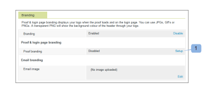

# [!DNL Workfront Proof] 사이트 브랜딩

>[!IMPORTANT]
>
>이 문서는 독립 실행형 제품 [!DNL Workfront] 증명의 기능을 참조합니다. [!DNL Adobe Workfront] 내부의 증명에 대한 자세한 내용은 [증명](../../../review-and-approve-work/proofing/proofing.md)을 참조하십시오.

[!DNL Workfront Proof] 관리자는 [!DNL Workfront Proof] 계정을 브랜딩하여 귀하와 귀하의 사용자에게 보다 사용자 정의된 환경을 제공할 수 있습니다.

기본 계정 브랜딩은 추가 비용 없이 모든 플랜에서 사용할 수 있습니다.

머리글, 메뉴 모음, 대시보드 등의 브랜딩이 포함된 고급 브랜딩에 대한 자세한 내용은 [사이트 브랜딩 [!DNL Workfront Proof] 사이트 - 고급](../../../workfront-proof/wp-acct-admin/branding/brand-wp-site-advanced.md)을 참조하십시오. 고급 브랜딩은 Select 및 Premium 플랜에서만 사용할 수 있습니다

[!DNL Workfront] 증명 사이트의 다양한 측면을 브랜딩하는 방법에 대한 자세한 내용은 다음 섹션을 참조하십시오.

## [!DNL Workfront Proof] 로그인 페이지에서 브랜딩 사용

계정에서 브랜딩을 활성화하려면:

1. [!DNL Workfront Proof]에 [!DNL Workfront Proof] 관리자로 로그인합니다.
1. [!DNL Workfront Proof] 인터페이스의 오른쪽 위 모서리에서 **[!UICONTROL 계정 설정]**&#x200B;을 클릭합니다.

   구성할 수 있는 다양한 계정 설정에 대한 자세한 내용은 [계정 설정](https://support.workfront.com/hc/en-us/sections/115000912147-Account-Settings)을 참조하세요.

1. **[!UICONTROL 설정]** 탭을 클릭합니다.
1. **[!UICONTROL 브랜딩]** 섹션에서 **[!UICONTROL 사용]**&#x200B;을 클릭하세요. (1)

   

   이제 브랜딩 이미지가 로그인 페이지에 표시됩니다.

   >[!NOTE]
   >
   >기본 [!DNL Workfront] 증명 로그인 URL을 통해 액세스하는 경우 브랜딩 이미지가 로그인 페이지에 표시되지 않습니다. 예: `https://www.proofhq.com/login`. 사용자 정의 하위 도메인 또는 전체 브랜드 도메인을 통해 로그인 페이지에 액세스하는 경우에만 표시됩니다. 사용자 지정 로그인 페이지에 액세스하려면 브라우저에 계정 URL을 입력하면 됩니다. 예: `http://<yoursubdomain>.proofhq.com.` <!--For more information about fully branded domains, see "Fully Branded Domains" in the article [Configure a branded domain in [!DNL Workfront Proof]](../../../workfront-proof/wp-acct-admin/branding/configure-branded-domain-in-wp.md).-->

   

## 증명에 대한 브랜딩 활성화

계정에서 만든 모든 증명의 [!UICONTROL 증명 로드] 페이지에 고유한 브랜딩 이미지를 추가하려면:

1. [!DNL Workfront Proof]에 [!DNL Workfront Proof] 관리자로 로그인합니다.
1. [!DNL Workfront Proof] 인터페이스의 오른쪽 위 모서리에서 **[!UICONTROL 계정 설정]**&#x200B;을 클릭합니다.

   구성할 수 있는 다양한 계정 설정에 대한 자세한 내용은 [계정 설정](https://support.workfront.com/hc/en-us/sections/115000912147-Account-Settings)을 참조하세요.

1. **[!UICONTROL 설정]** 탭을 클릭합니다.
1. **[!UICONTROL 브랜딩]** 섹션에서 **[!UICONTROL 증명 브랜딩]** 옆에 있는 **[!UICONTROL 설정]**&#x200B;을 클릭합니다. (1)

   

1. 드롭다운 메뉴에서 **[!UICONTROL 브랜딩 이미지]**&#x200B;를 선택합니다.
**[!UICONTROL 사용 안 함]**&#x200B;을(를) 선택하면 증명 로드 페이지에 [!DNL Workfront Proof] 로고가 표시됩니다

1. **[!UICONTROL 저장]**&#x200B;을 클릭합니다. (3)

   

1. **[!UICONTROL 편집]**&#x200B;을 클릭하여 브랜딩 이미지(4)를 선택합니다.

   JPG, GIF 또는 PNG를 사용할 수 있습니다. 투명도가 지원됩니다. 권장 이미지 크기는 150x300px입니다. 로그인 및 로그아웃 페이지의 이미지 크기가 이러한 크기로 조정됩니다.

   

1. 업로드할 이미지를 선택합니다. (5)
1. **[!UICONTROL 저장]**&#x200B;을 클릭합니다.

   이제 브랜딩 이미지가 계정에서 만든 모든 증명의 증명 로드 페이지에 표시됩니다.

   

## 브랜딩 이메일 알림

검토자에게 전송된 이메일 알림에 포함되도록 브랜딩 이미지를 구성할 수 있습니다. 이 이미지의 크기는 최대 크기인 90x550px로 조정됩니다.

전자 메일 브랜딩을 설정하려면:

1. [!DNL Workfront Proof]에 [!DNL Workfront Proof] 관리자로 로그인합니다.
1. [!DNL Workfront Proof] 인터페이스의 오른쪽 위 모서리에서 **[!UICONTROL 계정 설정]**&#x200B;을 클릭합니다.

   구성할 수 있는 다양한 계정 설정에 대한 자세한 내용은 [계정 설정](https://support.workfront.com/hc/en-us/sections/115000912147-Account-Settings)을 참조하세요.

1. **[!UICONTROL 설정]** 탭을 클릭합니다.
1. **[!UICONTROL 브랜딩]** 섹션에서 전자 메일 응용 프로그램 이미지(1) 옆에 있는 **[!UICONTROL 편집]**&#x200B;을 클릭합니다.
   

1. 이메일 브랜딩에 사용할 이미지를 선택하십시오. (2)

   전자 메일 브랜딩이 이미 구성되어 있고 이를 사용하지 않으려면 **[!UICONTROL 지우기]**&#x200B;를 클릭하십시오. (4)

   

1. **[!UICONTROL 저장]**&#x200B;을 클릭합니다.

   이제 이미지가 모든 증명 알림 이메일에 표시됩니다. (3)

   

<!--
<h2 data-mc-conditions="QuicksilverOrClassic.Draft mode">Custom Sub-Domains</h2>
-->

<!--

You can add your brand name to your Workfront Proof account URL. For example, your URL might look like this:

-->

<!--

<strong>http://yoursubdomain.proofhq.com</strong> 

-->

<!--

This customization is also included in all your proof links, as well as in the 'From' email address for your proof notifications.

-->

<!--

For more information on how to set up a branded sub-domain, see <a href="../../../workfront-proof/wp-acct-admin/branding/configure-branded-domain-in-wp.md" class="MCXref xref">Configure a branded domain in Workfront Proof</a>

-->

## API를 통한 버튼 및 링크 제외

[!DNL Workfront Proof] API를 통해 증명을 만드는 경우 단추와 링크를 표시하지 않고 사용자 지정 링크를 만들 수 있습니다.

자세한 내용은 [[!DNL Workfront Proof] API](https://api.proofhq.com/)을(를) 참조하십시오.
