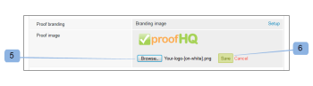

# 브랜딩 [!DNL Workfront Proof] 사이트

>[!IMPORTANT]
>
>이 문서는 독립 실행형 제품의 기능에 대해 설명합니다 [!DNL Workfront] 증명. 내부 교정에 대한 정보 [!DNL Adobe Workfront], 참조 [증명](../../../review-and-approve-work/proofing/proofing.md).

로서의 [!DNL Workfront Proof] 관리자, 다음을 브랜딩할 수 있습니다 [!DNL Workfront Proof] 사용자 및 사용자에게 보다 사용자 정의된 경험을 제공하는 계정입니다.

기본 계정 브랜딩은 추가 비용 없이 모든 플랜에서 사용할 수 있습니다.

브랜딩 헤더, 메뉴 막대, 대시보드 등을 포함하는 고급 브랜딩에 대한 자세한 내용은 다음을 참조하십시오. [브랜딩 [!DNL Workfront Proof] 사이트 - 고급](../../../workfront-proof/wp-acct-admin/branding/brand-wp-site-advanced.md). 고급 브랜딩은 Select 및 Premium 플랜에서만 사용할 수 있습니다

의 다양한 측면을 브랜딩하는 방법에 대한 자세한 내용은 다음 섹션을 참조하십시오 [!DNL Workfront] 증명 사이트:

## 에서 브랜딩 활성화 [!DNL Workfront Proof] 로그인 페이지

계정에서 브랜딩을 활성화하려면:

1. 에 로그인 [!DNL Workfront Proof] (으)로 [!DNL Workfront Proof] 관리자.
1. 클릭 **[!UICONTROL 계정 설정]** 의 오른쪽 위 모서리 [!DNL Workfront Proof] 인터페이스.

   구성할 수 있는 다양한 계정 설정에 대한 자세한 내용은 [계정 설정.](https://support.workfront.com/hc/en-us/sections/115000912147-Account-Settings)

1. 다음을 클릭합니다. **[!UICONTROL 설정]** 탭.
1. 다음에서 **[!UICONTROL 브랜딩]** 섹션, 클릭 **[!UICONTROL 사용]**. (1)

   

   이제 브랜딩 이미지가 로그인 페이지에 표시됩니다.

   >[!NOTE]
   >
   >을 통해 에 액세스하는 경우 브랜딩 이미지가 로그인 페이지에 표시되지 않습니다 [!DNL Workfront] 증명 로그인 URL. For example, `https://www.proofhq.com/login`. 사용자 정의 하위 도메인 또는 전체 브랜드 도메인을 통해 로그인 페이지에 액세스하는 경우에만 표시됩니다. 사용자 지정 로그인 페이지에 액세스하려면 브라우저에 계정 URL을 입력하면 됩니다. For example, `http://<yoursubdomain>.proofhq.com.` <!--For more information about fully branded domains, see "Fully Branded Domains" in the article [Configure a branded domain in [!DNL Workfront Proof]](../../../workfront-proof/wp-acct-admin/branding/configure-branded-domain-in-wp.md).-->

   

## 증명에 대한 브랜딩 활성화

에 고유한 브랜딩 이미지를 추가하려면 [!UICONTROL 증명 로드 중] 계정에서 만든 모든 증명의 페이지:

1. 에 로그인 [!DNL Workfront Proof] (으)로 [!DNL Workfront Proof] 관리자.
1. 클릭 **[!UICONTROL 계정 설정]** 의 오른쪽 위 모서리 [!DNL Workfront Proof] 인터페이스.

   구성할 수 있는 다양한 계정 설정에 대한 자세한 내용은 [계정 설정.](https://support.workfront.com/hc/en-us/sections/115000912147-Account-Settings)

1. 다음을 클릭합니다. **[!UICONTROL 설정]** 탭.
1. 다음에서 **[!UICONTROL 브랜딩]** 섹션, 클릭 **[!UICONTROL 설정]** 다음에 **[!UICONTROL 증명 브랜딩]**. (1)

   

1. 드롭다운 메뉴에서 을(를) 선택합니다 **[!UICONTROL 브랜딩 이미지]**.
다음을 선택하는 경우 **[!UICONTROL 사용 안 함]**, [!DNL Workfront Proof] 증명 로드 페이지에 로고가 표시됨

1. **[!UICONTROL 저장]**&#x200B;을 클릭합니다. (3)

   

1. 클릭 **[!UICONTROL 편집]** 을 클릭하여 브랜딩 이미지를 선택합니다(4).

   JPG, GIF 또는 PNG를 사용할 수 있습니다. 투명도가 지원됩니다. 권장 이미지 크기는 150x300px입니다. 로그인 및 로그아웃 페이지의 이미지 크기가 이러한 크기로 조정됩니다.

   

1. 업로드할 이미지를 선택합니다. (5)
1. **[!UICONTROL 저장]**&#x200B;을 클릭합니다.

   이제 브랜딩 이미지가 계정에서 만든 모든 증명의 증명 로드 페이지에 표시됩니다.

   

## 브랜딩 이메일 알림

검토자에게 전송된 이메일 알림에 포함되도록 브랜딩 이미지를 구성할 수 있습니다. 이 이미지의 크기는 최대 크기인 90x550px로 조정됩니다.

전자 메일 브랜딩을 설정하려면:

1. 에 로그인 [!DNL Workfront Proof] (으)로 [!DNL Workfront Proof] 관리자.
1. 클릭 **[!UICONTROL 계정 설정]** 의 오른쪽 위 모서리 [!DNL Workfront Proof] 인터페이스.

   구성할 수 있는 다양한 계정 설정에 대한 자세한 내용은 [계정 설정.](https://support.workfront.com/hc/en-us/sections/115000912147-Account-Settings)

1. 다음을 클릭합니다. **[!UICONTROL 설정]** 탭.
1. 다음에서 **[!UICONTROL 브랜딩]** 섹션, 클릭 **[!UICONTROL 편집]** 이메일 애플리케이션 이미지(1) 옆에 있습니다.
   

1. 이메일 브랜딩에 사용할 이미지를 선택하십시오. (2)

   이메일 브랜딩이 이미 구성되어 있고 이를 비활성화하려면 **[!UICONTROL 지우기]**. (4)

   

1. **[!UICONTROL 저장]**&#x200B;을 클릭합니다.

   이제 이미지가 모든 증명 알림 이메일에 표시됩니다. (3)

   

<!--
<h2 data-mc-conditions="QuicksilverOrClassic.Draft mode">Custom Sub-Domains</h2>
-->

<!--

You can add your brand name to your Workfront Proof account URL. For example, your URL might look like this:

-->

<!--

<strong>http://yoursubdomain.proofhq.com</strong> 

-->

<!--

This customization is also included in all your proof links, as well as in the 'From' email address for your proof notifications.

-->

<!--

For more information on how to set up a branded sub-domain, see <a href="../../../workfront-proof/wp-acct-admin/branding/configure-branded-domain-in-wp.md" class="MCXref xref">Configure a branded domain in Workfront Proof</a>

-->

## API를 통한 버튼 및 링크 제외

을 통해 증명을 만드는 경우 [!DNL Workfront Proof] API를 사용하면 버튼과 링크를 표시하지 않고 사용자 지정 링크를 만들 수 있습니다.

다음을 참조하십시오 [[!DNL Workfront Proof] API](https://api.proofhq.com/) 추가 정보.
