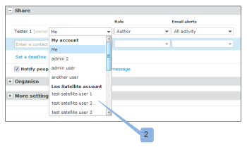

# 에서 파트너와 항목 공유 [!DNL Workfront Proof]

>[!IMPORTANT]
>
>이 문서는 독립형 제품의 기능을 참조합니다 [!DNL Workfront Proof]. 내부 교정에 대한 자세한 정보 [!DNL Adobe Workfront]를 참조하십시오. [교정](../../../review-and-approve-work/proofing/proofing.md).

만약 [!DNL Workfront Proof] 다른 조직(예: 회사 내 클라이언트 또는 다른 부서)과 파트너 관계를 맺고, 증명, 파일, 폴더 및 파트너와 연락처 세부 사항을 공유할 수 있습니다. 파트너 관계에 대한 자세한 내용은 [Workfront 증명 계정 간의 파트너 관계 관리](../../../workfront-proof/wp-acct-admin/partner-accounts/manage-partner-relationship-between-wp-accts.md).

## 파트너와 항목 공유 정보

파트너와 항목을 공유할 때는 다음 사항을 고려하십시오.

* 새로 만드는 증표인 경우에만 파트너 계정에서 증명 소유자를 선택할 수 있습니다. 기존 증명 또는 새 증명 버전에 대해서는 그렇게 할 수 없습니다.
* 파트너와 항목을 공유할 때 파트너 계정의 감독자 및 관리자에게 증명에 대한 편집 권한을 전달합니다. 증명을 만든 계정의 감독자 및 관리자는 더 이상 증명에 대한 편집 권한이 없습니다(증명 작성자가 포함됨). 의 권한에 대한 자세한 정보 [!DNL Workfront] 증명, 자세한 내용은 [증명 권한 프로필 [!DNL Workfront] 증명](../../../workfront-proof/wp-acct-admin/account-settings/proof-perm-profiles-in-wp.md).
* 증명은 증명의 소유가 되는 계정(증명의 계정이 아님)에 저장됩니다.
* 증명 브랜딩은 증명이 소유한 계정(증명을 만든 계정이 아님)에서 가져옵니다.

## 파트너와 항목 공유

파트너와 승인된 관계를 맺고 나면 폴더, 파일, 증명 등의 항목을 쉽게 공유할 수 있습니다.

1. 증명 또는 파일 공유를 시작합니다.\
   공유에 대한 자세한 내용은 [증명 공유 위치 [!DNL Workfront Proof]](../../../workfront-proof/wp-work-proofsfiles/share-proofs-and-files/share-proof.md)  [파일 공유 위치 [!DNL Workfront Proof]](../../../workfront-proof/wp-work-proofsfiles/share-proofs-and-files/share-files.md) 및 [폴더 공유 위치 [!DNL Workfront Proof]](../../../workfront-proof/wp-work-proofsfiles/organize-your-work/share-folders.md).

1. 에서 **[!UICONTROL 공유]** 섹션 [!UICONTROL 새 증명] 또는 [!UICONTROL 새 파일] 페이지의 경우, 시스템에서 다른 사용자와 공유하는 것처럼 자동 완료 필드에 이름을 입력할 때 파트너 이름이 나타납니다.\
   

## 파트너 계정의 사용자를 증명 소유자로 지정

다른 사용자와 파트너 관계를 설정한 경우 [!DNL Workfront Proof] 계정, Partner 계정에서 사용자를 선택하여 증명의 소유자가 될 수 있습니다.

>[!NOTE]
>
>다음 조건이 충족되는 경우에만 파트너 계정에서 사용자를 선택할 수 있습니다.
>
>* 사용자 지정 필드가 없습니다
>* 폴더를 선택하지 않았습니다.
>* 태그가 적용되지 않음
>

파트너 계정의 사용자를 증명 소유자로 만들려면,

1. 설정 [!UICONTROL 새 증명] 페이지에서 **[!DNL Change]** 링크를 클릭합니다. (1)\
   

1. Partner 계정에서 증명 소유자가 될 사용자를 선택합니다. (2)\
   
