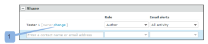

# [!DNL Workfront Proof]에서 파트너와 항목 공유

>[!IMPORTANT]
>
>이 문서는 독립 실행형 제품 [!DNL Workfront Proof]의 기능을 참조합니다. [!DNL Adobe Workfront] 내부의 증명에 대한 자세한 내용은 [증명](../../../review-and-approve-work/proofing/proofing.md)을 참조하십시오.

다른 조직(예: 고객 또는 회사의 다른 부서)과 [!DNL Workfront Proof] 파트너 관계가 있는 경우 파트너와 증명, 파일, 폴더 및 연락처 세부 정보를 공유할 수 있습니다. 파트너 관계에 대한 자세한 내용은 [Workfront Proof 계정 간의 파트너 관계 관리](../../../workfront-proof/wp-acct-admin/partner-accounts/manage-partner-relationship-between-wp-accts.md)를 참조하십시오.

## 파트너와 항목 공유 정보

파트너와 항목을 공유할 때는 다음 사항을 고려하십시오.

* 생성 중인 새 증명인 경우에만 파트너 계정의 사용자를 증명 소유자로 선택할 수 있습니다. 기존 증명 또는 새 증명 버전에 대해서는 그렇게 할 수 없습니다.
* At 항목을 파트너와 공유할 때 증명에 대한 편집 권한을 파트너 계정의 책임자 및 관리자에게 전달합니다. 증명이 생성된 계정의 관리자 및 관리자는 더 이상 증명에 대한 편집 권한이 없습니다(증명 작성자 포함). [!DNL Workfront] Proof의 권한에 대한 자세한 내용은 [Proof [!DNL Workfront] Proof](../../../workfront-proof/wp-acct-admin/account-settings/proof-perm-profiles-in-wp.md)의 증명 권한 프로필을 참조하십시오.
* 증명은 증명을 만든 계정이 아닌 증명이 소유한 계정에 저장됩니다.
* 증명 브랜딩은 증명을 소유한 계정(증명을 만든 계정이 아님)에서 가져옵니다.

## 파트너와 항목 공유

파트너와 관계를 맺은 후에는 폴더, 파일 및 증명 등의 항목을 파트너와 쉽게 공유할 수 있습니다.

1. 증명 또는 파일 공유를 시작합니다.\
   공유에 대한 자세한 내용은 [증명 공유 [!DNL Workfront Proof]](../../../workfront-proof/wp-work-proofsfiles/share-proofs-and-files/share-proof.md) [파일 공유 [!DNL Workfront Proof]](../../../workfront-proof/wp-work-proofsfiles/share-proofs-and-files/share-files.md) 및 [폴더 공유 [!DNL Workfront Proof]](../../../workfront-proof/wp-work-proofsfiles/organize-your-work/share-folders.md)를 참조하십시오.

1. [!UICONTROL 새 증명] 또는 [!UICONTROL 새 파일] 페이지의 **[!UICONTROL 공유]** 섹션에서, 시스템의 다른 사용자와 공유하는 것처럼 자동 완성 필드에 이름을 입력할 때 파트너 이름이 표시됩니다.\
   

## 파트너 계정의 사용자를 증명 소유자로 설정

다른 [!DNL Workfront Proof] 계정과의 파트너 관계를 설정한 경우 파트너 계정의 사용자를 증명 소유자로 선택할 수 있습니다.

>[!NOTE]
>
>다음 조건이 충족되는 경우에만 파트너 계정에서 사용자를 선택할 수 있습니다.
>
>* 사용자 정의 필드가 없습니다.
>* 폴더를 선택하지 않았습니다.
>* 적용된 태그 없음
>

파트너 계정의 사용자를 증명 소유자로 설정하려면 다음을 수행합니다.

1. [!UICONTROL 새 증명] 페이지에서 **[!DNL Change]** 링크를 클릭합니다. (1)\
   

1. Partner 계정에서 증명 소유자로 사용할 사용자를 선택합니다. (2)\
   
