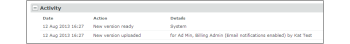
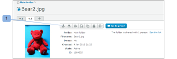

# 새로운 증명 이메일

>[!IMPORTANT]
>
>이 문서는 독립형 제품의 기능을 참조합니다 [!DNL Workfront Proof]. 내부 교정에 대한 자세한 정보 [!DNL Adobe Workfront]를 참조하십시오. [교정](../../../review-and-approve-work/proofing/proofing.md).

<!--

Make this article work better for PiW.

-->

증명의 새 버전이나 새 버전을 만들거나, 증명에 새 사람을 추가하거나, 증명에 워크플로우를 추가하는 경우, 다음 문서에 설명된 대로 검토자에게 이메일을 보낼 것인지 결정할 수 있습니다.

* [자동화된 워크플로우를 사용하여 고급 증명 만들기](../../../review-and-approve-work/proofing/creating-proofs-within-workfront/create-automated-proof-workflow.md)
* [에서 증명 생성 [!DNL Workfront Proof]](../../../workfront-proof/wp-work-proofsfiles/create-proofs-and-files/generate-proofs.md)

수신자가 받는 이메일을 [!UICONTROL 새 증명] 이메일. 증명 작성자와 증명에 검토자를 추가할 수 있는 권한이 있는 사용자만 이 이메일을 제어할 수 있습니다. 수신자가 비활성화할 수 없습니다.

새 증명 이메일에는 다음이 포함되어 있습니다.

* 개인 메시지(메시지를 포함하도록 선택한 경우)
* 항상 동일한 사용자 지정 메시지를 검토자에게 보내는 경우 검토자에 저장하는 것이 좋습니다 [!UICONTROL 개인 설정] 아래에 [!UICONTROL 교정 기본값] 탭. 자세한 내용은 를 참조하십시오.
* 증명에 대한 개인 링크
* **[!UICONTROL 세부 사항 보기]** 연결된 링크로 이동합니다. [!DNL Workfront] 개체(예: 프로젝트, 작업 또는 문제)
* 증명 이미지의 축소판
* 다음 증명 세부 정보:

   * 증명 이름
   * 버전 번호

      자세한 내용은 를 참조하십시오.

   * 검토자 목록 및 증명 진행 상황
   * 증명을 다른 사람과 공유하는 링크

      원본 파일에 대한 증명 URL 및/또는 다운로드 링크를 공유할 수 있도록 해줍니다. 따라서 증명에 검토자를 명시적으로 추가할 수 없으며, 공개 증명 URL만 공유하며 수신자는 증명에 대한 읽기 전용 액세스 권한을 받습니다.

      자세한 내용은 [증명 공유 위치 [!DNL Workfront Proof]](../../../workfront-proof/wp-work-proofsfiles/share-proofs-and-files/share-proof.md) 추가 정보.

      이 링크가 수신자의 전자 메일에 표시되지 않도록 하려면 [!UICONTROL 공개 공유] 증명 설정

      (원본 파일 및 공개 URL 다운로드). 자세한 내용은 [의 증명 세부 정보 관리 [!DNL Workfront Proof]](../../../workfront-proof/wp-work-proofsfiles/manage-your-work/manage-proof-details.md) 추가 정보.

## 활동 로그

보내기 [!UICONTROL 새 증명] 검토자에게 전자 메일이 [!UICONTROL 활동] 섹션 [!UICONTROL 증명 세부 사항] 페이지. 자세한 내용은  [관리[!UICONTROL  증명 세부 사항] in [!DNL Workfront Proof]](../../../workfront-proof/wp-work-proofsfiles/manage-your-work/manage-proof-details.md) 추가 정보. 다음을 확인할 수 있습니다 [!UICONTROL 새 증명] 증명을 만들 때 이메일이 활성화되었습니다.

>[!NOTE]
>
>* 증명의 작성자나 소유자가 [!UICONTROL 증명] 기본적으로 비활성화된 이메일(개인 설정에서)은 수신되지 않습니다 [!UICONTROL 증명] 또는 [!UICONTROL 새로운 증명] 이메일은 [!UICONTROL 전자 메일로 사람들에게 알림] 새 증명 페이지에서 상자를 선택합니다. 자세한 내용은 를 참조하십시오.
>* 이메일 알림이 [!UICONTROL 계정 설정] 증명의 작성자/소유자가 아무 것도 받지 못합니다 [!UICONTROL 증명] 또는 [!UICONTROL 새로운 증명] 개인 설정 및 개인 설정에서 이 기능이 활성화된 경우에도 전자 메일 [!UICONTROL 알림] [새 증명] 페이지에서 전자 메일로 사람 상자를 선택합니다. 자세한 내용은 [다음 [!UICONTROL 증명] 이메일](../../../workfront-proof/wp-emailsntfctns/proof-notifications-and-reminders/proof-made-email.md) 을 참조하십시오.
>

## 를 활성화합니다 [!UICONTROL 새 증명] 이메일 및 사용자 지정 메시지 포함

만들 때 증명을 통해 검토자에게 전자 메일 경고를 전송할지 또는 사용자를 추가할지 여부를 지정할 수 있습니다.

* [증명을 만들 때](#when-you-create-a-proof)
* [증명에 검토자를 추가할 때](#when-you-add-a-reviewer-to-a-proof)

### 증명을 만들 때 {#when-you-create-a-proof}

에서 새 증명을 만들 때 [!UICONTROL 새로운 증명] 페이지, 아래에 **[!UICONTROL 공유]** 섹션에서 이메일 경고를 전송할지 여부를 선택할 수 있습니다.

* 여기에서 원하는 사항을 결정할 수 있습니다 [!UICONTROL 전자 메일로 사람들에게 알림] (1). 이 옵션을 선택 취소하면 검토자가 검토를 위한 준비가 되었음을 알리는 이메일을 받지 못합니다.
* 이메일 알림(2)에 사용자 지정 메시지를 포함할 수도 있습니다.
* 사용자 지정 메시지를 추가하기로 결정하는 경우 이메일(4) 본문에 사용자 지정된 제목 줄(3)과 메시지를 넣을 수 있습니다.
* 사용자 지정 메시지를 취소하려면 링크(5)를 클릭하면 됩니다.

   >[!NOTE]
   >
   >항상 동일한 사용자 지정 메시지를 검토자에게 보내는 경우, [!UICONTROL 교정 기본값] 탭. 자세한 내용은 를 참조하십시오.

### 증명에 검토자를 추가할 때 {#when-you-add-a-reviewer-to-a-proof}

기존 증명에 추가된 새 검토자가 증명에 대한 알림을 받는지(위와 유사) 여부를 선택할 수 있습니다.

* 먼저, **[!UICONTROL 이 버전 공유]** 단추 **[!UICONTROL 증명 세부 사항]** 페이지 (1).

* 새 검토자를 추가할 수 있는 상자가 나타납니다. 그런 다음 전자 메일(2)로 알림을 받을 것인지 여부를 결정하고 전자 메일(3)에 사용자 지정 메시지를 추가하도록 선택할 수 있습니다.

* 사용자 지정 메시지를 추가하도록 선택하면 상자가 확장되며 이메일 본문(5)에 사용자 정의 제목 줄(4)과 사용자 정의 텍스트를 넣을 수 있습니다. 링크(6)를 클릭하여 사용자 지정 메시지를 취소할 수도 있습니다.

